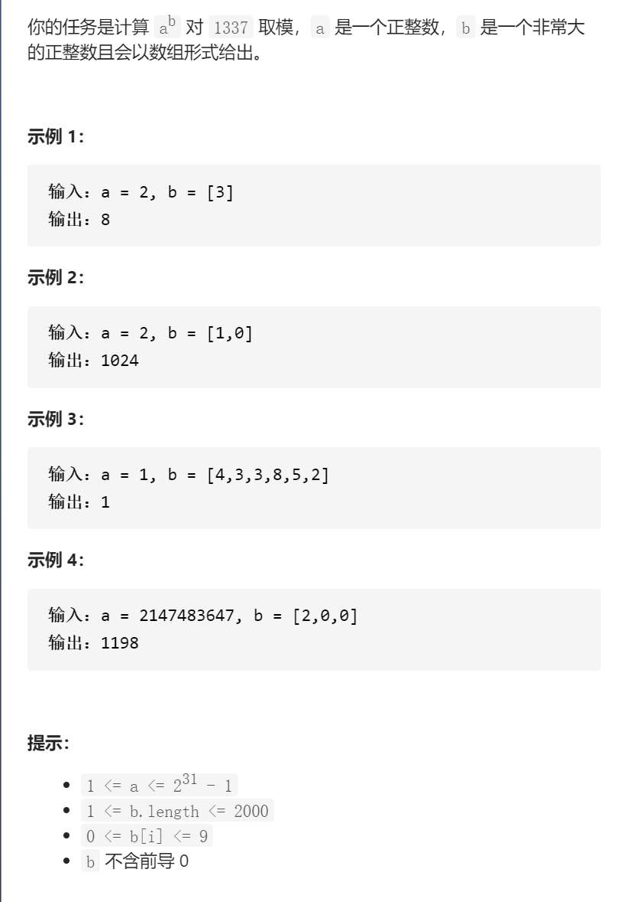

超级次方



变量简洁正确完整思路

dfs(int a,vector<int>&b)可以得到a^b的答案，

a=4，b={1,5,6,4}，则只需要a^4  * dfs(a,{1,5,6})^10

快速幂，如果b是奇数，mypow返回a*(mypow(a,b-1))

如果b是偶数，先计算sum=mypow(a,b/2)，返回sum*sum

```c
class Solution {
public:
    const int mod=1337;
    int superPow(int a, vector<int>& b) {
        if(b.empty())return 1;
        int num=b.back();b.pop_back();
        int sum1=mypow(a,num);
        int sum2=mypow(superPow(a,b),10);

        return (sum1*sum2)%mod;
    }
    int mypow(int a,int b){
        if(b==0)return 1;
        a%=mod;
        if(b&1){
            return a*mypow(a,b-1);
        }else {
            int sum=mypow(a,b/2);
            return (sum%mod)*(sum%mod)%mod;
        }
    }
};
踩过的坑
(a*b)%k=a%k  *    b%k     )   %k防止溢出
```

