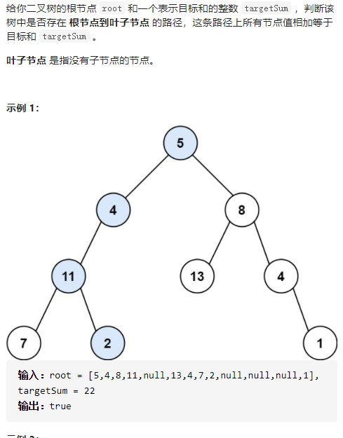

路径总和

详细思路

dfs，参数root和targetsum，求出root树是否有路径和为targetsum的

精确定义

dfs，参数root和targetsum，求出root树是否有路径和为targetsum，haveTarget为true提前返回，叶节点边界返回，最后返回需要分情况一个儿子和两个儿子

```c
class Solution {
public:
    bool haveTarget;
    bool hasPathSum(TreeNode* root, int targetSum) {
        if(!root)return false;
        haveTarget=false;
        return dfs(root,targetSum);
    }
    bool dfs(TreeNode*root,int targetSum){
        if(haveTarget)return true;
        if(!root->left&&!root->right){
            if(root->val==targetSum){
                haveTarget=true;
                return true;
            }
            else return false;
        }
        int newTarget=targetSum-root->val;
        if(root->left&&!root->right)return dfs(root->left,newTarget);
        else if(!root->left&&root->right)return dfs(root->right,newTarget);
        return dfs(root->left,newTarget)||dfs(root->right,newTarget);

    }
};
```


踩过的坑

根结点不是叶节点，也就是说，[1,2] 1   是找不到的，不能说1是一条根结点到叶节点的，简单的方法是只能到叶节点就是边界，不能到空节点。

