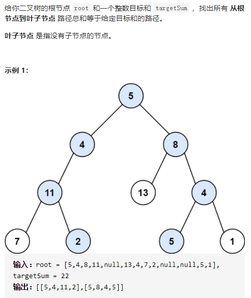

路径总和II



详细思路

dfs，形参roottargetSum，得到root树所有等于targetSum的路径，由于根结点不算做叶节点所以不能到空节点，边界是叶节点

精确定义

dfs，形参roottargetSum，得到root树所有等于targetSum的路径，叶节点边界更新答案，最后根据孩子情况更新答案

```c
class Solution {
public:
    vector<vector<int>> pathSum(TreeNode* root, int targetSum) {
        if(!root)return {};
        vector<vector<int>>ans;
        vector<int>ans1;
        dfs(root,targetSum,ans,ans1);
        return ans;
    }
    void dfs(TreeNode*root,int targetSum,vector<vector<int>>&ans,vector<int>&ans1){
        if(!root->left&&!root->right){
            ans1.push_back(root->val);
            if(root->val==targetSum){
                ans.push_back(ans1);
                return ;
            }else return;
        }
        ans1.push_back(root->val);
        int newVal=targetSum-root->val;
        if(root->left){
            dfs(root->left,newVal,ans,ans1);
            ans1.pop_back();
        }
        if(root->right){
            dfs(root->right,newVal,ans,ans1);
            ans1.pop_back();
        }
    }
};
```


踩过的坑

没有返回值的递归，更新答案往往需要回溯，边界返回记得也要push，应对返回之后pop

​    if(!root->left&&!root->right){

​      ans1.push_back(root->val);

​      ans1.pop_back();