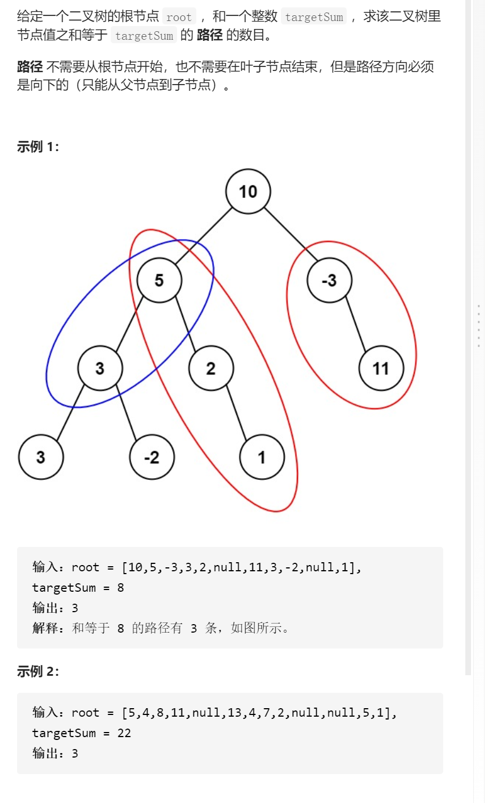

路径总和III

变量简洁正确完整思路

getCnt函数形参root target，得到root树root作为路径第一个节点的路径数量

dfs函数root target前序遍历对每一个root树调用getCnt更新答案

getCnt边界返回考虑空，target不为0或者为0，考虑target<val==val提前返回，

```c
class Solution {
public:
    int ans=0;
    int pathSum(TreeNode* root, int targetSum) {
        dfs(root,targetSum);
        return ans;
    }
    void dfs(TreeNode*root,int targetSum){
        if(!root)return;
        ans+=getCnt(root,targetSum);
        //cout<<ans<<' '<<root->val<<endl;
        dfs(root->left,targetSum);
        dfs(root->right,targetSum);
    }
    int getCnt(TreeNode*root,int targetSum){
        if(!root)return 0;
        int ans1=0;
        //cout<<root->val<<' '<<targetSum<<'a'<<endl;
        //if(root->val>targetSum)return 0;
        if(root->val==targetSum)ans1++;
        ans1+=getCnt(root->left,targetSum-root->val)+getCnt(root->right,targetSum-root->val);
        return ans1;
    }
};

```

踩过的坑

​    if(root->val==targetSum)ans1++;

​    ans1+=getCnt(root->left,targetSum-root->val)+getCnt(root->right,targetSum-root->val);

​    return ans1;

路径==targetSum不代表可以return，因为继续往下可能还会满足，所以用ans1记录

 void dfs(TreeNode*root,int targetSum){

int getCnt(TreeNode*root,int targetSum){

每一个递归函数都有明确的作用，递归最重要的是看你的精确定义

记忆化搜索dfs

当dfs函数变为后序遍历，递归函数的维度root和targetSum作为memo的键值，向上过程

可以稍微剪枝

```c
class Solution {
public:
    map<pair<TreeNode*,int>,int>memo;
    int ans=0;
    int pathSum(TreeNode* root, int targetSum) {
        dfs(root,targetSum);
        return ans;
    }
    void dfs(TreeNode*root,int targetSum){
        if(!root)return;
        
        
        dfs(root->left,targetSum);
        dfs(root->right,targetSum);
        int cnt=0;
        memo[{root,targetSum}]=cnt=getCnt(root,targetSum);
        ans+=cnt;
        //cout<<root->val<<' '<<ans<<endl;
    }
    int getCnt(TreeNode*root,int targetSum){
        if(memo.count({root,targetSum}))return memo[{root,targetSum}];
        if(!root)return 0;
        int ans1=0;
        //cout<<root->val<<' '<<targetSum<<'a'<<endl;
        //if(root->val>targetSum)return 0;
        if(root->val==targetSum)ans1++;
        ans1+=getCnt(root->left,targetSum-root->val)+getCnt(root->right,targetSum-root->val);
        return ans1;
    }
};
```

