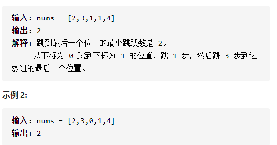

跳跃游戏



详细思路

从左到右，每次维护寻找最远可到达的位置和上次找到的最远可到达的位置，在走向上次找到的最远可到达位置的时候不断寻找最远可到达位置，到达上次找到最远可到达位置后ans++并更新，直到寻找最远可到达位置大于终点直接ans++

精确定义

lastfind上次找到的最远可到达的位置的下标

nowfind寻找最远可到达的位置的下标

i需要判断的下标

```c
class Solution {
public:
    int jump(vector<int>& nums) {
        int nowfind = 0, n = nums.size(), lastfind = 0, ans = 0;
        for (int i = 0; i < n - 1; ++i) {
            if (nums[i]+i>nowfind)nowfind=nums[i]+i;
            if(nowfind>=n-1){
                ans++;
                break;
            }
            if (i == lastfind) {
                lastfind = nowfind;
                ++ans;
            }
        }
        return ans;
    }
};
```

踩过的坑

​    for (int i = 0; i < n - 1; ++i) {

不要轻易用while，遍历最好用for

​      if (i == lastfind) {

​        lastfind = nowfind;

​        ++ans;

​      }

不要更新nowfind