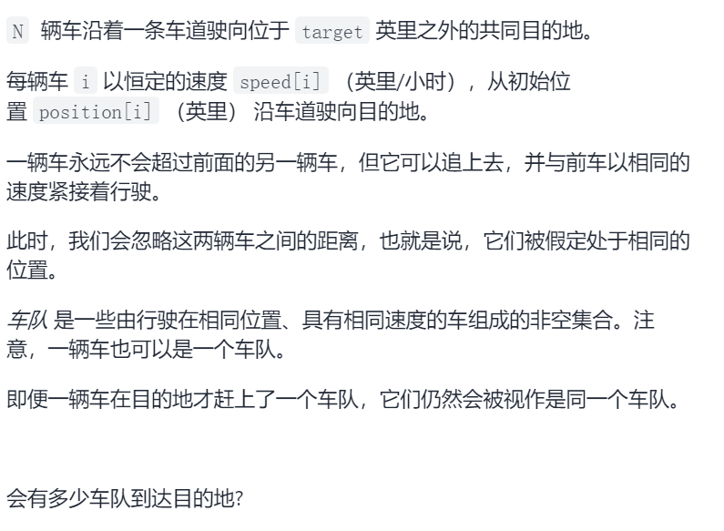
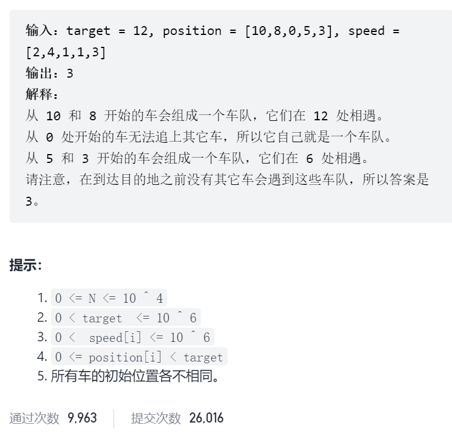
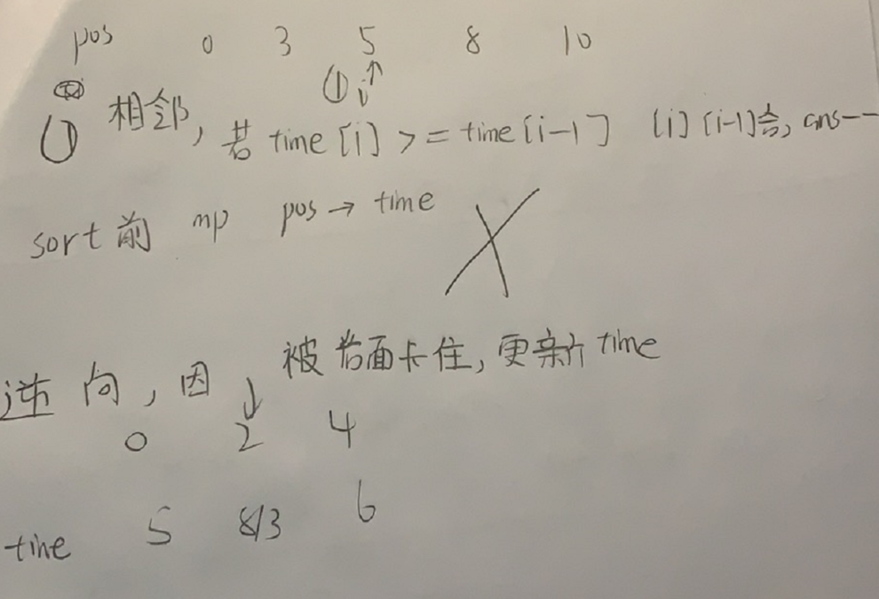

车队



抽象图一二ij



```c
class Solution {
public:
    int carFleet(int target, vector<int>& position, vector<int>& speed) {
        int n=position.size();
        vector<double>time(n);
        for(int i=0;i<n;i++){
            time[i]=(double)(target-position[i])/speed[i];
        }
        unordered_map<int,double>pos2time;
        for(int i=0;i<n;i++){
            pos2time[position[i]]=time[i];
        }
        sort(position.begin(),position.end());
        int ans=n;
        for(int i=n-2;i>=0;i--){
            double &preTime=pos2time[position[i]];
            double &curTime=pos2time[position[i+1]];
            if(curTime>=preTime){
                ans--;
                preTime=curTime;
            }
        }
        return ans;
    }
};
```

