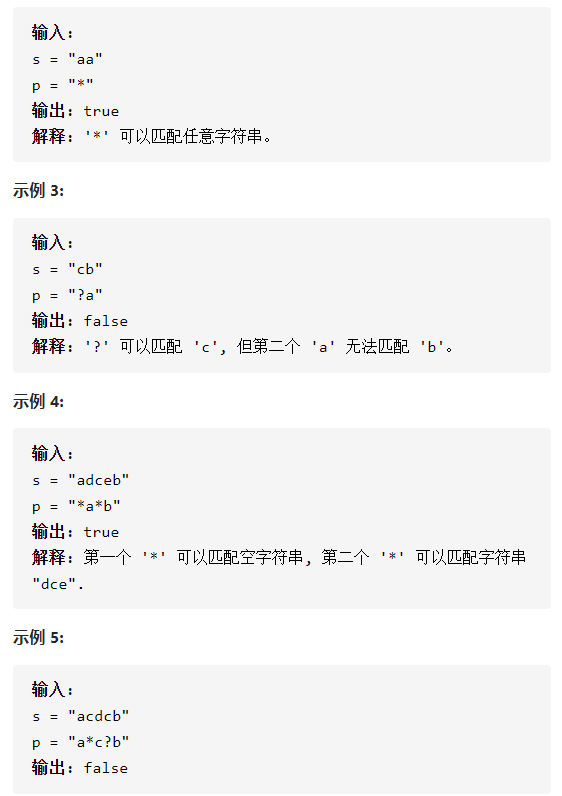

通配符匹配



详细思路

第i第j可以从某些转移过来

精确定义

dp ij 下标为0代表空，下标为1代表第一个字符，前ij个字符是否匹配

si pj  下标为0代表第一个字符

状态转移

\- - 1

\- - 1(?)   dpi j=dp i-1 j-1

\- - 1

\- - *      dpi j=dp i-1 j || dp i j-1

初始化

空

空 =1

任意

\* dp[0][1]=1

空

遍历顺序从左往右

```c
class Solution {
public:
    bool isMatch(string s, string p) {
        int n=s.size(),m=p.size();
        vector<vector<int>>dp(n+1,vector<int>(m+1,0));
        dp[0][0]=1;
        for(int j=1;j<=m;j++){
            if(p[j-1]=='*')dp[0][j]=1;
            else break;
        }
        for(int i=1;i<=n;i++){
            for(int j=1;j<=m;j++){
                if(s[i-1]==p[j-1]||p[j-1]=='?')dp[i][j]=dp[i-1][j-1];
                else if(p[j-1]=='*')dp[i][j]=dp[i-1][j]||dp[i][j-1];
            }
        }
        return dp[n][m];
    }
};

```

踩过的坑

dp ij 下标为0代表空，下标为1代表第一个字符

si pj  下标为0代表第一个字符

​    for(int j=1;j<=m;j++){

​      if(p[j-1]=='*')dp[0][j]=1;

​      else break;

​    }

