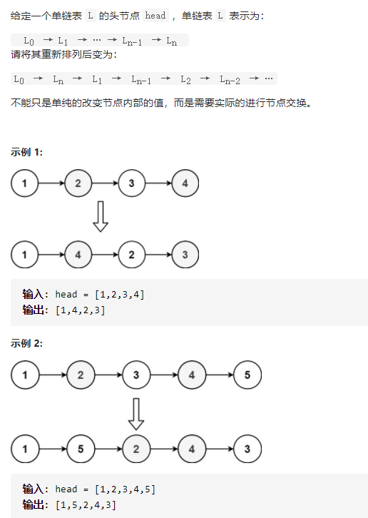
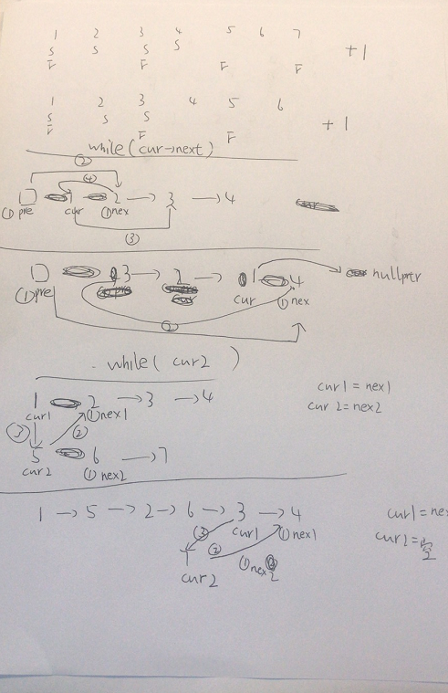

重排链表



变量简洁正确完整思路

找中点，翻转后半段，插入前半段，链表题只要好好画图，画图的第一步多初始化，第二步连接小心点注意顺序就可以

画图，分初始化、连接、再赋值三步骤



```c
class Solution {
public:
    void reorderList(ListNode* head) {
        if(!head->next)return;
        ListNode*S=head,*F=head;
        while(F->next&&F->next->next){
            F=F->next->next,S=S->next;
        }
        ListNode*head2=reverse(S->next);
        S->next=nullptr;
        merge(head,head2);
    }
    ListNode*reverse(ListNode*head){
        ListNode*dummy=new ListNode(-1,head);
        ListNode*cur=head;
        while(cur->next){
            ListNode*pre=dummy,*nex=cur->next;
            cur->next=nex->next;
            nex->next=pre->next;
            pre->next=nex;
        }
        return dummy->next;
    }
    void merge(ListNode*cur1,ListNode*cur2){
        while(cur2){
            ListNode*nex1=cur1->next,*nex2=cur2->next;
            cur2->next=nex1;
            cur1->next=cur2;
            cur1=nex1,cur2=nex2;
        }
    }
};
```


踩过的坑

翻转链表的图，pre要初始化，连接顺序搞错了