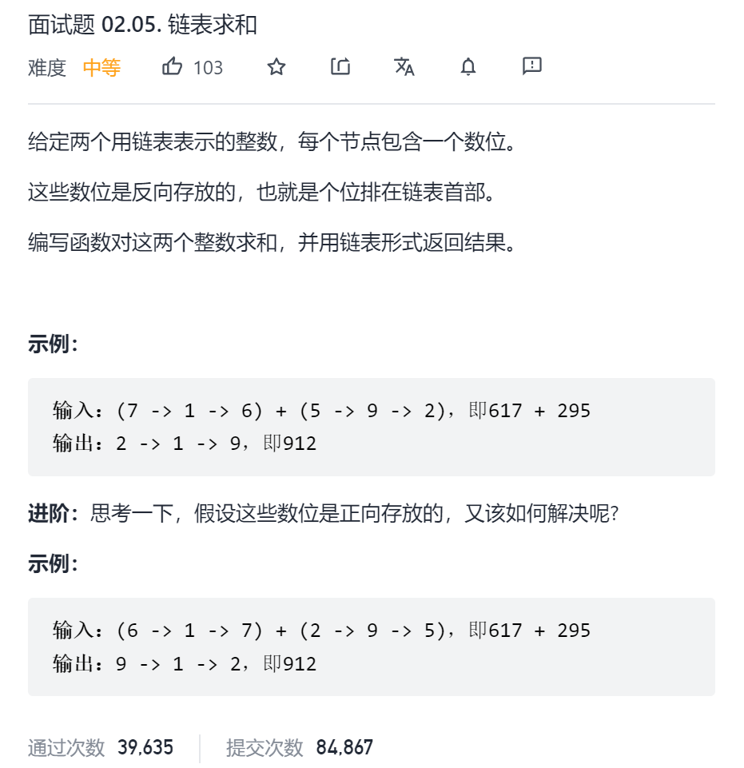

```c
/**
 * Definition for singly-linked list.
 * struct ListNode {
 *     int val;
 *     ListNode *next;
 *     ListNode(int x) : val(x), next(NULL) {}
 * };
 */
class Solution {
public:
    ListNode* addTwoNumbers(ListNode* l1, ListNode* l2) {

        ListNode* dummy=new ListNode(0);//哑节点
        ListNode* cur=dummy;
        int add=0;
        while(l1||l2||add){
            add+=(l1?l1->val:0)+(l2?l2->val:0);//进位的值+l1节点值+l2节点值
            cur->next=new ListNode(add%10);//当前节点的值 add%10
            add/=10;//获得进位的值 add/10
            cur=cur->next;
            l1=l1?l1->next:nullptr;//l1移动下一个节点(如果不为空)
            l2=l2?l2->next:nullptr;//l2移动下一个节点(如果不为空)
        }
        return dummy->next;
    }
};


```

