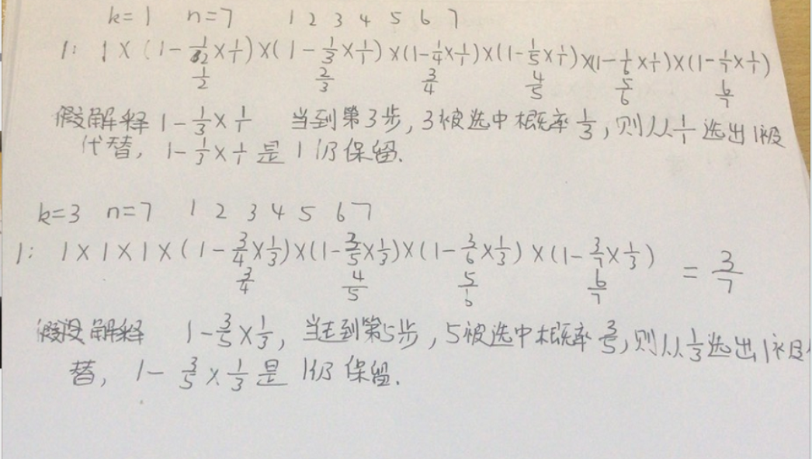

变量简洁正确完整思路

蓄水池抽样算法，大数据流中的随机抽样问题，从未知大小并且数据只能访问一次的数据流随机选取k个数据，保证每个数据被抽取到的概率相等

k步之前，被选中概率为1，k步走后，如果第i步被选中的概率是k/i，则最终所有数据被选中概率是k/n



用(rand()%i) ==0表示 1/i的概率第i个数字被选中

精确定义

i、cur是当前需要判断

```c
class Solution {
public:
    Solution(ListNode* head) {
        this->head=head;
    }
    
    int getRandom() {
        ListNode*cur=this->head;
        int pool=-1;
        int i=1;
        while(cur){
            if(rand()%i==0)pool=cur->val;
            i++;
            cur=cur->next;
        }
        return pool;
    }

private:
    ListNode*head;
};
```

