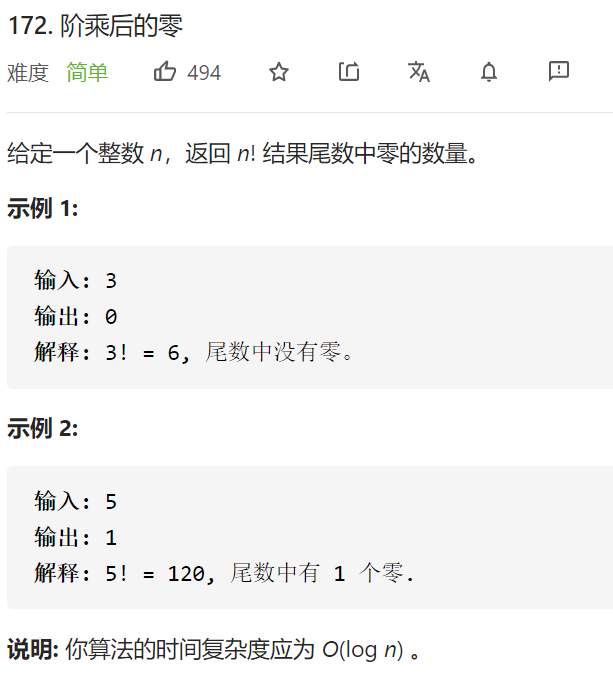

阶乘后的零



变量简洁正确完整思路

有多少个0-》2比5多-》有多少个5？

1-24直接+=n/5

25有多少个5？(n)/5+(n)/25

125 625。。。

但是不会超过n，所以如果n在125-625之内

先+=n/5，再+=n/25在+=n/125

也即是+=n/5 +=n/5  /5    +=n/5 /5 /5

```c
class Solution {
public:
    int trailingZeroes(int n) {
        int ans=0;
        while(n>0){
            ans+=n/5;
            n/=5;
        }
        return ans;
    }
};
```

