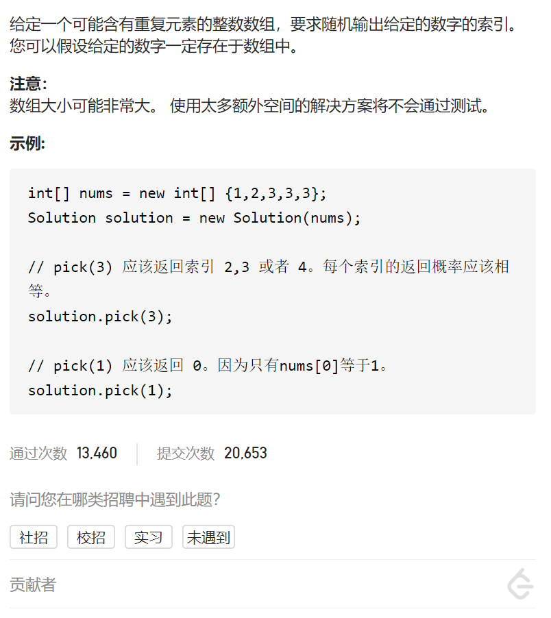
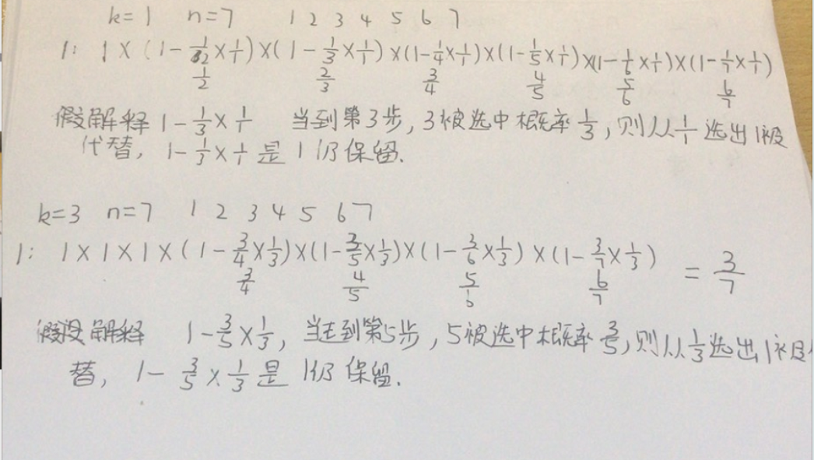

随机数索引

变量简洁正确完整思路

unordered_map<int值,vector<int下标>>，rand()%n

```c
class Solution {
public:
    unordered_map<int,vector<int>>num2indexs;
    Solution(vector<int>& nums) {
        for(int i=0;i<nums.size();i++){
            num2indexs[nums[i]].push_back(i);
        }
    }
    
    int pick(int target) {
        vector<int>vec=num2indexs[target];
        return vec[rand()%vec.size()];
    }
};

```


变量简洁正确完整思路

蓄水池抽样算法，大数据流中的随机抽样问题，从未知大小并且数据只能访问一次的数据流随机选取k个数据，保证每个数据被抽取到的概率相等

k步之前，被选中概率为1，k步走后，如果第i步被选中的概率是k/cnt，则最终所有数据被选中概率是k/n



用(rand()%cnt) ==0表示 1/cnt的概率第i个数字被选中

固定cur，如果*cur是target，对cnt抽样

```c
class Solution {
public:
    vector<int>::iterator beg,end;
    Solution(vector<int>& nums) {
        beg=nums.begin();
        end=nums.end();
    }
    
    int pick(int target) {
        vector<int>::iterator cur=beg;
        int cnt=1;
        int pool=0;
        int i=0;
        while(cur!=end){
            if(*cur==target){
                if(rand()%cnt==0)pool=i;
                cnt++;
            }
            i++,cur++;
        }
        return pool;
    }
};
```

