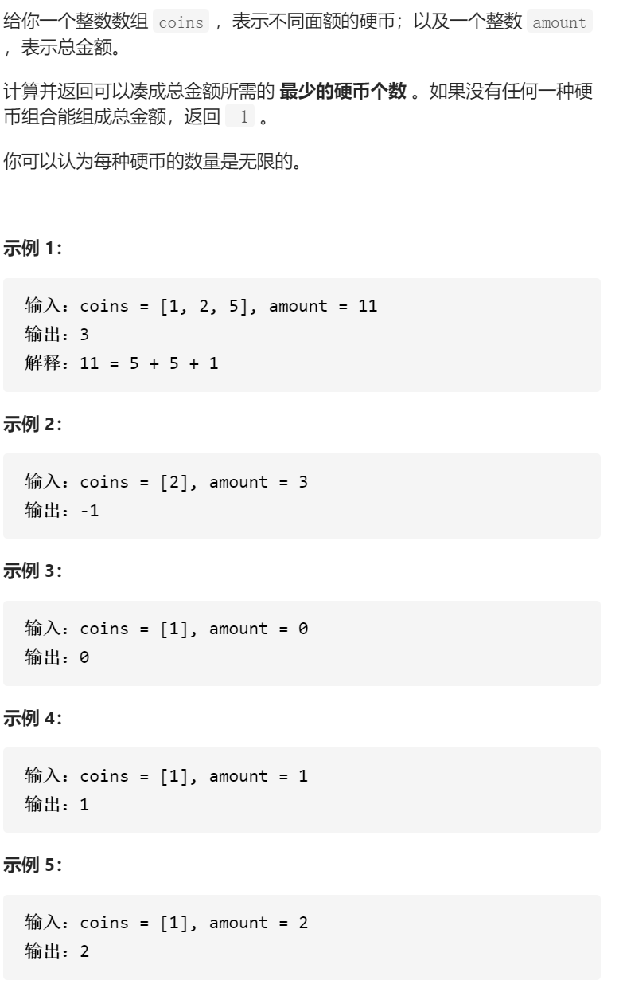

零钱兑换



变量简洁正确完整思路

dpi 凑成i元最少硬币数 dp0为0元

转移

1 2 5 

dp i= min(dpi  dp i- cj  +1

初始化

dp0=0

遍历顺序

往往是for(int num:nums)和for(int i=0;i<=target;i++)for(int i=target;i>=0;i--)的选择

0/1背包：外循环nums,内循环target,target正序，易错，假如外循环是i，每个dpi遍历完只放入一个物品，假如i正序，只能使用1次的物品被使用多次

完全背包：外循环nums,内循环target,target正序

组合背包：外循环target,内循环nums,target正序

```c
class Solution {
public:
    int coinChange(vector<int>& coins, int amount) {
        vector<int>dp(amount+1,0x3f3f3f3f);
        dp[0]=0;
        for(int i=1;i<=amount;i++){
            for(int coin:coins){
                if(i-coin>=0)dp[i]=min(dp[i],dp[i-coin]+1);
            }
        }
        return dp[amount]==0x3f3f3f3f?-1:dp[amount];
    }
};
class Solution {
public:
    int coinChange(vector<int> &coins, int amount)
    {
        vector<long long> dp(amount + 1, INT_MAX); 
        for (int coin : coins)
        {
            for (int i = 0; i <= amount; i++)
            {
                if (coin <= i)
                    dp[i] = min(dp[i], dp[i - coin] + 1);
            }
        }
        return dp[amount] == INT_MAX ? -1 : dp[amount];
    }
};
```

