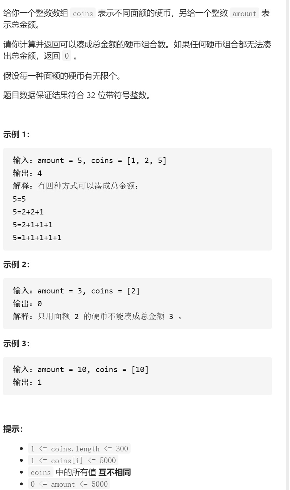
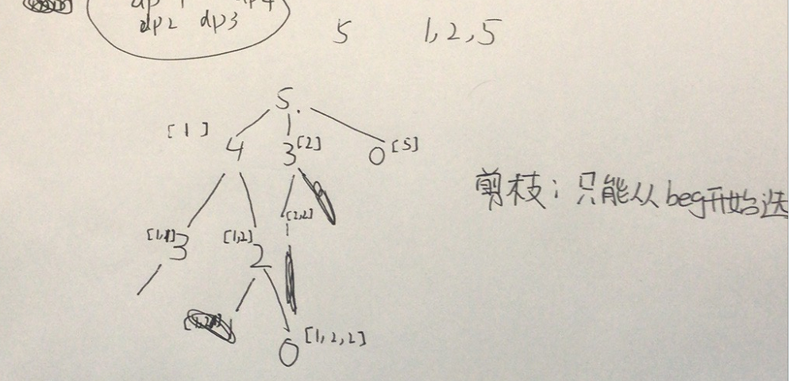

零钱兑换II



抽象图固定维护寻找



```c
class Solution {
public:
    vector<vector<int>>memo;
    int change(int amount, vector<int>& coins) {
        memo.resize(coins.size(),vector<int>(amount+1,-1));
        return dfs(0,amount,coins);
    }
    int dfs(int beg,int amount,vector<int>&coins){
        if(amount==0)return 1;
        if(beg==coins.size()||amount<0)return 0;
        if(memo[beg][amount]!=-1)return memo[beg][amount];
        int ans=0;
        for(int i=beg;i<coins.size();i++){
            ans+=dfs(i,amount-coins[i],coins);
        }
        memo[beg][amount]=ans;
        return ans;
    }
};

```


0/1背包：外循环nums,内循环target,target逆序，易错，假如外循环是i，每个dpi遍历完只放入一个物品，假如i正序，只能使用1次的物品被使用多次

完全背包：外循环nums,内循环target,target正序

组合背包：外循环target,内循环nums,target正序

```c
class Solution {
public:
    int change(int amount, vector<int>& coins) {
        vector<int>dp(amount+1,0);
        dp[0]=1;
        for(int coin:coins){
            for(int i=1;i<=amount;i++){
                if(i-coin>=0)dp[i]+=dp[i-coin];
            }
        }
        return dp[amount];
    }
};
```


