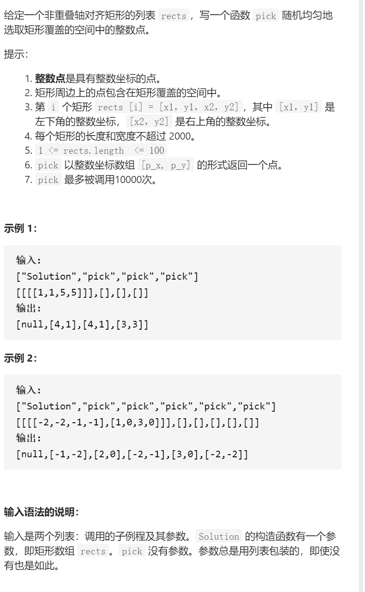
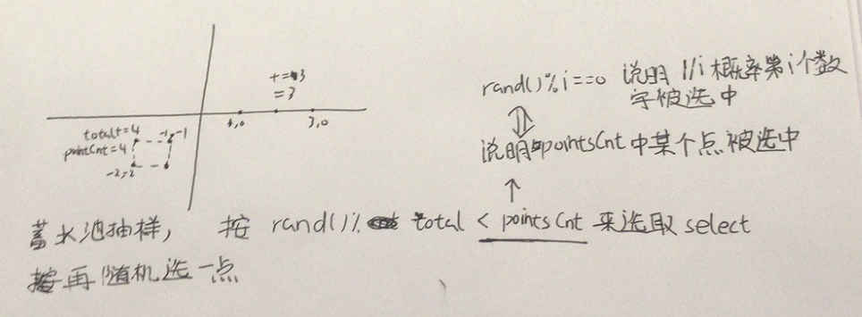

非重叠矩形中的随机点



抽象图固定维护寻找

蓄水池抽样选取矩形，随机选取矩形的点



```c
class Solution {
public:
    vector<vector<int>>rects;
    Solution(vector<vector<int>>& rects) {
        this->rects=rects;
    }
    
    vector<int> pick() {    
        int total=0;
        vector<int>select;
        for(const auto &rect:rects){
            int pointsCnt=(rect[3]-rect[1]+1)*(rect[2]-rect[0]+1);
            total+=pointsCnt;
            if(rand()%total<pointsCnt)select=rect;
        }
        int x1=select[0],y1=select[1],x2=select[2],y2=select[3];
        int randX=rand()%(x2-x1+1)+x1;
        int randY=rand()%(y2-y1+1)+y1;
        return {randX,randY};

    }
};
```

