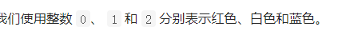

颜色分类



详细思路

用p0 p2从左右开工，p0是已经弄好的1，p2是已经弄好的2；从左往右，如果是0放到p0如果是2放到p2

精确定义

p0 是下标已经弄好，如p0=0代表下标0已经弄好

p2 是p2=n-1代表p2已经弄好

```c
class Solution {
public:
    void sortColors(vector<int>& nums) {
        int n = nums.size();
        int p0 =-1, p2 = n;
        for (int i = 0; i < p2; ++i) {
            while (i < p2 && nums[i] == 2) {
                --p2;
                swap(nums[i], nums[p2]);
            }
            if (nums[i] == 0) {
                ++p0;
                swap(nums[i], nums[p0]);
            }
        }
    }
};
```


踩过的坑

遇到2，更新p2，还是2，更新p2，不是2了，却是0，更新p0，非常重要

遇到0，更新p0，因为swap过去i的必然不会是0也不会是2，只会是1