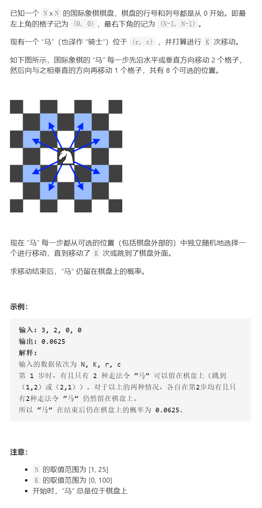

’‘马’‘在棋盘上的概率



抽象图一二ij

题目没有明确的点：1、跳第一次是8种情况，若已经有越界，那跳第二次是64种情况还是小于64种？（越界不再尝试跳跃）

如果是64种（这道题的答案是这种情况）

```c
class Solution {
public:
    int xx[8]={-2,-2,-1,-1,1,1,2,2};
    int yy[8]={-1,1,-2,2,-2,2,-1,1};
    double knightProbability(int n, int k, int row, int column) {

        int cnt1=0;
        dfs(n,k,row,column,cnt1);
        return (double)cnt1/pow(8,k);
    }
    void dfs(int n,int k,int x,int y,int &cnt1){
        if(k==0){
            cnt1++;
            return;
        }
        for(int i=0;i<8;i++){
            int dx=xx[i]+x,dy=yy[i]+y;
            if(dx<0||dx>=n||dy<0||dy>=n){
                continue;
            }
            dfs(n,k-1,dx,dy,cnt1);
        }
    }
};
```


记忆化

```c
class Solution {
public:
    int xx[8]={-2,-2,-1,-1,1,1,2,2};
    int yy[8]={-1,1,-2,2,-2,2,-1,1};
    double knightProbability(int n, int k, int row, int column) {
        vector<vector<vector<double>>>memo(25,vector<vector<double>>(25,vector<double>(101,-1)));
        return dfs(n,k,row,column,memo);
    }
    double dfs(int n,int k,int x,int y,vector<vector<vector<double>>>&memo){
        if(k==0){
            return 1;
        }
        if(memo[x][y][k]!=-1)return memo[x][y][k];
        double ans=0;
        for(int i=0;i<8;i++){
            int dx=xx[i]+x,dy=yy[i]+y;
            if(dx<0||dx>=n||dy<0||dy>=n){
                continue;
            }
            ans+=dfs(n,k-1,dx,dy,memo)/8.0;
        }
        memo[x][y][k]=ans;
        return ans;
    }
};

```


踩过的坑

k非常大，(double)cnt1/pow(8,k);超出long long，所以要将/8融入dfs

动态规划

基本上就是超一遍记忆化

```c
class Solution {
public:
    int xx[8]={-2,-2,-1,-1,1,1,2,2};
    int yy[8]={-1,1,-2,2,-2,2,-1,1};
    double knightProbability(int n, int k, int row, int column) {
        vector<vector<vector<double>>>memo(25,vector<vector<double>>(25,vector<double>(101,-1)));
        for(int i=0;i<n;i++){
            for(int j=0;j<n;j++){
                memo[i][j][0]=1;
            }
        }
        for(int p=1;p<=k;p++){
            for(int x=0;x<n;x++){
                for(int y=0;y<n;y++){
                    double ans=0;
                    for(int i=0;i<8;i++){
                        int dx=xx[i]+x,dy=yy[i]+y;
                        if(dx<0||dx>=n||dy<0||dy>=n)continue;
                        ans+=memo[dx][dy][p-1]/8.0;
                    }
                    memo[x][y][p]=ans;
                }
            }
        }
        return memo[row][column][k];
        //return dfs(n,k,row,column,memo);
    }
    /*
    double dfs(int n,int k,int x,int y,vector<vector<vector<double>>>&memo){
        if(k==0){
            return 1;
        }
        if(memo[x][y][k]!=-1)return memo[x][y][k];
        double ans=0;
        for(int i=0;i<8;i++){
            int dx=xx[i]+x,dy=yy[i]+y;
            if(dx<0||dx>=n||dy<0||dy>=n){
                continue;
            }
            ans+=dfs(n,k-1,dx,dy,memo)/8.0;
        }
        memo[x][y][k]=ans;
        return ans;
    }
    */
};
```


状态压缩

显然k和k-1可以滚动数组

```c
class Solution {
public:
    int xx[8]={-2,-2,-1,-1,1,1,2,2};
    int yy[8]={-1,1,-2,2,-2,2,-1,1};
    double knightProbability(int n, int k, int row, int column) {
        vector<vector<vector<double>>>memo(25,vector<vector<double>>(25,vector<double>(2,-1)));
        for(int i=0;i<n;i++){
            for(int j=0;j<n;j++){
                memo[i][j][0]=1;
            }
        }
        for(int p=1;p<=k;p++){
            for(int x=0;x<n;x++){
                for(int y=0;y<n;y++){
                    double ans=0;
                    for(int i=0;i<8;i++){
                        int dx=xx[i]+x,dy=yy[i]+y;
                        if(dx<0||dx>=n||dy<0||dy>=n)continue;
                        ans+=memo[dx][dy][(p-1)%2]/8.0;
                    }
                    memo[x][y][p%2]=ans;
                }
            }
        }
        return memo[row][column][k%2];
        //return dfs(n,k,row,column,memo);
    }
    /*
    double dfs(int n,int k,int x,int y,vector<vector<vector<double>>>&memo){
        if(k==0){
            return 1;
        }
        if(memo[x][y][k]!=-1)return memo[x][y][k];
        double ans=0;
        for(int i=0;i<8;i++){
            int dx=xx[i]+x,dy=yy[i]+y;
            if(dx<0||dx>=n||dy<0||dy>=n){
                continue;
            }
            ans+=dfs(n,k-1,dx,dy,memo)/8.0;
        }
        memo[x][y][k]=ans;
        return ans;
    }
    */
};
```


如果是小于64种（越界不再尝试跳跃）

```c
class Solution {
public:
    int xx[8]={-2,-2,-1,-1,1,1,2,2};
    int yy[8]={-1,1,-2,2,-2,2,-1,1};
    double knightProbability(int n, int k, int row, int column) {

        int cnt1=0,cnt2=0;
        dfs(n,k,row,column,cnt1,cnt2);
        return (double)cnt1/(cnt1+cnt2);
    }
    void dfs(int n,int k,int x,int y,int &cnt1,int &cnt2){
        if(k==0){
            cnt1++;
            return;
        }
        for(int i=0;i<8;i++){
            int dx=xx[i]+x,dy=yy[i]+y;
            if(dx<0||dx>=n||dy<0||dy>=n){
                cnt2++;
                continue;
            }
            dfs(n,k-1,dx,dy,cnt1,cnt2);
        }
    }
};
```

