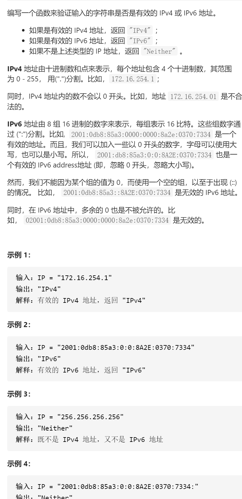

验证IP地址



抽象固定维护寻找

先抽象写出框架，bool is4(string),bool is6(string), 先split放到vector，千万不要面向测试用例编程，面试官想要看到什么？

```c
class Solution {
public:
    string validIPAddress(string IP) {
        if(is4(IP))return "IPv4";
        else if(is6(IP))return "IPv6";
        return "Neither";
    }
    bool is4(string IP){
        vector<string>ip;
        split(IP,ip,'.');
        if(ip.size()!=4)return false;
        for(string s:ip){
            if(s.size()==0||(s.size()>1&&s[0]=='0')||s.size()>3)return false;
            for(char c:s){
                if(!isdigit(c))return false;
            }
            int digit=stoi(s);
            if(digit<0||digit>255)return false;
        }
        return true;
    }

    bool is6(string IP){
        vector<string>ip;
        split(IP,ip,':');
        if(ip.size()!=8)return false;
        for(string s:ip){
            if(s.size()==0||s.size()>4)return false;
            for(char c:s){
                if(c<'0'||c>'9'&&c<'A'||c>'F'&&c<'a'||c>'f')return false;
            }
        }
        return true;
    }
    void split(string s,vector<string>&ip,char c){
        stringstream ss(s);
        string tmp;
        while(getline(ss,tmp,c))ip.push_back(tmp);
        if(s.size()>0&&s.back()==c)ip.push_back({});
    }
};
```

踩过的坑

if(c<'0'||c>'9'&&c<'A'||c>'F'&&c<'a'||c>'f')return false;