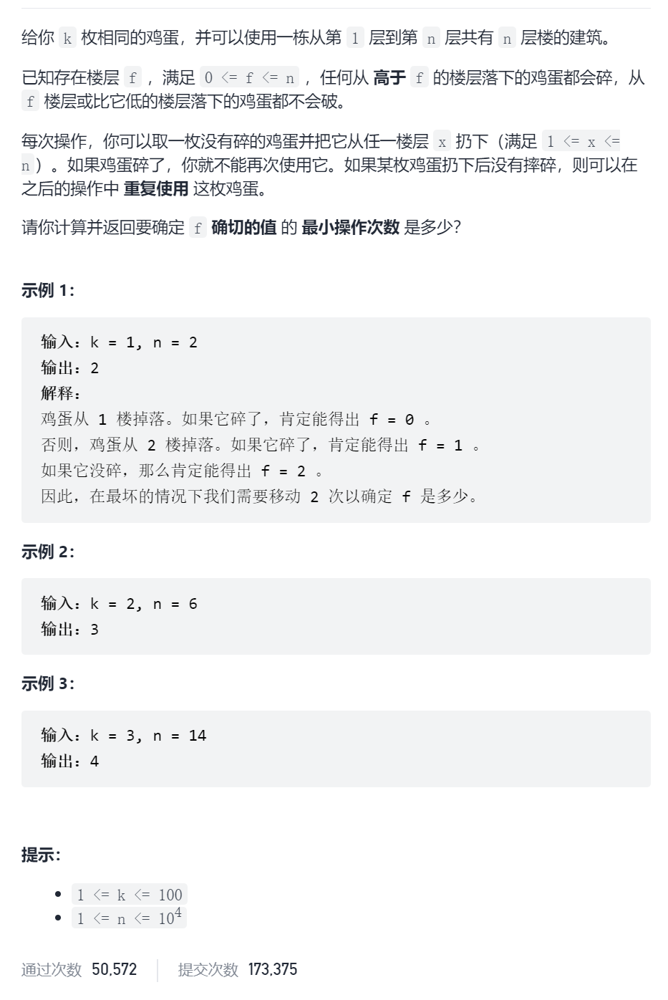
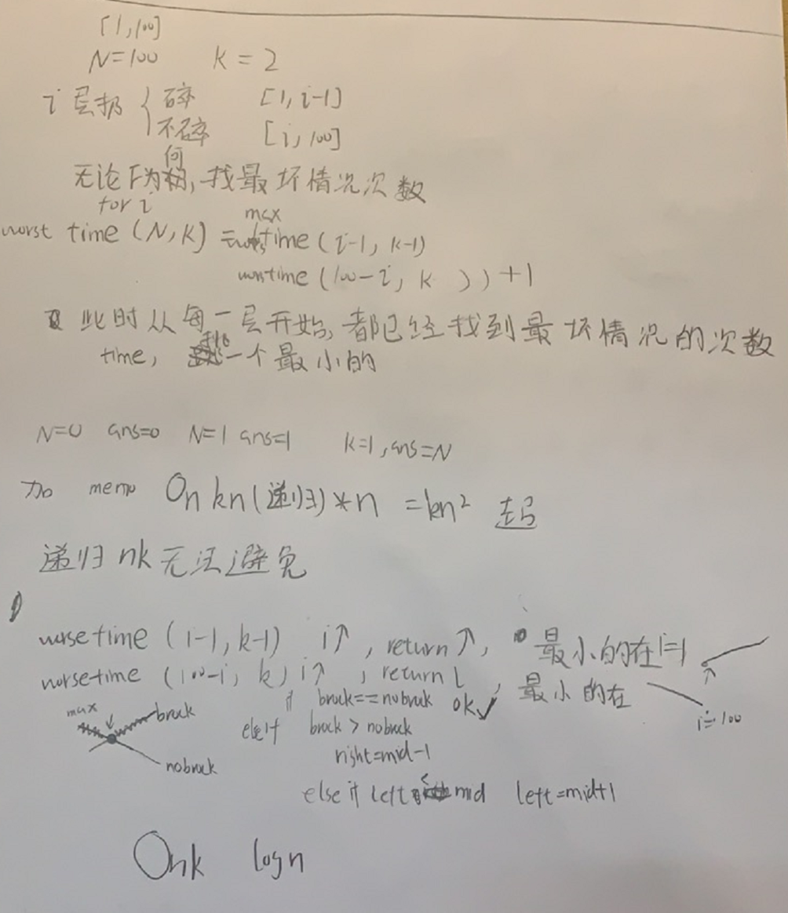
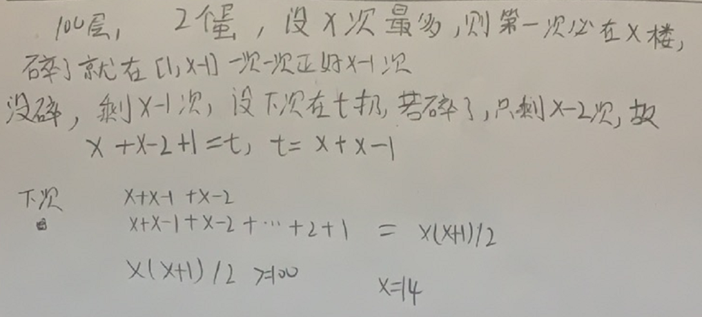

鸡蛋掉落






```c
class Solution {
public:
    int memo[10005][105];
    int superEggDrop(int k, int n) {
        memset(memo,-1,sizeof(memo));//只是负数
        return worstTime(n,k);
    }
    int worstTime(int n,int k){
        if(n==0|][k]>=0)return memo[n][k];
        int minCn|n==1||k==1)return n;
        if(memo[nt=n;
        for(int i=1;i<=n;i++){
            int curWorstTime=max(worstTime(i-1,k-1),worstTime(n-i,k))+1;
            minCnt=min(minCnt,curWorstTime);
        }
        memo[n][k]=minCnt;
        return minCnt;
    }
};
```



```c
class Solution {
public:
    int memo[10005][105];
    int superEggDrop(int k, int n) {
        memset(memo,-1,sizeof(memo));//只是负数
        return worstTime(n,k);
    }
    int worstTime(int n,int k){
        if(n==0||n==1||k==1)return n;
        if(memo[n][k]>=0)return memo[n][k];
        int minCnt=n;
        int left=1,right=n;
        while(left<=right){
            int mid=left+(right-left)/2;
            int broke=worstTime(mid-1,k-1);
            int noBroke=worstTime(n-mid,k);
            if(broke==noBroke){
                minCnt=broke+1;
                break;
            }else if(broke>noBroke){
                right=mid-1;
                minCnt=min(minCnt,broke+1);
            }else if(broke<noBroke){
                left=mid+1;
                minCnt=min(minCnt,noBroke+1);
            }
        }
        memo[n][k]=minCnt;
        return minCnt;
    }
};
```

