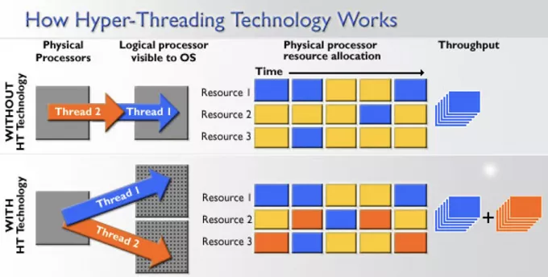

## **主板上的新邻居**

“阿Q，快别忙了，马上去一趟会议室，领导有重要事情开会”，一大早，咱们CPU厂里的总线主任就挨个到8个车间通知大家开会，神色有些凝重。

“什么事情，这么着急？”

“听说是主板上新来了一家单位，来抢咱们CPU工厂的饭碗了”，主任小声的说到。

“还有这种事情？”，我二话没说赶紧起身出门了。

来到会议室，没想到大家都已经到齐了，就差我了。

见我到来，领导开始讲话：“诸位，想必大家可能都有所耳闻，就在昨天，在咱们CPU工厂的不远处，主板上新来了一家叫**GPU**的单位，公开抢我们饭碗，今天召集大家就是商讨应对之策”

“GPU，我知道，就是**图形处理器**，就是干图形计算的，怎么能抢我们的活呢？领导你多虑了吧”，我回头一看，原来是六号车间的代表小六在发言。

“哦，看来你对他们很了解嘛？”，领导问小六。

小六有些不好意思的说到：“实不相瞒，在跳槽到这里来之前，我在另外一家CPU工厂上班，那里的主板上就有个GPU。他们主要承接一些图形渲染相关的计算工作，不过他们都是执行一些固定的操作，计算电路都是固定的，根本都不具备可编程的能力，跟我们CPU那是没法比的”

“小六，士别三日都当刮目相看，你有多久没见他们了？现在他们不仅和我们一样可以编程，据说团队规模扩张，现在已经是**通用计算架构**了，名字都要改了，叫什么GPGPU，连计算速度都比我们快了！”，领导说的掷地有声，会场一下安静了下来。

“阿Q、小六，你们两个想办法混进去他们工厂摸摸情况，汇报以后咱们再继续讨论，大家意下如何？”，领导望向大家。

我还没反应过来，大家都纷纷说好，看来这份差事我是躲不掉了。

## **潜入GPU内部**

当天夜里，我与小六偷偷溜进了GPU工厂，没想到虽然夜已深，但里面还是灯火通明，一派繁忙的景象。

等到进入了他们工作的地方，我和我的小伙伴都惊呆了！好家伙，这规模也太大了，放眼望去，全是一个个的工作车间，一眼望不到头。

“Q哥，他们这也太猛了，咱们CPU也就8核，才8个车间，他们这我目测不下1000个车间，难道他们有1000多个核，看得我眼睛都花了！”，小六满脸惊讶的说到。

“我看没那么简单，你仔细看他们的工作车间，比我们的可简陋多了”

“还真是，那些橙色的地方应该就是缓存吧，比我们可小多了。还有他们好像大部分都是计算电路，逻辑控制电路很少”

“你们不去干活，躲在这干嘛？”，不好，我们被巡逻的给发现了！但好像他并没有认出我们的身份，把我们当成这里的员工了。

我俩尴尬的点头笑着说到：“休息休息，我们这就回去”

“你俩快去1024号车间，那里还缺人手”

“好嘞好嘞，这就去，这就去”

我堂堂CPU一号车间的指令执行长官阿Q，居然在这里对这个小小巡逻点头哈腰的，想想都气！

## **GPU的秘密**

找了好久，我俩终于来到1024号车间，这里有一个小哥正忙的不可开交。见到我们到来，小哥高兴的说到：“你们可算是来了，我这都忙死了”

“今天都这么晚了，这是在忙着执行什么程序啊”，我试探性的问到。

“今天有点背，程序员下班前留了一个深度学习的神经网络训练任务给我们，今儿晚上大家肯定没法休息了，搞不好得通宵”，小哥一边忙着操作计算电路进行数据计算，一边对我们说到。

小六给我使了个眼神，然后对小哥说到：“你空了给我们介绍下工作吧，让我们也干点活”

“对，对，让我们也帮你分担点”，我跟着附和。

“你们先坐坐，这一轮训练马上就要结束了，趁着空当给你们介绍介绍。”，小哥说完擦了擦额头的汗。

趁着小哥在忙，我俩四处转了转，“小六啊，他们这车间比起咱们CPU确实显得寒酸了许多。我们每个车间可都是标配了一二级缓存的，少说也有几百KB，他们可没有这个待遇。而且他们的计算资源电路也简单很多，像我们用于**分支预测**和**乱序执行**的逻辑控制电路这里都没有”

“Q哥高手啊，这里这么多电路你都能认得出来？”

“俺在CPU厂里混了那么多年，这都认不出来那不白干了吗？”

“不对啊，按照你说的，他们这里的电路应该很少才对，可是你看怎么这么多”，小六的话引起了我的注意。

再仔细一看，计算电路虽然没我们那么复杂，但**计算单元ALU**却有很多份！要知道在咱们CPU工厂，一个车间也只有一份。

正在纳闷之际，小哥忙完了手里的活，走了过来，“总算可以歇口气了”。

“大哥辛苦了，想问一下这里怎么这么多重复的计算电路啊？这不浪费吗？”，我赶紧上前问到。

小哥不以为然，“这可不是浪费，在咱们GPU工厂的车间里，每个车间都配置了很多个计算单元，我可以操作它们同时进行批量的数据计算，提升速度”

“批量计算？还能同时？”，小六问到。

“是啊，像我们GPU工厂承包的活基本都是这种类型，**像3D图像渲染中每个像素的计算，深度学习中张量和矩阵的计算，它们有一个特点，都是算法固定，只是数据不一样而已。同样的计算逻辑，我喂给它们不同的数据就可以并行计算了！这个叫SIMT（Single Instruction，Multiple Threads）技术**”，小哥得意的说到。

“SIMT？这技术怎么感觉那么眼熟呢？”，我问到。

小哥继续笑着说到：“那可不，这一招CPU他们早就用过了，我们这是借鉴”

“哦，我想起来了，Q哥，他说的应该是**SIMD（Single Instruction Multiple Data，单指令多数据流）**，一条指令中可以批量操作多个数据，提升性能”

小六一下点醒了我，“原来如此！我们，哦不，是他们CPU只是批量操作数据，GPU这里是批量执行计算，真是妙啊！”

“Q哥，听起来不错啊，为什么咱们CPU不能这样搞呢？”，小六悄悄问我。

“你个笨蛋，咱们CPU内部有八个车间，每个车间同时执行一个线程不就是并行吗？只不过咱们执行的多个线程都是功能各异，有些是IO密集，有些是计算密集，既有缓存和逻辑控制电路的的建设成本，还要做到通用，没有办法像他们这样搞很多个出来。”

接下来，小哥带我们来到了操作平台，告诉我们如何操作这一堆电路执行计算工作，我自然是轻车熟路了，这比在我们那儿简单多了。

“那边是寄存器和保存执行上下文的地方，你们等会儿会用到。”，小哥指着一堆箱子说到。

“哎，老哥，这执行上下文怎么这么多，比计算单元ALU还多”，我问到。

小哥一拍脑袋说到：“嗨，瞧我这记性，忘记给你们说了。咱们GPU虽然以计算见长，但还是会遇到分支判断的场景，咱们这又没有CPU那样的**分支预测**和**乱序执行**的能力，你们不知道内存那家伙可慢了，有时候难免会遇到停顿等待的情况，浪费计算资源。后来领导交代了，为了充分利用计算资源，不让ALU闲置着，遇到这种停顿的情况，就把计算资源ALU挪出来去执行别的计算代码。所以就需要多预留一些执行上下文来保存现场了。”

“卧槽，这不就是**超线程技术**嘛！又抄袭我们CPU”，我几乎突口而出，说完看了一眼小六。

“怎么能叫抄袭呢，借鉴，是借鉴哈”，小哥龇着牙笑着。

小六突然问了一句：“咱们GPU这么厉害，以后是不是都没他们CPU啥事儿啦？”

小哥摇了摇头：“这话说的有些吹牛皮了，我们连**中断处理**和**虚拟内存**都没有，还需要借助CPU他们的帮忙才能工作呢，是不可能取代他们的。他们CPU太忙了，又要忙着计算，又要忙着执行IO，处理中断，还有各种复杂逻辑的判断处理，我们就简单了，没有那么多顾虑，就是用人海战术，做纯粹的计算工作，人多力量大，又能并行，所以在数学计算方面我们要快得多。不过总体来说我们和CPU是合作关系，不是竞争关系！”

听到小哥这么一说，我俩悬着的心总算放了下来，这下回去可算是给领导有个交代了。

我正想的出神，小六从背后悄悄拍了拍我，使了个眼神。

顺着他示意的地方望去，只见刚才那个巡逻正带着几个保安朝我们这边走了过来。

来不及向小哥告别，我俩赶紧溜之大吉···

