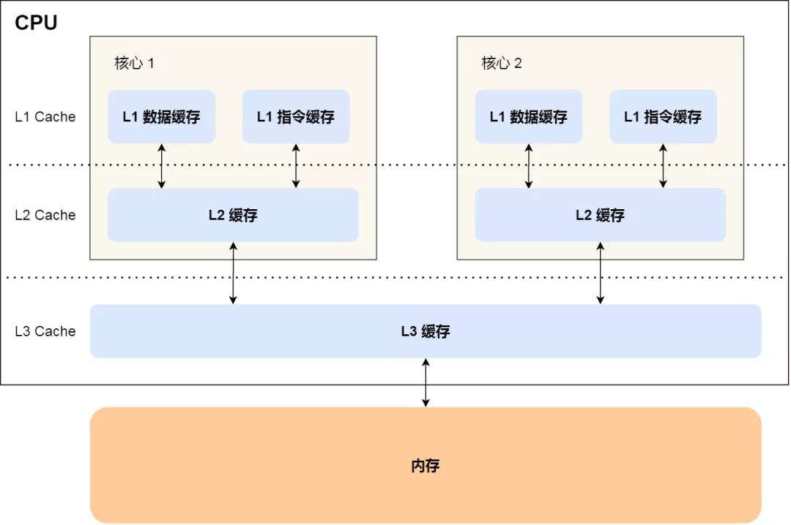
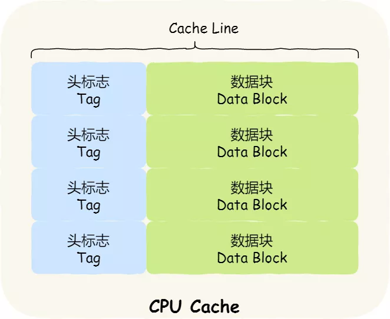
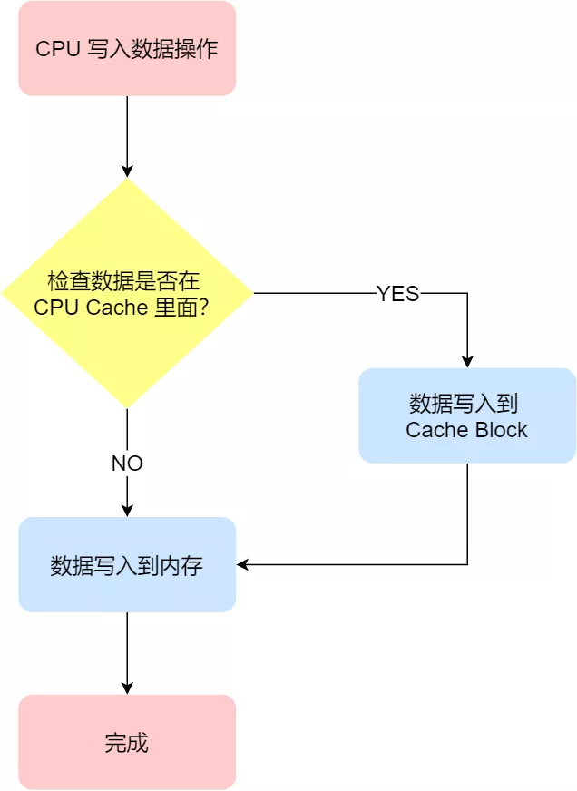
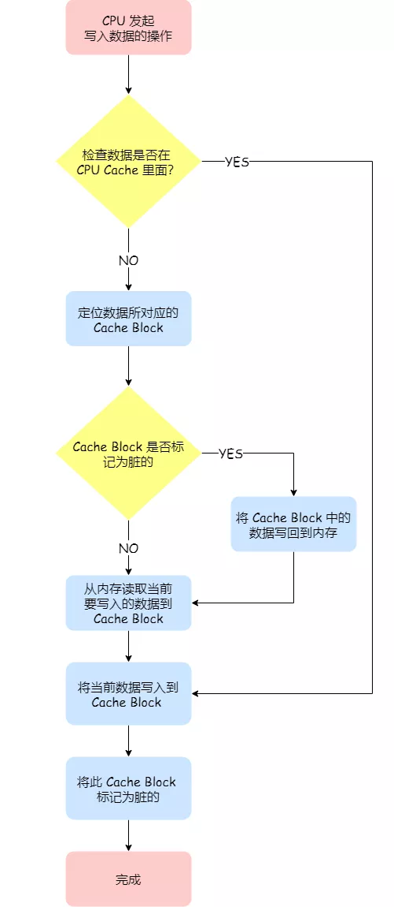

### CPU Cache 的数据写入

随着时间的推移，CPU 和内存的访问性能相差越来越大，于是就在 CPU 内部嵌入了 CPU Cache（高速缓存），CPU Cache 离 CPU 核心相当近，因此它的访问速度是很快的，于是它充当了 CPU 与内存之间的缓存角色。

CPU Cache 通常分为三级缓存：L1 Cache、L2 Cache、L3 Cache，级别越低的离 CPU 核心越近，访问速度也快，但是存储容量相对就会越小。其中，在多核心的 CPU 里，每个核心都有各自的 L1/L2 Cache，而 L3 Cache 是所有核心共享使用的。

我们先简单了解下 CPU Cache 的结构，CPU Cache 是由很多个 Cache Line 组成的，CPU Line 是 CPU 从内存读取数据的基本单位，而 CPU Line 是由各种标志（Tag）+ 数据块（Data Block）组成，你可以在下图清晰的看到：

我们当然期望 CPU 读取数据的时候，都是尽可能地从 CPU Cache 中读取，而不是每一次都要从内存中获取数据。所以，身为程序员，我们要尽可能写出缓存命中率高的代码，这样就有效提高程序的性能，具体的做法，你可以参考我上一篇文章[「如何写出让 CPU 跑得更快的代码？」](https://mp.weixin.qq.com/s?__biz=MzUxODAzNDg4NQ==&mid=2247486022&idx=1&sn=8bb5a066d81f77523a06cd09251055da&scene=21#wechat_redirect)

事实上，数据不光是只有读操作，还有写操作，那么如果数据写入 Cache 之后，内存与 Cache 相对应的数据将会不同，这种情况下 Cache 和内存数据都不一致了，于是我们肯定是要把 Cache 中的数据同步到内存里的。

问题来了，那在什么时机才把 Cache 中的数据写回到内存呢？为了应对这个问题，下面介绍两种针对写入数据的方法：

- 写直达（*Write Through*）
- 写回（*Write Back*）

#### 写直达

保持内存与 Cache 一致性最简单的方式是，**把数据同时写入内存和 Cache 中**，这种方法称为**写直达（\*Write Through\*）**。

在这个方法里，写入前会先判断数据是否已经在 CPU Cache 里面了：

- 如果数据已经在 Cache 里面，先将数据更新到 Cache 里面，再写入到内存里面；
- 如果数据没有在 Cache 里面，就直接把数据更新到内存里面。

写直达法很直观，也很简单，但是问题明显，无论数据在不在 Cache 里面，每次写操作都会写回到内存，这样写操作将会花费大量的时间，无疑性能会受到很大的影响。

#### 写回

既然写直达由于每次写操作都会把数据写回到内存，而导致影响性能，于是为了要减少数据写回内存的频率，就出现了**写回（\*Write Back\*）的方法**。

在写回机制中，**当发生写操作时，新的数据仅仅被写入 Cache Block 里，只有当修改过的 Cache Block「被替换」时才需要写到内存中**，减少了数据写回内存的频率，这样便可以提高系统的性能。

那具体如何做到的呢？下面来详细说一下：

- 如果当发生写操作时，数据已经在 CPU Cache 里的话，则把数据更新到 CPU Cache 里，同时标记 CPU Cache 里的这个 Cache Block 为脏（Dirty）的，这个脏的标记代表这个时候，我们 CPU Cache 里面的这个 Cache Block 的数据和内存是不一致的，这种情况是不用把数据写到内存里的；
- 如果当发生写操作时，数据所对应的 Cache Block 里存放的是「别的内存地址的数据」的话，就要检查这个 Cache Block 里的数据有没有被标记为脏的，如果是脏的话，我们就要把这个 Cache Block 里的数据写回到内存，然后再把当前要写入的数据，写入到这个 Cache Block 里，同时也把它标记为脏的；如果 Cache Block 里面的数据没有被标记为脏，则就直接将数据写入到这个 Cache Block 里，然后再把这个 Cache Block 标记为脏的就好了。

可以发现写回这个方法，在把数据写入到 Cache 的时候，只有在缓存不命中，同时数据对应的 Cache 中的 Cache Block 为脏标记的情况下，才会将数据写到内存中，而在缓存命中的情况下，则在写入后 Cache 后，只需把该数据对应的 Cache Block 标记为脏即可，而不用写到内存里。

这样的好处是，如果我们大量的操作都能够命中缓存，那么大部分时间里 CPU 都不需要读写内存，自然性能相比写直达会高很多。