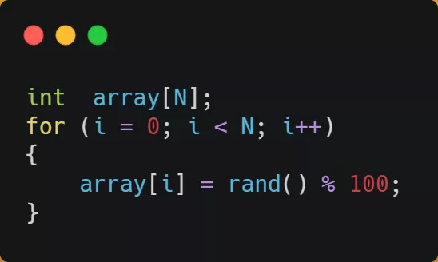
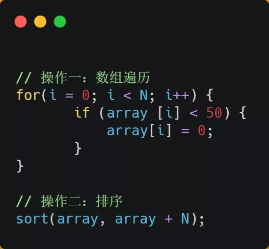
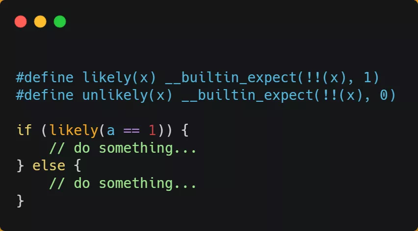

#### 如何提升指令缓存的命中率？

提升数据的缓存命中率的方式，是按照内存布局顺序访问，那针对指令的缓存该如何提升呢？

我们以一个例子来看看，有一个元素为 0 到 100 之间随机数字组成的一维数组：

接下来，对这个数组做两个操作：

- 第一个操作，循环遍历数组，把小于 50 的数组元素置为 0；
- 第二个操作，将数组排序；

那么问题来了，你觉得先遍历再排序速度快，还是先排序再遍历速度快呢？

在回答这个问题之前，我们先了解 CPU 的**分支预测器**。对于 if 条件语句，意味着此时至少可以选择跳转到两段不同的指令执行，也就是 if 还是 else 中的指令。那么，**如果分支预测可以预测到接下来要执行 if 里的指令，还是 else 指令的话，就可以「提前」把这些指令放在指令缓存中，这样 CPU 可以直接从 Cache 读取到指令，于是执行速度就会很快**。

当数组中的元素是随机的，分支预测就无法有效工作，而当数组元素都是顺序的，分支预测器会动态地根据历史命中数据对未来进行预测，这样命中率就会很高。

因此，先排序再遍历速度会更快，这是因为排序之后，数字是从小到大的，那么前几次循环命中 `if < 50` 的次数会比较多，于是分支预测就会缓存 `if` 里的 `array[i] = 0` 指令到 Cache 中，后续 CPU 执行该指令就只需要从 Cache 读取就好了。

如果你肯定代码中的 `if` 中的表达式判断为 `true` 的概率比较高，我们可以使用显示分支预测工具，比如在 C/C++ 语言中编译器提供了 `likely` 和 `unlikely` 这两种宏，如果 `if` 条件为 `ture` 的概率大，则可以用 `likely` 宏把 `if` 里的表达式包裹起来，反之用 `unlikely` 宏。

实际上，CPU 自身的动态分支预测已经是比较准的了，所以只有当非常确信 CPU 预测的不准，且能够知道实际的概率情况时，才建议使用这两种宏。