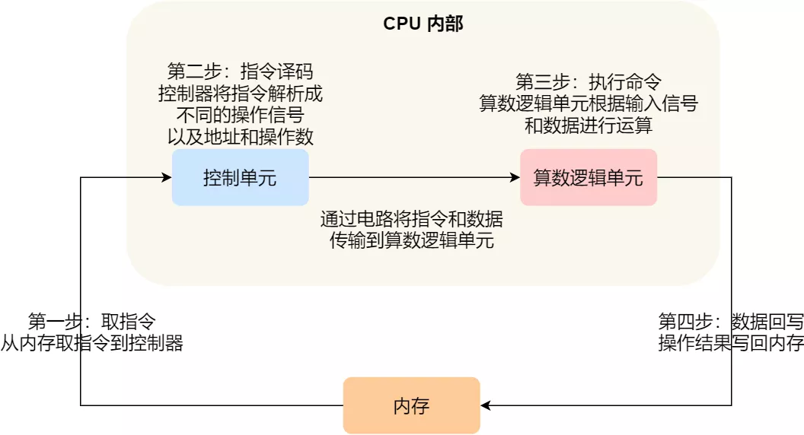

### 总结

CPU 在读写数据的时候，都是在 CPU Cache 读写数据的，原因是 Cache 离 CPU 很近，读写性能相比内存高出很多。对于 Cache 里没有缓存 CPU 所需要读取的数据的这种情况，CPU 则会从内存读取数据，并将数据缓存到 Cache 里面，最后 CPU 再从 Cache 读取数据。

而对于数据的写入，CPU 都会先写入到 Cache 里面，然后再在找个合适的时机写入到内存，那就有「写直达」和「写回」这两种策略来保证 Cache 与内存的数据一致性：

- 写直达，只要有数据写入，都会直接把数据写入到内存里面，这种方式简单直观，但是性能就会受限于内存的访问速度；
- 写回，对于已经缓存在 Cache 的数据的写入，只需要更新其数据就可以，不用写入到内存，只有在需要把缓存里面的脏数据交换出去的时候，才把数据同步到内存里，这种方式在缓存命中率高的情况，性能会更好；

当今 CPU 都是多核的，每个核心都有各自独立的 L1/L2 Cache，只有 L3 Cache 是多个核心之间共享的。所以，我们要确保多核缓存是一致性的，否则会出现错误的结果。

要想实现缓存一致性，关键是要满足 2 点：

- 第一点是写传播，也就是当某个 CPU 核心发生写入操作时，需要把该事件广播通知给其他核心；
- 第二点是事物的串行化，这个很重要，只有保证了这个，次啊能保障我们的数据是真正一致的，我们的程序在各个不同的核心上运行的结果也是一致的；

基于总线嗅探机制的 MESI 协议，就满足上面了这两点，因此它是保障缓存一致性的协议。

MESI 协议，是已修改、独占、共享、已实现这四个状态的英文缩写的组合。整个 MSI 状态的变更，则是根据来自本地 CPU 核心的请求，或者来自其他 CPU 核心通过总线传输过来的请求，从而构成一个流动的状态机。另外，对于在「已修改」或者「独占」状态的 Cache Line，修改更新其数据不需要发送广播给其他 CPU 核心。

------

### a = 1 + 2 执行具体过程

知道了基本的程序执行过程后，接下来用 `a = 1 + 2` 的作为例子，进一步分析该程序在冯诺伊曼模型的执行过程。

CPU 是不认识 `a = 1 + 2` 这个字符串，这些字符串只是方便我们程序员认识，要想这段程序能跑起来，还需要把整个程序翻译成**汇编语言**的程序，这个过程称为编译成汇编代码。

针对汇编代码，我们还需要用汇编器翻译成机器码，这些机器码由 0 和 1 组成的机器语言，这一条条机器码，就是一条条的**计算机指令**，这个才是 CPU 能够真正认识的东西。

下面来看看  `a = 1 + 2` 在 32 位 CPU 的执行过程。

程序编译过程中，编译器通过分析代码，发现 1 和 2 是数据，于是程序运行时，内存会有个专门的区域来存放这些数据，这个区域就是「数据段」。如下图，数据 1 和 2 的区域位置：

- 数据 1 被存放到 0x100 位置；
- 数据 2 被存放到 0x104 位置；

注意，数据和指令是分开区域存放的，存放指令区域的地方称为「正文段」。

编译器会把 `a = 1 + 2` 翻译成 4 条指令，存放到正文段中。如图，这 4 条指令被存放到了 0x200 ~ 0x20c 的区域中：

- 0x200 的内容是 `load` 指令将 0x100 地址中的数据 1 装入到寄存器 `R0`；
- 0x204 的内容是 `load` 指令将 0x104 地址中的数据 2 装入到寄存器 `R1`；
- 0x208 的内容是 `add` 指令将寄存器 `R0` 和 `R1` 的数据相加，并把结果存放到寄存器 `R2`；
- 0x20c 的内容是 `store` 指令将寄存器 `R2` 中的数据存回数据段中的 0x108 地址中，这个地址也就是变量 `a` 内存中的地址；

编译完成后，具体执行程序的时候，程序计数器会被设置为 0x200 地址，然后依次执行这 4 条指令。

上面的例子中，由于是在 32 位 CPU 执行的，因此一条指令是占 32 位大小，所以你会发现每条指令间隔 4 个字节。

而数据的大小是根据你在程序中指定的变量类型，比如 `int` 类型的数据则占 4 个字节，`char` 类型的数据则占 1 个字节。

#### 指令

上面的例子中，图中指令的内容我写的是简易的汇编代码，目的是为了方便理解指令的具体内容，事实上指令的内容是一串二进制数字的机器码，每条指令都有对应的机器码，CPU 通过解析机器码来知道指令的内容。

不同的 CPU 有不同的指令集，也就是对应着不同的汇编语言和不同的机器码，接下来选用最简单的 MIPS 指集，来看看机器码是如何生成的，这样也能明白二进制的机器码的具体含义。

MIPS 的指令是一个 32 位的整数，高 6 位代表着操作码，表示这条指令是一条什么样的指令，剩下的 26 位不同指令类型所表示的内容也就不相同，主要有三种类型R、I 和 J。

一起具体看看这三种类型的含义：

- *R 指令*，用在算术和逻辑操作，里面由读取和写入数据的寄存器地址。如果是逻辑位移操作，后面还有位移操作的「位移量」，而最后的「功能码」则是再前面的操作码不够的时候，扩展操作码来表示对应的具体指令的；
- *I 指令*，用在数据传输、条件分支等。这个类型的指令，就没有了位移量和操作码，也没有了第三个寄存器，而是把这三部分直接合并成了一个地址值或一个常数；
- *J 指令*，用在跳转，高 6 位之外的 26 位都是一个跳转后的地址；

接下来，我们把前面例子的这条指令：「`add` 指令将寄存器 `R0` 和 `R1` 的数据相加，并把结果放入到 `R3`」，翻译成机器码。

加和运算 add 指令是属于 R 指令类型：

- add 对应的 MIPS 指令里操作码是 `000000`，以及最末尾的功能码是 `100000`，这些数值都是固定的，查一下 MIPS 指令集的手册就能知道的；
- rs 代表第一个寄存器 R0 的编号，即 `00000`；
- rt 代表第二个寄存器 R1 的编号，即 `00001`；
- rd 代表目标的临时寄存器 R2 的编号，即 `00010`；
- 因为不是位移操作，所以位移量是 `00000`

把上面这些数字拼在一起就是一条 32 位的 MIPS 加法指令了，那么用 16 进制表示的机器码则是 `0x00011020`。

编译器在编译程序的时候，会构造指令，这个过程叫做指令的编码。CPU 执行程序的时候，就会解析指令，这个过程叫作指令的解码。

现代大多数 CPU 都使用来流水线的方式来执行指令，所谓的流水线就是把一个任务拆分成多个小任务，于是一条指令通常分为 4 个阶段，称为 4 级流水线，如下图：

四个阶段的具体含义：

1. CPU 通过程序计数器读取对应内存地址的指令，这个部分称为 **Fetch（取得指令）**；
2. CPU 对指令进行解码，这个部分称为 **Decode（指令译码）**；
3. CPU 执行指令，这个部分称为 **Execution（执行指令）**；
4. CPU 将计算结果存回寄存器或者将寄存器的值存入内存，这个部分称为 **Store（数据回写）**；

上面这 4 个阶段，我们称为**指令周期（\*Instrution Cycle\*）**，CPU 的工作就是一个周期接着一个周期，周而复始。

事实上，不同的阶段其实是由计算机中的不同组件完成的：

- 取指令的阶段，我们的指令是存放在**存储器**里的，实际上，通过程序计数器和指令寄存器取出指令的过程，是由**控制器**操作的；
- 指令的译码过程，也是由**控制器**进行的；
- 指令执行的过程，无论是进行算术操作、逻辑操作，还是进行数据传输、条件分支操作，都是由**算术逻辑单元**操作的，也就是由**运算器**处理的。但是如果是一个简单的无条件地址跳转，则是直接在**控制器**里面完成的，不需要用到运算器。