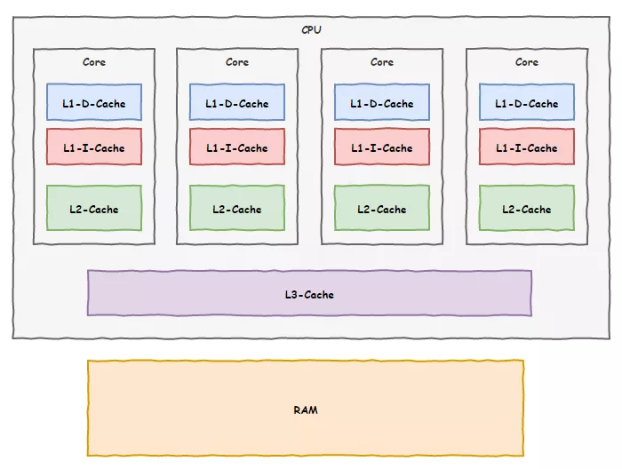

### 总结

CPU 在读写数据的时候，都是在 CPU Cache 读写数据的，原因是 Cache 离 CPU 很近，读写性能相比内存高出很多。对于 Cache 里没有缓存 CPU 所需要读取的数据的这种情况，CPU 则会从内存读取数据，并将数据缓存到 Cache 里面，最后 CPU 再从 Cache 读取数据。

而对于数据的写入，CPU 都会先写入到 Cache 里面，然后再在找个合适的时机写入到内存，那就有「写直达」和「写回」这两种策略来保证 Cache 与内存的数据一致性：

- 写直达，只要有数据写入，都会直接把数据写入到内存里面，这种方式简单直观，但是性能就会受限于内存的访问速度；
- 写回，对于已经缓存在 Cache 的数据的写入，只需要更新其数据就可以，不用写入到内存，只有在需要把缓存里面的脏数据交换出去的时候，才把数据同步到内存里，这种方式在缓存命中率高的情况，性能会更好；

当今 CPU 都是多核的，每个核心都有各自独立的 L1/L2 Cache，只有 L3 Cache 是多个核心之间共享的。所以，我们要确保多核缓存是一致性的，否则会出现错误的结果。

要想实现缓存一致性，关键是要满足 2 点：

- 第一点是写传播，也就是当某个 CPU 核心发生写入操作时，需要把该事件广播通知给其他核心；
- 第二点是事物的串行化，这个很重要，只有保证了这个，次啊能保障我们的数据是真正一致的，我们的程序在各个不同的核心上运行的结果也是一致的；

基于总线嗅探机制的 MESI 协议，就满足上面了这两点，因此它是保障缓存一致性的协议。

MESI 协议，是已修改、独占、共享、已实现这四个状态的英文缩写的组合。整个 MSI 状态的变更，则是根据来自本地 CPU 核心的请求，或者来自其他 CPU 核心通过总线传输过来的请求，从而构成一个流动的状态机。另外，对于在「已修改」或者「独占」状态的 Cache Line，修改更新其数据不需要发送广播给其他 CPU 核心。


------

### a = 1 + 2 执行具体过程

知道了基本的程序执行过程后，接下来用 `a = 1 + 2` 的作为例子，进一步分析该程序在冯诺伊曼模型的执行过程。

CPU 是不认识 `a = 1 + 2` 这个字符串，这些字符串只是方便我们程序员认识，要想这段程序能跑起来，还需要把整个程序翻译成**汇编语言**的程序，这个过程称为编译成汇编代码。

针对汇编代码，我们还需要用汇编器翻译成机器码，这些机器码由 0 和 1 组成的机器语言，这一条条机器码，就是一条条的**计算机指令**，这个才是 CPU 能够真正认识的东西。

下面来看看  `a = 1 + 2` 在 32 位 CPU 的执行过程。

程序编译过程中，编译器通过分析代码，发现 1 和 2 是数据，于是程序运行时，内存会有个专门的区域来存放这些数据，这个区域就是「数据段」。如下图，数据 1 和 2 的区域位置：

- 数据 1 被存放到 0x100 位置；
- 数据 2 被存放到 0x104 位置；

注意，数据和指令是分开区域存放的，存放指令区域的地方称为「正文段」。


编译器会把 `a = 1 + 2` 翻译成 4 条指令，存放到正文段中。如图，这 4 条指令被存放到了 0x200 ~ 0x20c 的区域中：

- 0x200 的内容是 `load` 指令将 0x100 地址中的数据 1 装入到寄存器 `R0`；
- 0x204 的内容是 `load` 指令将 0x104 地址中的数据 2 装入到寄存器 `R1`；
- 0x208 的内容是 `add` 指令将寄存器 `R0` 和 `R1` 的数据相加，并把结果存放到寄存器 `R2`；
- 0x20c 的内容是 `store` 指令将寄存器 `R2` 中的数据存回数据段中的 0x108 地址中，这个地址也就是变量 `a` 内存中的地址；

编译完成后，具体执行程序的时候，程序计数器会被设置为 0x200 地址，然后依次执行这 4 条指令。

上面的例子中，由于是在 32 位 CPU 执行的，因此一条指令是占 32 位大小，所以你会发现每条指令间隔 4 个字节。

而数据的大小是根据你在程序中指定的变量类型，比如 `int` 类型的数据则占 4 个字节，`char` 类型的数据则占 1 个字节。

#### 指令

上面的例子中，图中指令的内容我写的是简易的汇编代码，目的是为了方便理解指令的具体内容，事实上指令的内容是一串二进制数字的机器码，每条指令都有对应的机器码，CPU 通过解析机器码来知道指令的内容。

不同的 CPU 有不同的指令集，也就是对应着不同的汇编语言和不同的机器码，接下来选用最简单的 MIPS 指集，来看看机器码是如何生成的，这样也能明白二进制的机器码的具体含义。

MIPS 的指令是一个 32 位的整数，高 6 位代表着操作码，表示这条指令是一条什么样的指令，剩下的 26 位不同指令类型所表示的内容也就不相同，主要有三种类型R、I 和 J。


一起具体看看这三种类型的含义：

- *R 指令*，用在算术和逻辑操作，里面由读取和写入数据的寄存器地址。如果是逻辑位移操作，后面还有位移操作的「位移量」，而最后的「功能码」则是再前面的操作码不够的时候，扩展操作码来表示对应的具体指令的；
- *I 指令*，用在数据传输、条件分支等。这个类型的指令，就没有了位移量和操作码，也没有了第三个寄存器，而是把这三部分直接合并成了一个地址值或一个常数；
- *J 指令*，用在跳转，高 6 位之外的 26 位都是一个跳转后的地址；

接下来，我们把前面例子的这条指令：「`add` 指令将寄存器 `R0` 和 `R1` 的数据相加，并把结果放入到 `R3`」，翻译成机器码。


加和运算 add 指令是属于 R 指令类型：

- add 对应的 MIPS 指令里操作码是 `000000`，以及最末尾的功能码是 `100000`，这些数值都是固定的，查一下 MIPS 指令集的手册就能知道的；
- rs 代表第一个寄存器 R0 的编号，即 `00000`；
- rt 代表第二个寄存器 R1 的编号，即 `00001`；
- rd 代表目标的临时寄存器 R2 的编号，即 `00010`；
- 因为不是位移操作，所以位移量是 `00000`

把上面这些数字拼在一起就是一条 32 位的 MIPS 加法指令了，那么用 16 进制表示的机器码则是 `0x00011020`。

编译器在编译程序的时候，会构造指令，这个过程叫做指令的编码。CPU 执行程序的时候，就会解析指令，这个过程叫作指令的解码。

现代大多数 CPU 都使用来流水线的方式来执行指令，所谓的流水线就是把一个任务拆分成多个小任务，于是一条指令通常分为 4 个阶段，称为 4 级流水线，如下图：


四个阶段的具体含义：

1. CPU 通过程序计数器读取对应内存地址的指令，这个部分称为 **Fetch（取得指令）**；
2. CPU 对指令进行解码，这个部分称为 **Decode（指令译码）**；
3. CPU 执行指令，这个部分称为 **Execution（执行指令）**；
4. CPU 将计算结果存回寄存器或者将寄存器的值存入内存，这个部分称为 **Store（数据回写）**；

上面这 4 个阶段，我们称为**指令周期（\*Instrution Cycle\*）**，CPU 的工作就是一个周期接着一个周期，周而复始。

事实上，不同的阶段其实是由计算机中的不同组件完成的：


- 取指令的阶段，我们的指令是存放在**存储器**里的，实际上，通过程序计数器和指令寄存器取出指令的过程，是由**控制器**操作的；
- 指令的译码过程，也是由**控制器**进行的；
- 指令执行的过程，无论是进行算术操作、逻辑操作，还是进行数据传输、条件分支操作，都是由**算术逻辑单元**操作的，也就是由**运算器**处理的。但是如果是一个简单的无条件地址跳转，则是直接在**控制器**里面完成的，不需要用到运算器。

------

## **自我介绍**

我叫阿Q，是CPU一号车间里的员工，我所在的这个CPU足足有8个核，就有8个车间，干起活来杠杠滴。

我所在的一号车间里，除了负责执行指令的我，还有负责取指令的小A，负责分析指令的小胖和负责结果回写的老K。


CPU的每个车间都有一堆箱子，人们把这些箱子叫做`寄存器`，我所在的一号车间也不例外，我们每天的工作就是不断执行指令，然后折腾这些箱子，往里面存东西取东西。

由于我们四个人的出色工作，一号车间业绩突出，在年会上还多次获得了最佳CPU核心奖呢。

## **缓存**

我们每天都需要跟内存打交道，不过由于内存这家伙实在太慢了，我们浪费了很多时间等待他给我们数据传输。


终于有一天，上面给我们下了命令，说竞争对手CPU的速度快赶上我们了，让我们想办法提升工作效率。这一下可难倒了我们，我们平时干活绝没有偷懒，要怪只能怪内存那家伙，是他拖了我们后腿。

一天晚上，我们哥四个在一起聚餐，讨论起上面的这道命令来，大家都纷纷叹气。

就在一筹莫展之际，老K提出了一个想法：“兄弟们，我发现了一个现象，**咱们和内存打交道的时候，如果访问了某个地址的数据，它周围的数据随后也大概率会被访问到**”，说到这里，老K停顿了一下。


我一边听一边想着，小A倒是先开口：“然后呢？你想表达什么意思？”

老K继续说道：“咱每次数据都找内存要，太慢了，我寻思在咱们车间划一块区域，结合我发现的那个现象，以后让内存一次性把目标区域附近的数据一起给我们，我们存在这块区域，后面在需要用到的时候就先去这里找，找不到再去找内存要，岂不省事？”

听老K这么一描述，感觉靠谱，我也赶紧附和：“好办法！你们看啊，这内存老是拖咱后退，但是这家伙一时半会也快不起来，要不咱先用这招试试，看看能不能加快一点工作效率，给上面也有个交代。”

说干就干，我们很快就付诸实践了，我们还给这技术取了个名字叫`缓存`，效果居然出奇的好，后来为了进一步优化，我们还把缓存分为了两块，一块离寄存器很近叫一级缓存，剩下的叫二级缓存。一级缓存中进一步分了指令缓存和数据缓存两块。


我们车间的工作效率那是飞速提升，但不知道是谁走漏了风声，其他几个车间也知道了这项技术，纷纷效仿。

这天，为了业绩，我们决定再加第三级缓存，这次把空间弄大点，不过咱们车间地盘有点局促，放不下，我们偷偷给上面领导反馈了这事儿，想让领导帮我们协调一下。

领导倒是同意了，不过告诉我们他得一碗水端平，平衡各车间的利益。但是咱厂里空间也有限，不可能给每个车间都分配那么大的空间，于是决定由厂里统一安排一块大的区域，让各个车间来共享。没有办法，我们也只好同意了。



现在，我们用上了三级缓存技术，内存那家伙拖后腿的现象缓解了不少，相当部分时间我们都能从这三级缓存里面找到我们需要的数据。

## **乱序执行**

随着技术的发展，咱们CPU工厂的工作性能也是不断攀升，慢慢的，我们几个又开始闲下来了，因为我们实在太快了，尽管有了缓存，但我们还是有了不少闲暇时间。

这天我还是像往常一样，小A取指令去了，我们知道这得要点时间，于是我和小胖还有老K我们仨斗起了地主。


打了好几把，小A才气喘吁吁的回来，“小胖，该你去指令分析了，你起来让我来打几把”。小胖赶紧起身干活，换上了小A上桌。

就这样我们几个轮流工作，一直保持着三个人的斗地主牌桌。

没想到的是，没过多久，厂里领导过来视察了，正好撞见我们几个打牌，狠狠的训斥了我们一顿。


“你们几个上班时间玩得挺嗨啊”，领导的脸拉的老长。

“领导，我们没有偷懒，这取指令、译码、执行、回写几个步骤都得分步执行，但是我们工作太快，存储器跟不上我们，我们等得无聊打发时间嘛”，我上前解释到。

“干等着你们也可以提前做一些后面的准备工作嘛，不要浪费时间，让生产效率更上一层楼”，领导说完就离开了，留下我们几个面面相觑。

不过领导的一番话倒是如一记重锤敲在我的头上，对啊，我们有这打牌的时间不如提前把后续指令的准备工作先做了，肯定能提升不少效率呢！

我开始组织兄弟几个商讨方案，“兄弟们，我们最主要的时间都浪费在等待内存数据上了，如果我们能在等待的时间里把后续指令需要的数据提前准备到缓存中来，那可就节约不少时间了，不用每次都等那么久。”


老K听后很赞赏我的思路，并补充到：“**不仅是准备工作，像有些指令，比如加法，如果参与加法的数据不依赖前面指令的结果，咱们完全可以提前把这加法指令执行了嘛，把结果保存在缓存中，等真正轮到这条指令执行的时候，再把缓存中的结果写到内存中，这不也是节约了时间吗**”

大家开始头脑风暴起来，原来可以做的事情还这么多，之前光想着等靠要，现在要主动出击了，因为打乱了顺序提前会执行后面的指令，我们把这个技术叫做`乱序执行`.

“这次大家要保密哦，不能让隔壁车间知道咱们的这次讨论内容”，会议结束前，我提醒大家。

## **分支预测**

按照这次会议讨论的结果，咱们第二天准备实行，不过刚一开始，就遇到了麻烦。

按照计划，我们在空闲时间里，会提前把后续要执行的指令能做的工作先做了，但麻烦的是我们遇到了一条判断指令，因为不知道最终结果是true还是false，我们没法知道后续是应该执行分支A的指令还是分支B的指令。不敢轻举妄动，怕一会做了无用功。


大家只好放弃了提前做准备工作的想法，还是一步步来。

不过很快我们发现，我们经常执行到这个判断指令，而且每次结果都是去执行A分支，从没有去过B分支。


于是我们几个又商量，发明了一种叫`分支预测`的技术，**遇到分支跳转时，按照之前的经验，如果某个分支经常被执行，那后续再去这个分支的概率一定很大，那这样咱们预测后面会去到这个分支，就提前把这个分支后面指令能做的工作先做了**。

果然，用上了`分支预测`和`乱序执行`后，我们车间的效率又狠狠的提升了一把，在工厂的集体大会上又一次表扬了我们，并且把我们的先进技术向全厂推广。

**未完待续······**

## **彩蛋**

> 然而幸福的日子没过太长，我们就因为这两项技术闯下了弥天大祸。
>
> 那天，我们还是如往常一般工作，可不久发现我们的分支预测频频出错，提前做的准备工作也屡屡白费，很快，我们发现出事儿了······
>
> *预知后事如何，请关注后续精彩······*


## **前情回顾**

还记得我吗，我是阿Q，就是那个CPU一号车间的阿Q啊。如果你忘记了我，记得看看这里回忆一下哦：[完了！CPU一味求快出事儿了！](https://mp.weixin.qq.com/s?__biz=MzAwMjc3NDQ1Mw==&mid=2247484282&idx=1&sn=76b766acd7bded24842cb18c263f1eb3&scene=21#wechat_redirect)

自从我们车间用上了`乱序执行`和`分支预测`后，生产效率那是大大提升，领导不仅在全厂的员工大会表扬了我们，还把这两项技术向全厂推广，在我们8个CPU核心车间都铺开了，性能甩开竞争对手CPU几条街。

可是，就在我们还沉醉在取得的成绩时，不知不觉我们竟埋下了灾难的种子······


事情还得从不久前的一个晚上说起。

## **神秘代码**

这天晚上，我们一号车间遇到了这样一段代码：

```
uint8_t array1[160] = {1,2,3,4,5,6,7,8,9,10,11,12,13,14,15,16};
uint8_t array2[256 * 512];
uint8_t temp = 0;

void bad_guy(int x) {
 if (x < 16) {
  temp &= array2[array1[x] * 512];
 }
}
```

不到一会儿功夫，我们就执行了这个`bad_guy()`函数很多次，这不，又来了。

负责取指令的小A向内存那家伙打了一通电话，让内存把参数x的内容传输过来，我们知道，以内存那蜗牛的速度，估计得让我们好等。

这时，负责指令译码的小胖忍不住说了：“你们看，我们这都执行这个函数好多次了，每次的参数x都是小于16的，这一次估计也差不多，要不咱们启动`分支预测`功能，先把小于16分支里的指令先提前做一些？大家看怎么样”


我和负责数据回写的老K互相看了一眼，都点头表示同意。

于是，就在等待的间隙，我们又给内存那家伙打了电话，让他把`array1[x]`的内容也传过来。

等了一会儿，数据总算传了过来：

```
x: 2
array1[x]: 3
```

拿到结果之后，我们开始一边执行`x<16`的比较指令，一边继续打电话给内存索要`array2[3]`的内容。

比较指令执行的结果不出所料，果然是`true`，接下来就要走入我们预测的分支，而我们提前已经将需要的数据准备到缓存中，省去了不少时间。

就这样，我们成功的预测了后续的路线，我们真是一群机智的小伙伴。


## **遭遇滑铁卢**

天有不测风云，不久，事情发生了变化。

“呀！比较结果是`false`，这一次的x比16大了”，我执行完结果后发现和我们预期的有了出入。

小A闻讯而来，“额，咱们提前执行了不该执行的指令不会有问题吧？”


老K安慰道：“没事儿，咱们只是提前把数据读到了我们的缓存中，没问题的，放心好啦”

我想了想也对，大不了我们提前做的准备工作白费了，没有多想就继续去执行>16的分支指令了。

随后，同样的事情也时有发生，渐渐的我们就习惯了。

## **灾难降临**

夜越来越深，我们都有点犯困了，突然，领导来了一通电话，让我们放下手里的工作火速去他办公室。

我们几个不敢耽误，赶紧出发。

来到领导的办公室，里面多了两个陌生人，其中一个还被绑着，领导眉头紧锁，气氛很是紧张。


“阿Q啊，你知不知道你们新发明的`乱序执行`和`分支预测`技术闯了大祸了？”

我们几个一听傻眼了，“领导，这是从何说起啊？”

领导从椅子上站了起来，指着旁边的陌生人说到：“给你们介绍一下，这是操作系统那边过来的安全员，让他告诉你们从何说起吧！”

这位安全员向大家点了点头，指着被捆绑那人说道：“大家好，我们抓到这个线程在读取系统内核空间的数据，经过我们的初审，他交代了是通过你们CPU的`乱序执行`和`分支预测`功能实现的这一目的。”

我和小A几个一听都是满脸问号，我们这两个提升工作效率的技术怎么就能泄漏系统内核数据呢？


## **真相大白**

安全员显然看出了我们的疑惑，指着被捆绑的那个线程说道：“你把之前交代的再说一遍”

“几位大爷，你们之前是不是遇到了分支预测失败的情况？”，那人抬头看着我们。

“有啊，跟这有什么关系？失败了很正常嘛，既然是预测那就不能100%打包票能预测正确啊”，我回答道。

“**您说的没错，不过如果这个失败是我故意策划的呢？**”


听他这么一说，我的心一下悬了起来，“纳尼，你干的？”

“是的，就是我，我先故意给你连续多次小于16的参数，误导你们，误以为后面的参数还是小于16的，然后突然来一个特意构造的大于16的参数，你们果然上钩了，预测失败，提前执行了一些本不该执行的指令。”

“那又如何呢？我们只是把后面需要的数据提前准备到了缓存中，并没有进一步做什么啊”，我还是不太明白。

“**这就够了！**”

“你小子都被捆上了，就别吊胃口了，一次把话说清楚”，一旁急性子的老K忍不住了。


“好好好，我这就交代。你们把数据提前准备到了缓存中，我后面去访问这部分数据的时候，发现比访问其他内存快了很多”

“那可不，我们的缓存技术可不是吹牛的！哎等等，怎么又扯到缓存上去了？”，老K继续问道。

那人继续说道：“**如果我想知道某个地址单元内的值，我就以它作为数组的偏移，去访问一片内存区域。利用你们会提前预测执行而且会把数据缓存的机制。你们虽然预测失败了，但对应的那一块数据已经在缓存中了，接着，我依次去访问那一片内存，看看谁的访问时间明显比其他部分短，那就知道哪一块被缓存了，再接着反推就能知道作为偏移的数值是多少了**，按照这个思路我可以知道每一个地址单元的内容”


我们几个一边听着一边想着，琢磨了好一会儿总算弄清楚了这家伙的套路，老K气得火冒三丈，差点就想动手修理那人。

“好你个家伙，倒是挺聪明的，可惜都不用在正途上！好好的加速优化机制竟然成为了你们的帮凶”，我心中也有一团火气。

## **亡羊补牢**

事情的真相总算弄清楚了，我们几个此刻已经汗流浃背。

经过和安全员的协商，操作系统那边推出了全新的`KPTI`技术来解决这个问题，也就是`内核页表隔离`。


以前的时候，线程执行在用户态和内核态时用的是同一本地址翻译手册，也就是人们说的`页表`，通过这本手册，我们CPU就能通过虚拟地址找到真实的内存页面。

现在好了，让线程运行在用户态和内核态时使用不同的手册，用户态线程的手册中，内核地址空间部分是一片空白，来一招釜底抽薪！

本以为我们可以回去了，没想到领导却给我们出了难题，“这祸是你们闯下的，人家操作系统那边虽然做了保护，你们是不是也该拿出点办法来呢，要不然以后我们CPU还怎么抬得起头来？”

你有什么好办法吗，帮帮我们吧！

## **幕后**

> 本文描述的是两年前爆发的大名鼎鼎的CPU的`熔断`与`幽灵`漏洞。
>
> `乱序执行`与`分支预测`是现代处理器普遍采用的优化机制。和传统软件漏洞不同，硬件级别的漏洞影响更大更深也更难以修复。
>
> 通过判断内存的访问速度来获知是否有被缓存，这类技术有一个专门的术语叫`侧信道`，即通过一些场外信息来分析得出重要结论，进而达成正常途径无法达成的目的。
>
> 后面的文章中此类手法的故事还将继续上演，敬请期待！

```
特别鸣谢：网友几多风雨劲提供的技术支持
```