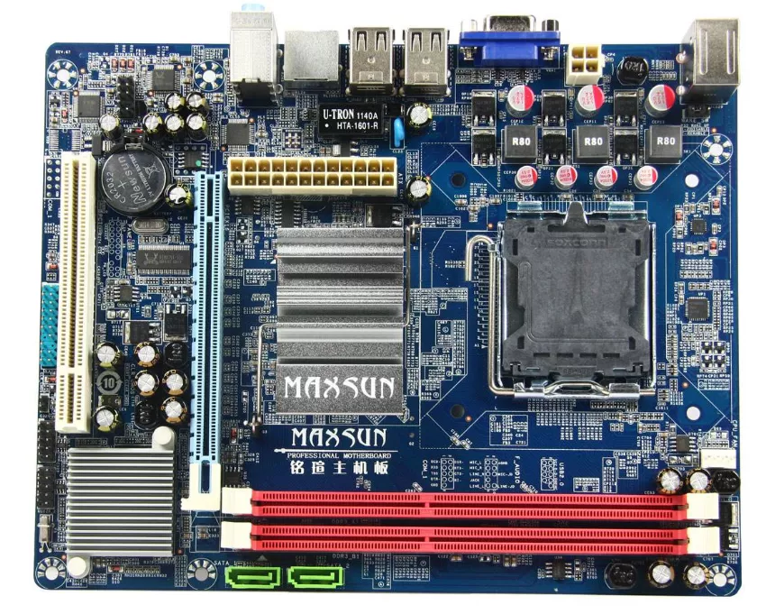
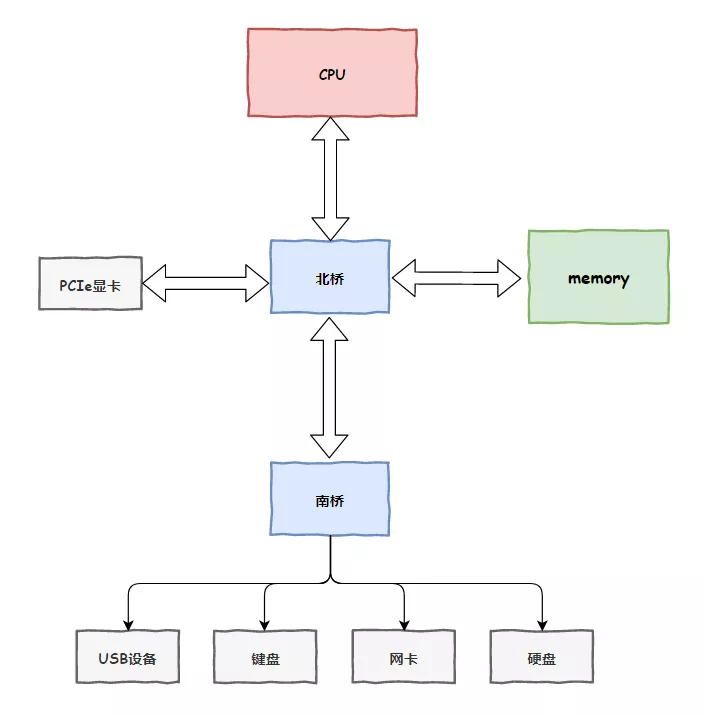
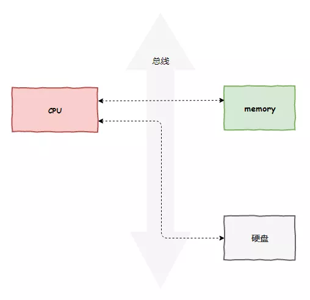
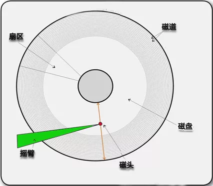
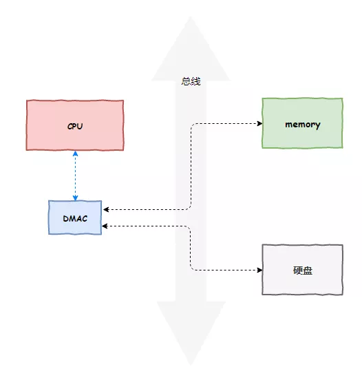

## **总线技术**

我是CPU一号车间的阿Q，最近为了一件事儿搞得我挺烦的。

当初我们CPU工厂刚刚来到主板上建厂时，那时候主板上的单位还不多，跟我们打交道最多的就是内存那家伙了。

后来，键盘、鼠标、硬盘、网卡、声卡、显卡等等设备纷纷入驻主板，这块土地变得越来越热闹起来。

不过，他们的到来并没有影响我们的地位，毕竟我们是中央处理器，所有人都得听我们指挥。

为了和主板上这些家伙们通信，我们花了重金铺了一条线路，主板上家家户户都连上了这条线路，我们把它叫做`总线`，虽然说是一条，但实际上它包含了传输数据的`数据总线`，传输地址的`地址总线`和进行控制管理的`控制总线`。

这样一来，各单位就能一起聊天了。不过这线路是共用的，大家不能都一起传数据，那就乱套了。为了统一管理，我们设立了一个新的单位叫`总线控制器`，这个单位来统一管理总线，大家要通信就得找它申请，这就叫做`总线仲裁`。

不过啊，主板上的单位之间的速度还是千差万别的，像内存就比硬盘、网卡这些单位快多了（当然，跟我们CPU车间的工作速度那还是不能比），不仅如此，不同单位他们的接口还千差万别，用一套总线矛盾就日益明显了，后来就变成了多级总线，让慢的跟慢的玩，快的跟快的玩，最后大家再用一个东西把不同总线连接起来，这个东西就是`桥`！

主板上后来出现了两个著名的桥，一个离我们CPU很近的叫`北桥`，内存那家伙和我们通信就会经过它，另一个离我们远一点的叫`南桥`，那些慢一些的I/O设备就通过南桥接进来。再后来，随着我们CPU工厂的壮大，直接把`北桥`收购了，现在变成了我们厂里的一个部门了。

## **PIO模式**

现在我们可以和这些I/O设备通信了，就拿硬盘来说吧，它有I/O端口，我们提供了`in`和`out`两条指令，就可以对它进行读写数据了。这种通信的方式叫做`可编程输入输出模型`，Programming Input/Output Model，简称`PIO`。

我们是整个主板上的核心，俗话说得好，能力越大，责任越大，但有时候真心觉得有点累。

随着越来越多的设备接入主板，越来越多的程序需要等待我们去执行，工作量大的压的我们喘不过气来。

尤其是随着技术进步，我们CPU工厂的速度越来越快，与硬盘的读写速度之间的差距越来越拉大，我们还用这种方式通信就太浪费我们的时间了。

## **DMA技术**

这几天，我们几个车间的Leader私下聚在一起讨论起这个事情来。

“阿Q，你不觉得现在我们花了太多时间再读写硬盘上了吗，这家伙慢不是他的错，扯我们后腿这就是他的错了啊。传输一次数据，我们要执行好多次I/O端口读写，我们宝贵的时间都浪费在这上面了！”，二号车间的虎子一脸幽怨的说到。

“嗨，我最近也为这事发愁呢，程序越来越多，读写硬盘的时间越来越多了，尤其是那个叫MySQL的，老让我访问硬盘，可累死我了。”

没想到我俩都憋了一肚子苦水呢。

这时，平日里爱拍老板马屁的八号车间老大说了一句话：“你们说的问题确实存在，这工作太没技术含量了，就是个体力活嘛，要不咱给老板说说，让他外包出去吧”

我俩一听，妙啊，要是能把这体力活外包出去，那可简直太好了，我们就可以专心做我们的专职工作了。

“你跟老板平时走得近，这事你去说吧”，我给虎子使了个眼色，一起撺掇老八去说这事。

“行，我去就我去”。

还别说，领导立马就同意了这个想法，毕竟能提高我们的工作效率，他自然是举双手欢迎。

没过多久，就成立了一个外包团队，独立出我们厂子，专门来负责这件事。和我们CPU一样，他们也提供了几个寄存器，传输数据的时候，只需要设置一下这些寄存器的内容，告诉他们要传输哪里的数据，从哪到哪，长度是多少，接下来的事情我们就不用操心了，交由他们来完成。我们就可以腾出功夫做其他事情，等数据传输完毕了，他们再用中断的方式告诉我们，我们直接去处理就好了，省去了让我们亲自去搬运的过程，真是爽的飞起～

后来，我们给这项技术也取了一个名字，叫Direct Memory Access，直接存储器访问，简称`DMA`，这个外包团队就是`DMAC`，DMA控制器。

## **DMA全面开花**

前几天的月总结会上，领导表扬了老八，说多亏他的建议让厂里的生产效率大大提升。早知道，当初就不撺掇老八去跟老板提建议了，我自己去。

正想着走神，突然想到了一个问题，这一次我打算抓住机会挣个表现。

“老板，这个DMA技术好是好，但现在只能用于硬盘哦。最近网卡那家伙数据包也挺多的，我花了好多时间去把数据包从网卡读取到内存中，又低效又没有技术含量，可不可以把这技术推广到网卡上啊？”，我起身说到。

老板点了点头，若有所思。

二号车间虎子见状也起身说到：“老板，除了硬盘和网卡，显示器也有这个需求。我经常要疲于奔波于把内存数据传输到显示器，也是劳神劳力，建议DMA技术也推广到显示器呢”

老板听完，皱了皱眉头说到，“这个不同设备之间的差别还是挺大的，没法通用。难不成我们要为每个设备成立一个外包团队？这成本有点高啊···”

老板果然还是老板，还是把成本考虑在第一位。

这时，爱拍马屁的老八又说话了，“老板说的是。我倒是有个建议，这个DMA推广到网卡、显示器这些单位也可以，不过让他们自己掏钱来增加DMAC，按照他们各自不同的需求来做。咱们不能当这冤大头”

老板一听，喜形于色，大声叫好！

就这样，很快我们就把这项技术推广了出去，主板上以网卡、显示器、摄像头为首的那些个单位为了不落后于人，纷纷拥抱变化，集成了DMAC。

我们得到了彻底的解放，再也不用做枯燥的搬运工了~

## **彩蛋**

> “阿Q，听说了吗，最近Linux帝国新成立了一个公司，居然绕过我们CPU就能把数据从网卡写入硬盘中”
>
> “不可能啊，至少得经过我们拷贝一下吧”
>
> “根本不用，他们号称是**零拷贝技术**”
>
> *预知后事如何，请关注后续精彩······*