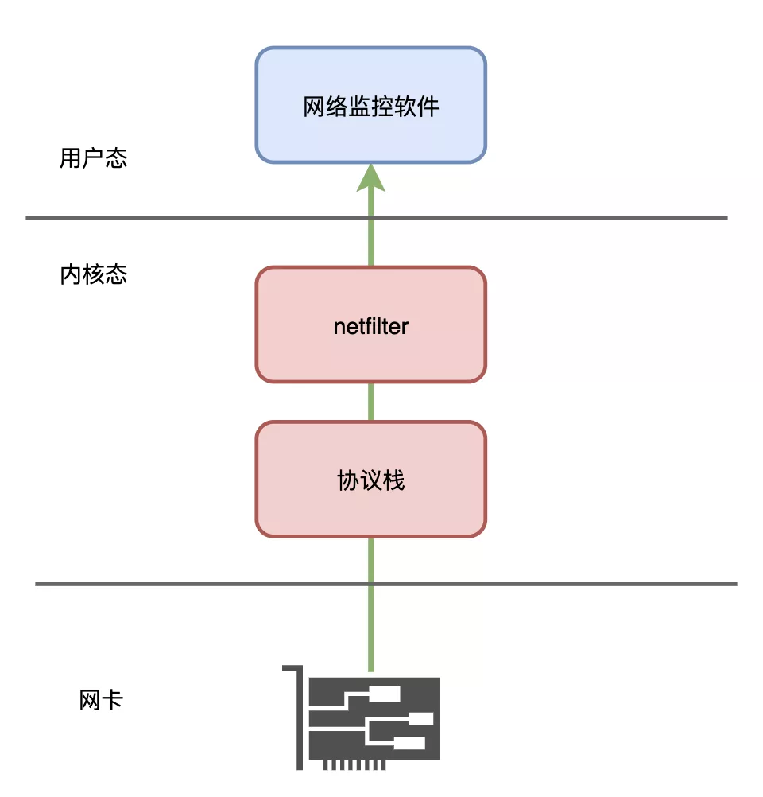
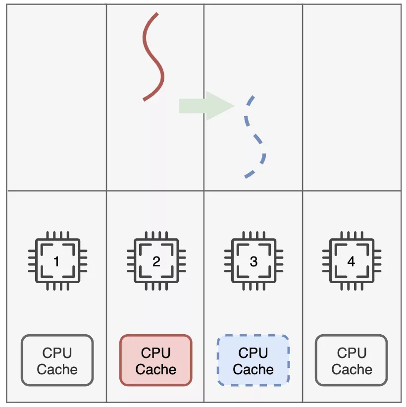
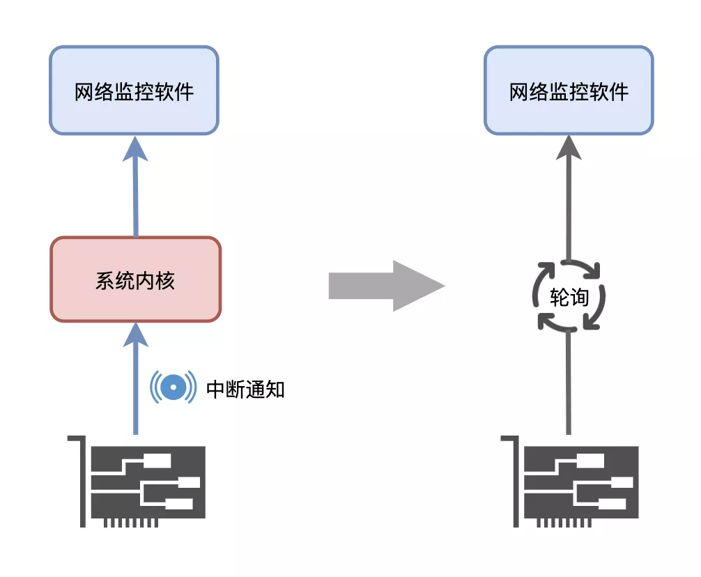
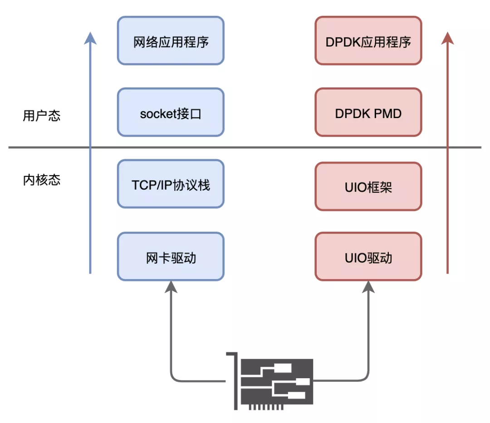
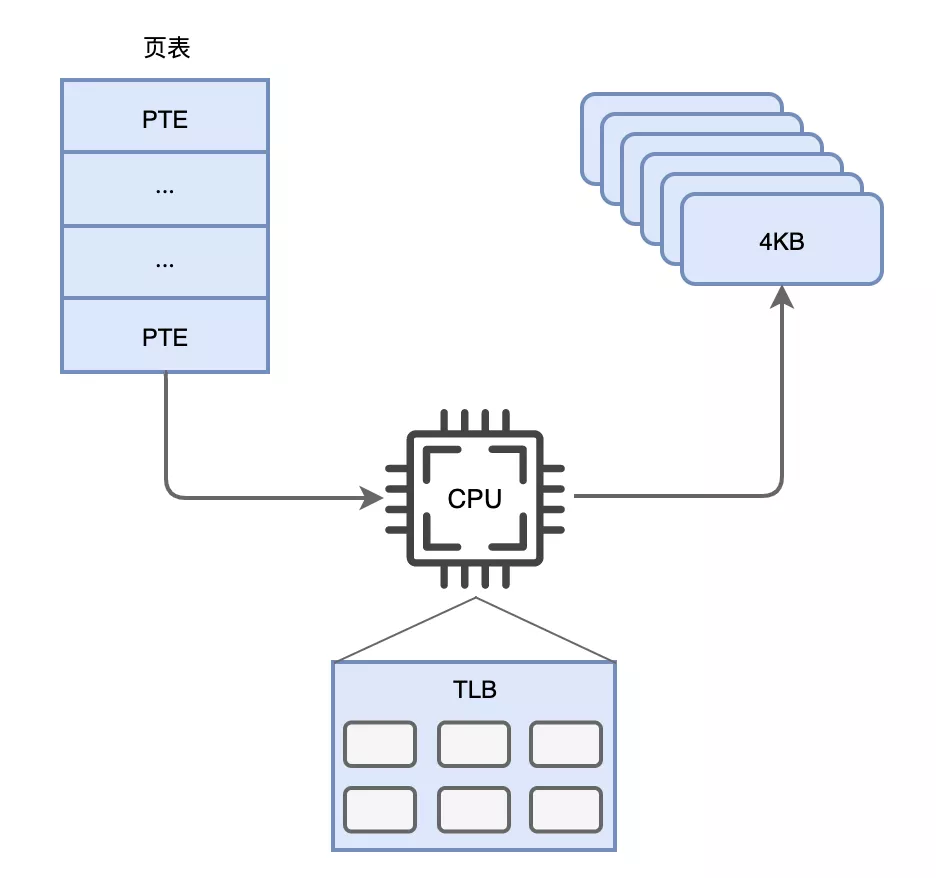

我是一个网络监控软件，我被开发出来的使命就是监控网络中进进出出的所有通信流量。

一直以来，我的工作都非常的出色，但是随着我监控的网络越来越庞大，网络中的通信流量也变得越来越多，我开始有些忙不过来了，逐渐发生**丢包**的现象，而且最近这一现象越发的严重了。

## **万兆流量需求**

一天晚上，程序员哥哥把我从硬盘上叫了起来。

“这都几点了，你怎么还不下班啊？”，我问小哥哥。

“哎，产品经理说了，让我下个月必须支持万兆网络流量的分析，我这压力可大了，没办法只好加班了。”，说完整理了一下自己那日益稀疏的头发。

“万兆？10Gbps？开玩笑呢吧？这是要累死我的节奏啊”

“可不是吗，可愁死我了。你快给我说说，你工作这么久了，有没有干的不爽的或者觉得可以改进的地方都可以给我说说”，小哥哥真诚的看着我。

我思考了片刻说到：“要说干的不爽的，还真有！就是我现在花了太多时间在拷贝数据包了，把数据包从内核空间拷贝到用户态空间，以前数据量小还行，现在网络流量这么大，可真是要了我的老命了。”

小哥哥叹了口气，“哎，这个改不了，数据包是通过操作系统的API获取的，操作系统又是从网卡那里读取的，咱们是工作在用户空间的程序，必须要拷贝一次，这没办法。你再想想别的？”

我也叹了口气，“那行吧，还有一个槽点，数据包收到后能不能直接交给我，别交给系统的**协议栈**和**netfilter框架**他们去处理了，反正我拿来后也要重新分析，每次都从他们那里过一次，他们办事效率又低，这不拖累我的工作嘛”

小哥哥皱着眉头，眨了眨眼睛说到：“大兄弟，这个咱也改不了啊，我这水平也有限，我还没有能力改造你绕过操作系统让你直接去跟网卡打交道啊。要不，要不你再说一个？嘿嘿”

“好吧，我也就不为难你了。有个简单的问题，你可得改一下”

“什么问题，说说看？”

“就是我现在花了很多时间在线程切换上，等到再次获得调度执行后，经常发现换了一个CPU核，导致之前的缓存都失效了，得重新建立缓存，这又是一个很大的浪费啊！能不能让我的工作线程独占CPU的核心，这样我肯定能提高不少工作效率！”

小哥哥稍微思考了一下，说到：“没问题，这个可以有！用**线程亲和性**就可以搞定，给你划几个核出来，不让它们参与系统的线程调度分配，专门给你用，这事就包在我身上吧！”

## **中断问题**

过了几天，程序员哥哥对我进行了升级改造，让我的几个工作线程都能独占CPU核，工作效率提升了不少。

不过，距离产品经理要求的万兆流量分析指标，那还是差了一大截。

一天晚上，程序员小哥哥又找我聊了起来。

“现在分析能力确实有所提升，不过离目标还差得远啊，你快给我说说，还有没有改进的建议给我啊？”

“有倒是有，但是我估计你还是会说改不了”，我翻了个白眼。

“你先说说看嘛！”

“现在这个数据包是用**中断**的形式来通知读取的，能不能不用中断，让我自己去取啊？你是不知道，每次中断都要保存上下文，从用户态切换到内核态，那么多流量，这开销大了去了！”，我激动的说到。

小哥哥听完沉默了。

“看吧，我就说你改不了吧！还是算了吧，趁早给产品经理说这个需求做不了，咱俩都轻松自在”

“那不行，这个项目对我非常重要，我还指望通过你来升职加薪，走向人生巅峰呢！”，小哥哥说的很坚定。

“实在不行，那就多找几台机器，把我copy几份过去，软件不行就靠硬件堆出性能嘛！”，我冲他眨了个眼睛。

“这还用你说，老板肯定不会同意的”

“那我没辙了，实话告诉你吧，想要我能处理万兆网络流量，非得绕开操作系统，我亲自去从网卡读取数据包不可，你好好去研究下吧，想升职加薪，怎么能怕难呢！”，我给小哥哥打了打气。

小哥哥点了点头，“你说的是，我一定可以的，给我一点时间”

## **DPDK**

就这样过了一个多星期，程序员小哥哥一直没再来找过我，也不知道他研究的怎么样了。

又过了好几天，他终于又来了。

“快出来！我找到办法了，明天就开始改造你！”

我一听来了兴趣，“什么办法？你打算怎么改造我？”

“这个新方案可以解决你之前提出的所有问题，可以让你直接去跟网卡打交道，不用中断来通知读取数据包，也不用再把数据包交给系统协议栈和netfilter框架处理，不用再频繁的在用户态和内核态反复切换了！”，小哥哥越说越激动！

“你也太牛了吧，能把这些问题都解决了！你是怎么做到这些的，什么原理？”，我好奇的问到。

小哥哥有些不好意思，“我哪有那本事啊，其实这是别人开发的技术，我只是拿来用而已。”

“额，那你都弄清楚它的原理了吗，别到时候坑我啊！”，我有些不太放心。

“这个你放心，这个技术叫**DPDK**，是人家Intel开发的技术，靠谱！”

接下来，程序员小哥哥给我介绍了这个叫DPDK的技术原理。

有了DPDK，通过操作系统的**用户态模式驱动UIO**，我可以在用户态通过轮询的方式读取网卡的数据包，再也不用中断了！

直接在用户态读取，再也不用把数据包在内核态空间和用户态空间搬来搬去。读到了之后我直接就可以分析，还不用走系统协议栈和netfilter瞎耽误功夫，简直完美！

“还不止这些呢！还支持**大页内存技术**”，小哥哥得意的说到。

“大页内存？这是什么”

“默认情况下系统不是以4KB大小来管理内存页面的吗？这个单位太小了，对于咱们服务器内存会有大量的内存页面，为了管理这些页面，就会有大量的页表项。CPU里面进行内存地址翻译的缓存**TLB**大小有限，页表项太多就会频繁失效，降低内存地址翻译的速度！”

听到这里，我突然明白了：“我知道了，把这个单位调大，管理的内存页面就少了，页表项数量就少了，TLB就不容易失效，地址翻译就能更快对不对？”

“没错，你猜猜看，调到多大？”，小哥哥故作神秘。

“翻一倍，8KB？”，见小哥哥摇摇头，我又猜到：“难道是16KB？”

“太保守了，能支持2MB和1GB两种大小呢！”

“这么大，厉害了！”

## **空转问题**

第二天，程序员小哥哥开始了对我进行了彻底的重构。

升级后的我试着跑了一下，发现了一个问题：如果数据包不是很多或者没有数据包的情况下，我的轮询基本上就挺浪费时间的，一直空转，由于我独占了一个核，这个核的占用率就一直是100%，不少别的程序都吐槽我，占着**不**。

于是，程序员小哥哥又对我进行了升级，用上了**Interrupt DPDK模式**：没有数据包处理时就进入睡眠，改为中断通知。还可以和其他线程共享CPU核，不再独占，但是DPDK线程会有更高调度优先级，一旦数据包多了起来，我又变成轮询模式，可以灵活切换。

程序员哥哥连续加了两个星期的班，经过一番优化升级，我的数据包分析处理能力有了极大的提升。

然而遗憾的是，测试了几轮，当面临10Gbps的流量时，我还是有点力不从心，还是差了那么一点点。

小哥哥有些灰心丧气，“我不知道该怎么办了，你觉得还有什么哪些地方可以改进吗？”

“我现在基本满负荷工作了，应该没有什么地方可以改进了。现在唯一有时间喘口气的地方就是数据竞争的时候了，遇到数据被加了锁发生线程切换歇一歇”

小哥哥思考了几秒钟，突然眼睛一亮，高兴的说到：“有了！”

还没来得及问，就把我关闭，下班去了～

到底程序员小哥哥又要对我做什么呢？