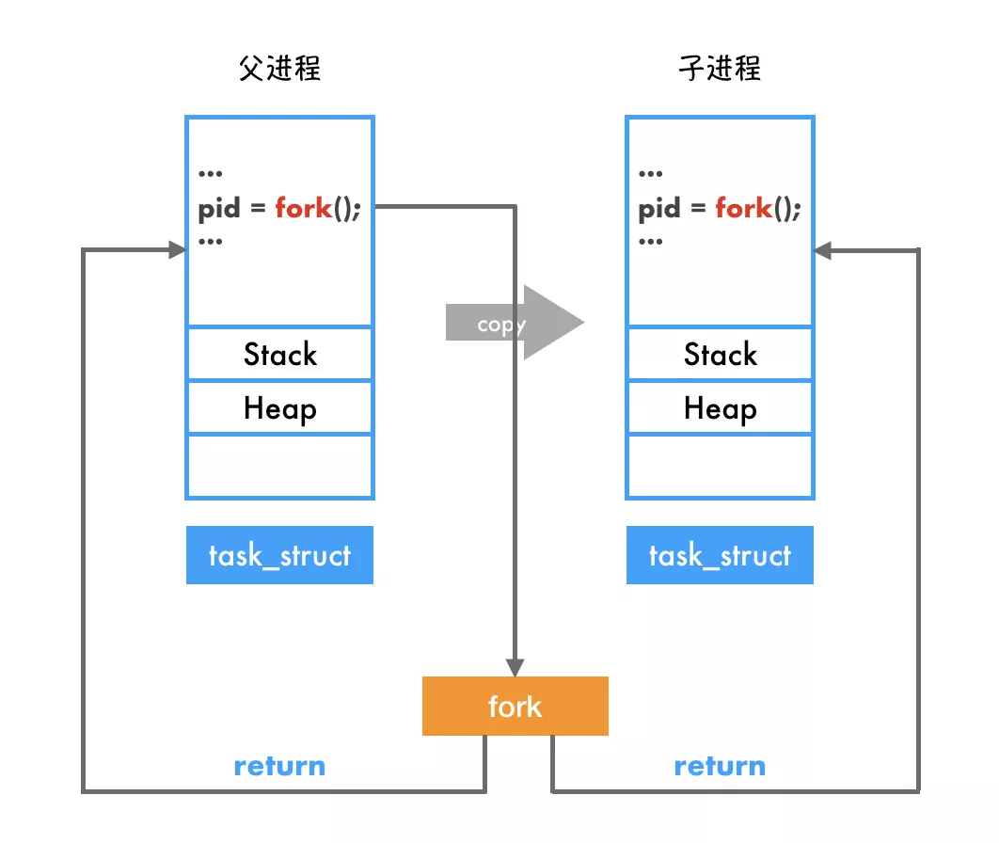
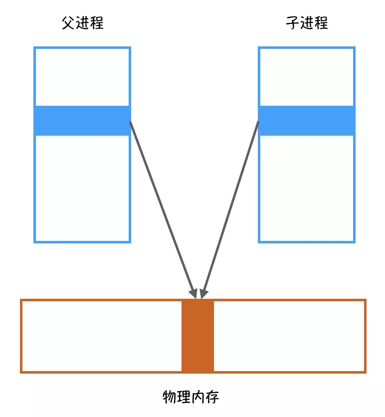
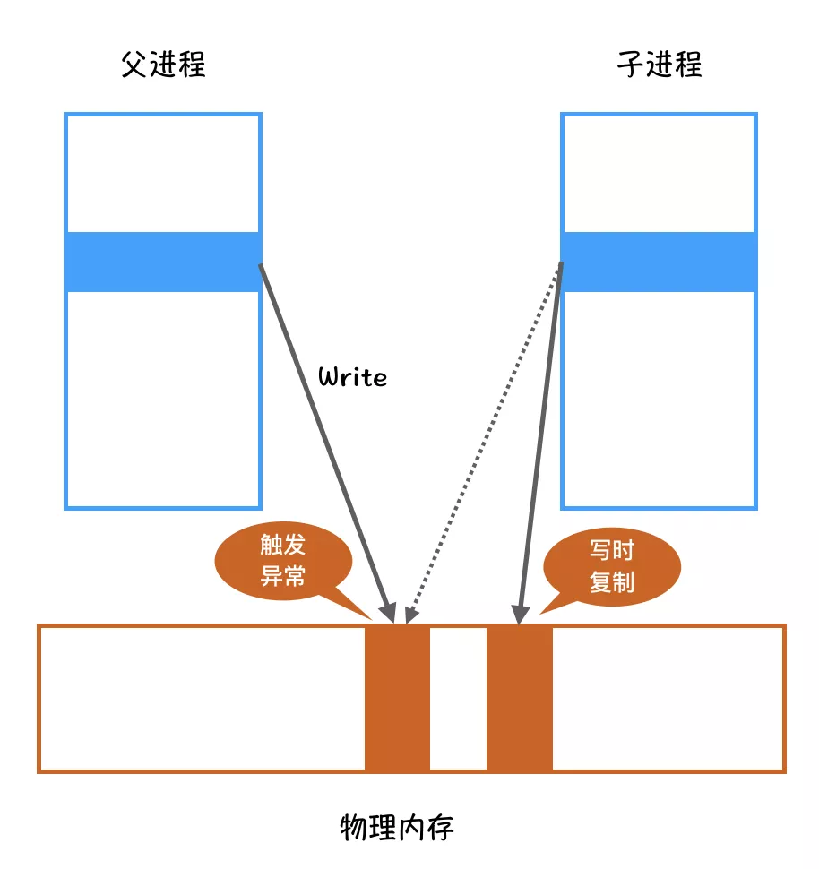
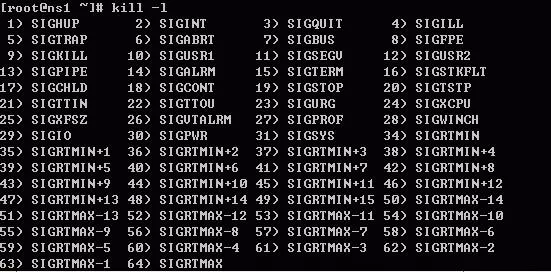

1. *fork*

   - 用于创建子进程。

   - 在调用时，返回两次：子进程的返回值是0，父进程的返回值的新建子进程的ID。

   - 子进程是父进程的副本。子进程和父进程继续执行

      

     fork

      

     之后的指令。

     - 子进程获得父进程的 **数据空间、堆、栈的副本**
     - 共享的是：**文件描述符、mmap建立的映射区**
     - 子进程和父进程共享的是 **代码段**，*fork* 之后各自执行。
     - 父进程和子进程的执行顺序谁先谁后是未知的，是竞争的关系。

   - *COW*
     *COW* 即写时复制(*Copy-On-Write*)， **数据空间、堆、栈的副本**在创建子进程时并不创建副本。而是在父进程或者子进程修改这片区域时，内核为修改区域的那块内存制作一个副本，以提高效率。

   - fork

     fork

      

     失败的原因：

     - 系统中已经有太多的进程
     - 该实际用户Id的进程数超过了系统限制

   - 案例

     ```c
     #include<stdio.h>
     #include<stdlib.h>
     #include<unistd.h>
     
     int globvar = 10;
     char buf[] = "a writte to stdout.\n";
     
     int main(int argv, char* argc[]){
     
         int var;
         pid_t pid;
     
         var = 88;
         if(write(STDOUT_FILENO, buf, sizeof(buf)-1) != sizeof(buf)-1){
             printf("write error");
             exit(1);
         }
         printf("before fork.\n");
         // 创建子进程后，后面的代码，父进程和子进程独立运行。
         if((pid=fork()) < 0){
             printf("fork() error.\n");
             exit(1);
         }
         else if(pid == 0){
             globvar++; //子进程运行不改变父进程的值
             var++;
         }
         else
             sleep(2);
         printf("pid=%ld, globvar=%d, var=%d.\n",(long)getpid() , globvar, var);
         retdurn 0;
     }
     ```
   
   ------
   
   “你还有什么要说的吗？没有的话我就要动手了”，**kill**程序最后问道。
   
   这一次，我没有再回答。
   
   只见kill老哥手起刀落，我短暂的一生就这样结束了···
   
   
   
   我是一个网络程序，一直以来都运行在Windows系统上，日子过得很舒服。可前段时间，程序员告诉我要把我移植到Linux系统下运行，需要对我大动手术，我平静的生活就这样被打破了。
   
   来到这个叫Linux的地方运行，一切对我都很陌生，没有了熟悉的C盘、D盘和E盘，取而代之的是各种各样的目录。
   
   ```
   /bin
   /boot
   /etc
   /dev
   /mnt
   /opt
   /proc
   /home
   /usr
   /usr64
   /var
   /sys
   ...
   ```
   
   这里很有意思，一切都是文件，硬件设备是文件、管道是文件、网络套接字也是文件，搞得我很不适应。
   
   这些都还好，我都还能接受，但直到今天···
   
   ## **奇怪的fork**
   
   今天早上，我收到了一个网络请求，需要完成一个功能，这个工作比较耗时，我准备创建一个子进程，让我的小弟去完成。
   
   这是我第一次在Linux系统上创建进程，有点摸不着北，看了半天，只看到程序员在我的代码里写了一个**fork**函数：
   
   ```
   pid_t pid=fork();
   if ( pid > 0 ) {
       ···
   } else if( pid == 0 ) {
       ···
   } else {
       ···
   }
   ```
   
   我晃晃悠悠的来到fork函数的门前，四处观察。
   
   “您是要创建进程吗？”，fork函数好像看出了我的来意。
   
   “是的，我是第一次在这里创建进程，以前我在Windows那片儿的时候，都是调用CreateProcess，但这里好像没有叫这个名字的函数···”
   
   fork函数听后笑了起来，说道：“别找了，我就是负责创建进程的函数”
   
   “你？fork不是叉子的意思吗，好端端的干嘛取这么个名字？”，我一边说，一边朝fork函数走去。
   
   
   
   fork没有理会我的问题，只是说道：“您这边稍坐一下，我要跟内核通信一下，让内核创建一个子进程”
   
   这下我倒是明白他的意思，像创建进程这种操作，都是由操作系统内核中的系统调用来完成的，而像fork这些我们可以直接调用的函数只是应用层的接口而已，这跟以前在Windows上是一样的。
   
   不过我突然反应过来，着急问道：“唉，我还没告诉你要创建的进程参数呢，你怎么知道要启动哪个程序？”
   
   fork扑哧一下笑出了声，不过并没有回答我的问题。
   
   人生地不熟的，我也没好再多问，只好耐心等待，等待期间我竟然睡着了。
   
   
   
   “醒醒”，不知过了多久，fork函数叫醒了我：“创建完成了，请拿好，这是进程号pid”，说完给了我一个数字。
   
   我摊开一看，居然写了一个大大的0！
   
   “怎么搞的，创建失败了？”，我问到。
   
   “没有啊，您就是刚刚创建的子进程”
   
   “啥？你是不是搞错了，我就是专程来创建子进程的，我自己怎么会是子进程？”
   
   fork函数又笑了，“我没有搞错，您其实已经不是原来的你了，而是一个复制品，是内核刚刚复制出来的”
   
   “复制品？什么意思？”，我越听越懵！
   
   “每个进程在内核中都是一个**task_struct**结构，刚才您睡着期间，内核在创建进程的时候，把内核中原来的你的**task_struct**复制了一份，还创建了一个全新的进程地址空间和堆栈，现在的你和原来的你除了极少数地方不一样，基本上差不多”
   
   
   
   “那原来的我呢？去哪里了”
   
   “他已经变成你的父进程了，我是一个特殊的函数，一次调用会返回两次，在父进程和子进程中都会返回。在原来的进程中，我把你的进程号给了他，而我返回给你0，就表示你现在就是子进程”
   
   原来是这样，我大受震撼，这简直颠覆我的认知，居然还有如此奇特的函数，调用一次，就变成了两个进程，思考之间，我忽然有些明白这个函数为什么要叫fork的原因了。
   
   ## **写时拷贝**
   
   “您是刚来咱们这里吧，可能还不太熟悉，慢慢就习惯了”
   
   “你们这效率也太高了吧，整个进程地址空间那么大，居然这么快就复制了一份！”
   
   fork函数又笑了！难道我又说错话了？
   
   “进程的内存地址空间可没有复制，你现在和父进程是共享的内存空间的”
   
   “啥？共享？你刚才不是说创建了新的进程空间和堆栈吗？”
   
   “您看到的内存地址空间是虚拟的，您的内存页面和父进程的内存页面实际上是映射的同一个物理内存页，所以实际上是共享的哟”
   
   
   
   “原来是这样，可是弄成共享了，两个进程一起用，岂不是要出乱子？”
   
   “放心，内核把这些页面都设置成了只读，如果你们只是读的话，不会有问题，但只要有一方尝试写入，就会触发异常，内核发现异常后再去分配一个新的页面让你们分开使用。哦对了，这个叫**写时拷贝（COW）** 机制”
   
   
   
   “有点意思，你们倒是挺聪明的”
   
   “没办法，尽量压缩成本，提高创建进程的效率嘛，因为进程中的很多内存页面都只会去读，如果全部无脑拷贝一份，那不是太浪费资源和时间了吗”，fork函数说到。
   
   “有道理，有道理”，我点了点头，告别了fork函数，准备回去继续工作。
   
   ## **消失的线程们**
   
   本以为这奇怪的进程创建方式已经让我大开眼界了，没想到可怕的事情才刚刚开始。
   
   告别fork函数没多久，我就卡在了一个地方没法执行下去，原来，前面有一把锁被别的线程占用了，而我现在也需要占用它。
   
   这倒也不足为奇，以往工作的时候，也经常碰到锁被别的线程锁定的情况，但这一次，我等了很久也一直不见有线程来释放。
   
   “喂，醒醒”
   
   不知过了多久，我竟然又睡着了。
   
   睁开眼睛，另一个程序站出现在了我的面前。
   
   “你是？”
   
   “你好，我是**kill**”
   
   “kill？那个专门杀进程的kill程序？你来找我干嘛”，我惊的一下睡意全无。
   
   
   
   kill程序从背后拿出了两个数字：9，1409
   
   “你看，这是我收到的参数，1409是你的进程号PID，9表示要强制杀死你”
   
   “啊？为什么？”，那一刻，我彻底慌了。
   
   “可能是你卡死在这里太久了吧，人类才启动我来结束你的运行”，kill程序说到。
   
   “是啊，不知道是哪个该死的线程占用了这把锁一直不释放，我才卡在这里”，我委屈的说到。
   
   “哪里有别的线程，我看了一下，你这进程就只有一个线程啊！”
   
   “你看错了吧？”，说完，我认真检查了起来，居然还真只有一个线程了！我白等了这么久！
   
   “奇怪了，我明明是一个多线程的程序啊！”，我眉头紧锁。
   
   “你仔细想想，刚才有没有发生什么事情？”，kill程序问到。
   
   “我就执行了一下fork，生成了一个子进程，哦对了，我就是那个子进程”
   
   “难怪！”，kill程序恍然大悟。
   
   “难怪什么？
   
   “fork那家伙创建子进程的时候，只会复制当前的线程，其他线程不会被复制！”，Kill程序说完叹了口气，仿佛已经见怪不怪了。
   
   “what？怎么会这样？其他线程没复制，那岂不是要出乱子？”
   
   kill程序不紧不慢地说道：“这都是历史遗留问题了，早期都是单线程的程序，一个`task_struct`就是一个进程，fork这样做是没有问题的，后来出现了多线程技术，一个`task_struct`实际上是一个线程了，多个`task_struct`通过共享地址空间，成为一个线程组，也就是进程，但fork仍然只复制当前的线程，就有了这个问题”
   
   “我去，这坑爹的fork！”
   
   “你不是第一个被坑的了！等着程序员把你重新改造下吧”
   
   “唉···”，我长长的叹了口气。
   
   “你还有什么要说的吗？没有的话我就要动手了”，**kill**程序最后问道。
   
   这一次，我没有再回答。
   
   只见kill老哥手起刀落，一切都消失了···