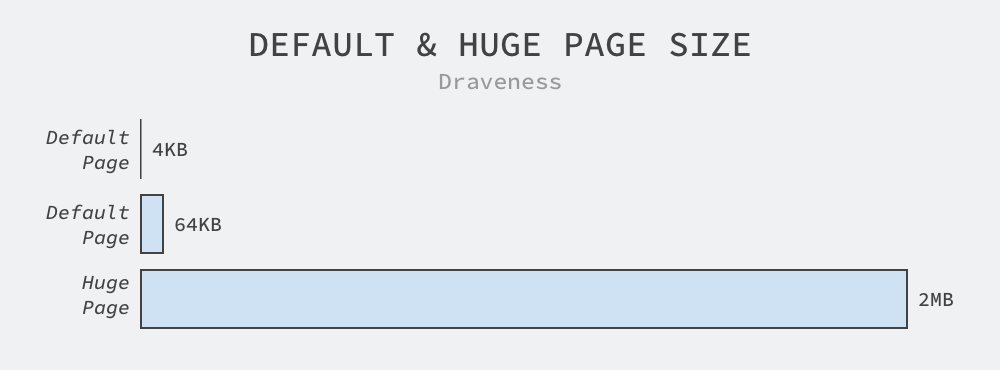
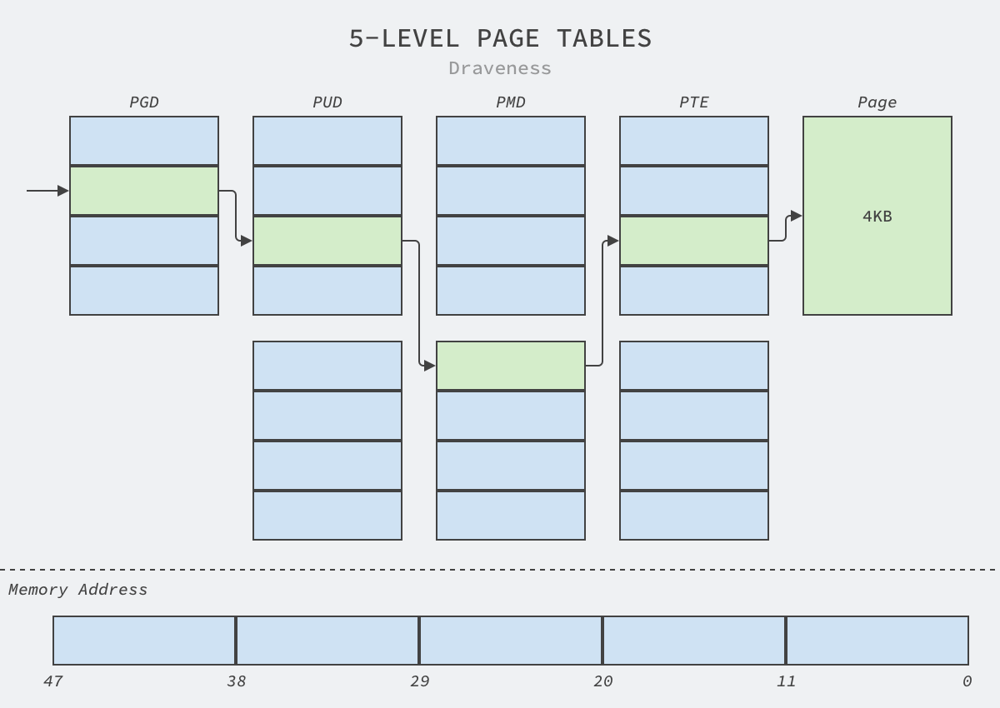
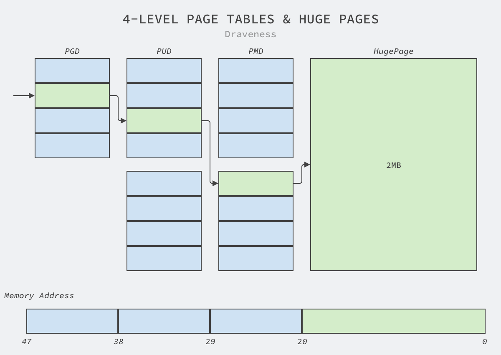
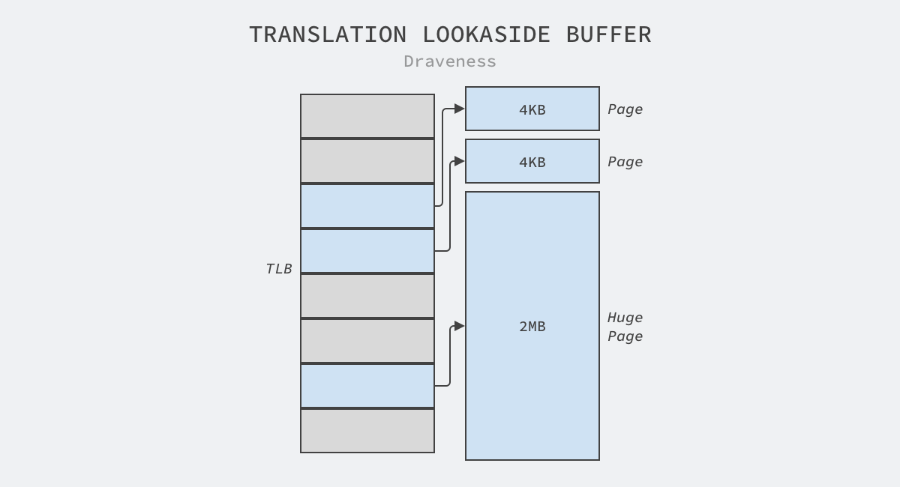
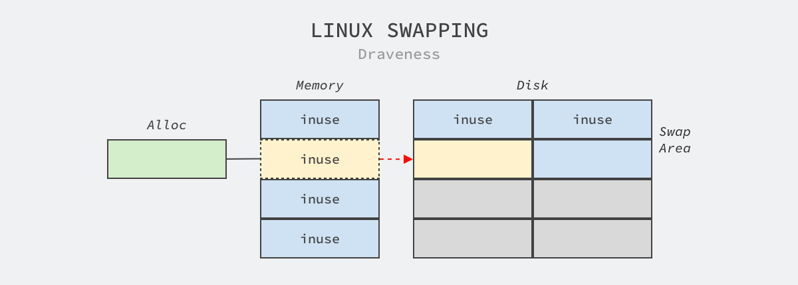

# 为什么 HugePages 可以提升数据库性能

2020-11-04 [为什么这么设计](https://draveness.me/tags/为什么这么设计) [系统设计](https://draveness.me/tags/系统设计) [HugePages](https://draveness.me/tags/hugepages) [Linux](https://draveness.me/tags/linux)

> 为什么这么设计（Why’s THE Design）是一系列关于计算机领域中程序设计决策的文章，我们在这个系列的每一篇文章中都会提出一个具体的问题并从不同的角度讨论这种设计的优缺点、对具体实现造成的影响。如果你有想要了解的问题，可以在文章下面留言。

内存是计算机的重要资源，虽然今天大多数的服务对内存的需求都没有那么高，但是数据库以及 Hadoop 全家桶这些服务却是消耗内存的大户，它们在生产环境动辄占用 GB 和 TB 量级的内存来提升计算的速度，Linux 操作系统为了更好、更快地管理这些内存并降低开销引入了很多策略，我们今天要介绍的是 HugePages，也就是大页[1](https://draveness.me/whys-the-design-linux-hugepages/#fn:1)。

绝大多数的 CPU 架构都支持更大的页面，只是不同操作系统会使用不同的术语，例如：Linux 上的 HugePages、BSD 上的 SuperPages 以及 Windows 上的 LargePages，这些不同的术语都代表着类似的大页面功能。


**图 1 - CPU 架构和更大的页面**

我们都知道 Linux 会以页为单位管理内存，而默认的页面大小为 4KB，虽然部分处理器会使用 8KB、16KB 或者 64KB 作为默认的页面大小，不过 4KB 仍然是操作系统的默认页面配置的主流[2](https://draveness.me/whys-the-design-linux-hugepages/#fn:2)，虽然 64KB 的页面是 4KB 的 16 倍，但是与最小 2MB 的 HugePages 相比，64KB 的页面实在是不够大，更不用说默认的 4KB 了：



**图 2 - 默认和大页面大小**

2MB 一般都是 HugePages 的默认大小，在 arm64 和 x86_64 的架构上甚至支持 1GB 的大页面，是 Linux 默认页面大小的 262,144 倍，我们可以使用如下所示的命令查看当前机器上 HugePages 的相关信息：

```terminal
$ cat /proc/meminfo | grep Huge
AnonHugePages:     71680 kB
ShmemHugePages:        0 kB
FileHugePages:         0 kB
HugePages_Total:       0
HugePages_Free:        0
HugePages_Rsvd:        0
HugePages_Surp:        0
Hugepagesize:       2048 kB
Hugetlb:               0 kB
```

Terminal

通过上面的输出结果，我们可以看到当前机器上的大页面默认大小为 2MB 并且大页面的数量也为 0，即没有进程在申请或者使用大页。各位读者可以在 Linux 尝试执行上述命令，如果机器上没有做过额外的配置，那么使用上述命令得到的输出与这里也不会有太大的差别。

`/proc/sys/vm/nr_hugepages` 中存储的数据就是大页面的数量，虽然在默认情况下它的值都是 0，不过我们可以通过更改该文件的内容申请或者释放操作系统中的大页：

```terminal
$ echo 1 > /proc/sys/vm/nr_hugepages
$ cat /proc/meminfo | grep HugePages_
HugePages_Total:       1
HugePages_Free:        1
...
```

Terminal

在 Linux 中，与其他内存的申请和释放方式相同，我们可以在向 `mmap` 系统调用中传入 `MAP_HUGETLB` 标记申请操作系统的大页并使用 `munmap` 释放内存[3](https://draveness.me/whys-the-design-linux-hugepages/#fn:3)，使用如下所示的代码片段可以在操作系统中申请 2MB 的大页：

```c
size_t s = (2UL * 1024 * 1024);

char *m = mmap(
    NULL, s, PROT_READ | PROT_WRITE,
    MAP_PRIVATE | MAP_ANONYMOUS | MAP_HUGETLB /* flags */,
    -1, 0
);

munmap(m, s);
```

C

虽然 HugePages 的申请方式与默认的内存相差不多，但是它实际上是操作系统单独管理的特殊资源，Linux 会在 `/proc/meminfo` 中单独展示 HugePages 的相关数据，而容器编排系统 Kubernetes 也会认为大页是不同于内存的独立资源，如下所示的 Pod 也需要单独申请大页资源[4](https://draveness.me/whys-the-design-linux-hugepages/#fn:4)：

```yaml
apiVersion: v1
kind: Pod
metadata:
  name: huge-pages-example
spec:
  containers:
  - name: example
    ...
    volumeMounts:
    - mountPath: /hugepages-2Mi
      name: hugepage-2mi
    - mountPath: /hugepages-1Gi
      name: hugepage-1gi
    resources:
      limits:
        hugepages-2Mi: 100Mi
        hugepages-1Gi: 2Gi
        memory: 100Mi
      requests:
        memory: 100Mi
  volumes:
  - name: hugepage-2mi
    emptyDir:
      medium: HugePages-2Mi
  - name: hugepage-1gi
    emptyDir:
      medium: HugePages-1Gi
```

YAML

作为 Linux 从 2.6.32 引入的新特性，HugePages 能够提升数据库、Hadoop 全家桶等占用大量内存的服务的性能，该特性对于常见的 Web 服务以及后端服务没有太多的帮助，反而可能会影响服务的性能，我们在这篇文章中会介绍 HugePages 为什么能够提升数据库等服务的性能：

- HugePages 可以降低内存页面的管理开销；
- HugePages 可以锁定内存，禁止操作系统的内存交换和释放；

## 管理开销

虽然 HugePages 的开启大都需要开发或者运维工程师的额外配置，但是在应用程序中启用 HugePages 却可以在以下几个方面降低内存页面的管理开销：

- 更大的内存页能够减少内存中的页表层级，这不仅可以降低页表的内存占用，也能降低从虚拟内存到物理内存转换的性能损耗；
- 更大的内存页意味着更高的缓存命中率，CPU 有更高的几率可以直接在 TLB（Translation lookaside buffer）中获取对应的物理地址；
- 更大的内存页可以减少获取大内存的次数，使用 HugePages 每次可以获取 2MB 的内存，是 4KB 的默认页效率的 512 倍；

因为进程的地址空间都是虚拟的，所以 CPU 和操作系统需要记录页面和进程之间的对应关系，操作系统中的页面越多，我们也就需要花费更多的时间在如下所示的五层页表结构中查找虚拟内存对应的物理内存，我们会根据虚拟地址依次访问页表中的目录（Directory）最终查找到对应的物理内存：



**图 3 - 默认页的五层页表**

如上图所示，如果我们使用 Linux 中默认的 4KB 内存页，那么 CPU 在访问对应的内存时需要分别读取 PGD、PUD、PMD 和 PTE 才能获取物理内存，但是 2MB 的大内存可以减少目录访问的次数：



**图 4 - 页表与大页**

因为 2MB 的内存页占用了 21 位的地址，所以我们也不再需要五层页表中的 PTE 结构，这不仅能够减少翻译虚拟地址时访问页表的次数，还能够降低页表的内存占用。

CPU 总可以通过上述复杂的目录结构找到虚拟页对应的物理页，但是每次翻译虚拟地址时都使用上述结构是非常昂贵的操作，操作系统使用 TLB 作为缓存来解决这个问题，TLB 是内存管理组件（Memory Management Unit）的一个部分，其中缓存的页表项可以帮助我们快速翻译虚拟地址：



**图 5 - TLB**

更大的内存页面意味着更高的缓存命中率，因为 TLB 缓存的容量是一定的，它只能缓存指定数量的页面，在这种情况下，缓存 2MB 的大页能够为系统提高缓存的命中率，从而提高系统的整体性能。

除了较少页表项和提高缓存命中率之外，使用更大的页面还可以提高内存的访问效率，对于相同的 1GB 内存，使用 4KB 的内存页需要系统处理 262,144 次，但是使用 2MB 的大页却只需要 512 次，这可以将系统获取内存所需要的处理次数降低几个数量级。

## 锁定内存

使用 HugePages 可以锁定内存，禁止操作系统的内存交换和释放。Linux 系统提供了交换分区（Swap）机制，该机制会在内存不足时将一部分内存页从内存拷贝到磁盘上，释放内存页占用的内存空间，而当对应的内存进程访问时又会被交换到内存中，这种机制能够为进程构造一种内存充足的假象，但是也会造成各种问题。



**图 6 - 交换分区**

我们在 [为什么 NUMA 会影响程序的延迟](https://draveness.me/whys-the-design-numa-performance/) 一文中就介绍过 Swap 在开启 NUMA 时可能会影响数据库的性能[5](https://draveness.me/whys-the-design-linux-hugepages/#fn:5)，系统中偶然发生的 Swap 并不是不可以接受的，但是频繁地读写磁盘会显著地降低操作系统的运行速度。

HugePages 与其他内存页不同，它是由系统工程师预先在操作系统上使用命令分配的，当进程通过 `mmap` 或者其他系统调用申请大页时，它们得到的都是预先分配的资源。Linux 中的 HugePages 都被锁定在内存中，所以哪怕是在系统内存不足时，它们也不会被 Swap 到磁盘上，这也就能从根源上杜绝了重要内存被频繁换入和换出的可能[6](https://draveness.me/whys-the-design-linux-hugepages/#fn:6)。

> REHL 6 引入了透明大页（Transparent Huge Pages、THP），它是一个可以自动创建、管理和使用大页的抽象层，能够为系统管理员和开发者隐藏了大页使用时的复杂性，但是不推荐在数据库以及类似负载中开启。[7](https://draveness.me/whys-the-design-linux-hugepages/#fn:7)

## 总结

随着单机内存越来越大、服务消耗的内存越来越多，Linux 和其他操作系统都引入了类似 HugePages 的功能，该功能可以从以下两个方面提升数据库等占用大量内存的服务的性能：

- HugePages 可以降低内存页面的管理开销，它可以减少进程中的页表项、提高 TLB 缓存的命中率和内存的访问效率；
- HugePages 可以锁定内存，禁止操作系统的内存交换和释放，不会被交换到磁盘上为其它请求让出内存；

虽然 HugePages 的管理相对比较复杂，需要系统管理员额外做出特定的配置，但是对于特定类型的工作负载，它确定能够起到降低管理开销和锁定内存的作用，从而提高系统的性能。到最后，我们还是来看一些比较开放的相关问题，有兴趣的读者可以仔细思考一下下面的问题：

- 透明大页（Transparent Huge Pages、THP）可能会造成哪些问题？
- 手动管理系统中的 HugePages 有哪些优点？

> 如果对文章中的内容有疑问或者想要了解更多软件工程上一些设计决策背后的原因，可以在博客下面留言，作者会及时回复本文相关的疑问并选择其中合适的主题作为后续的内容。

## 推荐阅读

- [为什么 Linux 需要虚拟内存](https://draveness.me/whys-the-design-os-virtual-memory/)
- [为什么 CPU 访问硬盘很慢](https://draveness.me/whys-the-design-cpu-and-disk/)

------

1. Debian Wiki: Hugepages https://wiki.debian.org/Hugepages [↩︎](https://draveness.me/whys-the-design-linux-hugepages/#fnref:1)
2. 为什么 Linux 默认页大小是 4KB https://draveness.me/whys-the-design-linux-default-page/ [↩︎](https://draveness.me/whys-the-design-linux-hugepages/#fnref:2)
3. mmap(2) — Linux manual page https://man7.org/linux/man-pages/man2/mmap.2.html [↩︎](https://draveness.me/whys-the-design-linux-hugepages/#fnref:3)
4. Manage HugePages https://kubernetes.io/docs/tasks/manage-hugepages/scheduling-hugepages/ [↩︎](https://draveness.me/whys-the-design-linux-hugepages/#fnref:4)
5. 为什么 NUMA 会影响程序的延迟 https://draveness.me/whys-the-design-numa-performance/ [↩︎](https://draveness.me/whys-the-design-linux-hugepages/#fnref:5)
6. HugePages on Oracle Linux 64-bit (Doc ID 361468.1) [↩︎](https://draveness.me/whys-the-design-linux-hugepages/#fnref:6)
7. 5.2. HUGE PAGES AND TRANSPARENT HUGE PAGES https://access.redhat.com/documentation/en-us/red_hat_enterprise_linux/6/html/performance_tuning_guide/s-memory-transhuge [↩︎](https://draveness.me/whys-the-design-linux-hugepages/#fnref:7)