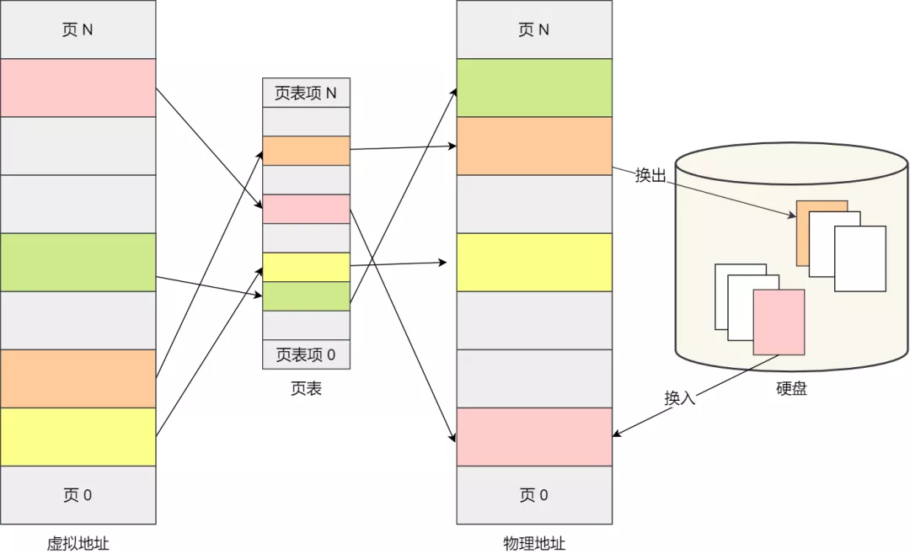
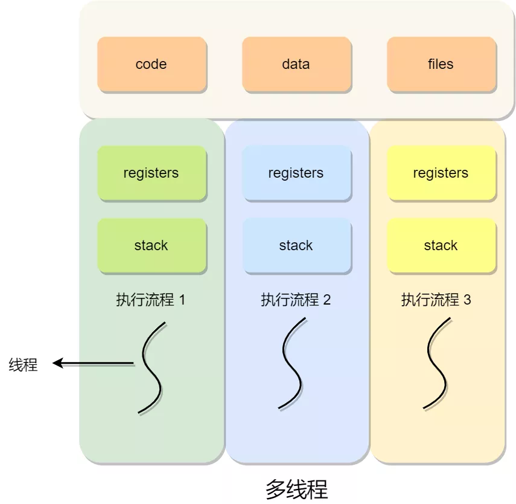

### 竞争与协作

在单核 CPU 系统里，为了实现多个程序同时运行的假象，操作系统通常以时间片调度的方式，让每个进程执行每次执行一个时间片，时间片用完了，就切换下一个进程运行，由于这个时间片的时间很短，于是就造成了「并发」的现象。

并发

另外，操作系统也为每个进程创建巨大、私有的虚拟内存的假象，这种地址空间的抽象让每个程序好像拥有自己的内存，而实际上操作系统在背后秘密地让多个地址空间「复用」物理内存或者磁盘。

虚拟内存管理-换入换出

如果一个程序只有一个执行流程，也代表它是单线程的。当然一个程序可以有多个执行流程，也就是所谓的多线程程序，线程是调度的基本单位，进程则是资源分配的基本单位。

所以，线程之间是可以共享进程的资源，比如代码段、堆空间、数据段、打开的文件等资源，但每个线程都有自己独立的栈空间。

多线程

那么问题就来了，多个线程如果竞争共享资源，如果不采取有效的措施，则会造成共享数据的混乱。

我们做个小实验，创建两个线程，它们分别对共享变量 `i` 自增 `1` 执行 `10000` 次，如下代码（虽然说是 C++ 代码，但是没学过 C++ 的同学也是看到懂的）：

按理来说，`i` 变量最后的值应该是 `20000`，但很不幸，并不是如此。我们对上面的程序执行一下：

运行了两次，发现出现了 i 值的结果是 `15173`，也会出现 `20000` 的 i 值结果。

每次运行不但会产生错误，而且得到不同的结果。在计算机里是不能容忍的，虽然是小概率出现的错误，但是小概率事件它一定是会发生的，「墨菲定律」大家都懂吧。

> 为什么会发生这种情况？

为了理解为什么会发生这种情况，我们必须了解编译器为更新计数器 `i` 变量生成的代码序列，也就是要了解汇编指令的执行顺序。

在这个例子中，我们只是想给 `i` 加上数字 1，那么它对应的汇编指令执行过程是这样的：

可以发现，只是单纯给 `i` 加上数字 1，在 CPU 运行的时候，实际上要执行 `3` 条指令。

设想我们的线程 1 进入这个代码区域，它将 i 的值（假设此时是 50 ）从内存加载到它的寄存器中，然后它向寄存器加 1，此时在寄存器中的 i 值是 51。

现在，一件不幸的事情发生了：**时钟中断发生**。因此，操作系统将当前正在运行的线程的状态保存到线程的线程控制块 TCP。

现在更糟的事情发生了，线程 2 被调度运行，并进入同一段代码。它也执行了第一条指令，从内存获取 i 值并将其放入到寄存器中，此时内存中 i 的值仍为 50，因此线程 2 寄存器中的 i 值也是 50。假设线程 2 执行接下来的两条指令，将寄存器中的 i 值 + 1，然后将寄存器中的 i 值保存到内存中，于是此时全局变量 i 值是 51。

最后，又发生一次上下文切换，线程 1 恢复执行。还记得它已经执行了两条汇编指令，现在准备执行最后一条指令。回忆一下， 线程 1 寄存器中的 i 值是51，因此，执行最后一条指令后，将值保存到内存，全局变量 i 的值再次被设置为 51。

简单来说，增加 i （值为 50 ）的代码被运行两次，按理来说，最后的 i 值应该是 52，但是由于**不可控的调度**，导致最后 i 值却是 51。

针对上面线程 1 和线程 2 的执行过程，我画了一张流程图，会更明确一些：

蓝色表示线程 1 ，红色表示线程 2