Linux 最经典的一句话是：「**一切皆文件**」，不仅普通的文件和目录，就连块设备、管道、socket 等，也都是统一交给文件系统管理的。

Linux 文件系统会为每个文件分配两个数据结构：**索引节点（\*index node\*）和目录项（\*directory entry\*）**，它们主要用来记录文件的元信息和目录层次结构。

- 索引节点，也就是 *inode*，用来记录文件的元信息，比如 inode 编号、文件大小、访问权限、创建时间、修改时间、**数据在磁盘的位置**等等。索引节点是文件的**唯一**标识，它们之间一一对应，也同样都会被存储在硬盘中，所以**索引节点同样占用磁盘空间**。
- 目录项，也就是 *dentry*，用来记录文件的名字、**索引节点指针**以及与其他目录项的层级关联关系。多个目录项关联起来，就会形成目录结构，但它与索引节点不同的是，**目录项是由内核维护的一个数据结构，不存放于磁盘，而是缓存在内存**。

由于索引节点唯一标识一个文件，而目录项记录着文件的名，所以目录项和索引节点的关系是多对一，也就是说，一个文件可以有多个别字。比如，硬链接的实现就是多个目录项中的索引节点指向同一个文件。

注意，目录也是文件，也是用索引节点唯一标识，和普通文件不同的是，普通文件在磁盘里面保存的是文件数据，而目录文件在磁盘里面保存子目录或文件。

> 目录项和目录是一个东西吗？

虽然名字很相近，但是它们不是一个东西，目录是个文件，持久化存储在磁盘，而目录项是内核一个数据结构，缓存在内存。

如果查询目录频繁从磁盘读，效率会很低，所以内核会把已经读过的目录用目录项这个数据结构缓存在内存，下次再次读到相同的目录时，只需从内存读就可以，大大提高了文件系统的效率。

注意，目录项这个数据结构不只是表示目录，也是可以表示文件的。

> 那文件数据是如何存储在磁盘的呢？

磁盘读写的最小单位是**扇区**，扇区的大小只有 `512B` 大小，很明显，如果每次读写都以这么小为单位，那这读写的效率会非常低。

所以，文件系统把多个扇区组成了一个**逻辑块**，每次读写的最小单位就是逻辑块（数据块），Linux 中的逻辑块大小为 `4KB`，也就是一次性读写 8 个扇区，这将大大提高了磁盘的读写的效率。

以上就是索引节点、目录项以及文件数据的关系，下面这个图就很好的展示了它们之间的关系：


索引节点是存储在硬盘上的数据，那么为了加速文件的访问，通常会把索引节点加载到内存中。

另外，磁盘进行格式化的时候，会被分成三个存储区域，分别是超级块、索引节点区和数据块区。

- *超级块*，用来存储文件系统的详细信息，比如块个数、块大小、空闲块等等。
- *索引节点区*，用来存储索引节点；
- *数据块区*，用来存储文件或目录数据；

我们不可能把超级块和索引节点区全部加载到内存，这样内存肯定撑不住，所以只有当需要使用的时候，才将其加载进内存，它们加载进内存的时机是不同的：

- 超级块：当文件系统挂载时进入内存；
- 索引节点区：当文件被访问时进入内存；

### 虚拟文件系统

文件系统的种类众多，而操作系统希望**对用户提供一个统一的接口**，于是在用户层与文件系统层引入了中间层，这个中间层就称为**虚拟文件系统（\*Virtual File System，VFS\*）。**

VFS 定义了一组所有文件系统都支持的数据结构和标准接口，这样程序员不需要了解文件系统的工作原理，只需要了解 VFS 提供的统一接口即可。

在 Linux 文件系统中，用户空间、系统调用、虚拟机文件系统、缓存、文件系统以及存储之间的关系如下图：

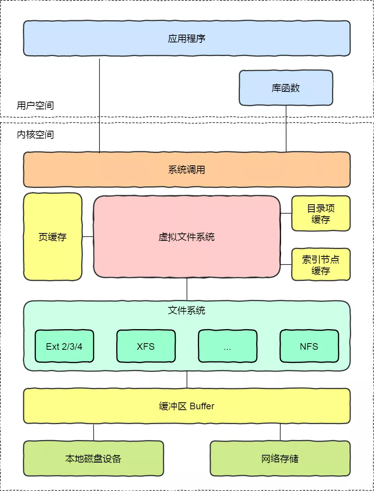

Linux 支持的文件系统也不少，根据存储位置的不同，可以把文件系统分为三类：

- *磁盘的文件系统*，它是直接把数据存储在磁盘中，比如 Ext 2/3/4、XFS 等都是这类文件系统。
- *内存的文件系统*，这类文件系统的数据不是存储在硬盘的，而是占用内存空间，我们经常用到的 `/proc` 和 `/sys` 文件系统都属于这一类，读写这类文件，实际上是读写内核中相关的数据数据。
- *网络的文件系统*，用来访问其他计算机主机数据的文件系统，比如 NFS、SMB 等等。

文件系统首先要先挂载到某个目录才可以正常使用，比如 Linux 系统在启动时，会把文件系统挂载到根目录。

### 文件的使用

我们从用户角度来看文件的话，就是我们要怎么使用文件？首先，我们得通过系统调用来打开一个文件。

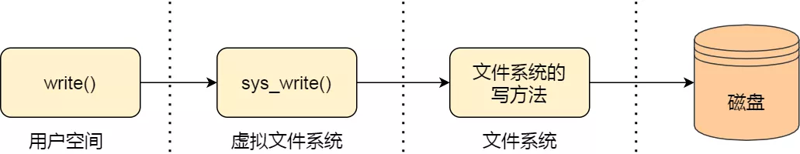

```
fd = open(name, flag); # 打开文件
...
write(fd,...);         # 写数据
...
close(fd);             # 关闭文件
```

上面简单的代码是读取一个文件的过程：

- 首先用 `open` 系统调用打开文件，`open` 的参数中包含文件的路径名和文件名。
- 使用 `write` 写数据，其中 `write` 使用 `open` 所返回的**文件描述符**，并不使用文件名作为参数。
- 使用完文件后，要用 `close` 系统调用关闭文件，避免资源的泄露。

我们打开了一个文件后，操作系统会跟踪进程打开的所有文件，所谓的跟踪呢，就是操作系统为每个进程维护一个打开文件表，文件表里的每一项代表「**文件描述符**」，所以说文件描述符是打开文件的标识。

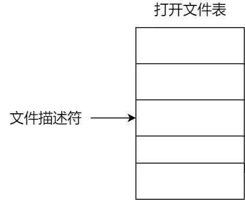打开文件表

操作系统在打开文件表中维护着打开文件的状态和信息：

- 文件指针：系统跟踪上次读写位置作为当前文件位置指针，这种指针对打开文件的某个进程来说是唯一的；
- 文件打开计数器：文件关闭时，操作系统必须重用其打开文件表条目，否则表内空间不够用。因为多个进程可能打开同一个文件，所以系统在删除打开文件条目之前，必须等待最后一个进程关闭文件，该计数器跟踪打开和关闭的数量，当该计数为 0 时，系统关闭文件，删除该条目；
- 文件磁盘位置：绝大多数文件操作都要求系统修改文件数据，该信息保存在内存中，以免每个操作都从磁盘中读取；
- 访问权限：每个进程打开文件都需要有一个访问模式（创建、只读、读写、添加等），该信息保存在进程的打开文件表中，以便操作系统能允许或拒绝之后的 I/O 请求；

在用户视角里，文件就是一个持久化的数据结构，但操作系统并不会关心你想存在磁盘上的任何的数据结构，操作系统的视角是如何把文件数据和磁盘块对应起来。

所以，用户和操作系统对文件的读写操作是有差异的，用户习惯以字节的方式读写文件，而操作系统则是以数据块来读写文件，那屏蔽掉这种差异的工作就是文件系统了。

我们来分别看一下，读文件和写文件的过程：

- 当用户进程从文件读取 1 个字节大小的数据时，文件系统则需要获取字节所在的数据块，再返回数据块对应的用户进程所需的数据部分。
- 当用户进程把 1 个字节大小的数据写进文件时，文件系统则找到需要写入数据的数据块的位置，然后修改数据块中对应的部分，最后再把数据块写回磁盘。

所以说，**文件系统的基本操作单位是数据块**。

------

### 文件的存储

文件的数据是要存储在硬盘上面的，数据在磁盘上的存放方式，就像程序在内存中存放的方式那样，有以下两种：

- 连续空间存放方式
- 非连续空间存放方式

其中，非连续空间存放方式又可以分为「链表方式」和「索引方式」。

不同的存储方式，有各自的特点，重点是要分析它们的存储效率和读写性能，接下来分别对每种存储方式说一下。

#### 连续空间存放方式

连续空间存放方式顾名思义，**文件存放在磁盘「连续的」物理空间中**。这种模式下，文件的数据都是紧密相连，**读写效率很高**，因为一次磁盘寻道就可以读出整个文件。

使用连续存放的方式有一个前提，必须先知道一个文件的大小，这样文件系统才会根据文件的大小在磁盘上找到一块连续的空间分配给文件。

所以，**文件头里需要指定「起始块的位置」和「长度」**，有了这两个信息就可以很好的表示文件存放方式是一块连续的磁盘空间。

注意，此处说的文件头，就类似于 Linux 的 inode。

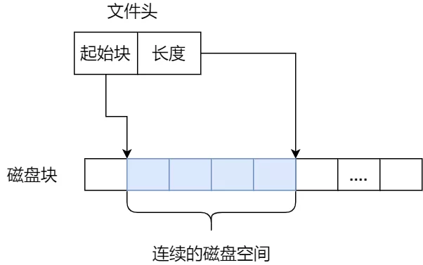连续空间存放方式

连续空间存放的方式虽然读写效率高，**但是有「磁盘空间碎片」和「文件长度不易扩展」的缺陷。**

如下图，如果文件 B 被删除，磁盘上就留下一块空缺，这时，如果新来的文件小于其中的一个空缺，我们就可以将其放在相应空缺里。但如果该文件的大小大于所有的空缺，但却小于空缺大小之和，则虽然磁盘上有足够的空缺，但该文件还是不能存放。当然了，我们可以通过将现有文件进行挪动来腾出空间以容纳新的文件，但是这个在磁盘挪动文件是非常耗时，所以这种方式不太现实。

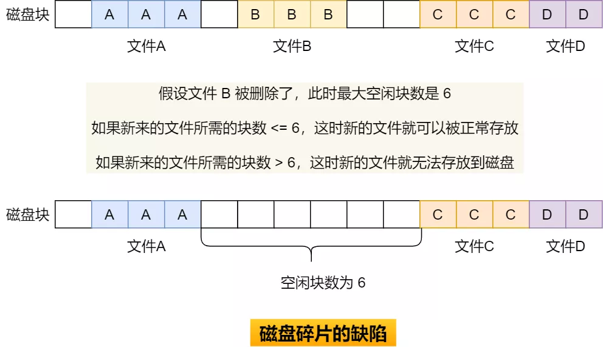磁盘碎片

另外一个缺陷是文件长度扩展不方便，例如上图中的文件 A 要想扩大一下，需要更多的磁盘空间，唯一的办法就只能是挪动的方式，前面也说了，这种方式效率是非常低的。

那么有没有更好的方式来解决上面的问题呢？答案当然有，既然连续空间存放的方式不太行，那么我们就改变存放的方式，使用非连续空间存放方式来解决这些缺陷。

#### 非连续空间存放方式

非连续空间存放方式分为「链表方式」和「索引方式」。

> 我们先来看看链表的方式。

链表的方式存放是**离散的，不用连续的**，于是就可以**消除磁盘碎片**，可大大提高磁盘空间的利用率，同时**文件的长度可以动态扩展**。根据实现的方式的不同，链表可分为「**隐式链表**」和「**显式链接**」两种形式。

文件要以「**隐式链表**」的方式存放的话，**实现的方式是文件头要包含「第一块」和「最后一块」的位置，并且每个数据块里面留出一个指针空间，用来存放下一个数据块的位置**，这样一个数据块连着一个数据块，从链头开是就可以顺着指针找到所有的数据块，所以存放的方式可以是不连续的。

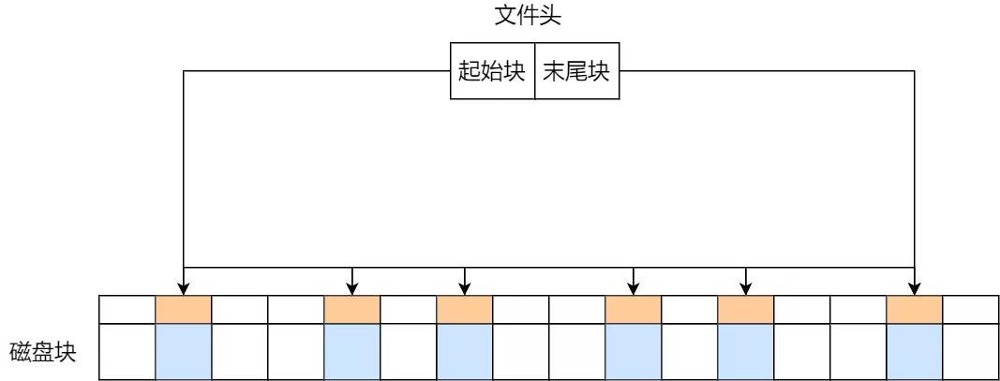隐式链表

隐式链表的存放方式的**缺点在于无法直接访问数据块，只能通过指针顺序访问文件，以及数据块指针消耗了一定的存储空间**。隐式链接分配的**稳定性较差**，系统在运行过程中由于软件或者硬件错误**导致链表中的指针丢失或损坏，会导致文件数据的丢失。**

如果取出每个磁盘块的指针，把它放在内存的一个表中，就可以解决上述隐式链表的两个不足。那么，这种实现方式是「**显式链接**」，它指**把用于链接文件各数据块的指针，显式地存放在内存的一张链接表中**，该表在整个磁盘仅设置一张，**每个表项中存放链接指针，指向下一个数据块号**。

对于显式链接的工作方式，我们举个例子，文件 A 依次使用了磁盘块 4、7、2、10 和 12 ，文件 B 依次使用了磁盘块 6、3、11 和 14 。利用下图中的表，可以从第 4 块开始，顺着链走到最后，找到文件 A 的全部磁盘块。同样，从第 6 块开始，顺着链走到最后，也能够找出文件 B 的全部磁盘块。最后，这两个链都以一个不属于有效磁盘编号的特殊标记（如 -1 ）结束。内存中的这样一个表格称为**文件分配表（\*File Allocation Table，FAT\*）**。

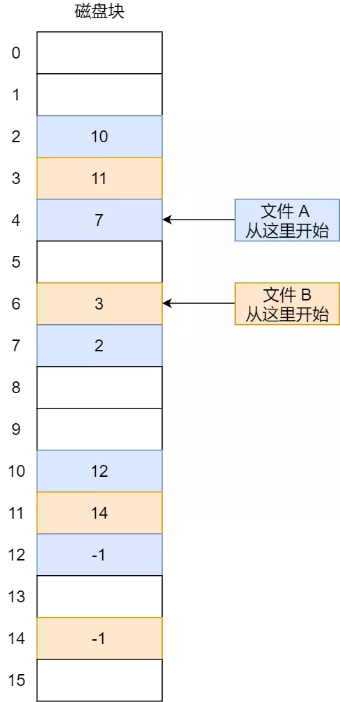显式链接

由于查找记录的过程是在内存中进行的，因而不仅显著地**提高了检索速度**，而且**大大减少了访问磁盘的次数**。但也正是整个表都存放在内存中的关系，它的主要的缺点是**不适用于大磁盘**。

比如，对于 200GB 的磁盘和 1KB 大小的块，这张表需要有 2 亿项，每一项对应于这 2 亿个磁盘块中的一个块，每项如果需要 4 个字节，那这张表要占用 800MB 内存，很显然 FAT 方案对于大磁盘而言不太合适。

> 接下来，我们来看看索引的方式。

链表的方式解决了连续分配的磁盘碎片和文件动态扩展的问题，但是不能有效支持直接访问（FAT除外），索引的方式可以解决这个问题。

索引的实现是为每个文件创建一个「**索引数据块**」，里面存放的是**指向文件数据块的指针列表**，说白了就像书的目录一样，要找哪个章节的内容，看目录查就可以。

另外，**文件头需要包含指向「索引数据块」的指针**，这样就可以通过文件头知道索引数据块的位置，再通过索引数据块里的索引信息找到对应的数据块。

创建文件时，索引块的所有指针都设为空。当首次写入第 i 块时，先从空闲空间中取得一个块，再将其地址写到索引块的第 i 个条目。

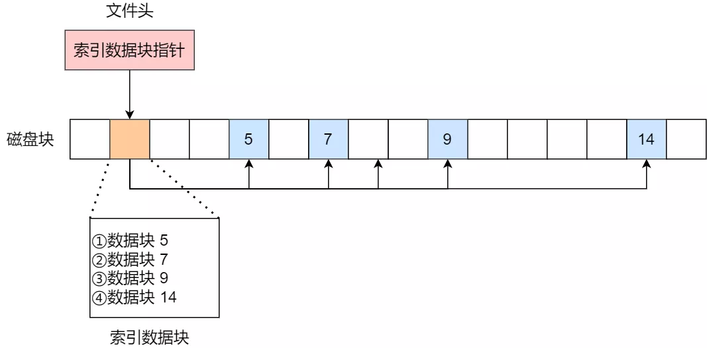索引的方式

索引的方式优点在于：

- 文件的创建、增大、缩小很方便；
- 不会有碎片的问题；
- 支持顺序读写和随机读写；

由于索引数据也是存放在磁盘块的，如果文件很小，明明只需一块就可以存放的下，但还是需要额外分配一块来存放索引数据，所以缺陷之一就是存储索引带来的开销。

如果文件很大，大到一个索引数据块放不下索引信息，这时又要如何处理大文件的存放呢？我们可以通过组合的方式，来处理大文件的存。

先来看看链表 + 索引的组合，这种组合称为「**链式索引块**」，它的实现方式是**在索引数据块留出一个存放下一个索引数据块的指针**，于是当一个索引数据块的索引信息用完了，就可以通过指针的方式，找到下一个索引数据块的信息。那这种方式也会出现前面提到的链表方式的问题，万一某个指针损坏了，后面的数据也就会无法读取了。

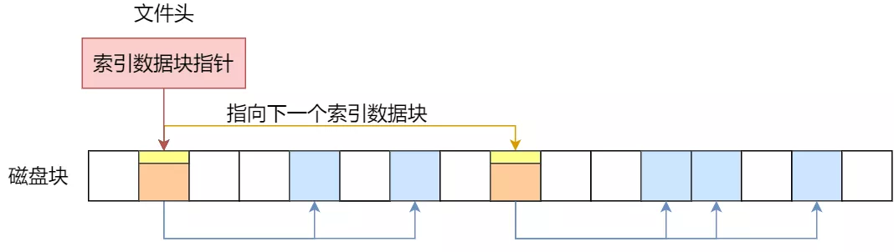链式索引块

还有另外一种组合方式是索引 + 索引的方式，这种组合称为「**多级索引块**」，实现方式是**通过一个索引块来存放多个索引数据块**，一层套一层索引，像极了俄罗斯套娃是吧。

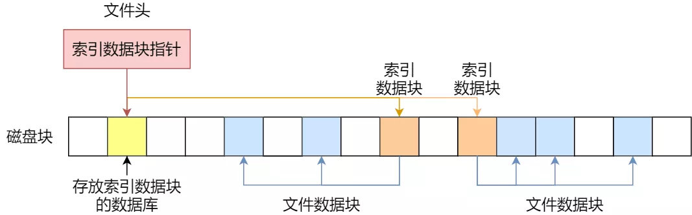多级索引块

#### Unix 文件的实现方式

我们先把前面提到的文件实现方式，做个比较：


那早期 Unix 文件系统是组合了前面的文件存放方式的优点，如下图：

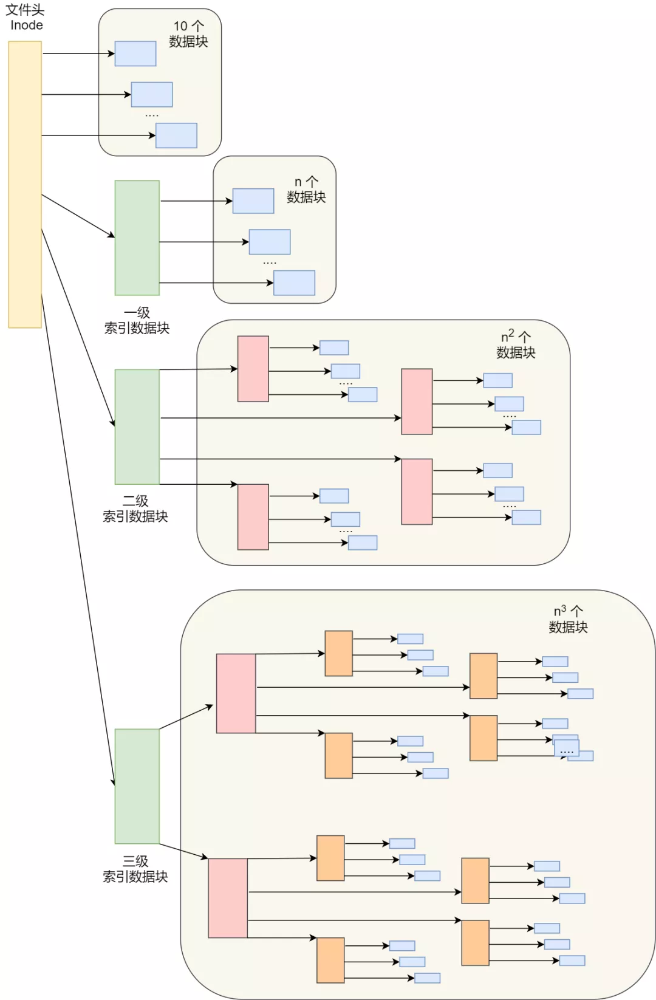早期 Unix 文件系统

它是根据文件的大小，存放的方式会有所变化：

- 如果存放文件所需的数据块小于 10 块，则采用直接查找的方式；
- 如果存放文件所需的数据块超过 10 块，则采用一级间接索引方式；
- 如果前面两种方式都不够存放大文件，则采用二级间接索引方式；
- 如果二级间接索引也不够存放大文件，这采用三级间接索引方式；

那么，文件头（*Inode*）就需要包含 13 个指针：

- 10 个指向数据块的指针；
- 第 11 个指向索引块的指针；
- 第 12 个指向二级索引块的指针；
- 第 13 个指向三级索引块的指针；

所以，这种方式能很灵活地支持小文件和大文件的存放：

- 对于小文件使用直接查找的方式可减少索引数据块的开销；
- 对于大文件则以多级索引的方式来支持，所以大文件在访问数据块时需要大量查询；

这个方案就用在了 Linux Ext 2/3 文件系统里，虽然解决大文件的存储，但是对于大文件的访问，需要大量的查询，效率比较低。

为了解决这个问题，Ext 4 做了一定的改变，具体怎么解决的，本文就不展开了。

------

### 空闲空间管理

前面说到的文件的存储是针对已经被占用的数据块组织和管理，接下来的问题是，如果我要保存一个数据块，我应该放在硬盘上的哪个位置呢？难道需要将所有的块扫描一遍，找个空的地方随便放吗？

那这种方式效率就太低了，所以针对磁盘的空闲空间也是要引入管理的机制，接下来介绍几种常见的方法：

- 空闲表法
- 空闲链表法
- 位图法

#### 空闲表法

空闲表法就是为所有空闲空间建立一张表，表内容包括空闲区的第一个块号和该空闲区的块个数，注意，这个方式是连续分配的。如下图：

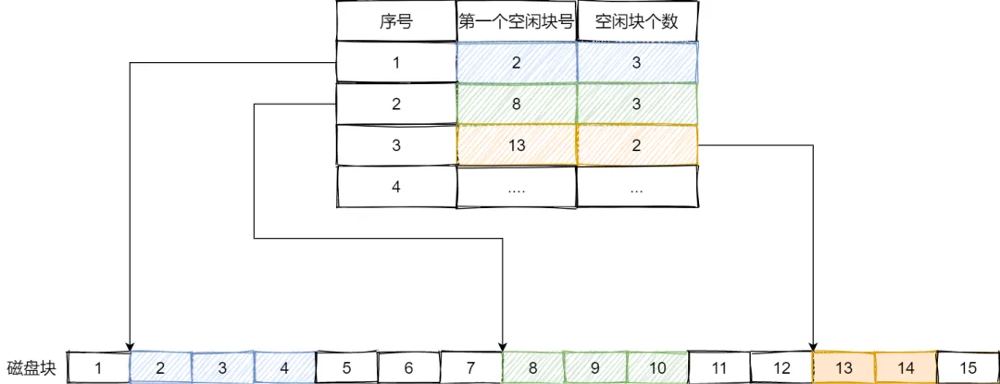空闲表法

当请求分配磁盘空间时，系统依次扫描空闲表里的内容，直到找到一个合适的空闲区域为止。当用户撤销一个文件时，系统回收文件空间。这时，也需顺序扫描空闲表，寻找一个空闲表条目并将释放空间的第一个物理块号及它占用的块数填到这个条目中。

这种方法仅当有少量的空闲区时才有较好的效果。因为，如果存储空间中有着大量的小的空闲区，则空闲表变得很大，这样查询效率会很低。另外，这种分配技术适用于建立连续文件。

#### 空闲链表法

我们也可以使用「链表」的方式来管理空闲空间，每一个空闲块里有一个指针指向下一个空闲块，这样也能很方便的找到空闲块并管理起来。如下图：

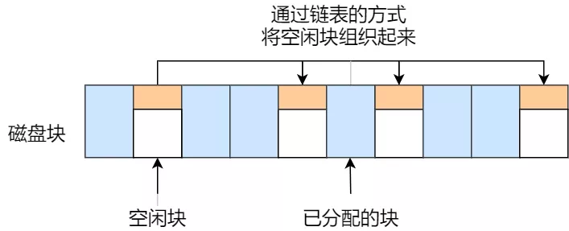空闲链表法

当创建文件需要一块或几块时，就从链头上依次取下一块或几块。反之，当回收空间时，把这些空闲块依次接到链头上。

这种技术只要在主存中保存一个指针，令它指向第一个空闲块。其特点是简单，但不能随机访问，工作效率低，因为每当在链上增加或移动空闲块时需要做很多 I/O 操作，同时数据块的指针消耗了一定的存储空间。

空闲表法和空闲链表法都不适合用于大型文件系统，因为这会使空闲表或空闲链表太大。

#### 位图法

位图是利用二进制的一位来表示磁盘中一个盘块的使用情况，磁盘上所有的盘块都有一个二进制位与之对应。

当值为 0 时，表示对应的盘块空闲，值为 1 时，表示对应的盘块已分配。它形式如下：

```
1111110011111110001110110111111100111 ...
```

在 Linux 文件系统就采用了位图的方式来管理空闲空间，不仅用于数据空闲块的管理，还用于 inode 空闲块的管理，因为 inode 也是存储在磁盘的，自然也要有对其管理。

------

### 文件系统的结构

前面提到 Linux 是用位图的方式管理空闲空间，用户在创建一个新文件时，Linux 内核会通过 inode 的位图找到空闲可用的 inode，并进行分配。要存储数据时，会通过块的位图找到空闲的块，并分配，但仔细计算一下还是有问题的。

数据块的位图是放在磁盘块里的，假设是放在一个块里，一个块 4K，每位表示一个数据块，共可以表示 `4 * 1024 * 8 = 2^15` 个空闲块，由于 1 个数据块是 4K 大小，那么最大可以表示的空间为 `2^15 * 4 * 1024 = 2^27` 个 byte，也就是 128M。

也就是说按照上面的结构，如果采用「一个块的位图 + 一系列的块」，外加「一个块的 inode 的位图 + 一系列的 inode 的结构」能表示的最大空间也就 128M，这太少了，现在很多文件都比这个大。

在 Linux 文件系统，把这个结构称为一个**块组**，那么有 N 多的块组，就能够表示 N 大的文件。

下图给出了 Linux Ext2 整个文件系统的结构和块组的内容，文件系统都由大量块组组成，在硬盘上相继排布：

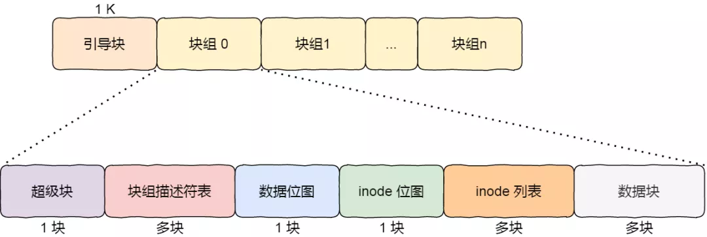

最前面的第一个块是引导块，在系统启动时用于启用引导，接着后面就是一个一个连续的块组了，块组的内容如下：

- *超级块*，包含的是文件系统的重要信息，比如 inode 总个数、块总个数、每个块组的 inode 个数、每个块组的块个数等等。
- *块组描述符*，包含文件系统中各个块组的状态，比如块组中空闲块和 inode 的数目等，每个块组都包含了文件系统中「所有块组的组描述符信息」。
- *数据位图和 inode 位图*， 用于表示对应的数据块或 inode 是空闲的，还是被使用中。
- *inode 列表*，包含了块组中所有的 inode，inode 用于保存文件系统中与各个文件和目录相关的所有元数据。
- *数据块*，包含文件的有用数据。

你可以会发现每个块组里有很多重复的信息，比如**超级块和块组描述符表，这两个都是全局信息，而且非常的重要**，这么做是有两个原因：

- 如果系统崩溃破坏了超级块或块组描述符，有关文件系统结构和内容的所有信息都会丢失。如果有冗余的副本，该信息是可能恢复的。
- 通过使文件和管理数据尽可能接近，减少了磁头寻道和旋转，这可以提高文件系统的性能。

不过，Ext2 的后续版本采用了稀疏技术。该做法是，超级块和块组描述符表不再存储到文件系统的每个块组中，而是只写入到块组 0、块组 1 和其他 ID 可以表示为 3、 5、7 的幂的块组中。

------

### 目录的存储

在前面，我们知道了一个普通文件是如何存储的，但还有一个特殊的文件，经常用到的目录，它是如何保存的呢？

基于 Linux 一切皆文件的设计思想，目录其实也是个文件，你甚至可以通过 `vim` 打开它，它也有 inode，inode 里面也是指向一些块。

和普通文件不同的是，**普通文件的块里面保存的是文件数据，而目录文件的块里面保存的是目录里面一项一项的文件信息。**

在目录文件的块中，最简单的保存格式就是**列表**，就是一项一项地将目录下的文件信息（如文件名、文件 inode、文件类型等）列在表里。

列表中每一项就代表该目录下的文件的文件名和对应的 inode，通过这个 inode，就可以找到真正的文件。

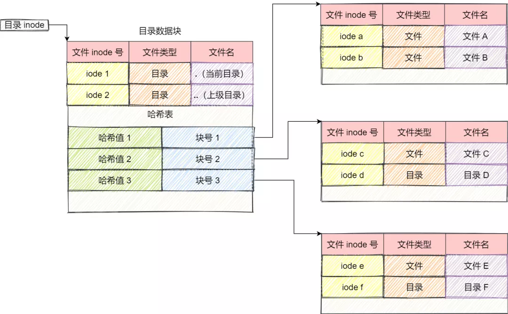目录格式哈希表

通常，第一项是「`.`」，表示当前目录，第二项是「`..`」，表示上一级目录，接下来就是一项一项的文件名和 inode。

如果一个目录有超级多的文件，我们要想在这个目录下找文件，按照列表一项一项的找，效率就不高了。

于是，保存目录的格式改成**哈希表**，对文件名进行哈希计算，把哈希值保存起来，如果我们要查找一个目录下面的文件名，可以通过名称取哈希。如果哈希能够匹配上，就说明这个文件的信息在相应的块里面。

Linux 系统的 ext 文件系统就是采用了哈希表，来保存目录的内容，这种方法的优点是查找非常迅速，插入和删除也较简单，不过需要一些预备措施来避免哈希冲突。

目录查询是通过在磁盘上反复搜索完成，需要不断地进行 I/O 操作，开销较大。所以，为了减少 I/O 操作，把当前使用的文件目录缓存在内存，以后要使用该文件时只要在内存中操作，从而降低了磁盘操作次数，提高了文件系统的访问速度。

------

### 软链接和硬链接

有时候我们希望给某个文件取个别名，那么在 Linux 中可以通过**硬链接（\*Hard Link\*）** 和**软链接（\*Symbolic Link\*）** 的方式来实现，它们都是比较特殊的文件，但是实现方式也是不相同的。

硬链接是**多个目录项中的「索引节点」指向一个文件**，也就是指向同一个 inode，但是 inode 是不可能跨越文件系统的，每个文件系统都有各自的 inode 数据结构和列表，所以**硬链接是不可用于跨文件系统的**。由于多个目录项都是指向一个 inode，那么**只有删除文件的所有硬链接以及源文件时，系统才会彻底删除该文件。**

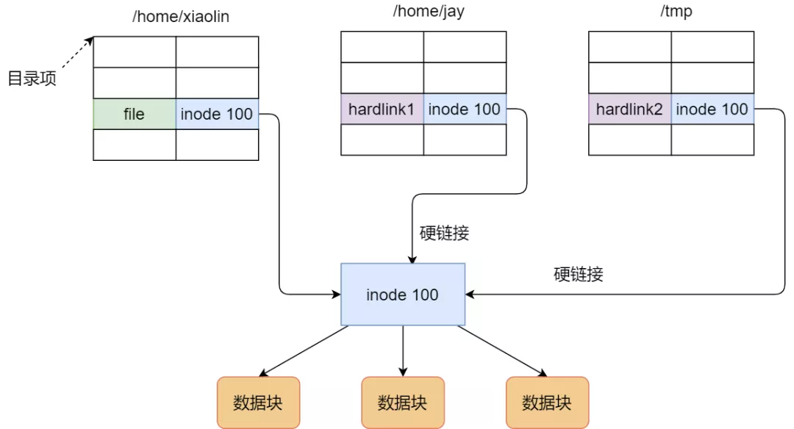硬链接

软链接相当于重新创建一个文件，这个文件有**独立的 inode**，但是这个**文件的内容是另外一个文件的路径**，所以访问软链接的时候，实际上相当于访问到了另外一个文件，所以**软链接是可以跨文件系统的**，甚至**目标文件被删除了，链接文件还是在的，只不过指向的文件找不到了而已。**

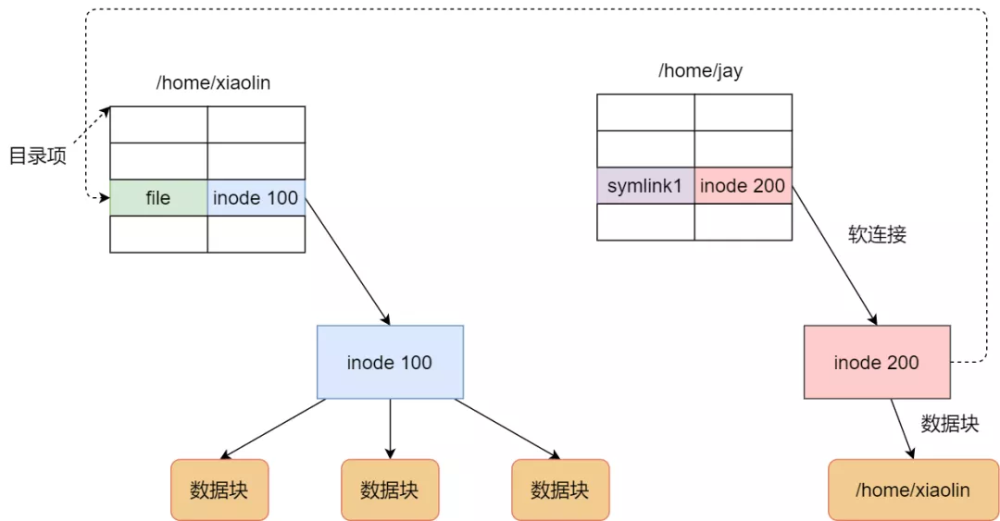软链接

------

### 文件 I/O

文件的读写方式各有千秋，对于文件的 I/O 分类也非常多，常见的有

- 缓冲与非缓冲 I/O
- 直接与非直接 I/O
- 阻塞与非阻塞 I/O VS 同步与异步 I/O

接下来，分别对这些分类讨论讨论。

#### 缓冲与非缓冲 I/O

文件操作的标准库是可以实现数据的缓存，那么**根据「是否利用标准库缓冲」，可以把文件 I/O 分为缓冲 I/O 和非缓冲 I/O**：

- 缓冲 I/O，利用的是标准库的缓存实现文件的加速访问，而标准库再通过系统调用访问文件。
- 非缓冲 I/O，直接通过系统调用访问文件，不经过标准库缓存。

这里所说的「缓冲」特指标准库内部实现的缓冲。

比方说，很多程序遇到换行时才真正输出，而换行前的内容，其实就是被标准库暂时缓存了起来，这样做的目的是，减少系统调用的次数，毕竟系统调用是有 CPU 上下文切换的开销的。

#### 直接与非直接 I/O

我们都知道磁盘 I/O 是非常慢的，所以 Linux 内核为了减少磁盘 I/O 次数，在系统调用后，会把用户数据拷贝到内核中缓存起来，这个内核缓存空间也就是「页缓存」，只有当缓存满足某些条件的时候，才发起磁盘 I/O 的请求。

那么，**根据是「否利用操作系统的缓存」，可以把文件 I/O 分为直接 I/O 与非直接 I/O**：

- 直接 I/O，不会发生内核缓存和用户程序之间数据复制，而是直接经过文件系统访问磁盘。
- 非直接 I/O，读操作时，数据从内核缓存中拷贝给用户程序，写操作时，数据从用户程序拷贝给内核缓存，再由内核决定什么时候写入数据到磁盘。

如果你在使用文件操作类的系统调用函数时，指定了 `O_DIRECT` 标志，则表示使用直接 I/O。如果没有设置过，默认使用的是非直接 I/O。

> 如果用了非直接 I/O 进行写数据操作，内核什么情况下才会把缓存数据写入到磁盘？

以下几种场景会触发内核缓存的数据写入磁盘：

- 在调用 `write` 的最后，当发现内核缓存的数据太多的时候，内核会把数据写到磁盘上；
- 用户主动调用 `sync`，内核缓存会刷到磁盘上；
- 当内存十分紧张，无法再分配页面时，也会把内核缓存的数据刷到磁盘上；
- 内核缓存的数据的缓存时间超过某个时间时，也会把数据刷到磁盘上；

#### 阻塞与非阻塞 I/O VS 同步与异步 I/O

为什么把阻塞 / 非阻塞与同步与异步放一起说的呢？因为它们确实非常相似，也非常容易混淆，不过它们之间的关系还是有点微妙的。

先来看看**阻塞 I/O**，当用户程序执行 `read` ，线程会被阻塞，一直等到内核数据准备好，并把数据从内核缓冲区拷贝到应用程序的缓冲区中，当拷贝过程完成，`read` 才会返回。

注意，**阻塞等待的是「内核数据准备好」和「数据从内核态拷贝到用户态」这两个过程**。过程如下图：

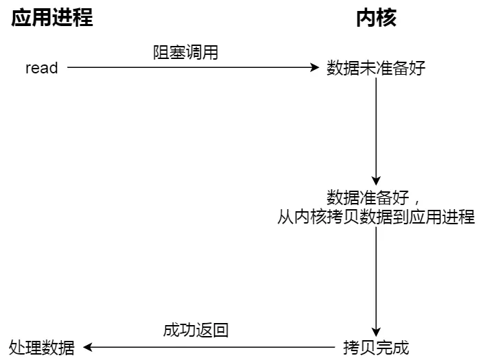阻塞 I/O

知道了阻塞 I/O ，来看看**非阻塞 I/O**，非阻塞的 read 请求在数据未准备好的情况下立即返回，可以继续往下执行，此时应用程序不断轮询内核，直到数据准备好，内核将数据拷贝到应用程序缓冲区，`read` 调用才可以获取到结果。过程如下图：

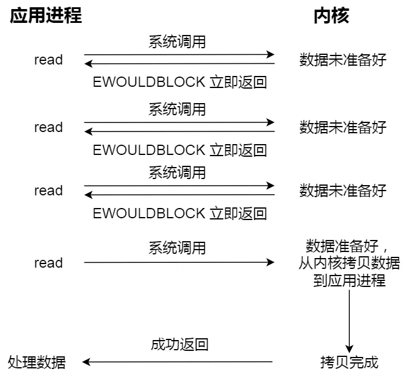非阻塞 I/O

注意，**这里最后一次 read 调用，获取数据的过程，是一个同步的过程，是需要等待的过程。这里的同步指的是内核态的数据拷贝到用户程序的缓存区这个过程。**

举个例子，访问管道或 socket 时，如果设置了 `O_NONBLOCK` 标志，那么就表示使用的是非阻塞 I/O 的方式访问，而不做任何设置的话，默认是阻塞 I/O。

应用程序每次轮询内核的 I/O 是否准备好，感觉有点傻乎乎，因为轮询的过程中，应用程序啥也做不了，只是在循环。

为了解决这种傻乎乎轮询方式，于是 **I/O 多路复用**技术就出来了，如 select、poll，它是通过 I/O 事件分发，当内核数据准备好时，再以事件通知应用程序进行操作。

这个做法大大改善了应用进程对 CPU 的利用率，在没有被通知的情况下，应用进程可以使用 CPU 做其他的事情。

下图是使用 select I/O 多路复用过程。注意，`read` 获取数据的过程（数据从内核态拷贝到用户态的过程），也是一个**同步的过程**，需要等待：

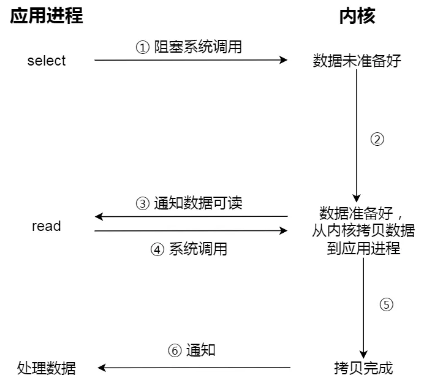I/O 多路复用

实际上，无论是阻塞 I/O、非阻塞 I/O，还是基于非阻塞 I/O 的多路复用**都是同步调用。因为它们在 read 调用时，内核将数据从内核空间拷贝到应用程序空间，过程都是需要等待的，也就是说这个过程是同步的，如果内核实现的拷贝效率不高，read 调用就会在这个同步过程中等待比较长的时间。**

而真正的**异步 I/O** 是「内核数据准备好」和「数据从内核态拷贝到用户态」这两个过程都不用等待。

当我们发起 `aio_read` 之后，就立即返回，内核自动将数据从内核空间拷贝到应用程序空间，这个拷贝过程同样是异步的，内核自动完成的，和前面的同步操作不一样，应用程序并不需要主动发起拷贝动作。过程如下图：

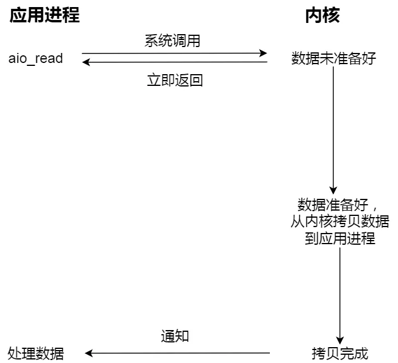异步 I/O

下面这张图，总结了以上几种 I/O 模型：


在前面我们知道了，I/O 是分为两个过程的：

1. 数据准备的过程
2. 数据从内核空间拷贝到用户进程缓冲区的过程

阻塞 I/O 会阻塞在「过程 1 」和「过程 2」，而非阻塞 I/O 和基于非阻塞 I/O 的多路复用只会阻塞在「过程 2」，所以这三个都可以认为是同步 I/O。

异步 I/O 则不同，「过程 1 」和「过程 2 」都不会阻塞。

> 用故事去理解这几种 I/O 模型

举个你去饭堂吃饭的例子，你好比用户程序，饭堂好比操作系统。

阻塞 I/O 好比，你去饭堂吃饭，但是饭堂的菜还没做好，然后你就一直在那里等啊等，等了好长一段时间终于等到饭堂阿姨把菜端了出来（数据准备的过程），但是你还得继续等阿姨把菜（内核空间）打到你的饭盒里（用户空间），经历完这两个过程，你才可以离开。

非阻塞 I/O 好比，你去了饭堂，问阿姨菜做好了没有，阿姨告诉你没，你就离开了，过几十分钟，你又来饭堂问阿姨，阿姨说做好了，于是阿姨帮你把菜打到你的饭盒里，这个过程你是得等待的。

基于非阻塞的 I/O 多路复用好比，你去饭堂吃饭，发现有一排窗口，饭堂阿姨告诉你这些窗口都还没做好菜，等做好了再通知你，于是等啊等（`select` 调用中），过了一会阿姨通知你菜做好了，但是不知道哪个窗口的菜做好了，你自己看吧。于是你只能一个一个窗口去确认，后面发现 5 号窗口菜做好了，于是你让 5 号窗口的阿姨帮你打菜到饭盒里，这个打菜的过程你是要等待的，虽然时间不长。打完菜后，你自然就可以离开了。

异步 I/O 好比，你让饭堂阿姨将菜做好并把菜打到饭盒里后，把饭盒送到你面前，整个过程你都不需要任何等待。


------

**你手里有一块硬盘，大小为 1T**


**你还有一堆文件**


这些文件在硬盘看来，就是一堆二进制数据而已


你准备把这些文件存储在硬盘上，并在需要的时候读取出来。

要设计怎样的软件，才能更方便地在硬盘中读写这些文件呢？

# 1

首先我不想和复杂的扇区，设备驱动等细节打交道，因此我先实现了一个简单的功能，将硬盘按逻辑分成一个个的**块**，并可以以块为单位进行读写。

每个块就定义为两个物理扇区的大小，即 1024 字节，就是 1KB 啦。

硬盘太大不好分析，我们就假设你的硬盘只有 1MB，那么这块硬盘则有 1024 个块。


OK，我们开始存文件啦！

准备一个文件


随便选个块放进去，3 号块吧！


成功！首战告捷！

# 2

再存一个文件！

诶？发现问题了，万一这个文件也存到了 3 号块，不是把原来的文件覆盖了么？不行，得有一个地方记录，现在可使用的块有哪些，像这样。

块 0：未使用

块 1：未使用

块 2：未使用

块 3：已使用

块 4：未使用

...

块 1023：未使用

那我们就用 0 号块，来记录所有块的使用情况吧！怎么记录呢？

**位图！**


那我们给块 0 起个名字，叫**块位图**，之后这个块 0 就专门用来记录所有块的使用情况，不再用来存具体文件了。


当我们再存入一个新文件时，只需要在块位图中找到第一个为 0 的位，就可以找到第一个还未被使用的块，将文件存入。同时，别忘了把块位图中的相应位置 1。

完美！

# 3

下面，我们尝试读取刚刚的文件。

咦？又遇到问题了，我怎么找到刚刚的文件呢？根据块号么？这也太蠢了，就像你去书店找书，店员让你提供书的编号，而不是书名，显然不合理。

因此我们给每个文件起一个名字，叫**文件名**，通过它来寻找这个文件。

那必然就要有一个地方，记录文件名与块号的对应关系，像这样。

葵花宝典.txt：3 号块

数学期末复习资料.mp4：5 号块

低并发编程的秘密.pdf：10 号块

...

别急，既然都要选一个地方记录文件名称了，不妨多记录一点我们关心的信息吧，比如文件大小、文件创建时间、文件权限等。

这些东西自然也要保存在硬盘上，我们选择用一个固定大小的空间，来表示这些信息，多大空间呢？128 字节吧。

为啥是 128 字节呢？我乐意。


我们将这 128 字节的结构体，叫做一个 **inode**。

之后，我们每存入一个新的文件，不但要占用一个块来存放这个文件本身，还要占用一个 inode 来存放文件的这些**元信息**，并且这个 inode 的**所在块号**这个字段，就指向这个文件所在的块号。


如果一个 inode 为 128 字节，那么一个块就可以容纳 8 个 inode，我们可以将这些 inode 编上号。

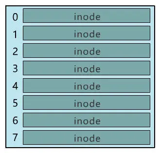

如果你觉得 inode 数不够，也可以用两个或者多个块来存放 inode 信息，但这样用于存放数据的块就少了，这就看你自己的平衡了。

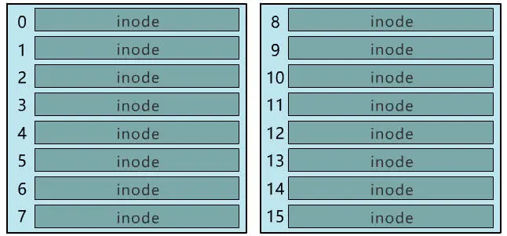

同样，和块位图管理块的使用情况一样，我们也需要一个 **inode 位图**，来管理 inode 的使用情况。我们就把 inode 位图，放在 1 号块吧！

同时，我们把 inode 信息，放在 2 号块，一共存 8 条 inode，这样我们的 2 号块就叫做 **inode 表**。

现在，我们的文件系统结构，变成了下面这个样子。


注意：块位图是管理可用的块，每一位代表一个块的使用与否。inode 位图管理的是一条一条的 inode，并不是 inode 所占用的块，比如上图中有 8 条 inode，则 inode 位图中就有 8 位是管理他们的使用与否。

# 4

现在，我们的文件很小，一个块就能容下。

但如果需要两个块、三个块、四个块呢？

很简单，我们只需要采用**连续存储法**，而 inode 则只记录文件的第一个块，以及后面还需要多少块，即可。

这种办法的缺点就是：容易留下大大小小的**空洞**，新的文件到来以后，难以找到合适的空白块，空间会被浪费。


看来这种方式不行，那怎么办呢？

既然在 inode 中记录了文件所在的块号，为什么不扩展一下，多记录几块呢？


原来在 inode 中只记录了一个块号，现在扩展一下，记录 8 个块号！而且这些块**不需要连续**。

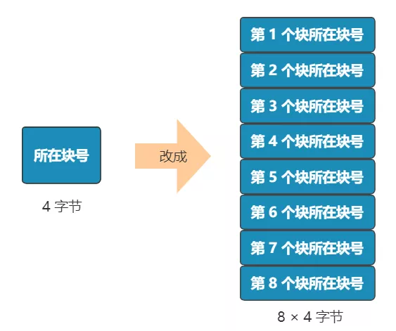

嗯，这是个可行的办法！

但是这也仅仅能表示 8 个块，能记录的最大文件是 8K（记住，一个块是 1K）, 现在的文件轻松就超过这个限制了，这怎么办？

很简单，我们可以让其中一个块，作为**间接索引**。

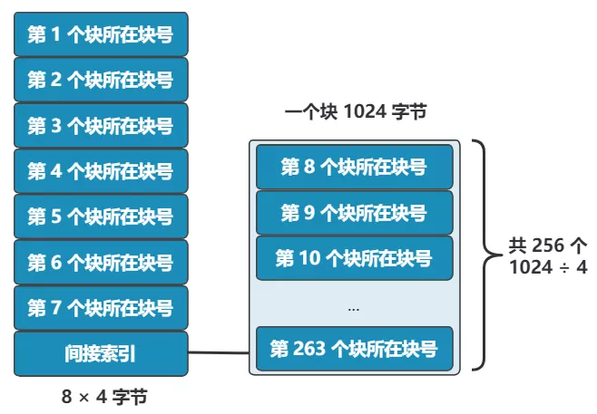

这样瞬间就有 263 个块（多了 256 -1 个块）可用了，这种索引叫**一级间接索引**。

如果还嫌不够，就再弄一个块做一级间接索引，或者做二级间接索引（二级间接索引则可以多出 256 * 256 - 1 个块）。

我们的文件系统，暂且先只弄一个一级间接索引。硬盘一共才 1024 个块，一个文件 263 个块够大了。再大了不允许，就这么任性，爱用不用。

好了，现在我们已经可以保存很大的文件了，并且可以通过文件名和文件大小，将它们准确读取出来啦！

# 5

但我们得精益求精，我们再想想看这个文件系统有什么毛病。

比如，inode 数量不够时，我们是怎么得知的呢？是不是需要在 inode 位图中找，找不到了才知道不够用了？

同样，对于块数量不够时，也是如此。

要是有个全局的地方，来记录这一切，就好了，也方便随时调整，比如这样

inode 数量

空闲 inode 数量

块数量

空闲块数量

那我们就再占用一个块来存储这些数据吧！由于他们看起来像是站在上帝视角来描述这个文件系统的，所以我们把它放在最开始的块上，并把它叫做**超级块**，现在的布局如下。


我们继续精益求精。

现在，**块位图**、**inode 位图**、**inode 表**，都是是固定地占据这块 1、块 2、块 3 这三个位置。

假如之后 inode 的数量很多，使得 inode 表或者 inode 位图需要占据多个块，怎么办？

或者，块的数量增多（硬盘本身大了，或者每个块变小了），块位图需要占据多个块，怎么办？

程序是死的，你不告诉它哪个块表示什么，它可不会自己猜。

很简单，与超级块记录信息一样，这些信息也选择一个块来记录，就不怕了。那我们就选择紧跟在超级块后面的 1 号块来记录这些信息吧，并把它称之为**块描述符**。


当然，这些所在块号只是记录起始块号，块位图、inode 位图、inode 表分别都可以占用多个块。

好了，大功告成！

# 6

现在，我们再尝试存入一批文件。

- 葵花宝典.txt
- 数学期末复习资料.mp4
- 赘婿1.mp4
- 赘婿2.mp4
- 赘婿3.mp4
- 赘婿4.mp4
- 低并发编程的秘密.pdf

诶？这看着好不爽，所有的文件都是平铺开的，能不能拥有**层级关系**呢？比如这样

- 葵花宝典.txt

- 数学期末复习资料.mp4

- 赘婿

- - 赘婿1.mp4
  - 赘婿2.mp4
  - 赘婿3.mp4
  - 赘婿4.mp4

- 低并发编程的秘密.pdf

我们将葵花宝典.txt 这种称为**普通文件**，将赘婿这种称为**目录文件**，如果要访问赘婿1.mp4，那全文件名要写成

赘婿/赘婿1.mp4。

如何做到这一点呢？那我们又得把 inode 结构拿出来说事了。


此时需要一个属性来区分这个文件是普通文件，还是目录文件。

缺什么就补什么嘛，我们已经很熟悉了，专门加一个 4 字节，来表示**文件类型**。


如果是**普通文件**，则这个 inode 所指向的数据块仍然和之前一样，就是文件本身原封不动的内容。

但如果是**目录文件**，则这个 inode 所指向的数据块，就需要重新规划了。

这个数据块里应该是什么样子呢？可以是一个一个指向不同 inode 的紧挨着的结构体，比如这样。

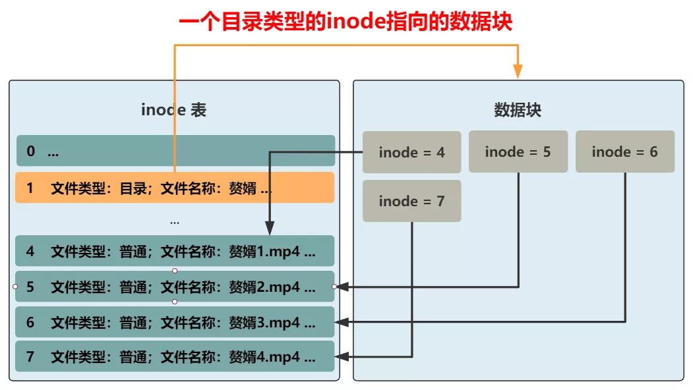

这样先通过 **赘婿** 这个目录文件，找到所在的数据块。再根据这个数据块里的一个个带有 **inode** 信息的结构体，找到这个目录下的所有文件。

完美！

# 7

不过这样的话，你想想看，如果想要查看一下赘婿**这个目录下的所有文件**（比如 ll 命令），将文件名和文件类型都展示出来，怎么办呢？

就需要把一个个结构体指向的 inode 从 inode 表中取出，再把文件名和文件类型取出，这很是浪费时间。

而让用户看到一个目录下的所有文件，又是一个极其常见的操作。

所以，不如把文件名和文件类型这种常见的信息，放在数据块中的结构体里吧。


同时，inode 结构中的文件名，好像就没啥用了，这种变长的东西放在这种定长的结构中本身就很讨厌，早就想给它去掉了。而且还能给其他信息省下空间，比如文件所在块的数组，就能再多几个了。

太好了，去掉它！


OK，大功告成，现在我们就可以给文件分门别类放进不同目录下了，还可以在目录下创建目录，无限套娃！

# 8

现在的文件系统，已经比较完善了，只是还有一点不太爽。

我们访问到一个目录下，可以很舒服地看到目录里的文件，然后再根据名称访问这个目录下的文件或者目录，整个过程都是一个套路。

但是，最上层的目录下的所有文件，即**根目录**，现在仍然需要通过遍历所有的 inode 来获得，能不能和上面的套路统一呢？

答案非常简单，我们规定，**inode 表中的 0 号 inode，就表示根目录**，一切的访问，就从这个根目录开始！


好了，这回没有然后了！

我们最后来欣赏下我们的文件系统架构。

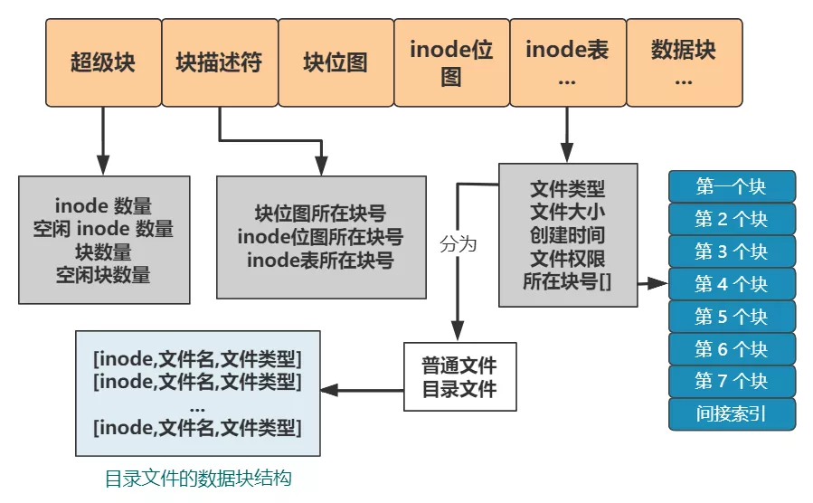

## 你是不是觉得这没啥了不起的。**但这个破玩意，它就叫文件系统**

#  **后记**    

这个文件系统，和 linux 上的经典文件系统 **ext2** 基本相同。

下面是我画的 ext2 文件系统的结构（字段部分只画了核心字段）


估计你是看不清了，我说下主要异同点：

\1. 超级块前面是启动块，这个是 PC 联盟给硬盘规定的 1KB 专属空间，任何文件系统都不能用它。

\2. ext2 文件系统首先将整个硬盘分为很多块组，但如果只有一个块组的话，和我们的文件系统整体结构就完全一样了，分别是超级块、块描述符、块位图、inode 位图、inode 表、数据块。

\3. ext2 文件系统的 inode 表中用 15 个块来定位文件，其中第 13 个块为一级间接索引、14 个为二级间接索引、15 个为三级间接索引。

\4. ext2 文件系统的文件类型分得更多，还有常见的如块设备文件、字符设备文件、管道文件、socket 文件等。

\5. ext2 文件系统的超级块、块描述符、inode 表中记录的信息更多，但核心的和我们的文件系统一样，而且这些字段在后续的 ext3 和 ext4 中不断增加，保持向前兼容。

\6. ext2 文件系统的 2 号 inode 为根目录，而我们的系统是 0 号 inode 为根目录，这个很随意，你设计一个文件系统定一个 187 号 inode 为根目录也没人拦着你。

如果你想了解 ext2 文件系统的全部细节，有三种方式。

\1. 看源码，linux1.0 后的源码都有 ext2 文件系统的实现，源码是最准确的。

\2. 看官方文档，这里有个 pdf 连接。
https://www.nongnu.org/ext2-doc/ext2.pdf

\3. 看优质博客，这里我推荐一个。
http://docs.linuxtone.org/ebooks/C&CPP/c/ch29s02.html

\4. 用 linux 的 mke2fs 命令生成一个 ext2 文件系统的磁盘镜像，然后一个字节一个字节分析其格式，可以在公众号 低并发编程 回复 ext2 获得我的镜像分析文件。

如果看源码和官方文档毫不吃力，我当然主推这两个，因为毕竟是一手资料。

但大多数人可能无法做到，有时也没大必要，因此也可以看一些优质的博客。

**介绍思想**的，我觉得我这一篇就算是很优质的一篇了，它会带你从设计者角度了解为什么这样来设计文件系统。

**介绍细节**的，那些连文件系统的格式和字段都写不对的，就别看了，所以我这里良心推荐一篇，就是上面的方式三，可以放心大胆，逐字逐句地食用。

最后你还可以用方式四，自己将文件系统镜像导出来，进行分析。

最近写这几篇文章，我感觉对如何学会一项新的技术，有了点小心得，不知道大家是否感兴趣，改天可以找一篇来专门和大家分享一下。