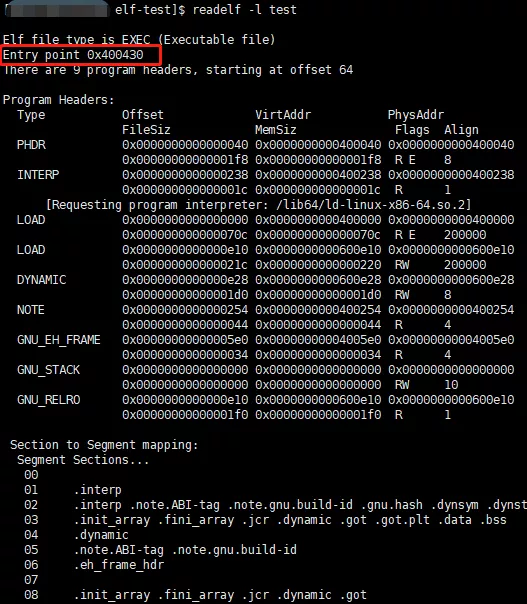
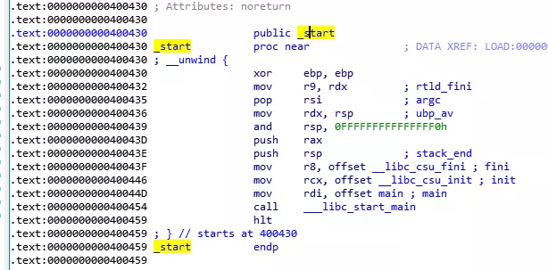
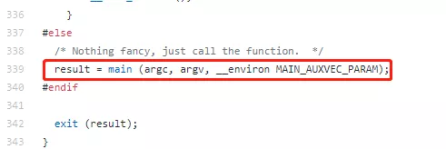
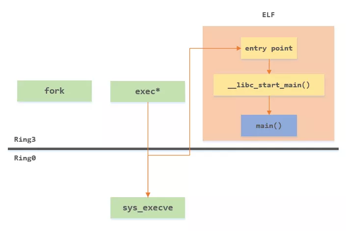
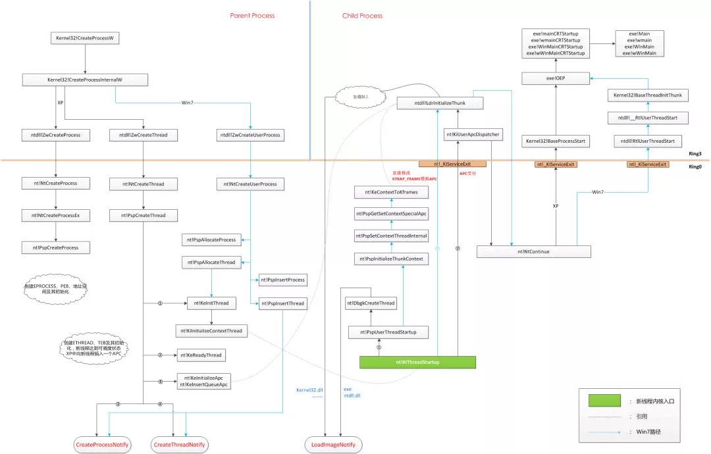

前几天，读者群里有小伙伴提问：**从进程创建后，到底是怎么进入我写的main函数的？**

今天这篇文章就来聊聊这个话题。

首先先划定一下这个问题的讨论范围：**C/C++语言**

这篇文章主要讨论的是**操作系统层面**上对于进程、线程的创建初始化等行为，而像Python、Java等基于解释器、虚拟机的语言，如何进入到main函数执行，这背后的路径则更长（包含了解释器和虚拟机内部的执行流程），以后有机会再讨论。所以这里就重点关注C/C++这类native语言的main函数是如何进入的。


本文会兼顾叙述**Linux**和**Windows**两个主要平台上的详细流程。

## **创建进程**

第一步，创建进程。

在Linux上，我们要启动一个新的进程，一般通过**fork** + **exec**系列函数来实现，前者将当前进程“分叉”出一个孪生子进程，后者负责替换这个子进程的执行文件，来执行子进程的新程序文件。

这里的**fork**、**exec**系列函数，是操作系统提供给应用程序的API函数，在其内部最终都会通过**系统调用**，进入操作系统内核，通过内核中的进程管理机制，来完成一个进程的创建。

操作系统内核将负责进程的创建，主要有下面几个工作要做：

> - 创建内核中用于描述进程的数据结构，在Linux上是**task_struct**
> - 创建新进程的页目录、页表，用于构建新进程的内存地址空间

在Linux内核中，由于历史原因，Linux内核早期并没有**线程**的概念，而是用**任务：task_struct**来描述一个程序的执行实例：**进程**。

在内核中，一个任务对应就是一个**task_struct**，也就是一个进程，内核的调度单元也是一个个的个**task_struct**。

后来，**多线程**的概念兴起，Linux内核为了支持多线程技术，**task_struct**实际上表示的变成了一个线程，通过将多个**task_struct**合并为一组（通过该结构内部的组id字段）再来描述一个进程。因此，Linux上的线程，也称为**轻量级进程**。

系统调用**fork**的一个重要使命就是要去创建新进程的**task_struct**结构，创建完成后，进程就拥有了调度单元。随后将开始可以参与调度并有机会获得执行。

## **加载可执行文件**

通过**fork**成功创建进程后，此时的子进程和父进程相当于一个细胞进行了有丝分裂，两个进程“几乎”是一模一样的。

而要想子进程执行新的程序，在子进程中还需要用到**exec**系列函数来实现对进程可执行程序的替换。

**exec**系列函数同样是系统调用的封装，通过调用它们，将进入内核**sys_execve**来执行真正的工作。

这个工作细节比较多，其中有一个重要的工作就是**加载可执行文件到进程空间并对其进行分析，提取出可执行文件的入口地址**。

我们使用C、C++等高级语言编写的代码，最终通过编译器会编译生成可执行文件，在Linux上，是**ELF**格式，在Windows上，称之为**PE**文件。

无论是ELF文件还是PE文件，在各自的文件头中，都记录了这个可执行文件的指令入口地址，它指示了程序该从哪里开始执行。

这个入口指向哪里，是我们的**main**函数吗？这里卖一个关子，先来解决在这之前的一个问题：**进程创建后，是如何来到这个入口地址的？**

不管在Windows还是Linux上，应用线程都会经常在用户空间和内核空间来回穿梭，这可能出现在以下几种情况发生时：

> - 系统调用
> - 中断
> - 异常

从内核返回时，线程是如何知道自己从哪里进来的，该回到应用空间的哪里去继续执行呢？

答案是，在进入内核空间时，线程将自动保存上下文（其实就是一些寄存器的内容，比如指令寄存器EIP）到线程的堆栈上，记录自己从哪里来的，等到从内核返回时，再从堆栈上加载这些信息，回到原来的地方继续执行。

前面提到，子进程是通过**sys_execve**系统调用进入到内核中的，在后面完成可执行文件的分析后，拿到了ELF文件的入口地址，将会去修改原来保存在堆栈上的上下文信息，将EIP指向ELF文件的入口地址。这样等**sys_execve**系统调用结束时，返回到用户空间后，就能够直接转到新的程序入口开始执行代码。

所以，一个非常重要的特点是：**exec系列函数正常情况下是不会返回的，一旦进入，完成使命后，执行流程就会转向新的可执行文件入口**。

> 另外需要提一下的是，在Linux上，除了ELF文件，还支持一些其他格式的可执行文件，如MS-DOS、COFF
>
> 除了二进制的可执行文件，还支持shell脚本，这个情况下将会将脚本解释器程序作为入口来启动

## **从ELF入口到main函数**

上面交代了，一个新的进程，是如何执行到可执行文件的入口地址的。

同时也留了一个问题，这个入口地址是什么？是我们的main函数吗？

这里有一个简单的C程序，运行起来后输出经典的hello world：

```
#include <stdio.h>
int main() {
    printf("hello, world!\n");
    return 0;
}
```

通过gcc编译后，生成了一个ELF可执行文件，通过**readelf**指令，可以实现对ELF文件的分析，这里可以看到ELF文件的入口地址是0x400430：



随后，我们通过反汇编神器，IDA打开分析这个文件，看一下位于0x400430入口的地方是什么函数？



可以看到，入口地方是一个叫做 **_start** 的函数，并不是我们的main函数。

在_start的结尾，调用了 **__libc_start_main** 函数，而这个函数，位于libc.so中。

你可能疑惑，这个函数是哪里冒出来的，我们的代码中并没有用到它呢？

其实，在进入main函数之前，还有一个重要的工作要做，这就是：**C/C++运行时库的初始化**。上面的 **__libc_start_main** 就是在完成这一工作。

在通过GCC进行编译时，编译器将自动完成运行时库的链接，将我们的main函数封装起来，由它来调用。

glibc是开源的，我们可以在GitHub上找到这个项目的libc-start.c文件，一窥 **__libc_start_main** 的真面目，我们的main函数正是被它在调用。



## **完整流程**

到这里，我们梳理了，从进程创建fork，到通过exec系列函数完成可执行文件的替换，再到执行流程进入到ELF文件的入口，再到我们的main函数的完整流程。



## **Windows上的一些区别**

下面简单介绍下Windows上这一流程的一些差异。

首先是创建进程的环节，Windows系统将fork+exec两步合并了一步，通过**CreateProcess**系列函数一步到位，在其参数中指定子进程的可执行文件路径。

不同于Linux上进程和线程的边界模糊，在Windows操作系统上，内核是有明确的进程和线程概念定义，进程用**EPROCESS**结构表示，线程用**ETHREAD**结构表示。

所以在Windows上，进程相关的工作准备就绪后，还需要单独创建一个参与内核调度的执行单元，也就是进程中的第一个线程：**主线程**。当然，这个工作也封装在了**CreateProcess**系列函数中了。

新进程的主线程创建完成后，便开始参与系统调度了。主线程从哪里开始执行呢？内核在创建时就明确进行了指定：**nt!KiThreadStartup**，这是一个内核函数，线程启动后就从这里开始执行。

线程从这里启动后，再通过Windows的**异步过程调用APC机制**执行提前插入的APC，进而将执行流程引入应用层，去执行Windows进程应用程序的初始化工作，比如一些核心DLL文件的加载（Kernel32.dll、ntdll.dll）等等。

随后，再次通过APC机制，再转向去执行可执行文件的入口点。

这后面和Linux上的机制类似，同样没有直接到main函数，而是需要先进行C/C++运行时库的初始化，这之后经过运行时函数的包装，才最终来到我们的**main**函数。

下面是Windows上，从创建进程到我们的main函数的完整流程（高清大图：https://bbs.pediy.com/upload/attach/201604/501306_qz5f5hi1n3107kt.png）：



现在你清楚，从进程启动是怎么一步步到你的main函数的了吗？有疑惑和不解的地方，欢迎留言交流。


------

#### [1、 在main执行之前和之后执行的代码可能是什么？](https://interviewguide.cn/#/Doc/Knowledge/C++/基础语法/基础语法?id=1、-在main执行之前和之后执行的代码可能是什么？)

**main函数执行之前**，主要就是初始化系统相关资源：

- 设置栈指针
- 初始化静态`static`变量和`global`全局变量，即`.data`段的内容
- 将未初始化部分的全局变量赋初值：数值型`short`，`int`，`long`等为`0`，`bool`为`FALSE`，指针为`NULL`等等，即`.bss`段的内容
- 全局对象初始化，在`main`之前调用构造函数，这是可能会执行前的一些代码
- 将main函数的参数`argc`，`argv`等传递给`main`函数，然后才真正运行`main`函数
- `__attribute__((constructor))`

**main函数执行之后**：

- 全局对象的析构函数会在main函数之后执行；
- 可以用 **`atexit`** 注册一个函数，它会在main 之后执行;
- `__attribute__((destructor))`