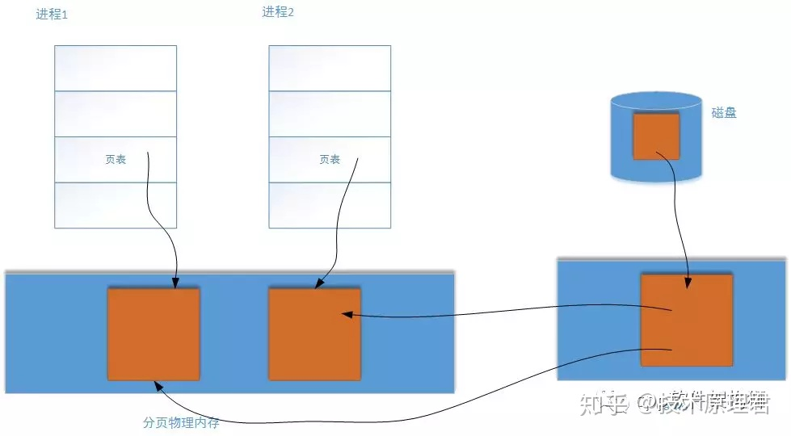
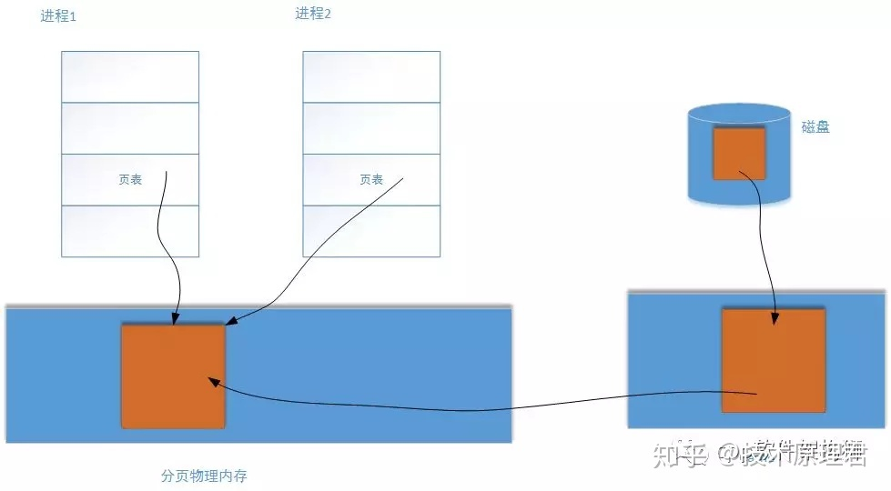

在Unix/Linux系统下读写文件，一般有两种方式。

一种是open一个文件，然后使用[read系统](https://www.zhihu.com/search?q=read系统&search_source=Entity&hybrid_search_source=Entity&hybrid_search_extra={"sourceType"%3A"article"%2C"sourceId"%3A69555454})调用读取文件的一部分或全部。这个read过程是这样的：内核将文件中的数据从磁盘区域读取到内核页[高速缓冲区](https://www.zhihu.com/search?q=高速缓冲区&search_source=Entity&hybrid_search_source=Entity&hybrid_search_extra={"sourceType"%3A"article"%2C"sourceId"%3A69555454})，再从内核的高速缓冲区读取到用户进程的地址空间。这里就涉及到了数据的两次拷贝：磁盘->内核，内核->用户态。

而且当存在多个进程同时读取同一个文件时，每一个进程中的[地址空间](https://www.zhihu.com/search?q=地址空间&search_source=Entity&hybrid_search_source=Entity&hybrid_search_extra={"sourceType"%3A"article"%2C"sourceId"%3A69555454})都会保存一份副本，这样肯定不是最优方式的，造成了[物理内存](https://www.zhihu.com/search?q=物理内存&search_source=Entity&hybrid_search_source=Entity&hybrid_search_extra={"sourceType"%3A"article"%2C"sourceId"%3A69555454})的浪费。看下图：





**第二种方式就是使用内存映射的方式**。具体操作方式是：open一个文件，然后调用mmap系统调用，将文件的内容的全部或一部分直接映射到进程的地址空间，映射完成后，进程可以像访问普通内存一样做其他的操作，比如memcpy等等。mmap并不分配物理地址空间，它只是占有进程的虚拟地址空间。这跟第一种方式不一样的，第一种方式需要预先分配好物理内存，内核才能将页高速缓冲中的文件数据拷贝到用户进程指定的内存空间中。


而第二种方式，当多个进程需要同时访问同一个文件时，每个进程都将文件所存储的内核高速缓冲映射到自己的进程地址空间。当第一个进程访问内核中的缓冲区时候，前面讲过并没有实际拷贝数据，这时MMU在地址映射表中是无法找到与地址空间相对应的物理地址的，也就是MMU失败，就会触发[缺页中断](https://www.zhihu.com/search?q=缺页中断&search_source=Entity&hybrid_search_source=Entity&hybrid_search_extra={"sourceType"%3A"article"%2C"sourceId"%3A69555454})。内核将文件的这一页数据读入到内核高速缓冲区中，并更新进程的页表，使页表指向内核缓冲中的这一页。之后有其他的进程再次访问这一页的时候，该页已经在内存中了，内核只需要将进程的页表登记并且指向内核的页高速缓冲区即可。如下图所示：





**上面只是讲述了基本原理，下篇文章继续深入内核源码一探究竟。下面mmap使用方法（经供参考）：**

```c
#include <sys/mman.h> /* for mmap and munmap */
#include <sys/types.h> /* for open */
#include <sys/stat.h> /* for open */
#include <fcntl.h>     /* for open */
#include <unistd.h>    /* for lseek and write */
#include <stdio.h>
 
int main(int argc, char **argv)
{
  int fd;
  char *mapped_mem, * p;
  int flength = 1024;
  void * start_addr = 0;
 
  fd = open(argv[1], O_RDWR | O_CREAT, S_IRUSR | S_IWUSR);
  flength = lseek(fd, 1, SEEK_END);
  write(fd, "\0", 1); /* 在文件最后添加一个空字符，以便下面printf正常工作 */
  lseek(fd, 0, SEEK_SET);
  mapped_mem = mmap(start_addr, flength, PROT_READ,        //允许读
    MAP_PRIVATE,       //不允许其它进程访问此内存区域
      fd, 0);
  
  /* 使用映射区域. */
  printf("%s\n", mapped_mem); /* 为了保证这里工作正常，参数传递的文件名最好是一个文本文件 */
  close(fd);
  munmap(mapped_mem, flength);
  return 0;
}
```