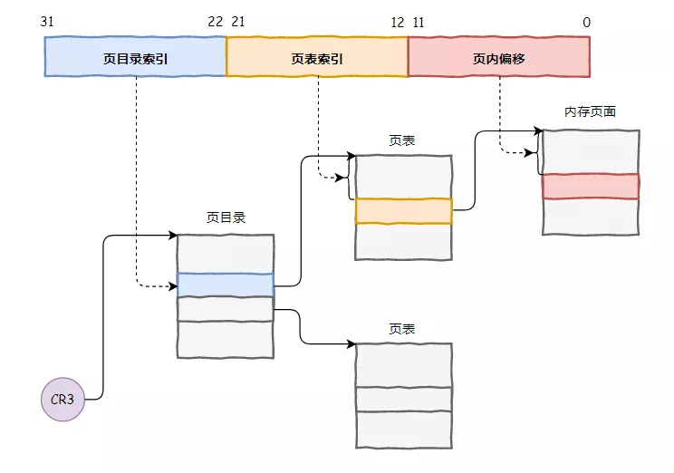
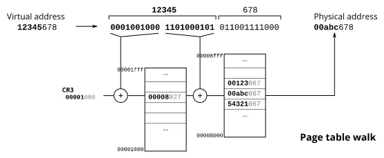
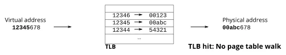
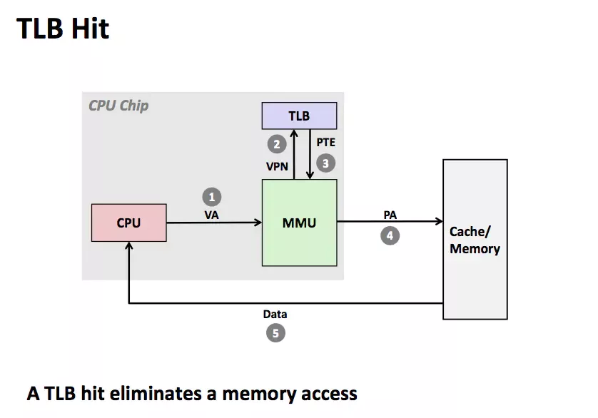
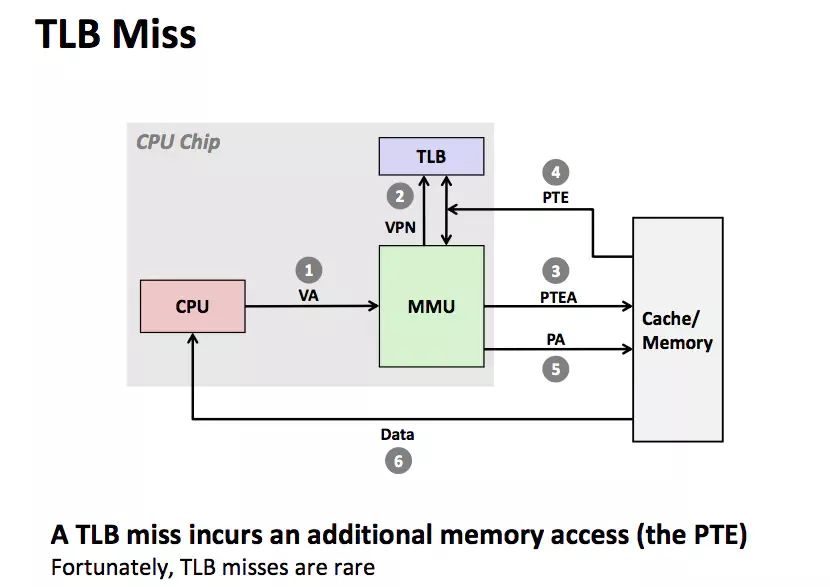
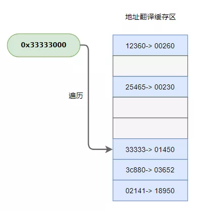
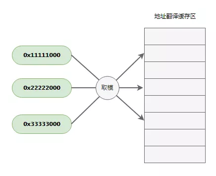
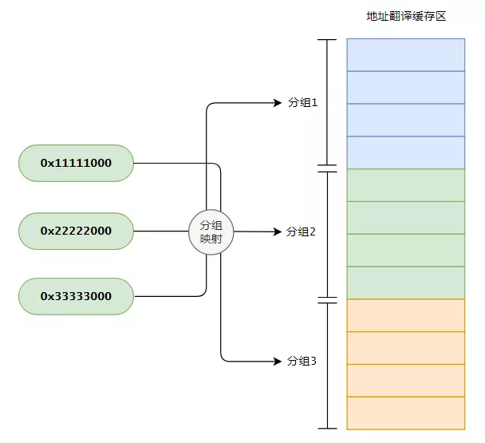

Hi，我是CPU一号车间的阿Q，还记得我吗，真是好久不见了～

我所在的CPU是一个八核CPU，就有八个工作车间，那运行起来速度杠杆的～

## **虚拟地址翻译**

一大早，我们一号车间MMU（内存管理单元）部门的小黑就来到领导办公室，恰好我也在。

“领导，听说您同意了阿Q他们的方案，给每个车间都划拨了缓存建设预算？”

“你这小子，消息还挺灵通的。没错，内存那家伙实在太慢了，加了缓存后，不用每次都从内存读取数据，能让咱们的性能提升不少”，领导说到。

“那我们MMU部门也要申请一笔经费”，小黑说到。

领导眉头一紧，问道：“你们要申请经费干什么？”

“我们也要建设缓存”

“你们MMU部门做地址翻译工作，要缓存做什么，怕不是看领导给我们拨了款，眼红了吧？”，我在一旁说到。

小黑转过身来，看着我说道：“说我眼红，我倒是问你，你知道虚拟地址翻译的过程吗？”

这可难不倒我，以前就没少听他说过，“怎么不知道？以32位的虚拟地址为例，一个32位的虚拟地址分为三部分，分别是页目录索引、页表索引、页内偏移。翻译的时候，从CR3寄存器中取出页目录地址，根据页目录索引找到页表，再根据页表索引找到物理内存页面，最后根据页内偏移，完成寻址。我说的对吧？”

“嘿，你小子不错啊，记性挺好”，小黑有点不敢相信，随后又问到：“既然你知道，那我再问你，这读取一次数据，需要访问几次内存？”

我思考了一下，开始算了起来。从页目录表中读取一次，从页表中再读取一次，最后访问页面内数据再读取一次，总共就是三次。

“需要访问三次内存！”，我回答到。

小黑点了点头说道：“没错，你知道的，内存那家伙本来就慢，这每读写一个数据，都要访问内存三次，这谁顶得住啊？”

说的是啊，内存那家伙慢我是知道的，但读写一次就要折腾三回，我倒是没想过。

“就这还是32位地址的情况，我还没算64位下变成了4级页表呢，那访问内存的次数就更多了！”

“好在咱们马上就要建设缓存设施了，也不用每次都从内存读取数据，要是缓存能找到，就不用读取内存了嘛！”

“可是查页目录和页表还是得要两次啊”，小黑说到。

“要是能把地址翻译的结果也缓存起来就好，就不用每次都从内存查了”，我陷入了思考。

“你看，你跟我想到一会儿去了，所以我才向领导申请，咱们MMU部门也加上缓存，这样地址翻译变快了，咱们整个车间工作效率才高嘛！”

这时，领导站了起来，说道：“唉～格局要打开，光你们一号车间提高不行，得发动全厂八个车间一起。小黑，经费的问题不用担心，这事由你牵头，把其他几个车间的MMU部门负责人召集起来开个会，把你说的方案落地下去”

“没问题！”，领导这么一说，小黑高兴坏了。

## **地址翻译缓存**

回去的路上，我又忍不住好奇，向小黑打听起来：“你们这翻译地址用的缓存，准备怎么个弄法？”

“我还没想的很成熟，只有个大概的方案”

“快给我透露一下”

“好吧，告诉你也无妨！我举个例子吧，假设要翻译的虚拟地址是`0x12345678`，这是一个32位的地址，前面的20位是`0x12345000`，经过两次查表后，定位到真实的物理页面`0x00abc000`，最后再加上页内偏移，翻译结果就是`0x00abc678`”

“地址翻译完成后，将虚拟页编号`0x12345`和物理页编号`0x00abc`的映射关系记录起来放到缓存中”

“在进行地址翻译的时候，先去这个缓存里瞅一瞅，看看有没有记录过，如果有就直接用之前记录的，找不到再去内存页表中找。跟局部性原理类似，翻译过的地址，在接下来一段时间内再次用到的可能性很大，所以这个缓存是很有必要的！”，小黑非常自信的说到。

“听上去很不错，期待早点上马啊！”

## **TLB**

过了几天，我打算去MMU部门转转，想看看他们的缓存搞的咋样了。

一进门，只见小黑和其他几个车间的MMU部门负责人正在紧张的讨论着，一旁的画板上画了不少条条框框的图。

“小黑老哥，你们这是在做什么呢？”

“我们正在研究这个翻译记录缓存项的存储方式呢！你来的正好，我们讨论了半天也没什么好的思路，快来帮我出出主意”

我有些好奇，问道：“什么问题把你们都难倒了？”

“就是虚拟地址翻译的结果，我们不知道怎么存了！”

“这有什么好纠结的，缓存空间就那么大，一个翻译结果就是一条记录，一条一条的存呗”

二号车间MMU负责人连连挥手，“没你想的这么简单，按照你这种存法，那在翻译地址的时候，怎么查找？难道要全部扫描一遍？”

我愣了一下，“啊这，我倒是没想这么多···不过缓存空间也不大，存不了太多翻译结果，全部扫描也还好吧？”

“那可不行，咱们CPU的目标就是要把性能优化到极致，这种方案上了，领导还不得骂死我”，小黑说到。

我想了想，“有了，给虚拟页编号取模，每个虚拟页的翻译记录只能存在缓存中固定的位置，这样不用全部扫描，一次就能定位，是不是很赞？”

小黑摇了摇头：“这个方案我们刚才也讨论过了，缓存空间有限，会导致大量的虚拟页取模后映射到同一个存储位置，就会经常冲突，也不是个好办法！”

“看来还真有点麻烦啊”，我也不自觉的皱起了眉头，陷入了思考之中。

“可不是嘛，所以我们才头疼啊”

空气突然安静，所有人都在低头沉思。

“哎，有了！”，一个念头在我脑中闪现。

“什么办法？快说说看”

“分组连接！”

“分组连接？”，众人问到。

“没错！把前面这两种方案结合一下。可以把缓存存储空间划分很多个组，全部遍历太慢，直接取模映射又容易冲突，那如果映射的结果不是一个固定的位置，而是一个分组呢？”

“听上去不错唉，这样既降低了冲突，遍历也只需在分组区间里进行了，工作量大大降低了，真是个好办法”

小黑和大家都一致同意了我的想法。

“那怎么分组呢，多少项为一组呢？”，有人问到。

“嗯，这个我也说不好，得做实验验证，2、4、8、16都可以试试，实践出真知嘛！”

“好，没问题，咱们下来测试下”

“我还有一个问题，你们的这个缓存项什么时候更新呢？咱们在保护模式下，不同的进程中，同一个虚拟页翻译后对应的物理页面可是不同的，你们可不要用了错误的缓存，那可就出大乱子了！”

“嗨，这还用你说，在场的各位干这份工作时间都不短了，这一点我们比你更清楚。进程切换的时候，会把新进程的页目录表基地址写到CR3寄存器中，那时候我们就会把缓存中的数据全部清掉啦！”，小黑胸有成竹的说到。

“也不用全部清掉吧，像有些内核页面，是所有进程共享的，就可以保留啊”

小黑点了点头，“有道理，看来得给地址翻译记录增加一个标记，用来标记是不是全局有效”

一个月后，八个车间MMU部门的缓存全部建设完成，当天便投入使用，咱们这个CPU的运行效率一下突飞猛进，这缓存的威力可真是太大了。

为了跟我们的一二级缓存相区分，小黑还给他们的地址翻译缓存取了一个响亮的名字：**TLB——翻译后备缓冲区**。

【完】