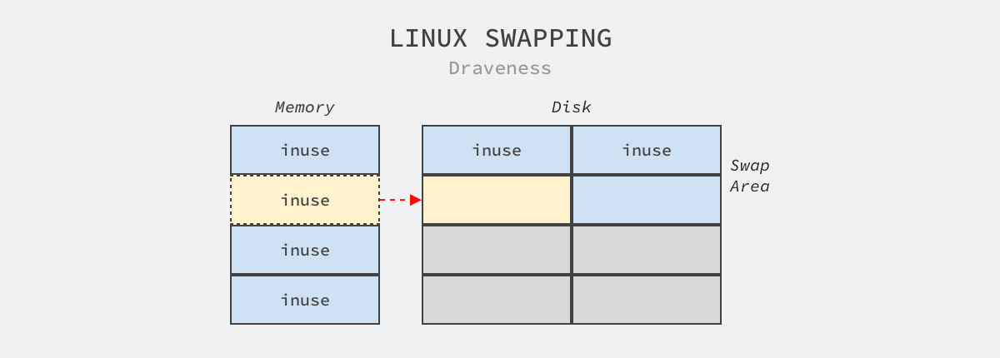
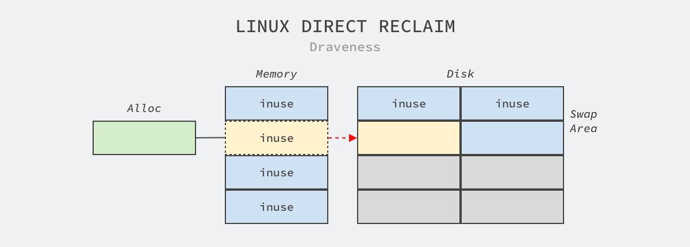
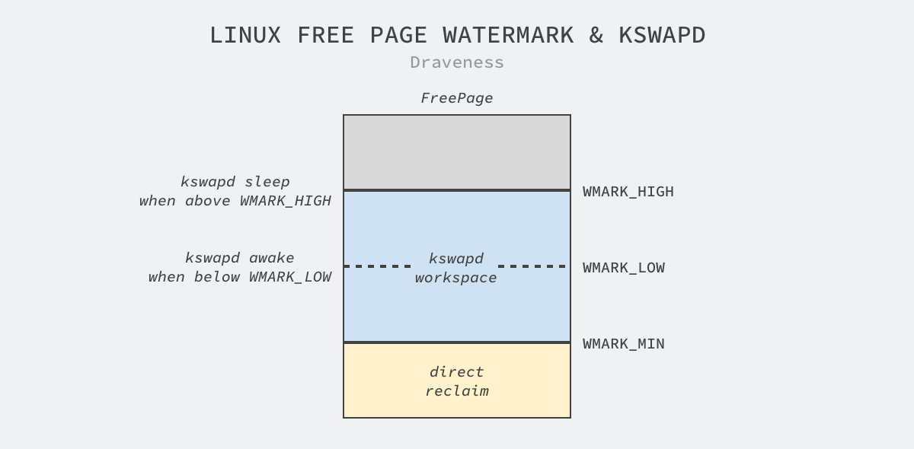
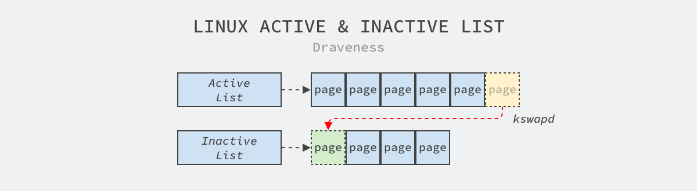

# 为什么 Linux 需要 Swapping

2020-11-10 [为什么这么设计](https://draveness.me/tags/为什么这么设计) [系统设计](https://draveness.me/tags/系统设计) [Swap](https://draveness.me/tags/swap) [内存](https://draveness.me/tags/内存) [Linux](https://draveness.me/tags/linux)

> 为什么这么设计（Why’s THE Design）是一系列关于计算机领域中程序设计决策的文章，我们在这个系列的每一篇文章中都会提出一个具体的问题并从不同的角度讨论这种设计的优缺点、对具体实现造成的影响。如果你有想要了解的问题，可以在文章下面留言。

对 Linux 稍有了解的人都知道，Linux 会将物理的随机读取内存（Random Access Memory、RAM）按页分割成 4KB 大小的内存块，而今天要介绍的 *Swapping* 机制就与内存息息相关，它是操作系统将物理内存页中的内容拷贝到硬盘上交换空间（Swap Space）以释放内存的过程，物理内存和硬盘上的交换分区组成了操作系统上可用的虚拟内存，而这些交换空间都是系统管理员预先配置好的[1](https://draveness.me/whys-the-design-linux-swapping/#fn:1)。



**图 1 - Linux Swapping**

正是因为 Linux 上的所有进程都会通过虚拟内存这一层抽象间接与物理内存打交道，而 Swapping 也充分利用了该特性，它能够让应用程序看到操作系统内存充足的假象，然而并不知道它使用的部分虚拟内存其实在磁盘上，因为内存和磁盘的读写速度上的巨大差异，这部分虚拟内存的读写非常缓慢，我们在 [为什么 CPU 访问硬盘很慢](https://draveness.me/whys-the-design-cpu-and-disk/) 曾经介绍过：

> 在 SSD 中随机访问 4KB 数据所需要的时间是访问主存的 1,500 倍，机械磁盘的寻道时间是访问主存的 100,000 倍[2](https://draveness.me/whys-the-design-linux-swapping/#fn:2)

如此巨大的性能差异使得触发 Swapping 的进程可能会遇到性能损失，同一个页面的频繁换入换出会导致极其明显的性能抖动，如果没有相应的背景知识，遇到类似的问题可能会很难查到根本原因，例如 MySQL 在错误配置 NUMA 时就会出现内存页频繁换入换出，影响服务质量的问题。

Linux 提供了两种不同的方法启用 Swapping，分别是 Swap 分区（Swap Partition）和 Swap 文件（Swapfile）：

- Swap 分区是硬盘上的独立区域，该区域只会用于交换分区，其他的文件不能存储在该区域上，我们可以使用 `swapon -s` 命令查看当前系统上的交换分区；
- Swap 文件是文件系统中的特殊文件，它与文件系统中的其他文件也没有太多的区别；

Swap 分区的大小是需要系统管理员手动设定的，然而不同的场景最好设置不同交换分区大小，例如：桌面系统的交换分区大小可以是系统内存的两倍，这可以让我们同时运行更多的应用程序；服务器的交换分区应该关闭或者使用少量的交换分区，不过一旦启用交换分区，就应该引入监控监控应用程序的性能。

我们到现在已经对 Linux 上的 Swapping 有了一定的了解，接下来回到这篇文章想要讨论的问题 — 『为什么 Linux 需要 Swapping』，我们将从以下两个方面介绍 Swapping 解决的问题、触发入口和执行路径：

- Swapping 可以直接将进程中使用相对较少的页面换出内存，立刻给正在执行的进程分配内存；
- Swapping 可以将进程中的闲置页面换出内存，为其他进程未来使用内存做好准备；

## 内存不足

当系统需要的内存超过了可用的物理内存时，内核会将内存中不常使用的内存页交换到磁盘上为当前进程让出内存，保证正在执行的进程的可用性，这个内存回收的过程是强制的直接内存回收（Direct Page Reclaim）。



**图 2 - 直接内存回收**

直接内存回收是在 Linux 调用 [`__alloc_pages_nodemask`](https://elixir.bootlin.com/linux/v5.9.6/source/mm/page_alloc.c#L4865) 申请新内存页时触发的，该函数会先在空闲页列表中查找是否有可用的页面，如果不存在可用页面，就会进入 [`__alloc_pages_slowpath`](https://elixir.bootlin.com/linux/v5.9.6/source/mm/page_alloc.c#L4552) 函数分配内存页，与从空闲列表中直接查找内存也相比，该函数会通过以下步骤分配内存：

```go
static inline struct page * __alloc_pages_slowpath(gfp_t gfp_mask, unsigned int order, struct alloc_context *ac) {
    ...
    if (alloc_flags & ALLOC_KSWAPD)
        wake_all_kswapds(order, gfp_mask, ac);

    page = get_page_from_freelist(gfp_mask, order, alloc_flags, ac);
    if (page) goto got_pg;

    if (can_direct_reclaim && (costly_order || (order > 0 && ac->migratetype != MIGRATE_MOVABLE)) && !gfp_pfmemalloc_allowed(gfp_mask)) {
        page = __alloc_pages_direct_compact(gfp_mask, order, alloc_flags, ac, INIT_COMPACT_PRIORITY, &compact_result);
        if (page) goto got_pg;
        ...
    }

 retry:
    page = __alloc_pages_direct_reclaim(gfp_mask, order, alloc_flags, ac, &did_some_progress);
    page = __alloc_pages_direct_compact(gfp_mask, order, alloc_flags, ac, compact_priority, &compact_result);
    page = __alloc_pages_may_oom(gfp_mask, order, ac, &did_some_progress);
 got_pg:
    return page;
}
```

Go

1. 唤醒 `kswapd` 线程在后台回收内存并尝试调用 [`get_page_from_freelist`](https://elixir.bootlin.com/linux/v5.9.6/source/mm/page_alloc.c#L3729) 从空闲列表中快速获取内存页；
2. 昂贵的内存申请会先调用 [`__alloc_pages_direct_compact`](https://elixir.bootlin.com/linux/v5.9.6/source/mm/page_alloc.c#L4037) 尝试压缩内存页，并在压缩后的内存中调用 [`get_page_from_freelist`](https://elixir.bootlin.com/linux/v5.9.6/source/mm/page_alloc.c#L3729) 查找空闲的内存页；
3. 调用 [`__alloc_pages_direct_reclaim`](https://elixir.bootlin.com/linux/v5.9.6/source/mm/page_alloc.c#L4288) 直接回收并分配新的内存页；
4. 再次调用 [`__alloc_pages_direct_compact`](https://elixir.bootlin.com/linux/v5.9.6/source/mm/page_alloc.c#L4037) 尝试压缩内存并获取空闲内存页；
5. 调用 [`__alloc_pages_may_oom`](https://elixir.bootlin.com/linux/v5.9.6/source/mm/page_alloc.c#L3941) 分配内存，如果内存分配失败会触发内存不足警告随机杀死操作系统上的几个进程；

虽然获取内存页的步骤已经经过了大量的删减，但是其中展示了 Linux 在内存也不足时获取内存的几个常见方法：内存压缩、直接回收以及触发内存不足错误杀掉部分进程。

## 内存闲置

应用程序在启动阶段使用的大量内存在启动后往往都不会使用，通过后台运行的守护进程，我们可以将这部分只使用一次的内存交换到磁盘上为其他内存的申请预留空间。kswapd 是 Linux 负责页面置换（Page replacement）的守护进程，它也是负责交换闲置内存的主要进程，它会在空闲内存低于一定水位时，回收内存页中的空闲内存保证系统中的其他进程可以尽快获得申请的内存，如下图所示：



**图 3 - Linux 空闲页面水位**

当空闲页面小于 `WMARK_LOW` 时，kswapd 进程才会开始工作，它会将内存页中交换到磁盘上直到空闲页面的水位回到 `WMARK_HIGH`，不过当空闲页面的水位低于 `WMARK_MIN` 时会触发上一节提到的内存直接回收，而水位高于 `WMARK_HIGH` 则意味着空闲内存充足，不需要进行回收。

Linux 操作系统采用最近最少使用（Least Recently Used、LRU）算法置换内存中的页面，系统中的每个区都会在内存中持有 `active_list` 和 `inactive_list` 两种链表，其中前者包含活跃的内存页，后者中存储的内存页都是回收的候选页面，除此之外，Linux 还会在将 [`lru_list`](https://elixir.bootlin.com/linux/v5.9.6/source/include/linux/mmzone.h#L246) 根据内存页的特性分成如下几种：

```c
enum lru_list {
	LRU_INACTIVE_ANON = LRU_BASE,
	LRU_ACTIVE_ANON = LRU_BASE + LRU_ACTIVE,
	LRU_INACTIVE_FILE = LRU_BASE + LRU_FILE,
	LRU_ACTIVE_FILE = LRU_BASE + LRU_FILE + LRU_ACTIVE,
	LRU_UNEVICTABLE,
	NR_LRU_LISTS
};
```

C

其中包含 `ANON` 的表示匿名内存页，这些内存页存储了与文件无关的进程堆栈等内容，而包含 `FILE` 的表示与文件相关的内存，也就是程序文件或者数据对应的内存，而最后的 `LRU_UNEVICTABLE` 表示禁止回收的内存页。



**图 4 - 活跃链表和不活跃链表**

每当内存页被访问时，Linux 都会将被访问的内存页移到链表的头部，所以在活跃链表末尾的是链表中『最老的』内存页，守护进程 kswapd 的作用是平衡两个链表的长度，将活跃链表末尾的内存页移至不活跃链表的队首等待回收，而函数 [`shrink_zones`](https://elixir.bootlin.com/linux/v5.9.6/source/mm/vmscan.c#L2896) 会负责回收 LRU 链表中的不活跃内存页。

## 总结

很多人认为当系统内存不足时应该立即触发内存不足（Out of memory、OOM）并杀掉进程，但是 Swapping 其实为系统管理员提供了另外一种选择，利用磁盘的交换空间避免程序被直接退出，以**降低服务质量的代价换取服务的部分可用性**。Linux 中的 Swapping 机制主要是为内存不足和内存闲置两种常见的情况存在的

- Swapping 可以直接将进程中使用相对较少的页面换出内存：当系统需要的内存超过了可用的物理内存时，内核会将内存中不常使用的内存页交换到磁盘上为当前进程让出内存，保证正在执行的进程的可用性；
- Swapping 可以将进程中的闲置页面换出内存：应用程序在启动阶段使用的大量内存在启动后往往都不会使用，通过后台运行的守护进程，我们可以将这部分只使用一次的内存交换到磁盘上为其他内存申请预留空间；

关于是否应该开启 Swapping 的讨论其实非常多，我们在今天也不应该一刀切地认为必须开启或者禁用 Swapping，我们仍然需要分析场景并利用好 Linux 为我们提供的这一机制，例如 Kubernetes 要求禁用 Swapping，我们就应该遵循社区提出的建议，在部署 Kubernetes 的机器上关闭这一特性[3](https://draveness.me/whys-the-design-linux-swapping/#fn:3)。到最后，我们还是来看一些比较开放的相关问题，有兴趣的读者可以仔细思考一下下面的问题：

- Linux 提供了哪些参数来控制 Swapping 的行为？
- 通过降低服务质量的代价换取部分可用在哪些场景下是可取的？

> 如果对文章中的内容有疑问或者想要了解更多软件工程上一些设计决策背后的原因，可以在博客下面留言，作者会及时回复本文相关的疑问并选择其中合适的主题作为后续的内容。

## 推荐阅读

- [为什么 Linux 需要虚拟内存](https://draveness.me/whys-the-design-os-virtual-memory/)
- [为什么 CPU 访问硬盘很慢](https://draveness.me/whys-the-design-cpu-and-disk/)

## 参考资料

- Kubelet/Kubernetes should work with Swap Enabled #53533 https://github.com/kubernetes/kubernetes/issues/53533
- Linux Performance: Why You Should Almost Always Add Swap Space https://haydenjames.io/linux-performance-almost-always-add-swap-space/
- Do we really need swap on modern systems? https://www.redhat.com/en/blog/do-we-really-need-swap-modern-systems

------

1. All about Linux swap space https://www.linux.com/news/all-about-linux-swap-space/ [↩︎](https://draveness.me/whys-the-design-linux-swapping/#fnref:1)
2. 为什么 CPU 访问硬盘很慢 https://draveness.me/whys-the-design-cpu-and-disk/ [↩︎](https://draveness.me/whys-the-design-linux-swapping/#fnref:2)
3. Why disable swap on kubernetes https://serverfault.com/questions/881517/why-disable-swap-on-kubernetes [↩︎](https://draveness.me/whys-the-design-linux-swapping/#fnref:3)