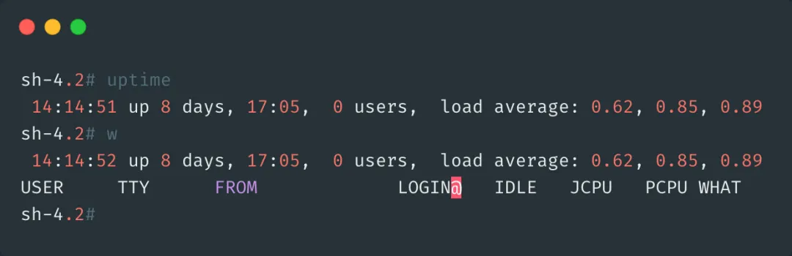
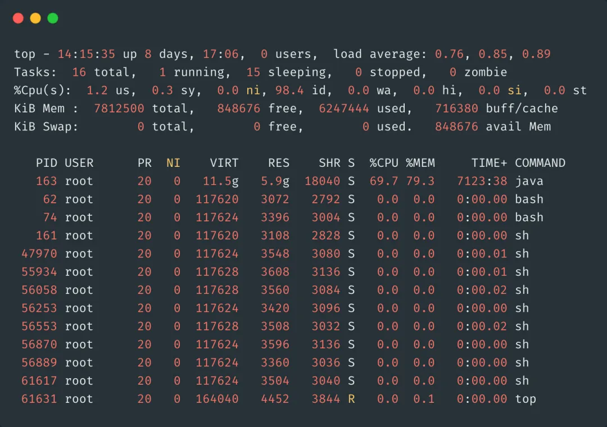
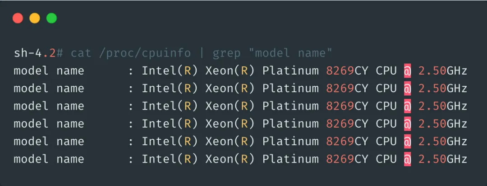
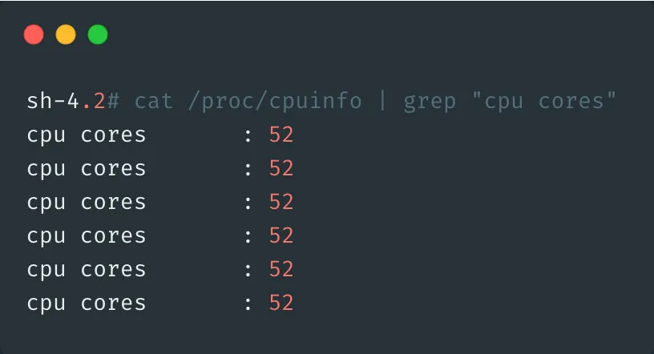
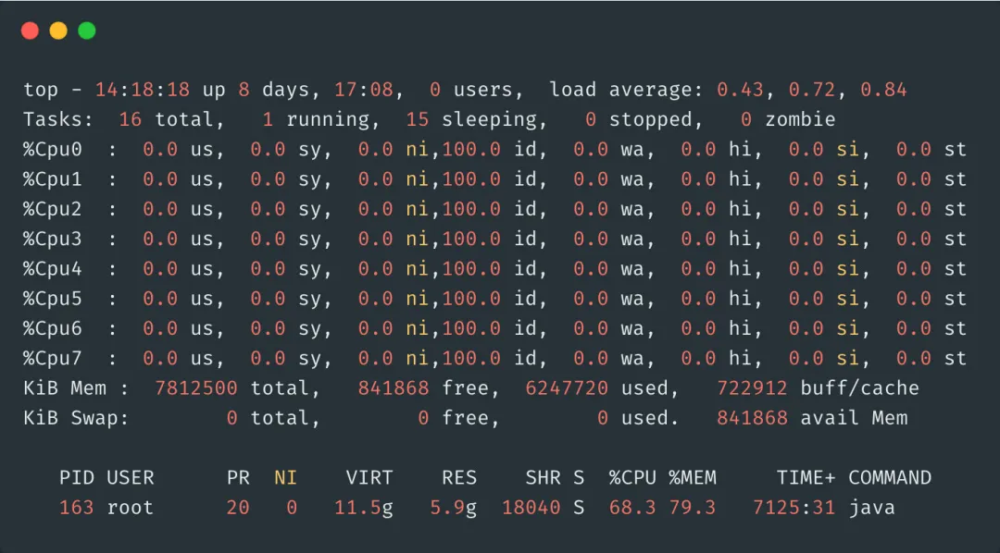
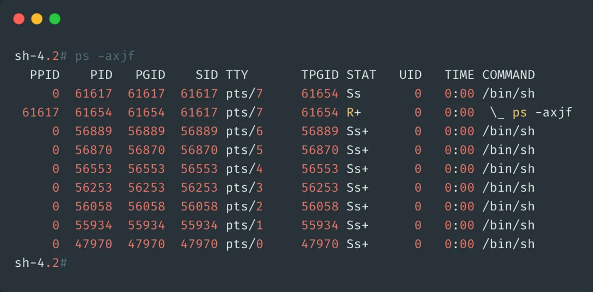
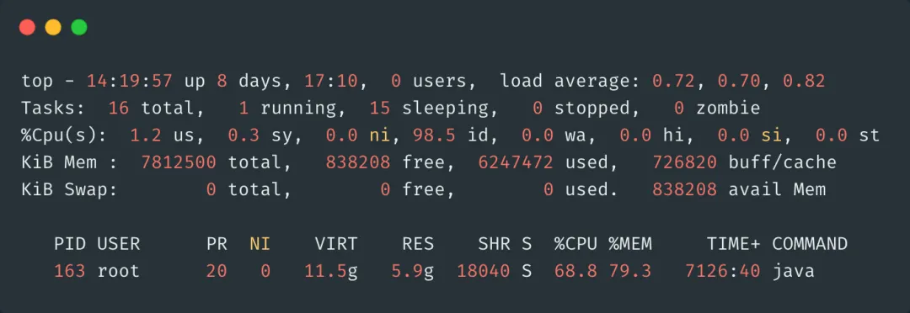
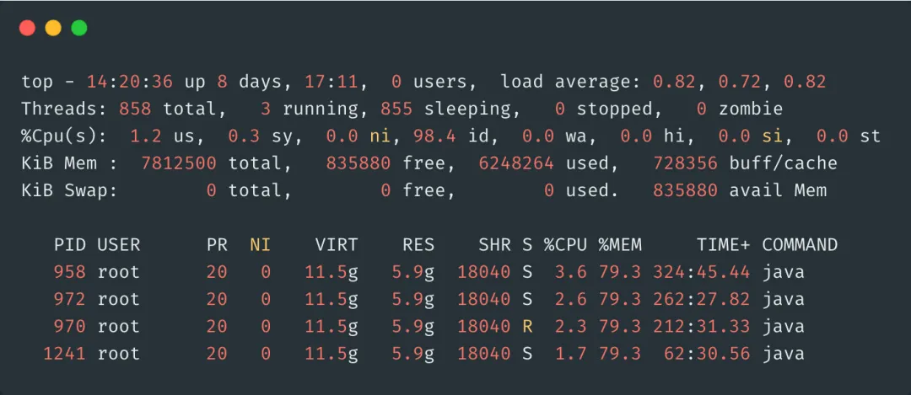
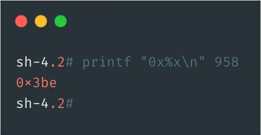
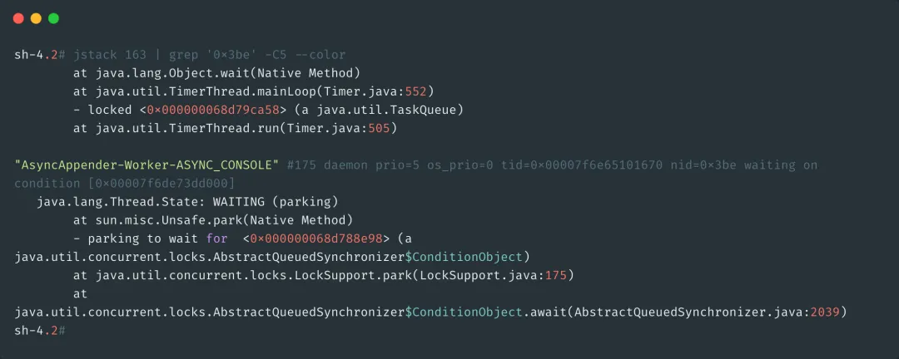

**1.CPU负载和CPU利用率的区别是什么？**

首先，我们可以通过`uptime`，`w`或者`top`命令看到CPU的平均负载。

**Load Average** ：负载的3个数字，比如上图的4.86，5.28，5.00，分别代表系统在过去的1分钟，5分钟，15分钟内的系统平均负载。他代表的是**当前系统正在运行的和处于等待运行的进程数之和**。也指的是处于**可运行状态**和**不可中断状态**的平均进程数。

如果单核CPU的话，负载达到1就代表CPU已经达到满负荷的状态了，超过1，后面的进行就需要排队等待处理了。

如果是是多核多CPU的话，假设现在服务器是2个CPU，每个CPU2个核，那么总负载不超过4都没什么问题。

怎么查看CPU有多少核呢？

通过命令`cat /proc/cpuinfo | grep "model name"`查看CPU的情况。

通过`cat /proc/cpuinfo | grep "cpu cores"`查看CPU的核数

**CPU 利用率**：和负载不同，CPU利用率指的是当前**正在运行**的进程实时占用CPU的百分比，他是对一段时间内CPU使用状况的统计。

我举个栗子🌰：

假设你们公司厕所有1个坑位，有一个人占了坑位，这时候负载就是1，如果还有一个人在排队，那么负载就是2。

如果在1个小时内，A上厕所花了10分钟，B上厕所花了20分钟，剩下30分钟厕所都没人使用，那么这一个小时内利用率就是50%。

### 2.那如果CPU负载很高，利用率却很低该怎么办？

CPU负载很高，利用率却很低，说明处于等待状态的任务很多，负载越高，代表可能很多僵死的进程。通常这种情况是IO密集型的任务，大量请求在请求相同的IO，导致任务队列堆积。

同样，可以先通过`top`命令观察(截图只是示意，不代表真实情况)，假设发现现在确实是高负载低使用率。

然后，再通过命令`ps -axjf`查看是否存在状态为`D+`状态的进程，这个状态指的就是不可中断的睡眠状态的进程。处于这个状态的进程无法终止，也无法自行退出，只能通过恢复其依赖的资源或者重启系统来解决。(对不起，我截不到D+的状态)

### 3.那如果负载很低，利用率却很高呢？

如果你的公司只有一个厕所，外面没人排队，却有一个人在里面上了大半个小时，这说明什么？

两种可能：他没带纸，或者一些奇怪的事情发生了？

这表示CPU的任务并不多，但是任务执行的时间很长，大概率就是你写的代码本身有问题，通常是计算密集型任务，生成了大量耗时短的计算任务。

怎么排查？直接`top`命令找到使用率最高的任务，定位到去看看就行了。如果代码没有问题，那么过段时间CPU使用率就会下降的。

### 4.那如果CPU使用率达到100%呢？怎么排查？

1. 通过`top`找到占用率高的进程。

1. 通过`top -Hp pid`找到占用CPU高的线程ID。这里找到958的线程ID

1. 再把线程ID转化为16进制，`printf "0x%x\n" 958`，得到线程ID`0x3be`

1. 通过命令`jstack 163 | grep '0x3be' -C5 --color` 或者 `jstack 163|vim +/0x3be -` 找到有问题的代码

