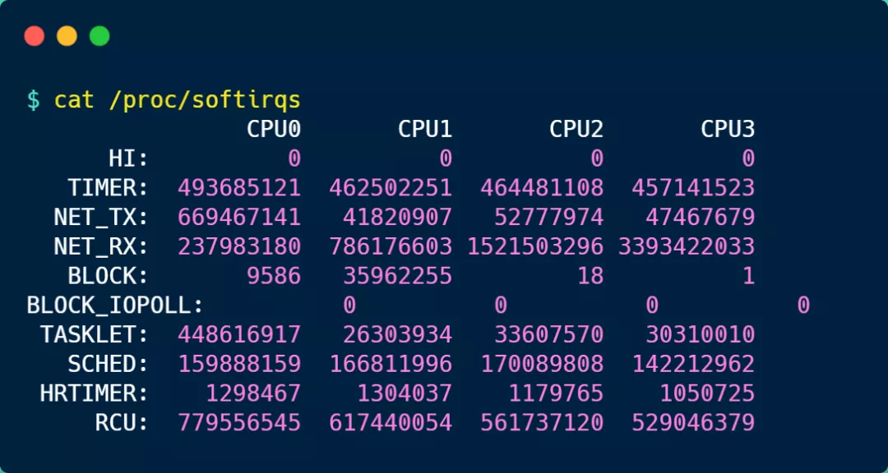
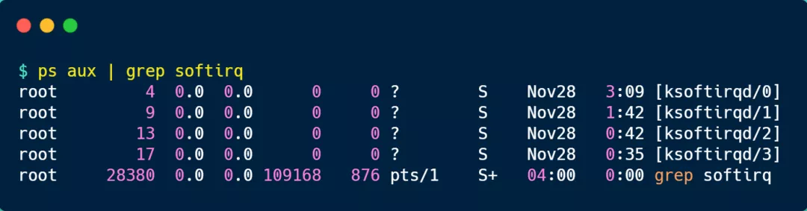
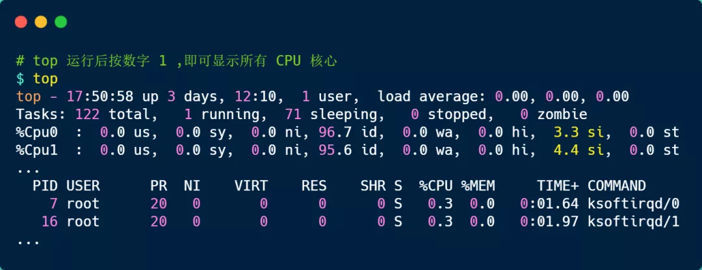
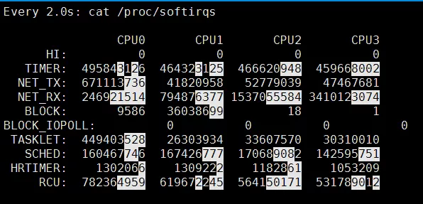
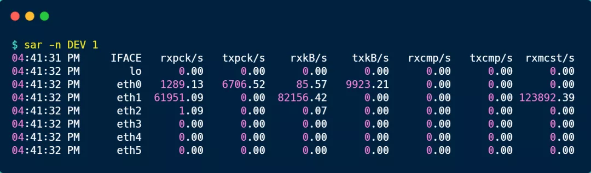
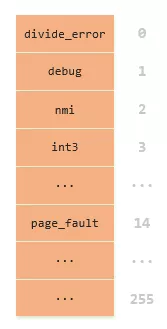
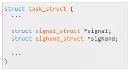
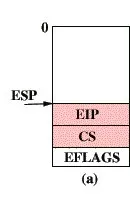

------

### 中断是什么？

先来看看什么是中断？在计算机中，中断是系统用来响应硬件设备请求的一种机制，操作系统收到硬件的中断请求，会打断正在执行的进程，然后调用内核中的中断处理程序来响应请求。

这样的解释可能过于学术了，容易云里雾里，我就举个生活中取外卖的例子。

小林中午搬完砖，肚子饿了，点了份白切鸡外卖，这次我带闪了，没有被某团大数据大熟。虽然平台上会显示配送进度，但是我也不能一直傻傻地盯着呀，时间很宝贵，当然得去干别的事情，等外卖到了配送员会通过「电话」通知我，电话响了，我就会停下手中地事情，去拿外卖。

这里的打电话，其实就是对应计算机里的中断，没接到电话的时候，我可以做其他的事情，只有接到了电话，也就是发生中断，我才会停下当前的事情，去进行另一个事情，也就是拿外卖。

从这个例子，我们可以知道，中断是一种异步的事件处理机制，可以提高系统的并发处理能力。

操作系统收到了中断请求，会打断其他进程的运行，所以**中断请求的响应程序，也就是中断处理程序，要尽可能快的执行完，这样可以减少对正常进程运行调度地影响。**

而且，中断处理程序在响应中断时，可能还会「临时关闭中断」，这意味着，如果当前中断处理程序没有执行完之前，系统中其他的中断请求都无法被响应，也就说中断有可能会丢失，所以中断处理程序要短且快。

还是回到外卖的例子，小林到了晚上又点起了外卖，这次为了犒劳自己，共点了两份外卖，一份小龙虾和一份奶茶，并且是由不同地配送员来配送，那么问题来了，当第一份外卖送到时，配送员给我打了长长的电话，说了一些杂七杂八的事情，比如给个好评等等，但如果这时另一位配送员也想给我打电话。

很明显，这时第二位配送员因为我在通话中（相当于关闭了中断响应），自然就无法打通我的电话，他可能尝试了几次后就走掉了（相当于丢失了一次中断）。

------

### 什么是软中断？

前面我们也提到了，中断请求的处理程序应该要短且快，这样才能减少对正常进程运行调度地影响，而且中断处理程序可能会暂时关闭中断，这时如果中断处理程序执行时间过长，可能在还未执行完中断处理程序前，会丢失当前其他设备的中断请求。

那 Linux 系统**为了解决中断处理程序执行过长和中断丢失的问题，将中断过程分成了两个阶段，分别是「上半部和下半部分」**。

- **上半部用来快速处理中断**，一般会暂时关闭中断请求，主要负责处理跟硬件紧密相关或者时间敏感的事情。
- **下半部用来延迟处理上半部未完成的工作**，一般以「内核线程」的方式运行。

前面的外卖例子，由于第一个配送员长时间跟我通话，则导致第二位配送员无法拨通我的电话，其实当我接到第一位配送员的电话，可以告诉配送员说我现在下楼，剩下的事情，等我们见面再说（上半部），然后就可以挂断电话，到楼下后，在拿外卖，以及跟配送员说其他的事情（下半部）。

这样，第一位配送员就不会占用我手机太多时间，当第二位配送员正好过来时，会有很大几率拨通我的电话。

再举一个计算机中的例子，常见的网卡接收网络包的例子。

网卡收到网络包后，会通过**硬件中断**通知内核有新的数据到了，于是内核就会调用对应的中断处理程序来响应该事件，这个事件的处理也是会分成上半部和下半部。

上部分要做到快速处理，所以只要把网卡的数据读到内存中，然后更新一下硬件寄存器的状态，比如把状态更新为表示数据已经读到内存中的状态值。

接着，内核会触发一个**软中断**，把一些处理比较耗时且复杂的事情，交给「软中断处理程序」去做，也就是中断的下半部，其主要是需要从内存中找到网络数据，再按照网络协议栈，对网络数据进行逐层解析和处理，最后把数据送给应用程序。

所以，中断处理程序的上部分和下半部可以理解为：

- **上半部直接处理硬件请求，也就是硬中断**，主要是负责耗时短的工作，特点是快速执行；
- **下半部是由内核触发，也就说软中断**，主要是负责上半部未完成的工作，通常都是耗时比较长的事情，特点是延迟执行；

还有一个区别，硬中断（上半部）是会打断 CPU 正在执行的任务，然后立即执行中断处理程序，而软中断（下半部）是以内核线程的方式执行，并且每一个 CPU 都对应一个软中断内核线程，名字通常为「ksoftirqd/CPU 编号」，比如 0 号 CPU 对应的软中断内核线程的名字是 `ksoftirqd/0`

不过，软中断不只是包括硬件设备中断处理程序的下半部，一些内核自定义事件也属于软中断，比如内核调度等、RCU 锁（内核里常用的一种锁）等。

------

#### 系统里有哪些软中断？

在 Linux 系统里，我们可以通过查看 `/proc/softirqs` 的 内容来知晓「软中断」的运行情况，以及 `/proc/interrupts` 的 内容来知晓「硬中断」的运行情况。

接下来，就来简单的解析下  `/proc/softirqs` 文件的内容，在我服务器上查看到的文件内容如下：

你可以看到，每一个 CPU 都有自己对应的不同类型软中断的**累计运行次数**，有 3 点需要注意下。

第一点，要注意第一列的内容，它是代表着软中断的类型，在我的系统里，软中断包括了 10 个类型，分别对应不同的工作类型，比如 `NET_RX` 表示网络接收中断，`NET_TX` 表示网络发送中断、`TIMER` 表示定时中断、`RCU` 表示 RCU 锁中断、`SCHED` 表示内核调度中断。

第二点，要注意同一种类型的软中断在不同 CPU 的分布情况，正常情况下，同一种中断在不同 CPU 上的累计次数相差不多，比如我的系统里，`NET_RX` 在 CPU0 、CPU1、CPU2、CPU3 上的中断次数基本是同一个数量级，相差不多。

第三点，这些数值是系统运行以来的累计中断次数，数值的大小没什么参考意义，但是系统的**中断次数的变化速率**才是我们要关注的，我们可以使用 `watch -d cat /proc/softirqs` 命令查看中断次数的变化速率。

前面提到过，软中断是以内核线程的方式执行的，我们可以用 `ps` 命令可以查看到，下面这个就是在我的服务器上查到软中断内核线程的结果：

可以发现，内核线程的名字外面都有有中括号，这说明 ps 无法获取它们的命令行参数，所以一般来说，名字在中括号里到，都可以认为是内核线程。

而且，你可以看到有 4 个 `ksoftirqd` 内核线程，这是因为我这台服务器的 CPU 是 4 核心的，每个 CPU 核心都对应着一个内核线程。

------

### 如何定位软中断 CPU 使用率过高的问题？

要想知道当前的系统的软中断情况，我们可以使用 `top` 命令查看，下面是一台服务器上的 top 的数据：

上图中的黄色部分 `si`，就是 CPU 在软中断上的使用率，而且可以发现，每个 CPU 使用率都不高，两个 CPU 的使用率虽然只有 3% 和 4% 左右，但是都是用在软中断上了。

另外，也可以看到 CPU 使用率最高的进程也是软中断 `ksoftirqd`，因此可以认为此时系统的开销主要来源于软中断。

如果要知道是哪种软中断类型导致的，我们可以使用 `watch -d cat /proc/softirqs` 命令查看每个软中断类型的中断次数的变化速率。

一般对于网络 I/O 比较高的 Web 服务器，`NET_RX` 网络接收中断的变化速率相比其他中断类型快很多。

如果发现 `NET_RX` 网络接收中断次数的变化速率过快，接下里就可以使用 `sar -n DEV` 查看网卡的网络包接收速率情况，然后分析是哪个网卡有大量的网络包进来。

接着，在通过 `tcpdump` 抓包，分析这些包的来源，如果是非法的地址，可以考虑加防火墙，如果是正常流量，则要考虑硬件升级等。

------

### 总结

为了避免由于中断处理程序执行时间过长，而影响正常进程的调度，Linux 将中断处理程序分为上半部和下半部：

- 上半部，对应硬中断，由硬件触发中断，用来快速处理中断；
- 下半部，对应软中断，由内核触发中断，用来异步处理上半部未完成的工作；

Linux 中的软中断包括网络收发、定时、调度、RCU 锁等各种类型，可以通过查看 /proc/softirqs 来观察软中断的累计中断次数情况，如果要实时查看中断次数的变化率，可以使用 watch -d cat /proc/softirqs 命令。

每一个 CPU 都有各自的软中断内核线程，我们还可以用 ps 命令来查看内核线程，一般名字在中括号里面到，都认为是内核线程。

如果在 top 命令发现，CPU 在软中断上的使用率比较高，而且 CPU 使用率最高的进程也是软中断 ksoftirqd 的时候，这种一般可以认为系统的开销被软中断占据了。

这时我们就可以分析是哪种软中断类型导致的，一般来说都是因为网络接收软中断导致的，如果是的话，可以用 sar 命令查看是哪个网卡的有大量的网络包接收，再用 tcpdump 抓网络包，做进一步分析该网络包的源头是不是非法地址，如果是就需要考虑防火墙增加规则，如果不是，则考虑硬件升级等。

------

内核和网络设备驱动是通过中断的方式来处理的。当设备上有数据到达的时候，会给CPU的相关引脚上触发一个电压变化，以通知CPU来处理数据。对于网络模块来说，由于处理过程比较复杂和耗时，如果在中断函数中完成所有的处理，将会导致中断处理函数（优先级过高）将过度占据CPU，将导致CPU无法响应其它设备，例如鼠标和键盘的消息。因此Linux中断处理函数是分上半部和下半部的。上半部是只进行最简单的工作，快速处理然后释放CPU，接着CPU就可以允许其它中断进来。剩下将绝大部分的工作都放到下半部中，可以慢慢从容处理。2.4以后的内核版本采用的下半部实现方式是软中断，由ksoftirqd内核线程全权处理。和硬中断不同的是，硬中断是通过给CPU物理引脚施加电压变化，而软中断是通过给内存中的一个变量的二进制值以通知软中断处理程序。

------

**
除0错误**

我是一个线程，出生在Linux帝国，今天我的任务是去执行一段人类用C语言编写的代码。

开始的工作很顺利，一共执行了18次系统调用，对于来往于用户空间与内核空间的那个虫洞我已经轻车熟路，再也不是萌新一枚。

后来，我拿到了一段数学运算的代码，来来往往地奔波于内存与寄存器之间，把我累得够呛，热的满头大汗，电脑风扇都转的飞快给我降温。

没多久，一条除法指令摆在我的面前，我瞟了一眼除数居然是0，一种不好的预感涌上心头。没有办法，硬着头皮也得上啊，准备开始执行这个除法。

突然！眼前闪过一道白光，然后变得漆黑，这不是执行系统调用的虫洞吗？可是我并没有执行系统调用啊，怎么跑到这里来了。

我心里开始犯嘀咕，打算等会问问原来的白胡子老头究竟是怎么回事。

不久，光亮开始出现，来到了一个陌生的地方，白雾茫茫。

继续前行，雾逐渐散去，一座大门出现在我面前，我定睛一看，上面写着：**0:divide_error**。

除法错误？我越发的紧张起来，这是到哪里了？

2

**中断&异常**

“年轻人，欢迎来到内核地址空间”，熟悉的问候语响起，走过来一位白发老头，却不是我在系统调用时见过的那位，拄着一根木棍，挂着一只葫芦，看起来年纪比系统调用那个老头还要大一些。

“敢问老先生，我怎么到这里来了，我并没有执行系统调用啊”，我向老头打听情况。

“这里并不是系统调用的入口，因为你执行了除数为0的除法，触发了异常，所以来到了这里”，老头说完喝了一口葫芦里的酒。

“异常，这又是什么意思？”，今天又听到一个新的名词。

只见老头木棍一挥，大雾完全散去，我这才注意到，这里还有好多大门，它们一个挨着一个，形成了一面门墙。

“老先生，这些都是什么啊，这到底是什么地方？”，我对眼前的景象感到越发的好奇。

“这里是中断描述符表——IDT，是所有中断和异常发生时，你们会来到的地方”，老头用了一堆我不懂的话来回答我。

“中断又是什么？和异常又是什么关系？IDT又是做什么的？”，我向老头发出了灵魂三问。

“中断就是有重要的事情发生，要打断你们线程手头的工作，让出CPU必须去处理”

“什么事情，这么重要？”

“比如说有键盘按键被按下，鼠标被移动或点击，网络中有数据包到来等等情况”。

“那异常呢？”

“异常就是你们这些线程在执行代码指令的时候出现了一些错误的情况，比如做除法的时候除数为0，又比如访问的内存地址错误等这些情况，那遇到这些情况怎么办呢？CPU会发现有问题，强制改变你们的执行流，去处理这些异常”。

“听起来，跟中断差不多嘛！“

“确实差不多，所以它们都用IDT来一起记录嘛！不过实际上差别还是很大的哦。最大的区别在于中断是异步，而异常是同步的！“

“这是为什么？”

“因为中断什么时候来你是不知道的，你是被迫被打断的，而异常是你们执行指令主动造成的”

“那IDT又是做什么的？”

“刚才我不是说发生中断和异常你们就会被打断嘛！那打断后该去那里呢？IDT就是把所有中断和异常发生后要去的地方记录成了一个表，也就是你眼前所看到的这一面门墙了，总共256扇门，你现在触发的是除0错误，该抓紧时间去0号门里去处理异常了！”

3

**信号投递**

拜别老先生，我走进divide_error这扇门，接着又穿过了common_exception和do_divide_error，

越往前走，周遭越发的阴森，直到来到了force_sig_info，我停下了脚步，想找人打听下情况。

正在这时，从force_sig_info里面走出一人，瞧着年纪长我几岁。

“大哥，前面是什么地界，为何这般阴森”，我上前请教。

“前面就是给你所属进程投递信号的地方了，你是准备去投递什么信号？”

“信号，什么信号？”我不太听得懂大哥的话。

“就是你手里的第一个参数，让我看一下。咦，是个SIGFPE信号，你是遇到除数是0的除法了吗？”大哥居然看出了我的来历。

“不错，我确实是因为除了一下0才来到这里的，不知大哥是如何得知的？”

“因为你手里是SIGFPE，这是在数学运算出错时才会给进程发送的信号，而通常情况下都是除法除以0时候发生，所以我才猜中的。”

“大哥，您口中一直所说的信号，到底是个什么意思？”

“这个信号就是Signal，用来告诉进程有事情发生了。比如常用的CTRL＋C进程就是发送SIGINT信号，kill杀进程就是SIGTERM信号，你现在手里的SIGFPE就是表示有数学运算错误。总而言之，这就是个通知而已”

“那这通知发送到了哪里呢？又是什么时候去处理呢？”，我有些好奇。

“这就先不告诉你了，等会你自己去就知道了，快去吧，再见了”，大哥挥手离开。

歇息过后便又起身继续前行，进入force_sig_info后，又先后跨过几个函数来到send_signal，我看到我所属进程的task_struct中有一个专门存放信号的队列，原来信号是放在了这里。

我准备了一个信号对象加入到了进程的信号队列中，大功告成，准备返回。

4

**返回前夕**

很快回到了见到白发老头的地方，我一下难住了，我是通过异常这个虫洞来到这里的，现在我该回哪里去呢？

“年轻人，事情都忙完了？”，老头又一次出现了。

“老先生，嗯，我都忙完了，可是我现在该怎么回去呢？”

“你现在看看你的内核堆栈上面存了什么？”

我低头看了一眼我的内核堆栈，发现上面居然保存了除0指令之后那条指令的地址，这正是我要回去的地方。

“这是什么时候存进去的，我不记得我执行过push保存啊”

“在你刚来到这里的时候就存进去了，确实不是你push进去的，而是当你通过异常这个虫洞进入内核空间时，CPU自动完成的”

“原来如此，我知道我要去哪里了，可是我该怎么打开虫洞回去呢？”

“你看前面，有一条**iret**指令，通过它，你就能开启虫洞之门，回到用户态空间了”，老头向我指了指方向。

“ret指令我倒是经常执行，就是函数返回嘛，这个iret是什么，能有这么强大能力？”

“iret就是interrupt return的意思，专门用于被中断或异常打断的线程处理完毕后返回用户空间使用的。”

“明白了，感谢老先生，我就先告辞了，下次再见”，再次向老头拜别，准备回到我原来的地方，来这里太久了，都有点想念了。

“等一下，少年，你现在还不能回去”，老头拦下了我。

“不能回去？为什么？”

“回去之前还有件事要去处理哦！”

“到底是什么事情啊？”

“你所在的进程有信号来了，需要先去处理！”

“纳尼？那信号是我放的啊？”，我回头一看，老先生竟然已经走远。

“别走啊，老先生请留步......”

未完待续·······

**彩蛋**

就在我准备起身去处理信号的时候，一道黑影从我眼前掠过，我抬头一看，IDT门墙的4号门有过丝丝晃动，仔细一瞧，这门上的地址和我来时所见似有不同······

欲知后事如何，请关注后续精彩......