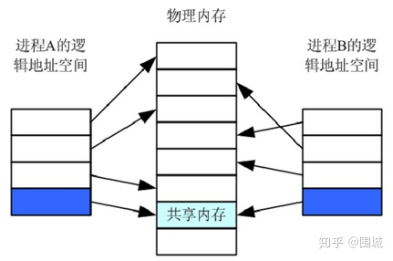

共享内存指 (shared memory)在多处理器的计算机系统中，可以被不同中央处理器（CPU）访问的大容量内存。由于多个CPU需要快速访问存储器，这样就要对存储器进行缓存（Cache）。任何一个缓存的数据被更新后，由于其他处理器也可能要存取，共享内存就需要立即更新，否则不同的处理器可能用到不同的数据。共享内存是 Unix下的多进程之间的通信方法 ,这种方法通常用于一个程序的多进程间通信，实际上多个程序间也可以通过共享内存来传递信息。
**1.共享内存概述**
共享内存是进程间通信中最简单的方式之一。共享内存允许两个或更多进程访问同一块内存，就如同 malloc() 函数向不同进程返回了指向同一个物理内存区域的指针。当一个进程改变了这块地址中的内容的时候，其它进程都会察觉到这个更改。




上图描述的内容一样，共享内存实际上就是进程通过调用shmget（Shared Memory GET 获取共享内存）来分配一个共享内存块，然后每个进程通过shmat（Shared Memory Attach 绑定到共享内存块），将进程的[逻辑虚拟地址空间](https://www.zhihu.com/search?q=逻辑虚拟地址空间&search_source=Entity&hybrid_search_source=Entity&hybrid_search_extra={"sourceType"%3A"article"%2C"sourceId"%3A37808566})指向共享内存块中。 随后需要访问这个共享内存块的进程都必须将这个共享内存绑定到自己的地址空间中去。当一个进程往一个共享内存快中写入了数据，共享这个内存区域的所有进程就可用都看到其中的内容。
**共享内存的特点：**

1. 共享内存是进程间共享数据的一种最快的方法。一个进程向共享的[内存区域](https://www.zhihu.com/search?q=内存区域&search_source=Entity&hybrid_search_source=Entity&hybrid_search_extra={"sourceType"%3A"article"%2C"sourceId"%3A37808566})写入了数据，共享这个内存区域的所有进程就可以立刻看到其中的内容。
2. 使用共享内存要注意的是多个进程之间对一个给定存储区访问的互斥。若一个进程正在向共享内存区写数据，则在它做完这一步操作前，别的进程不应当去读、写这些数据。

**2.共享内存的通信**
因为所有进程共享同一块内存，共享内存在各种进程间通信方式中具有最高的效率。访问[共享内存区域](https://www.zhihu.com/search?q=共享内存区域&search_source=Entity&hybrid_search_source=Entity&hybrid_search_extra={"sourceType"%3A"article"%2C"sourceId"%3A37808566})和访问进程独有的内存区域一样快，并不需要通过系统调用或者其它需要切入内核的过程来完成。同时它也避免了对数据的各种不必要的复制。
因为系统内核没有对访问共享内存进行同步，您必须提供自己的同步措施。例如，在数据被写入之前不允许进程从共享内存中读取信息、不允许两个进程同时向同一个共享内存地址写入数据等。解决这些问题的常用方法是通过使用信号量进行同步。
**3.共享内存的内存模型**
要使用一块共享内存，进程必须首先分配它。随后需要访问这个共享内存块的每一个进程都必须将这个共享内存绑定到自己的地址空间中。当完成通信之后，所有进程都将脱离共享内存，并且由一个进程释放该共享内存块。理解 Linux [系统内存](https://www.zhihu.com/search?q=系统内存&search_source=Entity&hybrid_search_source=Entity&hybrid_search_extra={"sourceType"%3A"article"%2C"sourceId"%3A37808566})模型可以有助于解释这个绑定的过程。在 Linux 系统中，每个进程的[虚拟内存](https://www.zhihu.com/search?q=虚拟内存&search_source=Entity&hybrid_search_source=Entity&hybrid_search_extra={"sourceType"%3A"article"%2C"sourceId"%3A37808566})是被分为许多页面的。这些内存页面中包含了实际的数据。每个进程都会维护一个从内存地址到虚拟内存页面之间的映射关系。尽管每个进程都有自己的内存地址，不同的进程可以同时将同一个内存页面映射到自己的地址空间中，从而达到共享内存的目的。
分配一个新的共享内存块会创建新的内存页面。因为所有进程都希望共享对同一块内存的访问，只应由一个进程创建一块新的共享内存。再次分配一块已经存在的内存块不会创建新的页面，而只是会返回一个标识该内存块的标识符。一个进程如需使用这个共享内存块，则首先需要将它绑定到自己的地址空间中。这样会创建一个从进程本身虚拟地址到共享页面的[映射关系](https://www.zhihu.com/search?q=映射关系&search_source=Entity&hybrid_search_source=Entity&hybrid_search_extra={"sourceType"%3A"article"%2C"sourceId"%3A37808566})。当对共享内存的使用结束之后，这个映射关系将被删除。当再也没有进程需要使用这个共享内存块的时候，必须有一个（且只能是一个）进程负责释放这个被共享的内存页面。


**4.共享内存的操作**
**4.1共享内存的分配**
进程通过调用shmget（Shared Memory GET，获取共享内存）来分配一个共享内存块。
该函数的第一个参数是一个用来标识共享内存块的键值。彼此无关的进程可以通过指定同一个键以获取对同一个共享内存块的访问。不幸的是，其它程序也可能挑选了同样的特定值作为自己分配共享内存的键值，从而产生冲突。用[特殊常量IP](https://www.zhihu.com/search?q=特殊常量IP&search_source=Entity&hybrid_search_source=Entity&hybrid_search_extra={"sourceType"%3A"article"%2C"sourceId"%3A37808566})C_PRIVATE作为键值可以保证系统建立一个全新的共享内存块。该函数的第二个参数指定了所申请的内存块的大小。因为这些内存块是以页面为单位进行分配的，实际分配的内存块大小将被扩大到页面大小的整数倍。第三个参数是一组标志，通过特定常量的按位或操作来shmget。


所需头文件：

\#include <sys/ipc.h>

\#include <sys/shm.h>


int shmget(key_t key, size_t size,int shmflg);

功能：

创建或打开一块共享内存区。

参数：

key：[进程间通信键值](https://www.zhihu.com/search?q=进程间通信键值&search_source=Entity&hybrid_search_source=Entity&hybrid_search_extra={"sourceType"%3A"article"%2C"sourceId"%3A37808566})，ftok() 的返回值。

size：该共享存储段的长度(字节)。

shmflg：[标识函数](https://www.zhihu.com/search?q=标识函数&search_source=Entity&hybrid_search_source=Entity&hybrid_search_extra={"sourceType"%3A"article"%2C"sourceId"%3A37808566})的行为及共享内存的权限，其取值如下：

IPC_CREAT：如果不存在就创建

IPC_EXCL： 如果已经存在则返回失败

位或权限位：共享内存位或权限位后可以设置共享内存的访问权限，格式和 open() 函数的 mode_t 一样（open() 的使用请点此链接），但可执行权限未使用。

返回值：

成功：共享内存标识符。

失败：-1。

##  **4.2.共享内存的映射**

要让一个进程获取对一块共享内存的访问，这个进程必须先调用 shmat（SHared Memory Attach，绑定到共享内存）。将 shmget 返回的共享内存标识符 SHMID 传递给这个函数作为第一个参数。该函数的第二个参数是一个指针，指向您希望用于映射该共享内存块的进程虚拟内存地址；如果您指定NULL则Linux会自动选择一个合适的地址用于映射。第三个参数是一个标志位，


所需头文件：

\#include <sys/types.h>

\#include <sys/shm.h>


void *shmat(int shmid, const void *shmaddr, int shmflg);

功能：

将一个共享内存段映射到调用进程的数据段中。简单来理解，让进程和共享内存建立一种联系，让进程某个指针指向此共享内存。

参数：

shmid：共享内存标识符，shmget() 的返回值。

shmaddr：共享内存映射地址(若为 NULL 则由系统自动指定)，推荐使用 NULL。

shmflg：共享内存段的访问权限和映射条件( 通常为 0 )，具体取值如下：

0：共享内存具有可读可写权限。

SHM_RDONLY：只读。

SHM_RND：（shmaddr 非空时才有效）

返回值：

成功：共享内存段[映射地址](https://www.zhihu.com/search?q=映射地址&search_source=Entity&hybrid_search_source=Entity&hybrid_search_extra={"sourceType"%3A"article"%2C"sourceId"%3A37808566})( 相当于这个指针就指向此共享内存 )

失败：-1


## **4.3.解除共享内存的映射**


当一个进程不再使用一个共享内存块的时候应通过调用 shmdt（Shared Memory Detach，脱离共享内存块）函数与该共享内存块脱离。如果当释放这个内存块的进程是最后一个使用该内存块的进程，则这个内存块将被删除。对 exit 或任何exec族函数的调用都会自动使进程脱离共享内存块。


所需头文件：

\#include <sys/types.h>

\#include <sys/shm.h>


int shmdt(const void *shmaddr);

功能：

将共享内存和当前进程分离( 仅仅是断开联系并不删除共享内存，相当于让之前的指向此共享内存的指针，不再指向)。

参数：

shmaddr：共享内存映射地址。

返回值：

成功：0

失败：-1


## **4.4.共享内存的控制**


所需的头文件：

\#include <sys/ipc.h>

\#include <sys/shm.h>


int shmctl(int shmid, int cmd, struct shmid_ds *buf);

功能：

共享内存属性的控制。

参数：

shmid：共享内存标识符。

cmd：函数功能的控制，其取值如下：

IPC_RMID：删除。(常用 )

IPC_SET：设置 shmid_ds 参数，相当于把共享内存原来的属性值替换为 buf 里的属性值。

IPC_STAT：保存 shmid_ds 参数，把共享内存原来的属性值备份到 buf 里。

SHM_LOCK：锁定共享内存段( 超级用户 )。

SHM_UNLOCK：解锁共享内存段。


SHM_LOCK 用于锁定内存，禁止内存交换。并不代表共享内存被锁定后禁止其它进程访问。其真正的意义是：被锁定的内存不允许被交换到虚拟内存中。这样做的优势在于让共享内存一直处于内存中，从而提高程序性能。


buf：shmid_ds 数据类型的地址(具体类型请点此链接 )，用来存放或修改共享内存的属性。

返回值：

成功：0

失败：-1


## **4.实战实例**

做这么一个例子：创建两个进程，在 A 进程中创建一个共享内存，并向其写入数据，通过 B 进程从共享内存中读取数据。

写端代码如下：

```c
#include <stdio.h>
#include <stdlib.h>
#include <string.h>
#include <unistd.h>
#include <sys/types.h>
#include <sys/ipc.h>
#include <sys/shm.h>

#define BUFSZ 512

int main(int argc, char *argv[])
{
    int shmid;
    int ret;
    key_t key;
    char *shmadd;
 
    //创建key值
    key = ftok("../", 2015);
    if(key == -1)
    {
        perror("ftok");
    }
 
    //创建共享内存
    shmid = shmget(key, BUFSZ, IPC_CREAT|0666);    
    if(shmid < 0)
    {
        perror("shmget");
        exit(-1);
    }
 
    //映射
    shmadd = shmat(shmid, NULL, 0);
    if(shmadd < 0)
    {
        perror("shmat");
        _exit(-1);
    }
 
    //拷贝数据至共享内存区
    printf("copy data to shared-memory\n");
    bzero(shmadd, BUFSZ); // 共享内存清空
    strcpy(shmadd, "how are you, lh\n");
 
    return 0;
}
```


读端代码如下：

```c
#include <stdio.h>
#include <stdlib.h>
#include <string.h>
#include <unistd.h>
#include <sys/types.h>
#include <sys/ipc.h>
#include <sys/shm.h>

#define BUFSZ 512

int main(int argc, char *argv[])
{
    int shmid;
    int ret;
    key_t key;
    char *shmadd;
 
    //创建key值
    key = ftok("../", 2015);
    if(key == -1)
    {
        perror("ftok");
    }
 
    system("ipcs -m"); //查看共享内存
 
    //打开共享内存
    shmid = shmget(key, BUFSZ, IPC_CREAT|0666);
    if(shmid < 0)
    {
        perror("shmget");
        exit(-1);
    }
 
    //映射
    shmadd = shmat(shmid, NULL, 0);
    if(shmadd < 0)
    {
        perror("shmat");
        exit(-1);
    }
 
    //读共享内存区数据
    printf("data = [%s]\n", shmadd);
 
    //分离共享内存和当前进程
    ret = shmdt(shmadd);
    if(ret < 0)
    {
        perror("shmdt");
        exit(1);
    }
    else
    {
        printf("deleted shared-memory\n");
    }
 
    //删除共享内存
    shmctl(shmid, IPC_RMID, NULL);
 
    system("ipcs -m"); //查看共享内存
 
    return 0;
}
```