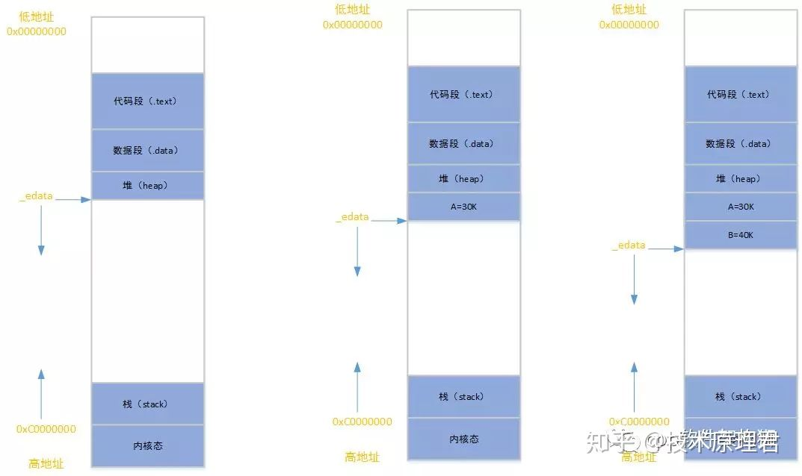
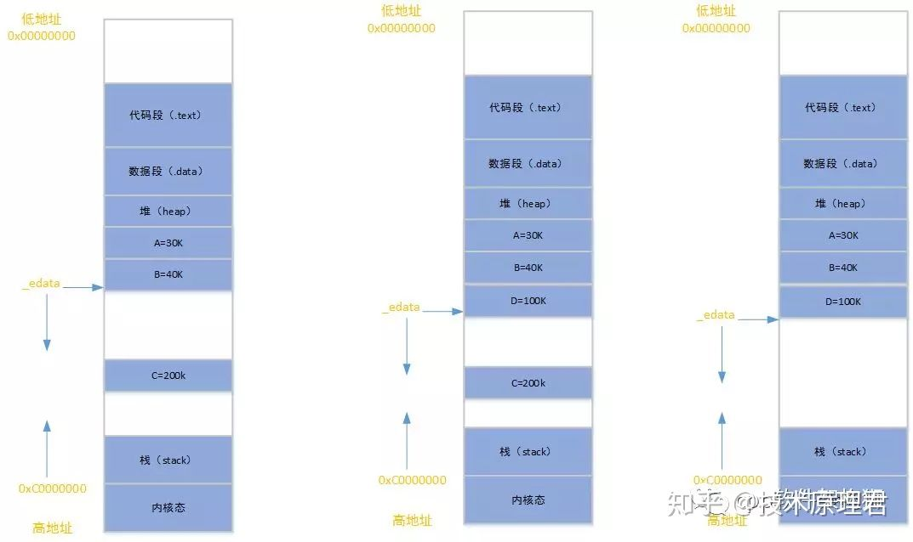
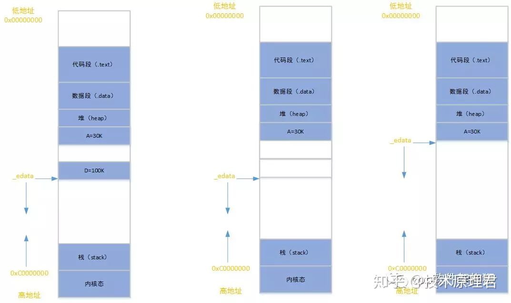

要想回答这个问题，就得刨根问底，内存到底是怎样分配的？

在内核态的角度来看，进程需要分配内存的方式有两种：**brk和mmap这两个系统调用**。

1. brk是数据段的[最高地址指针](https://www.zhihu.com/search?q=最高地址指针&search_source=Entity&hybrid_search_source=Entity&hybrid_search_extra={"sourceType"%3A"article"%2C"sourceId"%3A69555704})_edata往高地址增长；
2. mmap是建立了页到用户进程的[虚拟空间](https://www.zhihu.com/search?q=虚拟空间&search_source=Entity&hybrid_search_source=Entity&hybrid_search_extra={"sourceType"%3A"article"%2C"sourceId"%3A69555704})映射，在进程的虚拟地址空间中，堆和栈之间的大空间中找一块空闲的地址。

这两种方式分配到的都是[虚拟内存](https://www.zhihu.com/search?q=虚拟内存&search_source=Entity&hybrid_search_source=Entity&hybrid_search_extra={"sourceType"%3A"article"%2C"sourceId"%3A69555704})，并还没有分配真正的物理地址。会在第一次访问的时候，内核判断有没有物理地址，如果没有回发生缺页中断，然后分配物理地址，建立虚拟地址和[物理地址](https://www.zhihu.com/search?q=物理地址&search_source=Entity&hybrid_search_source=Entity&hybrid_search_extra={"sourceType"%3A"article"%2C"sourceId"%3A69555704})之间的映射关系。

但在用户态申请[动态内存](https://www.zhihu.com/search?q=动态内存&search_source=Entity&hybrid_search_source=Entity&hybrid_search_extra={"sourceType"%3A"article"%2C"sourceId"%3A69555704})，是不会直接调用这两个系统调用接口。一般情况下是通过C库的malloc/free来申请和释放。而C库的实现也正是基于这两个系统调用接口，进行上层的封装和管理。

**当内核发生缺页中断的时候，到底会做哪些事情呢？**

首先进程会从用户态陷入到内核态运行，会执行以下步骤：

1. **检查需要访问的虚拟地址是否合法；**
2. **查找，分配物理页；**
3. **填充物理页的内容；**
4. **建立映射关系（虚拟地址->物理地址）；**

**重新执行发生缺页中断的那条指令。**

如果第3步，需要读取磁盘，那么这次缺页中断就是**majflt**，否则就是**minflt**。

注意：

**用ps -o majflt,minflt -C program命令查看。**

**majflt代表major fault，中文名叫主错误，minflt代表minor fault，中文名叫次错误。**

**这两个数值表示一个进程自启动以来所发生的缺页中断的次数。**

**下面我们用实例来解释下内存申请的原理**

**情况一、**malloc小于128k的内存，使用brk分配内存，将_edata往高地址推(只分配虚拟空间，不对应物理内存(因此没有初始化)，第一次读/写数据时，引起内核缺页中断，内核才分配对应的物理内存，然后虚拟地址空间建立映射关系)，如下图：

**1、**进程启动的时候，其（虚拟）内存空间的初始布局如第一幅图所示。其中，**mmap内存映射文件是在堆和栈的中间**（例如libc-2.2.93.so，其它数据文件等），为了简单起见，省略了[内存映射文件](https://www.zhihu.com/search?q=内存映射文件&search_source=Entity&hybrid_search_source=Entity&hybrid_search_extra={"sourceType"%3A"article"%2C"sourceId"%3A69555704})。**_edata指针（glibc里面定义）指向数据段的最高地址。**

**2、**进程调用A=malloc(30K)以后，内存空间如第二幅图：[malloc函数](https://www.zhihu.com/search?q=malloc函数&search_source=Entity&hybrid_search_source=Entity&hybrid_search_extra={"sourceType"%3A"article"%2C"sourceId"%3A69555704})会调用brk系统调用，将_edata指针往高地址推30K，就完成虚拟内存分配。**你可能会问：**只要把_edata+30K就完成内存分配了？

事实是这样的，_edata+30K只是完成虚拟地址的分配，A这块内存现在还是没有物理页与之对应的，等到进程第一次读写A这块内存的时候，发生[缺页中断](https://www.zhihu.com/search?q=缺页中断&search_source=Entity&hybrid_search_source=Entity&hybrid_search_extra={"sourceType"%3A"article"%2C"sourceId"%3A69555704})，这个时候，内核才分配A这块内存对应的物理页。**也就是说，如果用malloc分配了A这块内容，然后从来不访问它，那么，A对应的物理页是不会被分配的。**

**3、**进程调用B=malloc(40K)以后，[内存空间](https://www.zhihu.com/search?q=内存空间&search_source=Entity&hybrid_search_source=Entity&hybrid_search_extra={"sourceType"%3A"article"%2C"sourceId"%3A69555704})如第三幅图。

**情况二、**malloc大于128k的内存，使用mmap分配内存，在堆和栈之间找一块空闲内存分配(对应独立内存，而且初始化为0)，如下图：

**4、**进程调用C=malloc(200K)以后，内存空间第一幅图：默认情况下，**malloc函数分配内存，如果请求内存大于128K（可由M_MMAP_THRESHOLD选项调节），那就不是去推_edata指针了，而是利用mmap系统调用，从堆和栈的中间分配一块虚拟内存。**

**这样子做主要是因为:brk分配的内存需要等到高地址内存释放以后才能释放（例如，在B释放之前，A是不可能释放的，这就是[内存碎片](https://www.zhihu.com/search?q=内存碎片&search_source=Entity&hybrid_search_source=Entity&hybrid_search_extra={"sourceType"%3A"article"%2C"sourceId"%3A69555704})产生的原因，什么时候紧缩看下面），而mmap分配的内存可以单独释放。**

当然，还有其它的好处，也有坏处，再具体下去，有兴趣的同学可以去看glibc里面malloc的代码了。

**5、**进程调用D=malloc(100K)以后，内存空间如图5；

**6、**进程调用free(C)以后，C对应的虚拟内存和物理内存一起释放。

**7、**进程调用free(B)以后，如第一幅图所示：**B对应的虚拟内存和物理内存都没有释放，因为只有一个_edata指针，如果往回推，那么D这块内存怎么办呢**？

**当然，B这块内存，是可以重用的，如果这个时候再来一个40K的请求，那么malloc很可能就把B这块内存返回回去了**。

**8、**进程调用free(D)以后，如第二幅图所示：**B和D连接起来，变成一块140K的[空闲内存](https://www.zhihu.com/search?q=空闲内存&search_source=Entity&hybrid_search_source=Entity&hybrid_search_extra={"sourceType"%3A"article"%2C"sourceId"%3A69555704})。**

**9、**默认情况下：**当最高地址空间的空闲内存超过128K（可由M_TRIM_THRESHOLD选项调节）时，执行内存紧缩操作（trim）。**在上一个步骤free的时候，发现最高地址空闲内存超过128K，于是内存紧缩，变成第三幅图所示。

如果这个时候我们想要申请一块50K的内存E，就会出现下图的情况。

**有没有发现，并没有从中间40K的内存分配，因为不满足我们申请50K大小的要求，而是向下偏移指针_edata分配50K，到这里就能发现就产生了内存碎片，这块碎片正是那40K。**

系统运行的越久，出现上述这样的情况越多，整个系统的小内存就会很多，导致的结果**是：查看系统的剩余内存比较可观，但申请大块内存会返回失败。**