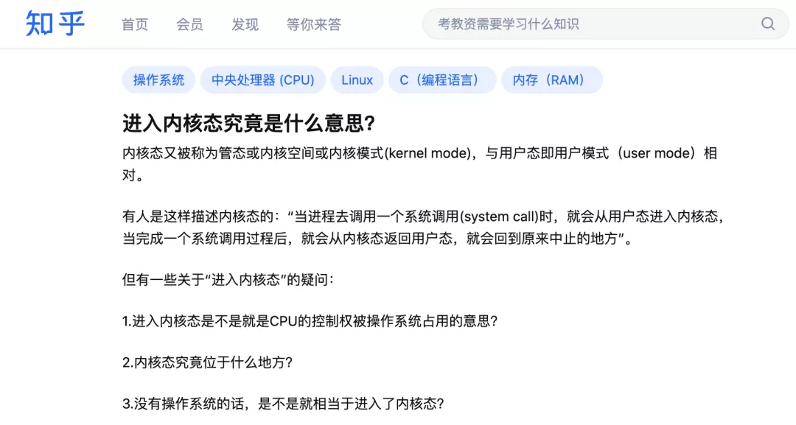
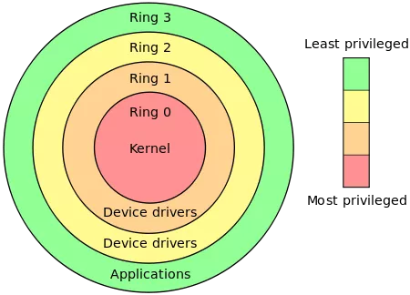

知乎上有一个问题：



**进入内核态究竟是什么意思？**

暂且忘记这个问题，让我们从另一个问题出发，一步步引出这个问题的答案。

## **特权指令问题**

现代计算机里面，同时运行了很多程序，比如Office软件、浏览器、QQ、还有你现在正在看这篇文章的微信，这些程序运行起来就是一个个的进程，每个进程都有各自的内存地址空间，为了防止大家越界，大打出手乱了规矩，得要有个管家来管理大家，这个管家就是**操作系统**。

好了，不管是前面说的那些应用程序，还是操作系统，本质上都是CPU去执行的二进制程序指令吧，而一个CPU能够执行的所有指令都在它的指令集里面了。

试想一下，假如指令集中的所有指令都一视同仁，任何程序都可以使用这些指令，那会出现什么问题？

那操作系统的权威性如何保证？怎么管理这一堆进程，还不反了天了？因为谁都可以执行这些指令，大家都是平起平坐啊！

所以，必须将指令集中的一部分比较敏感的划出来，这部分只能让操作系统来执行，其他程序不能执行，以此来捍卫操作系统的地位！

**哪些指令比较敏感？**

涉及到操作系统管理计算机资源的指令就是敏感指令。

以x86架构的CPU为例，中断的打开与关闭、外部设备的输入与输出、进程地址空间基地址CR3寄存器的修改、中断描述符表IDT基地址寄存器的修改、全局描述符表GDT基地址寄存器的修改···这些都是敏感操作，是普通应用程序绝对不能碰的指令：

```
cli
sti
in
out
lidt
lgdt
···
```

那如何做到让这些敏感指令操作系统能够执行，而普通程序又不能执行呢？

CPU在执行指令的时候又没办法区分这条指令是应用程序的还是操作系统的，它只是一个没有感情的执行机器，只会闷头执行···

为了解决这个问题，x86 CPU搞了个**特权级**出来，或者说是CPU提供了四个工作模式，从**Ring0-Ring3**，每一个模式又称为一个环，一共四个环。0环是最高权限模式，可以执行所有指令。Ring3是最低权限模式，只能执行指令集中的一部分指令。



也就是说，CPU搞了四个工作模式出来，只有工作在Ring0模式下，才能执行上面的那些特权指令，在其他模式下如果要去执行那些指令，CPU就会抛出异常！

有了CPU的这一硬件技术支持，问题就好办了，我们可以让CPU在执行操作系统代码的时候运行在Ring0模式，在执行普通应用程序代码的时候运行在Ring3模式，这样就解决了特权指令的问题。

## **内核地址空间**

但这里又回到之前那个问题了：**CPU如何知道现在执行的代码是不是操作系统的呢？**

一个最容易想到的解决办法就是：**把操作系统的代码放在内存中一个特殊的区域，当CPU执行的指令地址来自这个区域时，就切换工作模式到Ring0，离开这个区域后，就切换到其他模式。**

光这样还不够，还得加一个措施：这个区域不能让应用程序来访问，否则谁都能来读写，那还了得？

**所以，除了指令增加特权级以外，在内存的访问上，也得加上特权级。**

x86架构的CPU是基于分段式+分页式相结合的内存管理方式，所以Intel倒腾了几下，给不同的内存段限定了不同的访问模式，并把它记录到了段的描述符中。

在访问内存的时候，CPU就会拿当前段寄存器中标示的权限和要访问的目标内存所在段段访问权限进行对比，符合要求才能访问，否则也会抛出异常！

上面这一部分有一些抽象了，**简单来说，操作系统在内存中圈了一块地，把自己的代码放在这块地中，并设置了访问权限：闲人免进，非Ring0权限禁止入内。**

随后，操作系统又把自己圈的这块地映射到了每一个进程的虚拟地址空间中，这样一来，所有进程抬头一看自己的进程地址空间，都会看到它了：好家伙，这一块区域被操作系统占了，咱也不敢写，咱也不敢看。

操作系统圈的这块地，就是**内核地址空间**！一般位于进程地址空间中较高的区域，以32位下Windows为例，它是在0x80000000~0xFFFFFFFF这个区域。

我们把位于这个空间中的代码叫做操作系统的**内核代码**，有时候也简称**内核**。而把应用程序代码所活动的区域叫做**用户地址空间**。

进一步，我们常把CPU执行内核代码的模式称为**内核态**，把执行用户程序时的模式称为**用户态**。

CPU执行代码的过程，就是不断游走于用户态和内核态的过程。

## **进入和离开**

现在还有最后一个问题：**内核态的进入和离开怎么实现？**

假如没有任何约束，那普通应用程序，不是随便执行一条**jmp**指令就能跳进内核地址空间执行了？

应用程序可以随便进进出出，高兴了就来一个内核一日游，那还不天下大乱了？

况且话说回来，内核所在的内存空间因为权限保护，应用程序也是没办法jmp过去的，前面不说了吗：闲人免进！

那怎么办呢？

CPU提供了专门的入口，用来从用户态进入内核态。

这几个入口是：

### 1、中断：

当硬件设备有消息来了之后，会通过中断通知CPU，比如你移动了鼠标，敲下了键盘，收到了一个数据包，收到了时钟的滴答声···

当中断发生时，CPU会将当前执行的上下文保存到栈中，转入内核执行中断处理程序。

通过中断进入内核，入口是记录在中断描述符表IDT中的，由操作系统在系统启动的时候就安排好了。

### 2、异常：

当CPU执行过程中发现一些异常情况，比如执行除法指令的除数是0，访问的内存地址无效，或者访问的内存地址属于特权页面等这些情况，CPU都会触发异常。

异常和中断的流程有一些类似，遇到异常时，CPU也会将执行的上下文保存在栈中，转入内核执行中断处理程序。

通过异常进入内核的入口和中断一样，也是记录在IDT中的，同样是操作系统在系统启动的时候就安排好了。

### 3、系统调用：

在系统编程中，我们经常会调用很多操作系统提供的API函数，比如文件操作、内存操作、网络操作等等，这些函数都是操作系统封装出来的应用程序编程API，只是一个接口，真正的底层实现是位于内核中的系统调用函数。

应用层上的API通过CPU专门的指令（如sysenter/syscall）进入内核来完成对应的功能，进入内核后的入口同样也是操作系统提前安排好了的。

## **总结**

最后，让我们回答最开始知乎的那个问题：**进入内核态究竟是什么意思？**

CPU为了进行权限管控，引入了特权级的概念，CPU工作在不同的特权级下能够执行的指令和能够访问的内存区域是不一样的。

计算机在启动之初，CPU运行在高特权级下，操作系统率先获得了执行权限，在内存中圈了一块地，将自己的程序代码放了进去，并设定了这一部分内存只有高特权级才能访问。

随后，操作系统在创建进程的时候，都会把自己所在的这块内存区域映射到每一个进程地址空间中，这样所有进程都能看到自己的进程空间中，有一块叫“内核”的区域，这一块区域是无法擅入的。

所谓的“进入内核态”是指：当中断、异常、系统调用等情况发生的时候，CPU切换工作模式到高特权级模式Ring0，并转而执行位于内核地址空间处的代码。

看完这篇，你明白进入内核态是怎么一回事了吗？

看不懂没关系，下面用一张图来总结一下：