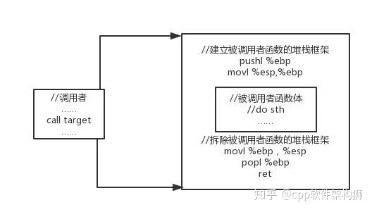
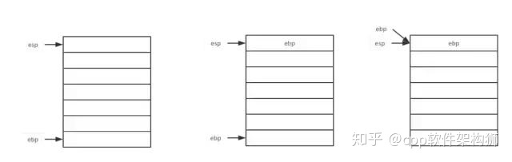
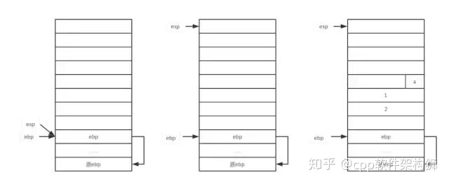
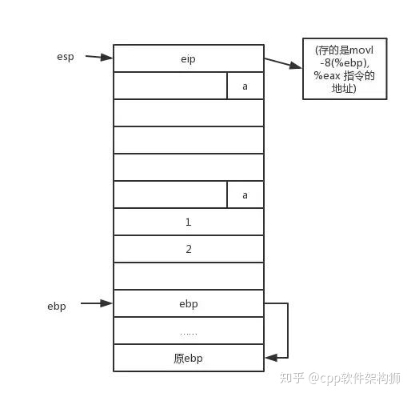
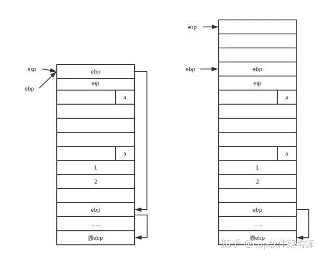
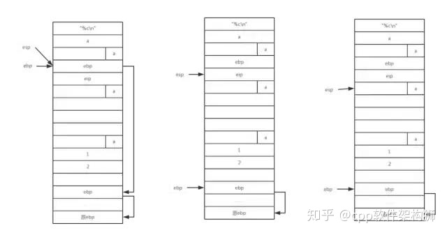
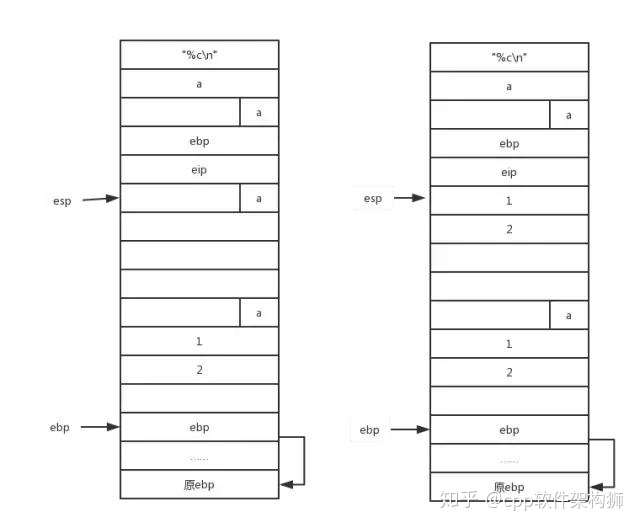
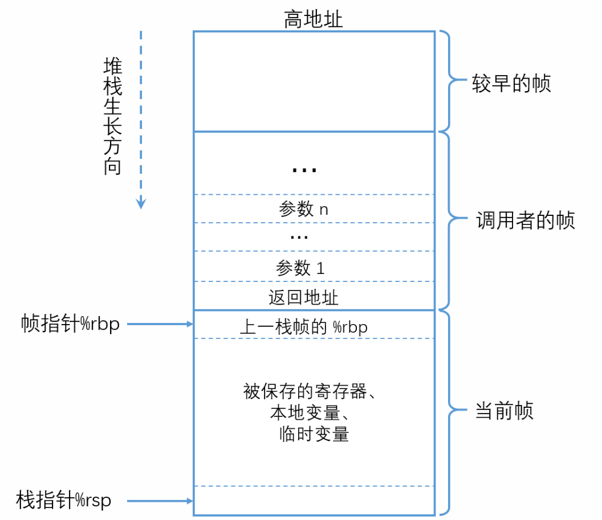
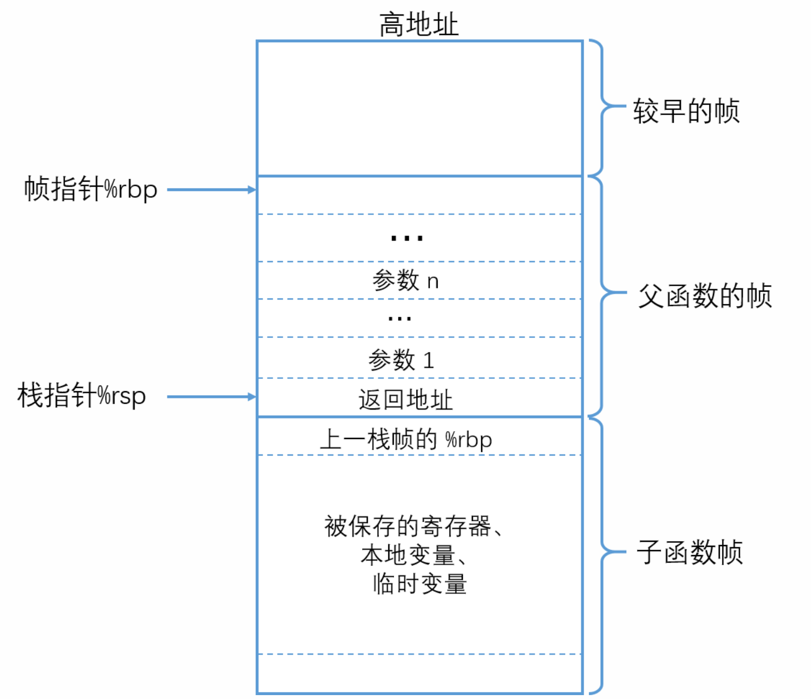

1. **第二步**

   数据结构的堆栈也没有特别深奥难以理解，所以暂且略过。so最值得去讲的是**内存分配方式的堆栈，以x86为例。**

   栈寄存器和栈操作

   1. **与栈相关的寄存器有两个：esp和ebp。**

   ```
   esp，栈指针，指向栈顶
   ebp，基址指针，指向栈底
   ```

   1. **栈操作**

   **push 进栈**

   栈顶指针减少4个字节（栈是由高地址向低地址增长的），例如 **pushl %eax**相当于：

   ```
   subl $4, %esp
   movl %eax, (%esp)
   ```

   **pop 出栈**

   栈顶地址增加4个字节，例如，popl %eax相当于

   ```
    movl (%esp), %eax
    add $4, %esp 
   ```

   **3.call**

   eip，程序计数器，总是指向下一条指令的位置。在进行函数调用时，会执行call指令，将eip中内容指向对应函数的位置。call具体执行过程如下：

   首先将eip的值压如栈顶，然后将eip执行被调用函数的入口地址。具体指令如下：

   ```
    pushl %eip
    movl 0x12345, %eip
    ret
   ```

   1. 弹出原来保存在栈顶的原eip中的值，放入eip。

   函数的栈框架

   每一个函数都会维持一个栈。栈框架会包裹函数执行体。如下图所示：

   

   

   **分析demo**

   **源码：**

   ```
   #include<stdio.h>
   #include<stdlib.h>
   void p1(char c)
   {
    printf(%c
   ",c);
   }
   int p2(int x,int y)
   {
    return x + y;
   } 
   int main()
   {
    char c = 'a';
    int x,y,z;
    x = 1;
    y = 2;
    p1(c);
    z = p2(x,y);
    printf("%d = %d + %d
   ",z,x,y);
   }
   ```

   **反汇编后**：

   ```
   .LC0:
    .string "%c
   "
    .text
   p1:
    pushl %ebp
    movl %esp, %ebp
    subl $12, %esp
    movl 8(%ebp), %eax
    movb %al, -4(%ebp)
    movsbl -4(%ebp),%eax
    movl %eax, 4(%esp)
    movl $.LC0, (%esp)
    call printf
    leave
    ret
   p2:
    pushl %ebp
    movl %esp, %ebp
    movl 12(%ebp), %eax
    addl 8(%ebp), %eax
    popl %ebp
    ret
   .LC1:
    .string "%d = %d + %d
   "
    .text
   main:
    pushl %ebp
    movl %esp, %ebp
    subl $32, %esp
    movb $97, -13(%ebp)
    movl $1, -12(%ebp)
    movl $2, -8(%ebp)
    movsbl -13(%ebp),%eax
    movl %eax, (%esp)
    call p1
    movl -8(%ebp), %eax
    movl %eax, 4(%esp)
    movl -12(%ebp), %eax
    movl %eax, (%esp)
    call p2
    movl %eax, -4(%ebp)
    movl -8(%ebp), %eax
    movl %eax, 12(%esp)
    movl -12(%ebp), %eax
    movl %eax, 8(%esp)
    movl -4(%ebp), %eax
    movl %eax, 4(%esp)
    movl $.LC1, (%esp)
    call printf
    leave
    ret
   ```

   **接下来我们分析下栈的过程**

   ```
   pushl %ebp
   movl %esp, %ebp
   ```

   以上两条指令属于函数调用框架，作用就是为main函数建议一个新的空的栈。

   

   

   ```
   subl $32, %esp
   movb $97, -13(%ebp)
   movl $1, -12(%ebp)
   movl $2, -8(%ebp)
   ```

   第一条指令的目的是在栈中开辟32字节的空间，存储局部变量。编译器会事先扫描函数中局部变量个数和大小，预分配给一个空间，供存储局部变量和参数调用。

   剩下三条指令为将局部变量压栈。

   

   

   ```
   movsbl -13(%ebp),%eax
   movl %eax, (%esp)
   ```

   将参数c=‘a’压栈

   

   

   ```
   call p1
   ```

   相当于：

   ```
    pushl %eip
    movl p1, %eip
   ```

   

   

   ```
   pushl %ebp
   movl %esp, %ebp
   subl $12, %esp
   ```

   

   

   ```
   movl 8(%ebp), %eax
   movb %al, -4(%ebp)
   movsbl -4(%ebp),%eax
   movl %eax, 4(%esp)
   movl $.LC0, (%esp)
   ```

   

   

   ```
   call printf
   leave
   ret
   ```

   

   

   ```
   movl -8(%ebp), %eax
   movl %eax, 4(%esp)
   movl -12(%ebp), %eax
   movl %eax, (%esp)
   ```

   

   

   进入p2函数，过程和p1函数调用过程相似。以上就是函数调用栈的过程。

------

# 常见寄存器

- `%rax` 通常用于存储函数的返回值，同时也用于乘法和除法指令。在乘法 `imul` 指令中，两个64位的乘积超过64位时，高位存储在 `%rdx` 中。在除法指令 `idiv` 中，被除数是超过64位时，高位存储在 `%rdx` 中。

- `%rsp` 是栈指针寄存器，指向的是栈顶元素。 可以用 `pushq` 和 `popq` 指令将数据存入栈中或是一从栈中取出。

  - 分配空间：将栈指针减小个适当的量可以为没有指定初始值的数据在栈上分配空间。
  - 释放空间： 可以通过增加栈指针来释放空间

  **当前正在执行的过程的帧总是在栈顶。**

- `%rbp` 是栈帧指针寄存器，用于标识当前栈帧的起始位置。

- `%rdi, %rsi, %rdx, %rcx, %r8, %r9` 用来存储函数调用的前6个参数，当 x86-64 函数调用的参数大于6时，超出的部分 就会在栈上分配空间，这部分称为函数调用的栈帧（`stack frame`）

# Caller Save 与 Callee Save

通用寄存器分为 Caller Save 和 Callee Save 两个类型，即发生函数调用时寄存器的值是由”调用者保存“ 还是由 ”被调用者保存“。当发生函数调用时，子函数内通常也会使用到通用寄存器，那么这些寄存器中之前保存的调用者(父函数）的值就会被覆盖。为了避免数据覆盖而导致从子函数返回时寄存器中的数据不可恢复，CPU 体系结构中就规定了通用寄存器的保存方式。

**`Caller Save`** 寄存器：在进行子函数调用前，就需要由调用者提前保存好这些寄存器的值，保存方法通常是把寄存器的值压入栈中，调用者保存完成后，在被调用者（子函数）中就可以随意覆盖这些寄存器的值了。这类寄存器有：`%r10，%r11`。

**`Callee Save`**：在函数调用时，调用者就不必保存这些寄存器的值而直接进行子函数调用，进入子函数后，子函数在覆盖这些寄存器之前，需要先保存这些寄存器的值，即这些寄存器的值是由被调用者来保存和恢复的。这类寄存器有：`%rbx, %rbp, %r12, %r13, %r14, %r15`。

其他的通用寄存比如上面介绍的 `%rax`，`%rsp` 无须保存，还有一些专门用来发生函数调用时的寄存器，专门用来保存函数参数的。

# 函数调用

在子函数调用时，执行的操作有：

- 父函数将调用参数从后向前压栈,即`arg1`在低地址，`argn`在高地址。

- 把返回地址当做子函数的栈帧的一部分，子函数的代码会扩展当前栈的边界， 分配它的栈帧所需的空间

- 跳转到子函数起始地址执行 ，即`%rip`设置为子函数的起始地址。

- 子函数将父函数栈帧起始地址`%rbp` 压栈

- 将 `%rbp` 的值设置为当前 `%rsp` 的值，即将 `%rbp` 指向子函数栈帧的起始地址。

  ```cpp
    		call func
    func:
          pushq rbp         // 将调用函数的栈帧起始地址压入栈
        	moveq rsp rbp     // 使得rbp 指向当前被调用函数的栈帧起始地址
  ```

**`call`** 指令完成了：①将父函数的返回地址入栈；②跳转到子函数。已经进入子函数了，因此“调用函数”的`%rbp`需要子函数来保存，属于`callee save`。

下图是发生函数调用时的栈帧。



# 函数返回

需要完成：

- 恢复栈的结果到函数调用之前的状态
- 跳转到调用函数的返回地址处继续执行

由于在调用子函数时已经保存了父函数的返回地址和父的栈帧起始地址，那么只需要恢复即可：

```cpp
    moveq %rbp, %rsp   // 使得 %rsp 和 %rbp 指向一处：子函数的栈帧起始地址 
    popq  %rbp         // 调用函数的栈帧起始地址地址，并且%rsp上移一个位置，指向返回地址
    ret				   // 从当前%rsp指向的位置弹出数据，并且跳转到此数据表示的地址处，即使返回父函数
```

总结下 `ret` 指令的作用：

- 使得`%rsp`再上移动一个位置，使得`%rsp`指向父函数的栈帧的结尾处，即保存了父函数的返回地址
- 会弹出栈中的数据，返回主函数

返回时候的栈帧如下：




------

#### [76、方法调用的原理（栈，汇编）](https://interviewguide.cn/#/Doc/Knowledge/C++/基础语法/基础语法?id=76、方法调用的原理（栈，汇编）)

\1) 机器用栈来传递过程参数、存储返回信息、保存寄存器用于以后恢复，以及本地存储。而为单个过程分配的那部分栈称为帧栈；帧栈可以认为是程序栈的一段，它有两个端点，一个标识起始地址，一个标识着结束地址，两个指针结束地址指针esp，开始地址指针ebp;

\2) 由一系列栈帧构成，这些栈帧对应一个过程，而且每一个栈指针+4的位置存储函数返回地址；每一个栈帧都建立在调用者的下方，当被调用者执行完毕时，这一段栈帧会被释放。由于栈帧是向地址递减的方向延伸，因此如果我们将栈指针减去一定的值，就相当于给栈帧分配了一定空间的内存。如果将栈指针加上一定的值，也就是向上移动，那么就相当于压缩了栈帧的长度，也就是说内存被释放了。

\3) 过程实现

① 备份原来的帧指针，调整当前的栈帧指针到栈指针位置；

② 建立起来的栈帧就是为被调用者准备的，当被调用者使用栈帧时，需要给临时变量分配预留内存；

③ 使用建立好的栈帧，比如读取和写入，一般使用mov，push以及pop指令等等。

④ 恢复被调用者寄存器当中的值，这一过程其实是从栈帧中将备份的值再恢复到寄存器，不过此时这些值可能已经不在栈顶了

⑤ 恢复被调用者寄存器当中的值，这一过程其实是从栈帧中将备份的值再恢复到寄存器，不过此时这些值可能已经不在栈顶了。

⑥ 释放被调用者的栈帧，释放就意味着将栈指针加大，而具体的做法一般是直接将栈指针指向帧指针，因此会采用类似下面的汇编代码处理。

⑦ 恢复调用者的栈帧，恢复其实就是调整栈帧两端，使得当前栈帧的区域又回到了原始的位置。

⑧ 弹出返回地址，跳出当前过程，继续执行调用者的代码。

\4) 过程调用和返回指令

① call指令

② leave指令

③ ret指令