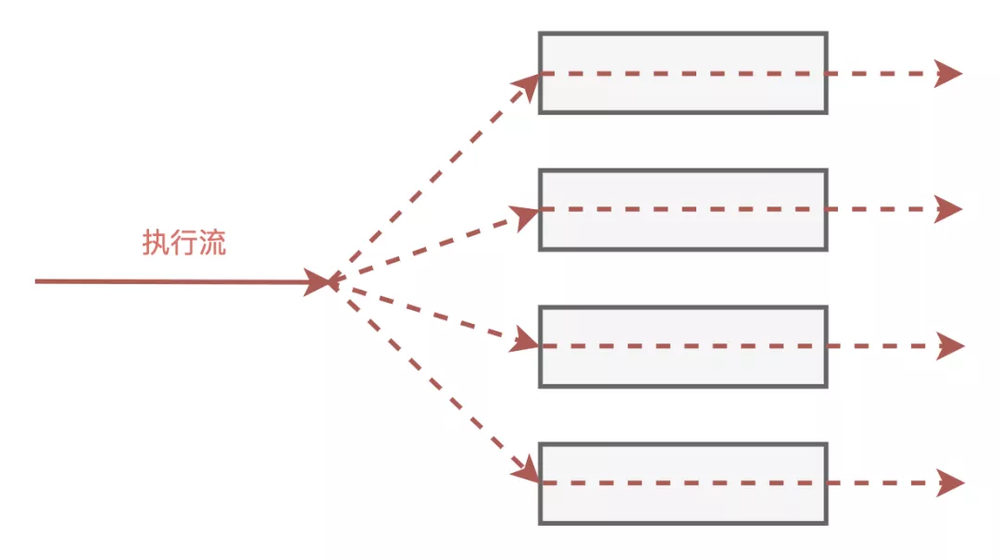

## **神秘使者**

“久闻Java语言跨越平台，框架众多，不过二十年功夫，就已晋升天下第一编程语言，今日一见，果然名不虚传呐！”

“使者先生您过奖了，咱们快些走，国王陛下已经等候多时了”

今日，Java帝国朝堂之上迎来了一位神秘的来宾。

来到大殿之上，只见国王正襟危坐，闭目养神，不怒自威，堂下群臣咸集，纷纷侧目。

“来者何人？”，国王一旁的内侍问到。

“我乃GoLang帝国使者——**Goroutine**”，使者答道。

“GoLang帝国？何方番邦小国？寡人竟从未听闻”，国王闭眼说到。

说罢，群臣皆笑了起来。

“来此所为何事？”，内侍继续问到。

使者回答：“我此行特为传道而来”

说完，国王睁开了眼睛，“传道？我Java帝国乃天下第一编程帝国，只有我们传出去，哪有学别人之道？”

使者不卑不亢，说到：“Java帝国虽如日中天，但却有一处缺陷，假以时日，必成大患”

“哦，你倒是说说看，如若言语不通，即刻轰出殿去。”，国王厉声喝到。

“敢问陛下，Java线程执行到阻塞函数时，该当如何？”，使者问到。

一旁的线程大臣见状，上前说到：“遇到阻塞那自然要被操作系统挂起，切换到别的线程”

“敢问大人，线程切换是否需要成本？如果大量线程频繁切换，成本又当如何？”，使者追问到。

“你若关心这个问题，那就不用阻塞函数，通过异步回调来进行”，线程大臣答道。

使者嘴角上扬，微微一笑，“好一个异步回调！异步回调确实不用阻塞，不过它有两宗罪，其一：割裂了原来的代码业务逻辑，其二：陷入回调地狱难以维护”

“这也不行，那也不行，你这人还真难伺候”，线程大臣有些急了。

使者转身面向国王说到：“启禀陛下，我有一法，可让线程遇到阻塞函数后不需切换线程，也不用异步回调还可以继续运行下去，是高并发开发神技”

国王一听来了兴趣：“哦，还有这种事？说来听听”

使者拜了一拜，说到：“线程可以在遇到阻塞的地方后，保存执行的上下文，转而去执行别处的代码。待阻塞的请求完成后，再转而回去继续执行”

国王不解，问到：“什么叫转而去执行别处的代码？什么叫回去继续执行？这函数执行到一半还能中途退出再回来？”

“是的，没错！”，使者回答。

此话一出，朝堂上议论纷纷，群臣都露出了鄙夷的笑容。

“简直荒谬！函数执行从进入到return退出，从来都是一气呵成，哪有中途执行一半退出，再回来接着执行的道理？简直闻所未闻！”，一旁的线程大臣说到。

使者继续说到：“一气呵成？恐怕不是吧？线程执行函数中途，遇到时间片用完或者遇到I/O阻塞，就会被操作系统保存上下文后挂起，切换到其他线程。而后等到机会再回过头继续执行，不是吗？”

线程大臣怒斥道：“强词夺理！你说的这情况是操作系统在调度管理多个线程，对咱们的应用层线程来说都是透明的，无需关心”

使者没有退让，却问道：“**既然操作系统可以调度管理多个线程，那为何线程不可以调度管理函数的执行？**”

群臣再次交头接耳，议论起来。

“陛下，此番邦使者妖言惑众，微臣建议即刻逐出大殿，以正视听！”

国王应允，随即遣人上前。

不待侍卫上前，使者自行离去，边走边说到：“可叹！堂堂Java帝国，却容不下一个新技术”

## **临别相会**

使者心灰意冷，打算离开Java帝国，却在半道上被人给拦了下来。

“先生请留步，我家主人请先生府上相会”

使者来到府上，原来主人乃当地一富豪乡绅。

“先生今日在朝堂之事，我已听说，在下对先生提到的函数执行过程中可中断和恢复的技术颇有兴趣，还请先生不吝赐教”，主人说完拜了一拜。

“赐教不敢当，我此次来Java帝国，所传之道名叫**协程**，是一种高并发开发的绝技，可无奈贵国国君与大臣皆不识货，无功而返，可惜啊，可惜！”，使者叹息到。

“协程？这是何物？我只听说过进程和线程，却是从未听过协程”

使者起身说到：“线程是操作系统抽象出来的执行流，由操作系统统一调度管理。那在一个线程中，同样可以抽象出多个执行流，由线程来统一调度管理。这线程之上抽象的执行流就是协程”

主人有些不解，问到：“一个线程怎么会有多个执行流呢？”

“这便是我今日在朝堂上说的，线程执行函数遇到阻塞后，可以保存上下文后退出，转而执行别处的代码，这里就从一个执行流转向了另外的执行流”，使者解释到。

主人拍案而起，“原来是这个意思，妙哉，妙哉啊！不过，这线程是操作系统在调度管理，那线程里抽象出来的执行流，也就是协程，该怎么调度管理呢？操作系统可以通过时钟中断和系统调用进入内核来剥夺线程的执行权，那线程该如何剥夺协程的执行权来实现调度管理呢？”

“真是个好问题！线程的调度由操作系统来管理，是抢占式调度。而协程不同，协程需要互相配合，主动交出执行权，这也是协程的名字——**协作式程序**的来历”

“主动交出执行权？如何办到？”，主人追问。

“办法有很多，比如C++帝国有一协程框架，名叫libco，他通过HOOK关键的系统函数来实现调度器的介入”

“那你们Golang是怎么做的？也是这样吗？”

“我们Golang帝国可不一样，我们先天设计就是支持协程，系统调用都被我们封装好了，应用程序调用时遇到需要阻塞的，像是文件读写Read/Write、Sleep我们的调度器就能有机会介入，去执行调度管理了”，使者得意的说到。

主人思考片刻，问到：“那我们Java该如何实现呢，还请先生赐教”

“你们Java语言，是通过JVM在执行，字节码的执行都在JVM的掌控之中，要想实现对应用代码执行流的中断和恢复还不是易如反掌？”，使者说到。

主人点了点头，若有所思。

## **新的征程**

主人与使者交谈甚欢，不知不觉已近黄昏。

主人起身说到：“今蒙先生赐教，大慰平生。还请先生在府上多留时日，我好细细请教。”

使者连连挥手，说到：“我还有要事在身，明日就要离去”

“不知先生欲往何处？”

“听说C++帝国又要发布新版本，我打算前往传道”

主人面露疑惑：“C++帝国不是有libco了吗？”

“libco终究不是朝廷之物，此番前去，希望可以让协程纳入新的官方标准”

翌日清晨，使者拜别主人，策马离去。

不久，Java帝国朝堂上传来消息，民间有人推出了协程框架——**Quasar**，一时朝野震动。