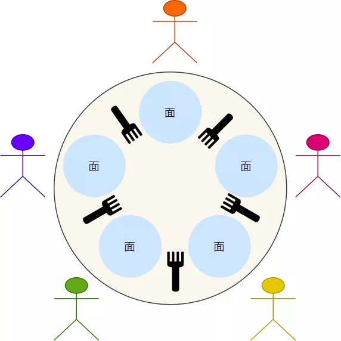
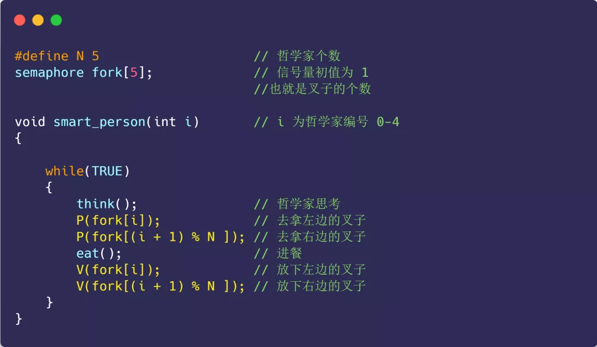
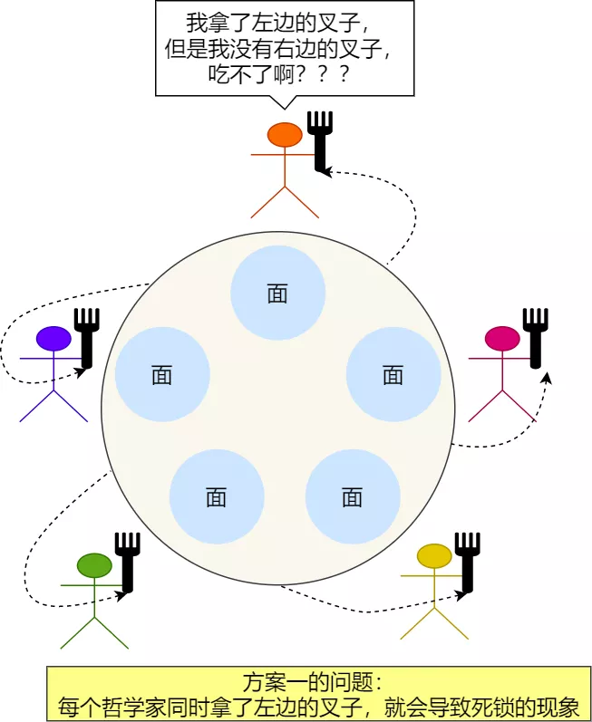
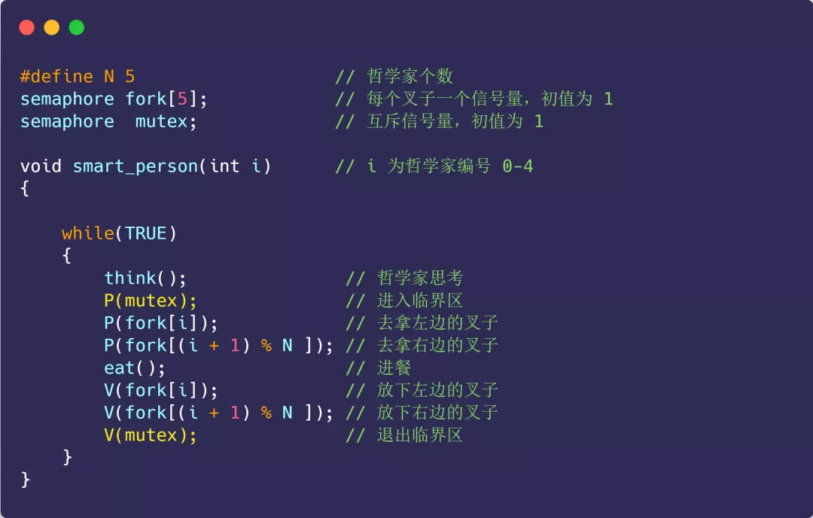
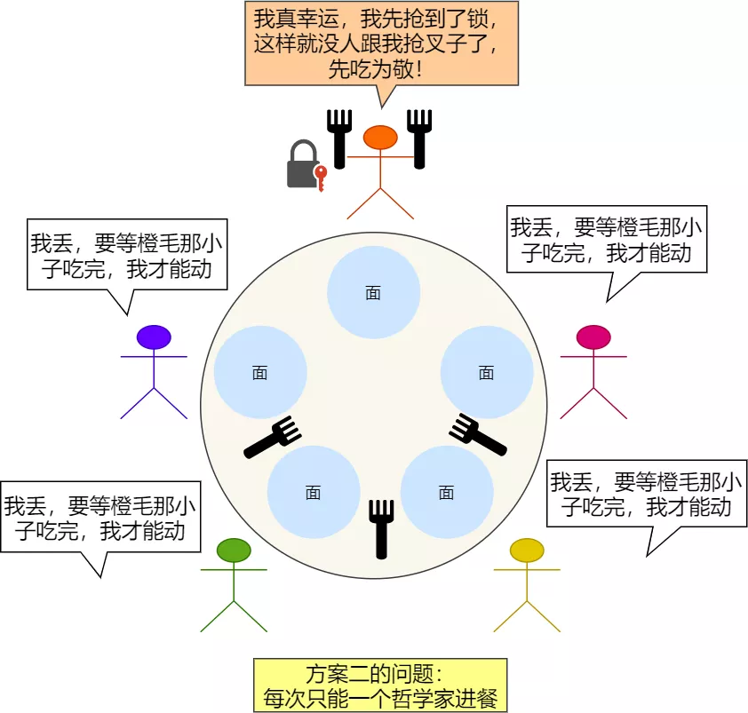
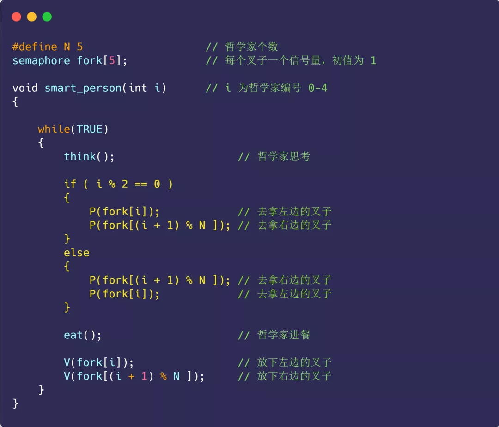
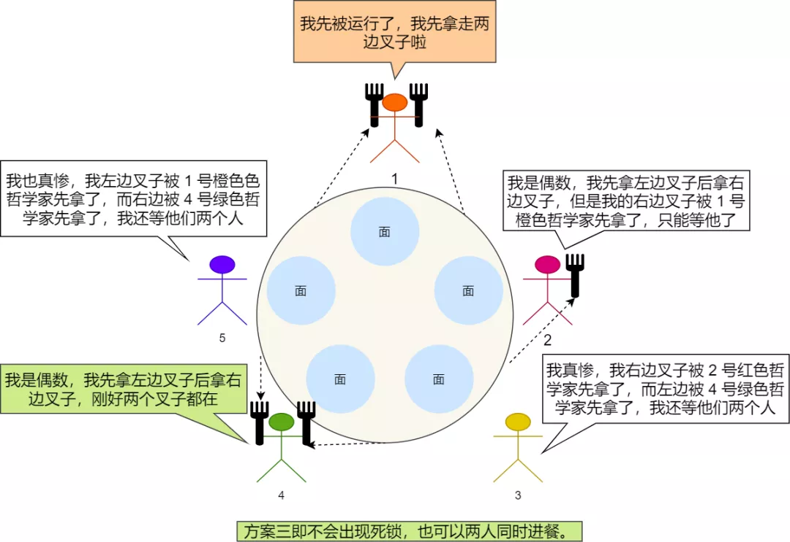
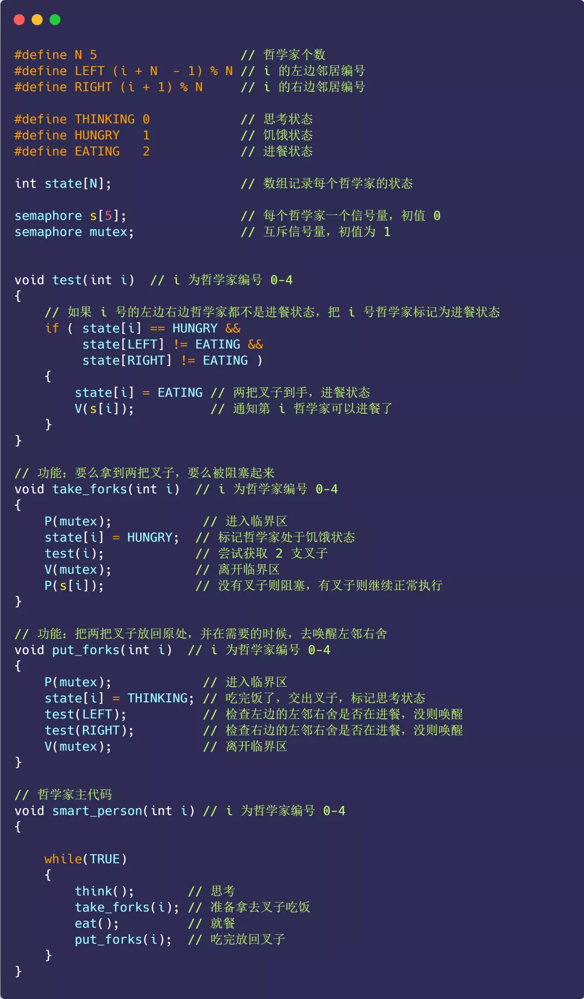
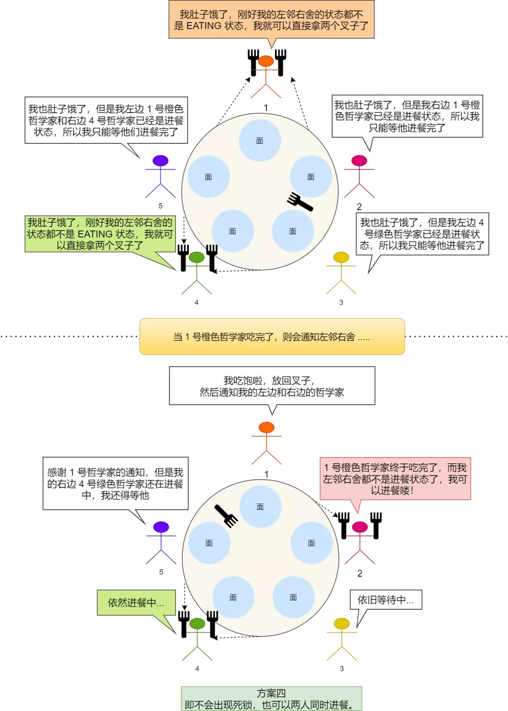

#### 哲学家就餐问题

当初我在校招的时候，面试官也问过「哲学家就餐」这道题目，我当时听的一脸懵逼，无论面试官怎么讲述这个问题，我也始终没听懂，就莫名其妙的说这个问题会「死锁」。

当然，我这回答槽透了，所以当场 game over，残酷又悲惨故事，就不多说了，反正当时菜就是菜。

时至今日，看我来图解这道题。

哲学家就餐的问题

先来看看哲学家就餐的问题描述：

- `5` 个老大哥哲学家，闲着没事做，围绕着一张圆桌吃面；
- 巧就巧在，这个桌子只有 `5` 支叉子，每两个哲学家之间放一支叉子；
- 哲学家围在一起先思考，思考中途饿了就会想进餐；
- **奇葩的是，这些哲学家要两支叉子才愿意吃面，也就是需要拿到左右两边的叉子才进餐**；
- **吃完后，会把两支叉子放回原处，继续思考**；

那么问题来了，如何保证哲学家们的动作有序进行，而不会出现有人永远拿不到叉子呢？

> 方案一

我们用信号量的方式，也就是 PV 操作来尝试解决它，代码如下：

上面的程序，好似很自然。拿起叉子用 P 操作，代表有叉子就直接用，没有叉子时就等待其他哲学家放回叉子。

方案一的问题

不过，这种解法存在一个极端的问题：**假设五位哲学家同时拿起左边的叉子，桌面上就没有叉子了， 这样就没有人能够拿到他们右边的叉子，也就说每一位哲学家都会在 `P(fork[(i + 1) % N ])` 这条语句阻塞了，很明显这发生了死锁的现象**。

> 方案二

既然「方案一」会发生同时竞争左边叉子导致死锁的现象，那么我们就在拿叉子前，加个互斥信号量，代码如下：

上面程序中的互斥信号量的作用就在于，**只要有一个哲学家进入了「临界区」，也就是准备要拿叉子时，其他哲学家都不能动，只有这位哲学家用完叉子了，才能轮到下一个哲学家进餐。**

方案二的问题

方案二虽然能让哲学家们按顺序吃饭，但是每次进餐只能有一位哲学家，而桌面上是有 5 把叉子，按道理是能可以有两个哲学家同时进餐的，所以从效率角度上，这不是最好的解决方案。

> 方案三

那既然方案二使用互斥信号量，会导致只能允许一个哲学家就餐，那么我们就不用它。

另外，方案一的问题在于，会出现所有哲学家同时拿左边刀叉的可能性，那我们就避免哲学家可以同时拿左边的刀叉，采用分支结构，根据哲学家的编号的不同，而采取不同的动作。

**即让偶数编号的哲学家「先拿左边的叉子后拿右边的叉子」，奇数编号的哲学家「先拿右边的叉子后拿左边的叉子」。**

上面的程序，在 P 操作时，根据哲学家的编号不同，拿起左右两边叉子的顺序不同。另外，V 操作是不需要分支的，因为 V 操作是不会阻塞的。

方案三可解决问题

方案三即不会出现死锁，也可以两人同时进餐。

> 方案四

在这里再提出另外一种可行的解决方案，我们**用一个数组 state 来记录每一位哲学家在进程、思考还是饥饿状态（正在试图拿叉子）。**

那么，**一个哲学家只有在两个邻居都没有进餐时，才可以进入进餐状态。**

第 `i` 个哲学家的左邻右舍，则由宏 `LEFT` 和 `RIGHT` 定义：

- *LEFT* : ( i + 5  - 1 ) % 5
- *RIGHT* : ( i + 1 ) % 5

比如 i 为 2，则 `LEFT` 为 1，`RIGHT` 为 3。

具体代码实现如下：

上面的程序使用了一个信号量数组，每个信号量对应一位哲学家，这样在所需的叉子被占用时，想进餐的哲学家就被阻塞。

注意，每个进程/线程将 `smart_person` 函数作为主代码运行，而其他 `take_forks`、`put_forks` 和 `test` 只是普通的函数，而非单独的进程/线程。

方案四也可解决问题

方案四同样不会出现死锁，也可以两人同时进餐。