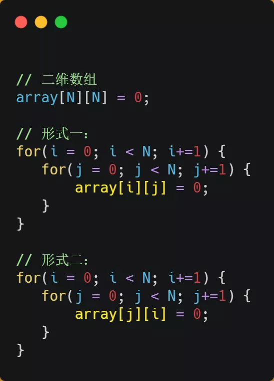
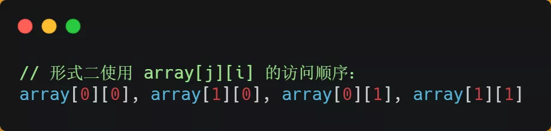
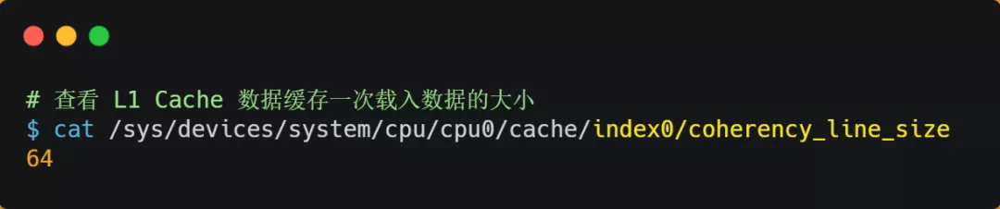

在前面我也提到， L1 Cache 通常分为「数据缓存」和「指令缓存」，这是因为 CPU 会别处理数据和指令，比如 `1+1=2` 这个运算，`+` 就是指令，会被放在「指令缓存」中，而输入数字 `1` 则会被放在「数据缓存」里。

因此，**我们要分开来看「数据缓存」和「指令缓存」的缓存命中率**。

#### 如何提升数据缓存的命中率？

假设要遍历二维数组，有以下两种形式，虽然代码执行结果是一样，但你觉得哪种形式效率最高呢？为什么高呢？

经过测试，形式一 `array[i][j]` 执行时间比形式二 `array[j][i]` 快好几倍。

之所以有这么大的差距，是因为二维数组 `array` 所占用的内存是连续的，比如长度 `N` 的指是 `2` 的话，那么内存中的数组元素的布局顺序是这样的：

形式一用 `array[i][j]` 访问数组元素的顺序，正是和内存中数组元素存放的顺序一致。当 CPU 访问 `array[0][0]` 时，由于该数据不在 Cache 中，于是会「顺序」把跟随其后的 3 个元素从内存中加载到 CPU Cache，这样当 CPU 访问后面的 3 个数组元素时，就能在 CPU Cache 中成功地找到数据，这意味着缓存命中率很高，缓存命中的数据不需要访问内存，这便大大提高了代码的性能。

而如果用形式二的 `array[j][i]` 来访问，则访问的顺序就是：

你可以看到，访问的方式跳跃式的，而不是顺序的，那么如果 N 的数值很大，那么操作 `array[j][i]` 时，是没办法把 `array[j+1][i]` 也读入到 CPU Cache 中的，既然 `array[j+1][i]` 没有读取到 CPU Cache，那么就需要从内存读取该数据元素了。很明显，这种不连续性、跳跃式访问数据元素的方式，可能不能充分利用到了 CPU Cache 的特性，从而代码的性能不高。

那访问 `array[0][0]` 元素时，CPU 具体会一次从内存中加载多少元素到 CPU Cache 呢？这个问题，在前面我们也提到过，这跟 CPU Cache Line 有关，它表示 **CPU Cache 一次性能加载数据的大小**，可以在 Linux 里通过 `coherency_line_size` 配置查看 它的大小，通常是 64 个字节。

也就是说，当 CPU 访问内存数据时，如果数据不在 CPU Cache 中，则会一次性会连续加载 64 字节大小的数据到 CPU Cache，那么当访问 `array[0][0]` 时，由于该元素不足 64 字节，于是就会往后**顺序**读取 `array[0][0]~array[0][15]` 到 CPU Cache 中。顺序访问的 `array[i][j]` 因为利用了这一特点，所以就会比跳跃式访问的 `array[j][i]` 要快。

**因此，遇到这种遍历数组的情况时，按照内存布局顺序访问，将可以有效的利用 CPU Cache 带来的好处，这样我们代码的性能就会得到很大的提升，**