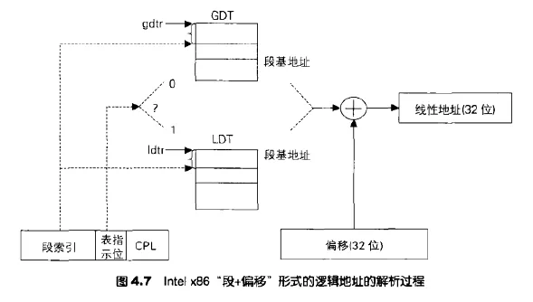

大家好，我是你们的老朋友轩辕。

点进这篇文章的朋友，恭喜你们，又要收获新知识了~

这又是一篇非常硬核的技术文，建议配合一瓶怡宝或营养快线食用，效果更好哦。

很多小伙伴在学操作系统的时候，学习到内存管理的部分时，都会接触到分段内存管理、分页内存管理。

但很多人学完以后一头雾水：

> 到底现在用的是分段还是分页？
>
> 段寄存器这个东西现在还在用吗？
>
> 为什么在讲到虚拟地址翻译的时候，好像跟段又没有关系了呢？

之所有有这个问题，是因为很多同学看的教程很多都是偏理论的或者是过时的，根本不给你讲现代操作系统中实际的情况（关于这一点我已经吐槽很多次了）。

今天轩辕就带大家把内存管理的这些疑问一次性弄清楚，分段还是分页，别再傻傻分不清楚了！

Let's go!

在开始之前，我们还是先来简单复习一下，操作系统书上讲到的Intel x86 CPU架构下的分段式内存管理和分页式内存管理。

## **分段式内存管理**

早在16位的8086时代，CPU为了能寻址超过16位地址能表示的最大空间（64KB），引入了段寄存器。

通过将内存空间划分为若干个段，然后采用段基地址+段内偏移的方式访问内存，这样能访问1MB的内存空间了！

那时候，段寄存器有4个，分别指向不同的段。

> - **cs**: 代码段
> - **ds**: 数据段
> - **ss**: 栈段
> - **es**：扩展段

在那个时候，段寄存器中存放的是段基地址，注意，是一个地址。

在通过ip寄存器读取指令的时候，实际上是cs:ip，通过sp寄存器访问栈的时候，实际上是ss:sp。

我看到网络上很多文章介绍分段式内存或者介绍段寄存器的时候就止步于此了，而事实上，进入32位时代后，情况已经发生了翻天覆地的变化，只讲上面这一部分内容实际上会误导很多人。

**变化1：**

在32位时代，段寄存器又增加了两个：fs、gs，这两个段寄存器有特殊用途。

**变化2：**

段寄存器里面存放的不再是段基地址，而是一个叫**段选择子**的东西。注意，注意，一切的变化都从这里开始。

段寄存器是16位的宽度，原来这16位是个物理内存地址，但现在，它是这样一个结构：

实际上，现在的段寄存器中存放的是一个号码，什么号码呢？是一个表格中表项的号码，这个表，有可能是**全局描述符表GDT**，也有可能是**局部描述符表LDT**。

那到底是哪个表？是由段选择子从低到高的第三位来决定的，如果这一位是0，则是GDT，否则就是LDT。

那这两个表又是啥，表里面装的又是什么，怎么来寻址呢？

这两个表的表项叫做段描述符，描述了一个内存段的信息，比如段的基地址、最大长度、访问属性等等一系列信息，它长这个样子：

CPU中单独添置了两个寄存器，用来指向这两个表，分别是gdtr和ldtr。

在寻址的时候，CPU首先根据段寄存器中的号码，通过gdtr或ldtr来到GDT/LDT中取出对应的段描述符，然后再取出这个段的基地址，最后再结合段内的偏移，完成内存寻址。

也就是说，在16位模式下，段寄存器中直接就是一个地址，相当于一个指针，而到了32位下，则变成了一个句柄，或者说二级指针了。

## **分页式内存管理**

相比分段式内存管理，可能大家对分页式内存管理要熟悉的多。

操作系统将内存空间按照“页”为单位划分了很多页面，这个页的大小默认是4KB（当然可以改的），各进程拥有虚拟的完整的地址空间，进程中使用到的页面会映射到真实的物理内存上，程序中使用的地址是**虚拟地址**，CPU在运行时自动将其翻译成真实的物理地址。

既然要翻译，那就得有地方记录虚拟地址和物理地址的映射关系，只有根据这个关系，才能完成翻译。

这个映射关系，是通过页表来完成的。

页表是用来记录虚拟内存页面和物理内存页面之间的映射关系的，每一个页表项记录一个页面的映射关系。但进程的地址空间很大，这样算下来需要的页表项的数量也会非常多。而实际上进程地址空间中很多页面都没有真正使用，也就没有映射关系，这样是一种浪费。

为了解决这个问题，CPU引入了多级页表的机制，在32位下一般是2级页表，像下面这样：

将虚拟地址划分了三段：页目录索引、页表索引、页内偏移。

线程切换时，如果同时发生了进程切换，CPU中的CR3寄存器将会加载当前进程的页目录地址。

在寻址的时候，通过CR3，一级一级按表索页，最终找到对应的物理内存页面，再结合页面内的偏移值，实现最终的内存寻址。

## **现代操作系统实际情况**

学完了这两种内存管理方式，很多人就要懵了：

现在操作系统到底用的哪种方式？好像是分页，但为什么段寄存器好像还是有，到底是怎么一回事？

先说结论，答案就是：**分段+分页相结合的内存管理方式**

首先要明确一个前提，这一点非常非常重要：**无论是分段还是分页，这都是x86架构CPU的内存管理机制，这俩是同时存在的（保护模式下），并不是让操作系统二选一！**

既然是同时存在的，那为什么现在将内存地址翻译时，都是讲分页，而很少谈到分段呢？

这一切的一切，都是因为一个原因：**操作系统通过巧妙的设置，‘屏蔽’了段的存在。**

操作系统怎么做到这一点的，接下来我们就来分析一下，彻底弄清楚背后的猫腻！

## **段寄存器**

让我们从段寄存器出发，在Win7 32位系统上，使用调试器（我用的WinDbg）随意调试一个程序，真的，随意，记事本、浏览器、Word，你看上谁就调试谁。

在中断的上下文中看一下，程序在执行时，段寄存器里面到底装了啥？

来看下几个主要的段寄存器的内容：

> - cs: 001b
> - ds: 0023
> - ss: 0023
> - es: 0023

PS: 可能不同版本的Windows上面的结果不一样，但这不重要，不影响我们分析问题。

只有0x001b和0x0023两个值，前面我们说了，这不是一个地址，而是一个段选择子，按照段选择子的格式展开来看一下这两个值指向的是哪个段描述符：

> 十六进制：001b
>
> 二进制：0000000000011 0 11
>
> - 段序号：3
> - 表类型：GDT
> - 特权级：Ring3

> 十六进制：0023
>
> 二进制：0000000000100 0 11
>
> - 段序号：4
> - 表类型：GDT
> - 特权级：Ring3

也就是说，cs段指向的是GDT中的第3个表项，其他三个寄存器指向的是GDT中的第4个表项。

接下来，我们来看一下这个神秘的GDT里面的内容到底是什么？很多人学了内存管理，可能还从来没看过真实的GDT里面到底是什么数据吧。

GDT是位于操作系统内核地址空间中的，在Windows上有两种查看方式，一种是通过Windbg，一种是通过一些ARK工具，我这里选择使用PChunter这个神器进行查看。

前面提到过，GDT中的表项是段描述符，这是一个比较复杂的数据格式，好在，这个神器对段描述符进行了解析，使用表格字段的方式进行了展示，让我们看起来轻松多了。

废话不多说了，来看一下这个神秘的GDT吧：

注意看第3个表项和第4个表项哦，看看它们的基地址，都是`0x00000000`。

再看它们的界限值，都是`0x000FFFFF`，注意看这个界限的单位，不是字节，而是Page——页，把这个值乘以页面的大小4KB，就是`0xFFFFF000`。也就说这个段的上限到了`0xFFFFF000`这个页面，再把这一个页面的大小加进去，就是`0xFFFFFFFF`了！

所以，重点来了！看到了吗，GDT中的第3个和第4个表项所描述的这两个段，它们的基地址都是`0x00000000`，整个段的大小都是`0xFFFFFFFF`，这意味着什么？**这意味着整个进程的地址空间实际上就是一个段！**

也就是说：进程的代码段、数据段、栈段、扩展段这四个段全部重合了，而且是整个进程地址空间共计4GB成为了一个段。

说起来是分段，实际上等于没分了，再加上段的基地址全部是0，那进行地址翻译的时候，有没有段都没什么区别了。

总结一句话：**操作系统这样分段，实际上是相当于把段给架空了！**

以上是Windows的情况，我们再来看一下Linux情况呢。

使用GDB随意调试一个ELF32的可执行文件，使用info r命令查看一下寄存器情况：

段寄存器有0x23和0x2b两种情况：

> 十六进制：0023
>
> 二进制：0000000000100 0 11
>
> - 段序号：4
> - 表类型：GDT
> - 特权级：Ring3

> 十六进制：002B
>
> 二进制：0000000000101 0 11
>
> - 段序号：5
> - 表类型：GDT
> - 特权级：Ring3

Linux下我没有找到可以直接用什么命令或者工具查看GDT的方式（如果你知道记得一定告诉我哦），于是去源代码中寻找答案：

看到了吗，这两项所描述的段和Windows一样，基地址为0，大小为4GB。

Windows和Linux都选择了通过这种方式架空了CPU的分段内存管理机制。

但需要说明一下的时，虽然两个操作系统都是这种情况，但并不意味着段机制彻底没用到，CPU的任务管理TSS还是需要用到，这一点大家知道就行了。

## **64位情况**

看到操作系统们都不待见这个分段式内存管理，Intel似乎也感受到了这玩意确实很鸡肋，于是到了64位平台，彻底把段寄存器给打入了冷宫！

在Intel的指令手册中，关于64位下的段寄存器是这样描述的：

不管你的段寄存器中指向的段基址是什么内容，都会被当成0来对待。

这一下，分段内存管理，彻底凉凉了···

## **总结**

好了，最后来总结一下。

无论是分段还是分页，这是CPU自身的机制，操作系统在管理内存时绕不过去，但通过巧妙的分段内存设计，相当于把分段的概念给屏蔽了，由此造成了我们平时在谈论虚拟地址翻译时，忘记了段的存在，但不代表它真的不存在。

CPU硬件层面的工作必须是结合分段+分页的内存管理机制，操作系统是软件绕不过去，所以采取了上面的方式应付CPU了事。

从16位到32位再到如今普遍的64位，不同的时代，分段管理的实际情况都不一样，大家在学习操作系统的时候一定不要死记硬背，而要结合实际情况哦。

现在分段和分页，你弄清楚了吗？

觉得有收获的话，帮忙给轩辕分享转发支持一下啊~