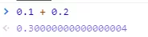

### 0.1 + 0.2 == 0.3 ?

前面提到过，并不是所有小数都可以用「完整」的二进制来表示的，比如十进制 0.1 在转换成二进制小数的时候，是一串无限循环的二进制数，计算机是无法表达无限循环的二进制数的，毕竟计算机的资源是有限。

因此，计算机只能用「近似值」来表示该二进制，那么意味着计算机存放的小数可能不是一个真实值，现在基本都是用 IEEE 754 规范的单精度浮点类型或双精度浮点类型来存储小数的，根据精度的不同，近似值也会不同。

那计算机是存储 0.1 是一个怎么样的二进制浮点数呢？偷个懒，我就不自己手动算了，可以使用 binaryconvert 这个工具，将十进制 0.1 小数转换成 float 浮点数：

可以看到，8 位指数部分是 `01111011`，23 位的尾数部分是 `10011001100110011001101`，可以看到尾数部分是 `0011` 是一直循环的，只不过尾数是有长度限制的，所以只会显示一部分，所以是一个近似值，精度十分有限。

接下来，我们看看 0.2 的 float 浮点数：

可以看到，8 位指数部分是 01111100，稍微和 0.1 的指数不同，23 位的尾数部分是 10011001100110011001101 和 0.1 的尾数部分是相同的，也是一个近似值。

0.1 的二进制浮点数转换成十进制的结果是 `0.100000001490116119384765625`：

0.2 的二进制浮点数转换成十进制的结果是 `0.20000000298023223876953125`：

这两个结果相加就是 `0.300000004470348358154296875`：

所以，你会看到在计算机中 0.1 + 0.2 并不等于完整的 0.3，这主要是因为有的小数无法可以用「完整」的二进制来表示，所以计算机里只能采用近似数的方式来保存，那两个近似数相加，得到的必然也是一个近似数。

我们在 JavaScript 里执行 0.1 + 0.2，你会得到下面这个结果：

结果和我们前面推到的类似，因为 JavaScript 对于数字都是使用 IEEE 754 标准下的双精度浮点类型来存储的，而我们二进制只能精准表达 2 除尽的数字 1/2, 1/4, 1/8，但是例如 0.1(1/10) 和 0.2(1/5)，在二进制中都无法精准表示时，需要根据精度舍入。

我们人类熟悉的十进制运算系统，可以精准表达 2 和 5 除尽的数字，例如1/2, 1/4, 1/5(0.2), 1/8, 1/10(0.1)。当然，十进制也有无法除尽的地方，例如 1/3, 1/7，也需要根据精度舍入。