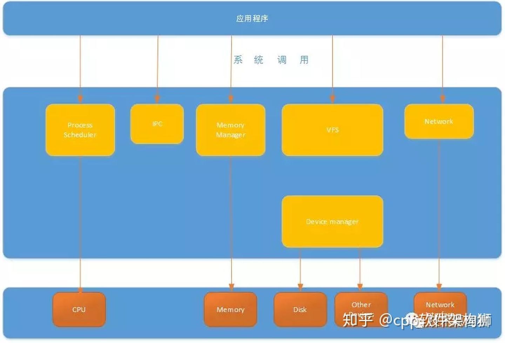

在Linux技术讨论中经常会**用户态**和**内核态**术语脱口而出，可你们想过吗？用户态和内核态代表是什么？本片文章，就来谈一谈这个话题。

我们先来看一张Linux整体架构图。

从图上我们可以看出来通过**系统调用**将Linux整个体系分为用户态和内核态（或者说[内核空间](https://www.zhihu.com/search?q=内核空间&search_source=Entity&hybrid_search_source=Entity&hybrid_search_extra={"sourceType"%3A"article"%2C"sourceId"%3A69554144})和用户空间）。那内核态到底是什么呢？其实从本质上说就是我们所说的内核，它是一种**特殊的[软件程序](https://www.zhihu.com/search?q=软件程序&search_source=Entity&hybrid_search_source=Entity&hybrid_search_extra={"sourceType"%3A"article"%2C"sourceId"%3A69554144})**，特殊在哪儿呢？**控制计算机的硬件资源，例如协调CPU资源，分配内存资源，并且提供稳定的环境供[应用程序](https://www.zhihu.com/search?q=应用程序&search_source=Entity&hybrid_search_source=Entity&hybrid_search_extra={"sourceType"%3A"article"%2C"sourceId"%3A69554144})运行**。

用户态就是提供应用程序运行的空间，为了使应用程序访问到内核管理的资源例如CPU，内存，I/O。内核必须提供一组通用的访问接口，这些接口就叫**系统调用。**

## 系统调用

**系统调用**时操作系统的最小功能单位。根据不同的应用场景，不同的Linux发行版本提供的系统调用数量也不尽相同，大致在240-350之间。这些系统调用组成了用户态跟内核态交互的基本接口，**例如：用户态想要申请一块20K大小的[动态内存](https://www.zhihu.com/search?q=动态内存&search_source=Entity&hybrid_search_source=Entity&hybrid_search_extra={"sourceType"%3A"article"%2C"sourceId"%3A69554144})，就需要brk系统调用，将数据段指针向下偏移，如果用户态多处申请20K动态内存，同时又释放呢？这个内存的管理就变得非常的复杂。**

## 库函数

**库函数**就是屏蔽这些复杂的底层实现细节，减轻程序员的负担，从而更加关注上层的逻辑实现。它对系统调用进行封装，提供简单的基本接口给用户，这样增强了程序的灵活性，当然对于简单的接口，也可以直接使用系统调用访问资源，例如：**open（），write（），read（）**等等。库函数根据不同的标准也有不同的版本，例如：**glibc库，posix库**等。

## shell

shell顾名思义，就是外壳的意思。就好像把内核包裹起来的外壳。它是一种特殊的应用程序，俗称[命令行](https://www.zhihu.com/search?q=命令行&search_source=Entity&hybrid_search_source=Entity&hybrid_search_extra={"sourceType"%3A"article"%2C"sourceId"%3A69554144})。为了方便用户和系统交互，一般一个shell对应一个终端，呈现给用户交互窗口。当然shell也是编程的，它有标准的shell语法，符合其语法的文本叫**[shell脚本](https://www.zhihu.com/search?q=shell脚本&search_source=Entity&hybrid_search_source=Entity&hybrid_search_extra={"sourceType"%3A"article"%2C"sourceId"%3A69554144})**。很多人都会用shell脚本实现一些常用的功能，可以提高工作效率。

我们再来看一个更加细化的Linux体系架构图。我们可以总结下：内核控制并且管理硬件资源，包括进程的调度和管理、内存管理、文件系统管理、设备驱动管理、网络管理等等。并且提供应用程序统一的系统调用接口。这种分层的架构，极大的提升了系统的稳定性和扩展性，兼容性。

## 用户态到内核态怎样切换？

往往我们的系统的资源是固定的，例如内存2G，CPU固定，磁盘2TB，网络接口固定。所以就需要[操作系统](https://www.zhihu.com/search?q=操作系统&search_source=Entity&hybrid_search_source=Entity&hybrid_search_extra={"sourceType"%3A"article"%2C"sourceId"%3A69554144})对资源进行有效的利用。假设某个应用程序过分的访问这些资源，就会导致整个系统的资源被占用，如果不对这种行为进行限制和区分，就会导致资源访问的冲突。所以，Linux的设计的初衷：**给不同的操作给与不同的“权限”**。Linux操作系统就将权限等级分为了2个等级，分别就是内核态和用户态。

各位有没有发现，前面讲了这么多内核态和用户态什么不同，其实用一句话就能概括：**它们权限不同**。用户态的进程能够访问的资源受到了极大的控制，而运行在内核态的进程可以“**为所欲为**”。一个进程可以运行在用户态也可以运行在内核态，那它们之间肯定存在用户态和内核态切换的过程。打一个比方：**C库接口malloc申请动态内存，malloc的实现内部最终还是会调用brk（）或者mmap（）系统调用来分配内存。**

**那为问题又来了，从用户态到内核态到底怎么进入？只能通过系统调用吗？还有其他方式吗？**

从用户态到内核态切换可以通过三种方式：

1. 系统调用，这个上面已经讲解过了，在我公众号之前的文章也有讲解过。其实系统调用本身就是中断，但是软件中断，跟硬中断不同。
2. 异常：如果当前进程运行在用户态，如果这个时候发生了异常事件，就会触发切换。例如：缺页异常。
3. 外设中断：当外设完成用户的请求时，会向CPU发送中断信号。

## 总结

本片文章，没有非常深入的Linux内核实现，只是从宏观的角度阐述了下。看完上面的文章，也能得出一点结论就是：**系统调用真的开销蛮大的**。涉及到上下文的切换。在上篇文章中【Linux的直接I/O原理】中有讲述到这些，Linux内核真的是复杂的工程，更多技术细节，需要点滴积累。