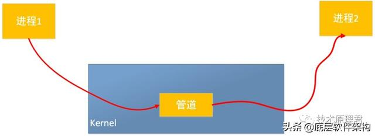
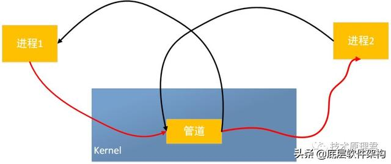
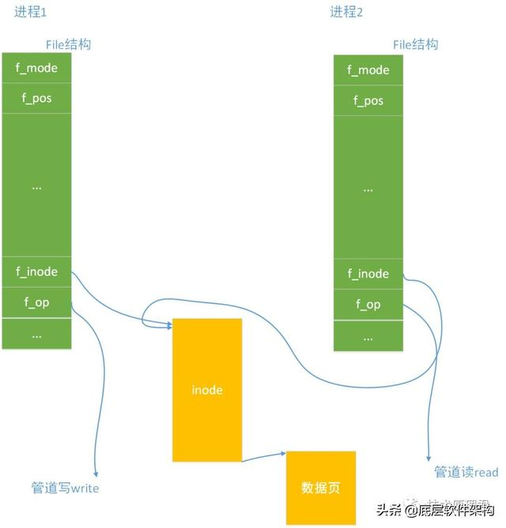

# 管道

这里说的管理特指的是无名管道，它是一种半双工的通讯方式。也就是说数据只能单向流动，通常是在具备亲缘关系的进程间使用，好比父子进程。当一个进程建立了一个管道,并调用fork建立本身的一个子进程后,父进程关闭读管道端,子进程关闭写管道端,这样提供了两个进程之间数据流动的一种方式。队列

管道是怎么通讯的呢？进程

首先管道是内核的一个缓冲区，并且是在内存中。管道一头链接着一个进程的输出，另外一头链接着另外一个进程的输入。一个缓冲区不须要很大，它被设计成为环形的数据结构，以便管道能够被循环利用。当管道中没有信息的话，从管道中读取的进程会等待，直到另外一端的进程放入信息。当管道被放满信息的时候，尝试放入信息的进程会等待，直到另外一端的进程取出信息。当两个进程都终结的时候，管道也自动消失。看下图：事件

 

 

 

那管道怎样创建的呢？

从原理上，管道利用fork机制创建，从而让两个进程能够链接到同一个PIPE上。最开始的时候，上面的两个箭头都链接在同一个进程1上(链接在进程1上的两个箭头)，以下图。当fork复制进程的时候，会将这两个链接也复制到新的进程(进程2)。随后，每一个进程关闭本身不须要的一个链接 (两个黑色的箭头被关闭; 进程1关闭从PIPE来的输入链接，进程2关闭输出到PIPE的链接)，这样，剩下的红色链接就构成了如上图的PIPE。

 

 

 

 

管道在内核中具体怎么实现的呢？

在Linux内核中，并无针对管道新增数据结构。而是巧妙的借用了文件系统的file结构和虚拟文件系统的索引节点inode。经过将两个 file 结构指向同一个临时的 VFS 索引节点，而这个 VFS 索引节点又指向一个物理页面而实现的。

 

 

 

具体实现

管道的实现其实也不难，源代码在内核工程中的fs/pipe.c，咱们着重的讲两个比较重要的接口吧，也就是经常使用的pipe_read()和pipe_write()，前者是管道读函数，后者是管道写函数。

管道写函数将字节数据复制到虚拟文件系统索引节点指向的物理内存页，而读函数则是相反：读出数据。固然这里存在着竞争的管理，须要必定的同步机制，使用锁，等待队列和信号。

当咱们写的时候，调用write（），内核根据传入的文件描述符fd，找到该文件的file结构。而后执行结构中f_op中的写函数。写函数在向内存写入数据以前，必须首先检查虚拟文件系统索引节点信息，检查是否有足够的内存空间能够写和内存没有被读程序锁定这两个条件，只有知足了，才真正的进行内存拷贝。

接下来写函数就会锁定内存，而后复制数据到内存，不然就在虚拟文件系统inode的等待队列中。

管道的读取过程和写入过程相似。可是，进程能够在没有数据或内存被锁定时当即返回错误信息，而不是阻塞该进程，这依赖于文件或管道的打开模式。反之，进程能够休眠在索引节点的等待队列中等待写入进程写入数据。当全部的进程完成了管道操做以后，管道的索引节点被丢弃，而共享数据页也被释放。