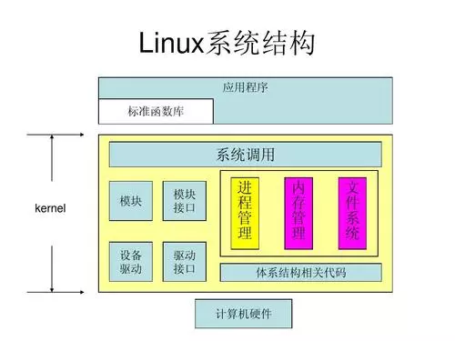
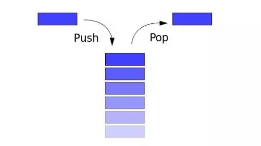

1

**开启冒险之旅**

我是一个线程，出生在这个Linux帝国，今天我的任务是去执行一段人类用C语言编写的代码。

一阵忙活过后，一个fopen函数调用的指令出现在我面前，跟随指令指向的方向，我来到了**libc.so**的地盘，进入了一个名为open的房间，房间里的桌上放了一张纸，上面写了一个编号和几句指令。

根据指令，我需要把编号放到eax寄存器，把open函数的参数放到ebx、ecx、edx三个寄存器中。


忙完上面的操作，我环顾四周，发现这房间里还有一道门，门上写着**sysenter**。

我小心翼翼的走了进去，突然，眼前闪过一道白光，紧接着光线消失，四周变得幽暗起来。但我能感觉到我在移动着，片刻之后，开始出现了亮光。


2

**神秘的长者**

“欢迎来到内核地址空间！”，一位白胡子老头向我走了过来。

“敢问长者是谁”，我有点紧张。


“年轻人别怕，你是第一次来这里吧，难怪看着眼生。这里是帝国的内核空间，帝国核心都在这里，你们这些应用程序线程平时是很少这里的，我就是专门在这里接待从应用层下来的线程们，为你们指路的”，老头一边说，一遍捋了捋胡须。

“多谢老先生，劳烦您带下路”，说完我俩就一起向前走。


很快，我们来到一面巨大的墙壁面前，墙壁上面有很多格子，每个格子上面都写了一个编号。我注意到墙的最上面还有一块招牌，上面写着：**sys_call_table**。


“年轻人，这是系统调用表，来，把你的编号给我”，老头转过身来。

我想起来这里之前，名为open的房间里纸上的那个编号，记得我把它放到eax寄存器里去了。

我从eax寄存器取出之前放置的编号，交给了老头。

“哦，是个2号，是要去**sys_open**啊”，说完，老头打开了墙上2号格子的抽屉，拿出了一个纸条交给我。

我一看，上面写着：

- 

```
sys_open: 0x7ffe10002030
```


“老先生，看来你对这里很熟嘛，还没看都知道我是要去sys_open”。

“那当然，从帝国诞生的第一天起，我就在这里工作了，帝国的三百多个系统调用我早就背的滚瓜烂熟了，刚来的时候我也和你差不多年轻，现在都满头白发咯，岁月不饶人啊！”，老头又捋了捋胡须。


3

**系统调用**

“系统调用？什么意思？”，我第一次听到这几个字。

“你现在来到我们这里办事，这就叫系统调用啊！”。

“还是不太明白，还请老先生赐教”。

“好吧，年轻人好学，老朽就给你说道说道。在天地混沌初开的时候，比特宇宙早期孕育的一些帝国文明，他们所有的程序都是和帝国自身的核心代码在一个地方执行。但这样的后果是程序之间经常发生混乱冲突，还经常伤害帝国本身的程序。”。


“到后来，一些新出现的帝国文明，像咱们的Linux帝国，还有Windows帝国等等，为了安全考虑，一方面把普通应用程序和帝国自身程序分开，普通应用程序执行的地方叫用户态地址空间，而帝国核心程序运行的地方叫内核地址空间，这叫权限分离。另一方面把多个普通应用程序之间也分开，防止他们的冲突混乱，把这叫进程隔离。”老头喝了口水继续说道。



“老先生您说了这么多，这跟系统调用又有什么关系呢？”

“别着急啊，听我继续说给你听。应用程序和帝国核心分开后，应用程序就没法直接访问磁盘、内存、网络等等设备了。那他们需要访问这些设备怎么办呢？为了让这些应用程序还能工作，帝国安排专门的部门来统一管理这些工作，把所有的功能分门别类开辟了300多个窗口来为你们提供服务，你前面拿到的sys_open函数就是其中一个。还设立一个特殊通道，类似于虫洞，连接用户空间和内核空间。而你们这些应用程序想要来办事，就带着办事窗口的编号，从这个虫洞过来，而我就在这头接待你们，指引你们去具体的窗口办理业务，整个过程呢就叫做系统调用啦！终于讲完了，可累死老夫了”。


"虫洞？是不是就是那个sysenter指令，通过它进入的？"，我恍然大悟。

“对，没错！”。


“原来如此，那为何不直接把sys_open函数的地址写在我来之前的open房间，还要弄一个编号来查，这不更省事吗？”


“唉，此言差矣，这些个函数的地址都是机密，怎么能随便透露给你们上面的应用程序呢。而且，为了安全，这些地址会随着帝国每次启动变化的，不是一个固定的地址，所以还是要用编号来查哦！”


“感谢老先生，今日获益良多，时辰不早，我该去做我的正事了，再会”！

“年轻人再见，一会儿我们还会见面的，你还得从这里回去呢”，老头说完就又去接待其他人去了。


4

**线程内核堆栈**

按照纸条上面的地址，我来到了sys_open函数的地方，开始执行这里的代码，完成我要办理的事情。


看到第一条push操作堆栈指令，我一下就慌了，我之前都是在用户空间工作，第一次来这里，没有堆栈可怎么办呐！



就在这时，旁边走过来一个大叔。

“你是第一次来这里吧！”，大叔一下看穿了我的萌新属性。


“大叔你好，我确实是第一次来，这里没有堆栈，我怎么push啊”，我向大叔求救。

“怎么没有啊，你仔细看看你的堆栈指针esp指向的地方呢？”


顺着esp指向的地方望去，果然有一个堆栈，不过和我来之前在用户空间的堆栈不太一样，这个小了许多。


“大叔，这个堆栈是哪来的啊？”，我又向大叔请教。

“这个叫线程的内核堆栈，每个应用程序的线程都有两个堆栈，一个在用户空间，一个在内核空间。这个呢就是你在内核空间的堆栈啦，专门供你在内核空间来办事的时候使用的，因为用得少，加上内核空间的资源宝贵，所以比你之前那个小了很多”，大叔解答了我的疑惑。


“哦，原来如此啊，多谢大叔。对了大叔，你也是从那个sysenter虫洞穿越过来的吗？”

“我是从虫洞过来的，不过不是sysenter哦，而是···哦我还有事要忙，就此别过吧”，说完匆忙离去。

我大吃一惊！难道还有别的虫洞？


未完待续·······


**彩蛋**

“怎么样，提权还顺利吗？”

“嗯，事情都办妥了，只是出了一点小插曲。你检查下我们进程的权限，现在应该已经是root了。”

“发生了什么？”

“刚才在内核空间遇到一个萌新，差点说漏嘴我是怎么进去的了”


欲知后事如何，请关注后续精彩......


原创不容易，快转发分享给更多人看啊