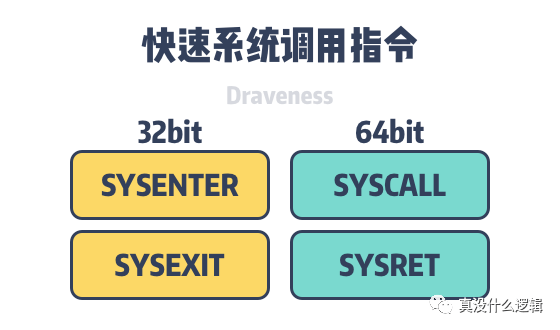

# 为什么 Linux 系统调用会消耗较多资源

 2020-06-10 
[linux](https://www.codenong.com/tag/linux/)

本文转载自：公众号真没什么逻辑，作者Draveness，特此感谢！

系统调用是计算机程序在执行的过程中向操作系统内核申请服务的方法，这可能包含硬件相关的服务、新进程的创建和执行以及进程调度，对操作系统稍微有一些了解的人都知道 — 系统调用为用户程序提供了操作系统的接口[^1]。

**图 1 - 操作系统接口**

C 语言的著名的 glibc 封装了操作系统提供的系统调用并提供了定义良好的接口[^2]，工程师可以直接使用器中封装好的函数开发上层的应用程序，其他编程语言的标准库也会封装系统调用，它们对外提供语言原生的接口，内部使用汇编语言触发系统调用。

我们在使用标准库时需要经常与系统调用打交道，只是很多时候我们不知道标准库背后的实现，以常见的 Hello World 程序为例，这么简单的几行函数在真正运行时会执行几十次系统调用：

| 1 2 3 4 5 6 7 8 9 10 11 12 13 14 15 16 17 18 19 20 21 22 23 24 25 | #include <stdio.h> int main() {   printf("Hello, World!");   return 0; }   $ gcc hello.c -o hello $ strace ./hello execve("./hello", ["./hello"], 0x7ffd64dd8090 /* 23 vars */) = 0 brk(NULL)                = 0x557b449db000 access("/etc/ld.so.nohwcap", F_OK)    = -1 ENOENT (No such file or directory) access("/etc/ld.so.preload", R_OK)    = -1 ENOENT (No such file or directory) openat(AT_FDCWD, "/etc/ld.so.cache", O_RDONLY\|O_CLOEXEC) = 3 fstat(3, {st_mode=S_IFREG\|0644, st_size=26133, ...}) = 0 mmap(NULL, 26133, PROT_READ, MAP_PRIVATE, 3, 0) = 0x7f645455a000 close(3)                 = 0 ... munmap(0x7f645455a000, 26133)      = 0 fstat(1, {st_mode=S_IFCHR\|0600, st_rdev=makedev(136, 0), ...}) = 0 brk(NULL)                = 0x557b449db000 brk(0x557b449fc000)           = 0x557b449fc000 write(1, "Hello, World!", 13Hello, World!)      = 13 exit_group(0)              = ? +++ exited with 0 +++ |
| ------------------------------------------------------------ | ------------------------------------------------------------ |
|                                                              |                                                              |

strace 是 Linux 中用于监控和篡改进程与内核之间操作的工具，上述命令会打印出hello 执行过程中触发系统调用、参数以及返回值等信息。执行 Hello World 程序时触发的多数系统调用都是程序启动触发的，只有 munmap 后的系统调用才是 printf函数触发的，作为应用程序我们能做的事情非常有限，很多功能都需要依赖操作系统提供的服务。

多数编程语言的函数调用只需要分配新的栈空间、向寄存器写入参数并执行 CALL 汇编指令跳转到目标地址执行函数，在函数返回时通过栈或者寄存器返回参数[^3]。与函数调用相比，系统调用会消耗更多的资源，如下图所示，使用 SYSCALL 指定执行系统调用消耗的时间是 C 函数调用的几十倍[^4]：

**图 2 - 系统调用与函数调用耗时比较**

上图中的 vDSO 全称是虚拟动态链接对象（Virtual Dynamically Shared Object、vDSO），它可以减少系统调用的消耗的时间，我们会在后面详细分析它的实现原理。

getpid(2) 是一个相对比较快的系统调用，该系统调用不包含任何参数，只会切换到内核态、读取变量并返回 PID，我们可以将它的执行时间当做系统调用的基准测试；除了 getpid(2) 之外，使用 close(999) 系统调用关闭不存在的文件描述符会消耗更少的资源[^5]，与 getpid(2) 相比大概会少 20 个 CPU 周期[^6]，当然想要实现用于测试额外开销的系统调用，使用自定义的空函数应该是最完美的选择，感兴趣的读者可以自行尝试一下。

**图 3 - 系统调用的三种方法**

从上面的系统调用与函数调用的基准测试中，我们可以发现不使用 vSDO 加速的系统调用需要的时间是普通函数调用的几十倍，为什么系统调用会带来这么大的额外开销，它在内部到底执行了哪些工作呢，本文将介绍 Linux 执行系统调用的三种方法：

- 使用软件中断（Software interrupt）触发系统调用；

- 

  

  

  使用 SYSCALL / SYSENTER 等汇编指令触发系统调用；

- 使用虚拟动态共享对象（virtual dynamic shared object、vDSO）执行系统调用；

## 软件中断

中断是向处理器发送的输入信号，它能够表示某个时间需要操作系统立刻处理，如果操作系统接收了中断，那么处理器会暂停当前的任务、存储上下文状态、并执行中断处理器处理发生的事件，在中断处理器结束后，当前处理器会恢复上下文继续完成之前的工作[^7]。

**图 4 - 硬件中断和软件中断**

根据事件发出者的不同，我们可以将中断分成硬件和软件中断两种，硬件中断是由处理器外部的设备触发的电子信号；而软件中断是由处理器在执行特定指令时触发的，某些特殊的指令也可以故意触发软件中断[^8]。

在 32 位的 x86 的系统上，我们可以使用 INT 指令来触发软件中断，早期的 Linux 会使用 INT 0x80 触发软件中断、注册特定的中断处理器 entry_INT80_32 来处理系统调用，我们来了解一下使用软件中断执行系统调用的具体过程[^9]：

1. 应用程序通过调用 C 语言库中的函数发起系统调用；

2. C 语言函数通过栈收到调用方传入的参数并将系统调用需要的参数拷贝到寄存器；

3. Linux 中的每一个系统调用都有特定的序号，函数会将系统调用的编号拷贝到 eax寄存器；

4. 

   

   

   函数执行 INT 0x80 指令，处理器会从用户态切换到内核态并执行预先定义好的处理器；

5. 执行中断处理器 entry_INT80_32 处理系统调用；

6. 1. 执行 SAVE_ALL 将寄存器的值存储到内核栈上并调用 do_int80_syscall_32；
   2. 调用 do_syscall_32_irqs_on 检查系统调用的序号是否合法；
   3. 在系统调用表 ia32_sys_call_table 中查找对应的系统调用实现并传入寄存器的值；
   4. 系统调用在执行期间会检查参数的合法性、在用户态内存和内核态内存之间传输数据，系统调用的结果会被存储到 eax 寄存器中；
   5. 从内核栈中恢复寄存器的值并将返回值放到栈上；
   6. 系统调用会返回 C 函数，包装函数会将结果返回给应用程序；

7. 如果系统调用服务在执行过程中出现了错误，C 语言函数会将错误存储在全局变量 errno 中并根据系统调用的结果返回一个用整数 int 表示的状态；

**图 5 - 系统调用的执行步骤**

从上述系统调用的执行过程中，我们可以看到基于软件中断的系统调用是一个比较复杂的流程，应用程序通过软件中断陷入内核态并在内核态查询并执行系统调用表注册的函数，整个过程不仅需要存储寄存器中的数据、从用户态切换至内核态，还需要完成验证参数的合法性，与函数调用的过程相比确实会带来很多的额外开销[^10]。

实际上，使用 INT 0x80 来触发系统调用早就是过去时了，大多数的程序都会尽量避免这种触发方式。然而这一规则也不是通用的，因为 Go 语言团队在做基准测试时发现INT 0x80 触发系统调用在部分操作系统上与其他方式有着几乎相同的性能[^11]，所以在 Android/386 和 Linux/386 等架构上仍然会使用中断来执行系统调用[^12]

## 汇编指令

因为使用软件中断实现的系统调用在 Pentium 4 的处理器上表现非常差[^13]。Linux 为了解决这个问题，在较新的版本使用了新的汇编指令 SYSENTER / SYSCALL，它们是 Intel 和 AMD 上用于实现快速系统调用的指令，我们会在 32 位的操作系统上使用SYSENTER / SYSEXIT，在 64 位的操作系统上使用 SYSCALL / SYSRET：

**图 6 - 快速系统调用指令**

上述的几个汇编指令是低延迟的系统调用和返回指令，它们会认为操作系统实现了线性内存模型（Linear-memory Model），极大地简化了操作系统系统调用和返回的过程，其中包括不必要的检查、预加载参数等，与软件中断驱动的系统调用相比，使用快速系统调用指令可以减少 25% 的时钟周期[^13]。

线性内存模型是一种内存寻址的常见范式，在这种模式中，线性内存与应用程序存储在单一连续的空间地址中，CPU 可以不借助内存碎片或者分页技术使用地址直接访问可用的内存地址。

在 64 位的操作系统上，我们会使用 SYSCALL / SYSRET 进入和退出系统调用，该指令会在操作系统最高权限等级中执行。内核在初始化时会调用 syscall_init 函数将 entry_SYSCALL_64 存入 MSR 寄存器（Model Specific Register、MSR）中，MSR 寄存器是 x86 指令集中用于调试、追踪以及性能监控的控制寄存器[^15]：

| 1 2 3 4 5 | void syscall_init(void) {   wrmsr(MSR_STAR, 0, (__USER32_CS << 16) \| __KERNEL_CS);   wrmsrl(MSR_LSTAR, (unsigned long)entry_SYSCALL_64);   ... } |
| --------- | ------------------------------------------------------------ |
|           |                                                              |

当内核收到了用户程序触发的系统调用时，它会在 MSR 寄存器中读取需要执行的函数并按照 x86-64 的调用惯例在寄存器中读取系统调用的编号以及参数，你能在 entry_SYSCALL_64 函数的注释中找到相关的调用惯例。

汇编函数 entry_SYSCALL_64 会在执行的过程中调用 do_syscall_64，它的实现与上一节中的 do_int80_syscall_32 有些相似，它们都会在系统调用表中查找函数并传入寄存器中的参数。

与 INT 0x80 通过触发软件中断实现系统调用不同，SYSENTER 和 SYSCALL 是专门为系统调用设计的汇编指令，它们不需要在中断描述表（Interrupt Descriptor Table、IDT）中查找系统调用对应的执行过程，也不需要保存堆栈和返回地址等信息，所以能够减少所需要的额外开销。

## vDSO

虚拟动态共享对象（virtual dynamic shared object、vDSO）是 Linux 内核对用户空间暴露内核空间部分函数的一种机制[^16]，简单来说，我们将 Linux 内核中不涉及安全的系统调用直接映射到用户空间，这样用户空间中的应用程序在调用这些函数时就不需要切换到内核态以减少性能上的损失。

vDSO 使用了标准的链接和加载技术，作为一个动态链接库，它由 Linux 内核提供并映射到每一个正在执行的进程中，我们可以使用如下所示的命令查看该动态链接库在进程中的位置：

| 1 2 3 4 5 6 7 8 9 10 11 12 13 14 | $ ldd /bin/cat   linux-vdso.so.1 (0x00007fff2709c000)   ...   $ cat /proc/self/maps ... 7f28953ce000-7f28953cf000 r--p 00027000 fc:01 2079            /lib/x86_64-linux-gnu/ld-2.27.so 7f28953cf000-7f28953d0000 rw-p 00028000 fc:01 2079            /lib/x86_64-linux-gnu/ld-2.27.so 7f28953d0000-7f28953d1000 rw-p 00000000 00:00 0 7ffe8ca4d000-7ffe8ca6e000 rw-p 00000000 00:00 0              [stack] 7ffe8ca8d000-7ffe8ca90000 r--p 00000000 00:00 0              [vvar] 7ffe8ca90000-7ffe8ca92000 r-xp 00000000 00:00 0              [vdso] ffffffffff600000-ffffffffff601000 r-xp 00000000 00:00 0          [vsyscall] |
| -------------------------------- | ------------------------------------------------------------ |
|                                  |                                                              |

因为 vDSO 是由操作系统直接提供的，所以它并不存在对应的文件，在程序执行的过程中我们也能在虚拟内存中看到它加载的位置。vDSO 可以为用户程序提供虚拟的系统调用，它会使用内核提供的数据在用户态模拟系统调用：

**图 7 - 内核和用户控件的初始化**

系统调用 gettimeofday 是一个非常好的例子，如上图所示，使用 vDSO 的系统调用gettimeofday 会按照如下所示的步骤进行初始化[^17]：

1. 内核中的 ELF 加载器会负责映射 vDSO 的内存页并设置辅助向量（Auxiliary Vector）中 AT_SYSINFO_EHDR，该标签存储了 vDSO 的基地址；
2. 动态链接器会查询辅助向量中 AT_SYSINFO_EHDR，如果设置了该标签会链接 vDSO；
3. libc 在初始化时会在 vDSO 中查找 __vdso_gettimeofday 符号并将符号链接到全局的函数指针上；

除了 gettimeofday 之外，多数架构上的 vDSO 还包含 clock_gettime、clock_getres 和 rt_sigreturn 等三个系统调用，这些系统调用完成功能相对来说比较简单，也不会带来安全上的问题，所以将它们映射到用户空间可以明显地提高系统调用的性能，就像我们在图二中看到的，使用 vDSO 可以将上述几个系统调用的时间提高几十倍。

## 总结

当我们在编写应用程序时，系统调用并不是一个离我们很远的概念，一个简单的 Hello World 会在执行时触发几十次系统调用，而在线上出现性能问题时，可能也需要我们与系统调用打交道。虽然程序中的系统调用非常频繁，但是与普通的函数调用相比，它会带来明显地额外开销：

- 使用软件中断触发的系统调用需要保存堆栈和返回地址等信息，还要在中断描述表中查找系统调用的响应函数，虽然多数的操作系统不会使用 INT 0x80 触发系统调用，但是在一些特殊场景下，我们仍然需要利用这一古老的技术；
- 使用汇编指令 SYSCALL / SYSENTER 执行系统调用是今天最常见的方法，作为专门为系统调用打造的指令，它们可以省去一些不必要的步骤，降低系统调用的开销；
- 使用 vSDO 执行系统调用是操作系统为我们提供的最快路径，该方式可以将系统调用的开销与函数调用拉平，不过因为将内核态的系统调用映射到『用户态』确实存在安全风险，所以操作系统也仅会放开有限的系统调用；

应用程序能够完成的工作相当有限，我们需要使用操作系统提供的服务才能编写功能丰富的用户程序。系统调用作为操作系统提供的接口，它与底层的硬件关系十分紧密，因为硬件的种类繁杂，所以不同架构要使用不同的指令，随着内核的快速演进，想要找到准确的资料也非常困难，不过了解不同系统调用的实现原理对我们认识操作系统也有很大的帮助。到最后，我们还是来看一些比较开放的相关问题，有兴趣的读者可以仔细思考一下下面的问题：

- vDSO 提供的系统调用 rt_sigreturn 有哪些作用？
- vDSO 提供的四种系统调用中三种都与获取时间有关，为什么它可以在用户态提供rt_sigreturn，不存在安全风险么？