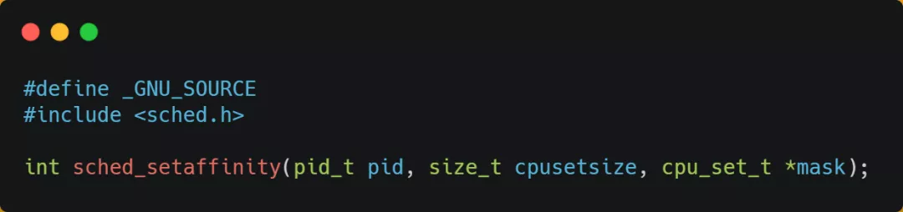

#### 如果提升多核 CPU 的缓存命中率？

在单核 CPU，虽然只能执行一个进程，但是操作系统给每个进程分配了一个时间片，时间片用完了，就调度下一个进程，于是各个进程就按时间片交替地占用 CPU，从宏观上看起来各个进程同时在执行。

而现代 CPU 都是多核心的，进程可能在不同 CPU 核心来回切换执行，这对 CPU Cache 不是有利的，虽然 L3 Cache 是多核心之间共享的，但是 L1 和 L2 Cache 都是每个核心独有的，**如果一个进程在不同核心来回切换，各个核心的缓存命中率就会受到影响**，相反如果进程都在同一个核心上执行，那么其数据的 L1 和 L2 Cache 的缓存命中率可以得到有效提高，缓存命中率高就意味着 CPU 可以减少访问 内存的频率。

当有多个同时执行「计算密集型」的线程，为了防止因为切换到不同的核心，而导致缓存命中率下降的问题，我们可以把**线程绑定在某一个 CPU 核心上**，这样性能可以得到非常可观的提升。

在 Linux 上提供了 `sched_setaffinity` 方法，来实现将线程绑定到某个 CPU 核心这一功能。

